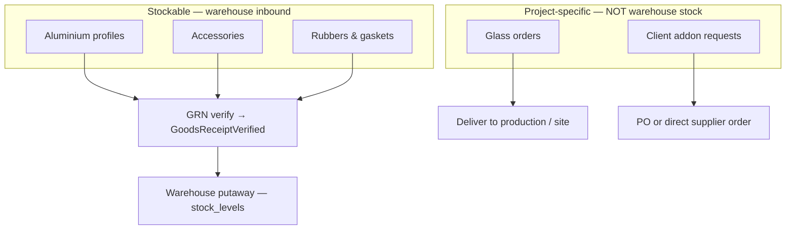
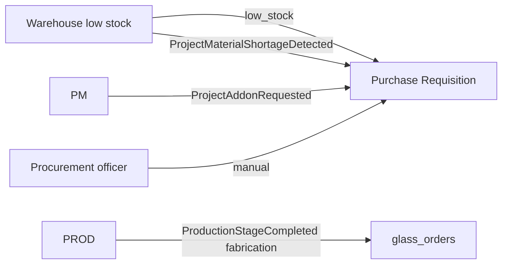
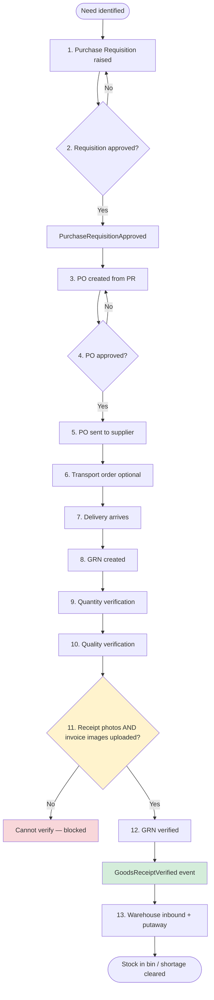
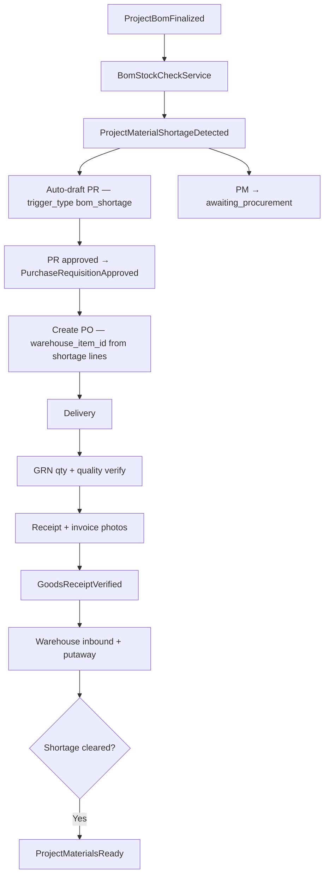
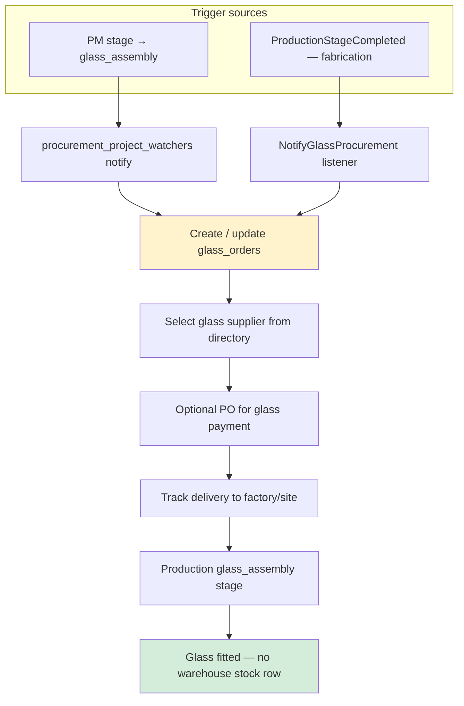
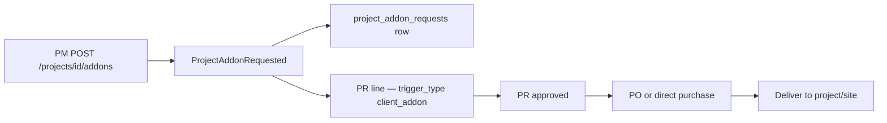
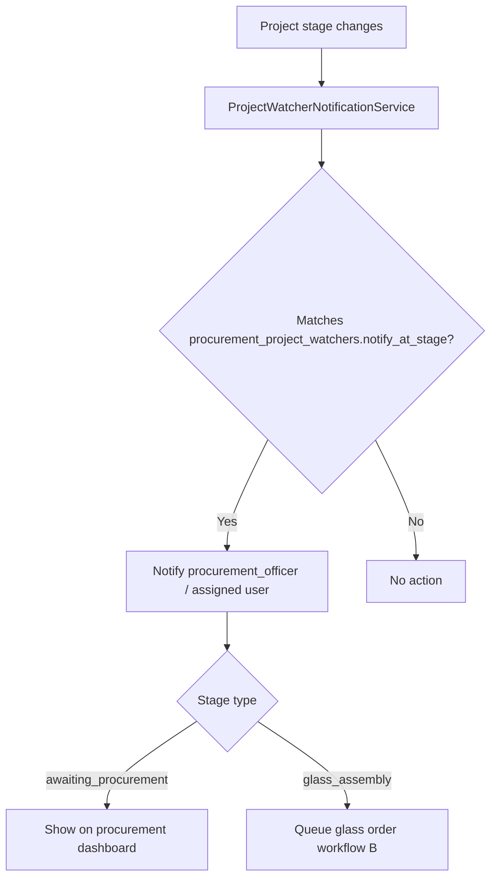
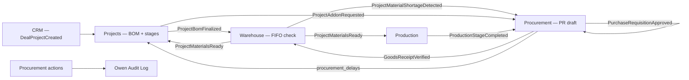

# Procurement — Implementation Plan

**Module:** Requisitions · Purchase Orders · GRN Verification · Glass Orders · Supplier Management · Transport  
**Stack:** PHP 8.2+ · Laravel 11 · PostgreSQL/MySQL · Next.js SPA  
**References:** [README.md](../../README.md) §8.4 (Procurement), §10 (Integrations), [USER_ONBOARDING.MD](./USER_ONBOARDING.MD), [WAREHOUSE.MD](./WAREHOUSE.MD) §7 (GRN inbound), §17 (integration), [INTEGRATION_CONTRACT.MD](./INTEGRATION_CONTRACT.MD), [SALES_CRM.MD](./SALES_CRM.MD) §14 (project handoff)  
**Version:** 1.0 · 2026

---

## Table of Contents

1. [Goals](#1-goals)
2. [Connecting Users to Procurement by Department](#2-connecting-users-to-procurement-by-department)
3. [Procurement Triggers](#3-procurement-triggers)
4. [Repository & Folder Structure](#4-repository--folder-structure)
5. [Purchase Order Flow (End-to-End)](#5-purchase-order-flow-end-to-end)
6. [Database Schema](#6-database-schema)
7. [Workflows A–D](#7-workflows-ad)
8. [Supplier Management](#8-supplier-management)
9. [Transport Orders](#9-transport-orders)
10. [Domain Events](#10-domain-events)
11. [API Endpoints](#11-api-endpoints)
12. [Permissions & Role Scoping](#12-permissions--role-scoping)
13. [Frontend Routes](#13-frontend-routes)
14. [Cross-Module Integration](#14-cross-module-integration)
15. [Audit Logging](#15-audit-logging)
16. [Implementation Phases](#16-implementation-phases)
17. [Open Questions](#17-open-questions)

---

## 1. Goals

### Business goals (README §8.4 · Raw_Plam §7)

Procurement sources **aluminium profiles**, **accessories**, **rubbers/gaskets**, and **project-specific glass** for Bibo Glass & Windows. Stockable items (everything except glass) are received into the warehouse via GRN; glass is tracked per project and **never** stored as warehouse inventory.

| Category | Received into warehouse? | Linked to |
|----------|--------------------------|-----------|
| Aluminium profiles | Yes — aluminium deck | `warehouse_items.sku` / `warehouse_item_id` |
| Accessories | Yes — accessories deck | `warehouse_items.sku` / `warehouse_item_id` |
| Rubbers & gaskets | Yes — rubbers deck | `warehouse_items.sku` / `warehouse_item_id` |
| **Glass** | **No — project-specific only** | `glass_orders` + `project_id` |

### Critical business rules

| Rule | Detail |
|------|--------|
| **Glass is never warehouse stock** | No `warehouse_items` row, no `stock_levels`, no GRN putaway for glass. Track in `glass_orders` only. |
| **GRN verification gate** | `GoodsReceiptVerified` may fire **only after** receipt photos **and** invoice images are uploaded on the GRN. |
| **Qty + quality verification** | GRN lines record `qty_received`, `qty_accepted`, `qty_rejected`, and `rejection_reason`. Rejected quantity is documented — not silently dropped. |
| **Project progress watching** | `procurement_project_watchers` notify procurement when projects reach configured stages (default: `glass_assembly`, `awaiting_procurement`). |
| **Delays affect PM timeline** | Every procurement delay logged in `procurement_delays` with `project_id`; PM reads delay data — procurement does **not** write `projects.stage` directly. |
| **PM owns stage transitions** | Procurement emits events; PM `ProjectStageService` advances stages ([INTEGRATION_CONTRACT.MD](./INTEGRATION_CONTRACT.MD) §7). |



---

## 2. Connecting Users to Procurement by Department

From [USER_ONBOARDING.MD](./USER_ONBOARDING.MD) §8.4–8.6 and seed data:

| Department slug | Default module | Landing route |
|-----------------|----------------|---------------|
| `procurement` | `procurement` | `/procurement/orders` |

| Role slug | Scope |
|-----------|--------|
| `procurement_officer` | Full procurement module; read-only warehouse stock (`warehouse.stock.view`) |
| `operations_manager` | Approve POs above threshold; view all procurement |
| `super_admin` | All permissions |
| `finance_officer` | Read POs/GRNs for invoice matching (future Finance module) |
| `project_manager` | Read procurement status for assigned projects (via PM material-status aggregate) |

### Role → permission summary

| Role | Key permissions |
|------|-----------------|
| `procurement_officer` | `procurement.*`, `warehouse.stock.view` |
| `operations_manager` | `procurement.*`, `procurement.po.approve`, `warehouse.stock.view_all` |
| `warehouse_manager_*` | `warehouse.stock.receive` — GRN putaway only (Agent 2); no PO approval |
| `project_manager` | `projects.view`, read-only `/api/procurement/*?project_id=` via material-status |

---

## 3. Procurement Triggers

All triggers map to `RequisitionTrigger` enum ([INTEGRATION_CONTRACT.MD](./INTEGRATION_CONTRACT.MD) §2.3) stored on `purchase_requisition_lines.trigger_type`.

| Trigger | Enum value | Source | Auto-draft PR? |
|---------|------------|--------|----------------|
| Low stock alert | `low_stock` | WH — item `available_qty < min_stock_qty` | Phase 2 (optional) |
| BOM shortage | `bom_shortage` | WH — `ProjectMaterialShortageDetected` listener | Yes |
| Glass at assembly | `glass_order` | **`ProductionStageCompleted(fabrication)` only** | Creates `glass_orders` row — **not** PM `glass_assembly` advance ([INTEGRATION_CONTRACT.MD](./INTEGRATION_CONTRACT.MD) §11 Q4) |
| Manual requisition | `manual` | Procurement officer UI | No — user creates |
| Client addon | `client_addon` | PM — `ProjectAddonRequested` | Yes |

### Trigger → entity mapping



**Glass trigger (resolved):** PROC creates `glass_orders` **only** when listening to `ProductionStageCompleted` with `productionStage = fabrication`. Do **not** create glass orders on PM stage `glass_assembly`.

---

## 4. Repository & Folder Structure

Same convention as CRM ([SALES_CRM.MD §3](./SALES_CRM.MD#3-repository--module-folder-structure)) and Warehouse ([WAREHOUSE.MD §4](./WAREHOUSE.MD#4-repository--folder-structure)):

```
backend/app/
├── Enums/Procurement/
│   ├── RequisitionTrigger.php       # bom_shortage, low_stock, glass_order, client_addon, manual
│   ├── RequisitionStatus.php        # draft, pending_approval, approved, rejected, cancelled
│   ├── PurchaseOrderStatus.php      # draft, pending_approval, approved, sent, partial_received, received, cancelled
│   ├── GoodsReceiptStatus.php       # pending, verifying, verified, rejected
│   ├── GlassOrderStatus.php         # draft, ordered, in_transit, delivered, cancelled
│   └── AttachmentType.php           # receipt_photo, invoice_photo, delivery_note
├── Events/Procurement/
│   ├── PurchaseRequisitionApproved.php
│   └── GoodsReceiptVerified.php
├── Listeners/Procurement/
│   ├── DraftPurchaseRequisitionFromShortage.php   # listens: ProjectMaterialShortageDetected
│   ├── CreateAddonRequisition.php               # listens: ProjectAddonRequested
│   ├── NotifyGlassProcurement.php               # listens: ProductionStageCompleted
│   ├── UnlockPurchaseOrderCreation.php          # listens: PurchaseRequisitionApproved (internal)
│   └── NotifyProjectWatcherStages.php           # listens: PM stage change (read-only poll or event)
├── Http/Controllers/Procurement/
│   ├── Requisitions/
│   │   ├── PurchaseRequisitionController.php
│   │   └── ApprovePurchaseRequisitionController.php
│   ├── PurchaseOrders/
│   │   ├── PurchaseOrderController.php
│   │   ├── ApprovePurchaseOrderController.php
│   │   └── SendPurchaseOrderController.php
│   ├── GoodsReceipts/
│   │   ├── GoodsReceiptController.php
│   │   ├── VerifyGoodsReceiptController.php
│   │   └── GoodsReceiptAttachmentController.php
│   ├── GlassOrders/
│   │   └── GlassOrderController.php
│   ├── Addons/
│   │   └── ProjectAddonRequestController.php
│   ├── Suppliers/
│   │   ├── SupplierController.php
│   │   └── SupplierItemPriceController.php
│   ├── Transport/
│   │   └── TransportOrderController.php
│   ├── Delays/
│   │   └── ProcurementDelayController.php
│   ├── Watchers/
│   │   └── ProcurementProjectWatcherController.php
│   └── Dashboard/
│       └── ProcurementDashboardController.php
├── Http/Requests/Procurement/
│   ├── Requisitions/
│   ├── PurchaseOrders/
│   ├── GoodsReceipts/
│   └── GlassOrders/
├── Http/Resources/Procurement/
│   ├── PurchaseRequisitionResource.php
│   ├── PurchaseOrderResource.php
│   ├── GoodsReceiptResource.php
│   └── GlassOrderResource.php
├── Models/Procurement/
│   ├── Supplier.php
│   ├── PurchaseRequisition.php
│   ├── PurchaseRequisitionLine.php
│   ├── PurchaseOrder.php
│   ├── PurchaseOrderLine.php
│   ├── GoodsReceipt.php
│   ├── GoodsReceiptLine.php
│   ├── GoodsReceiptAttachment.php
│   ├── TransportOrder.php
│   ├── ProcurementDelay.php
│   ├── GlassOrder.php
│   ├── ProjectAddonRequest.php
│   ├── SupplierItemPrice.php
│   └── ProcurementProjectWatcher.php
├── Services/Procurement/
│   ├── Requisitions/
│   │   ├── PurchaseRequisitionService.php
│   │   └── AutoDraftRequisitionService.php
│   ├── PurchaseOrders/
│   │   ├── PurchaseOrderService.php
│   │   └── PurchaseOrderPdfService.php
│   ├── GoodsReceipts/
│   │   ├── GoodsReceiptService.php
│   │   └── GoodsReceiptVerificationService.php   # qty + quality gate
│   ├── Glass/
│   │   └── GlassOrderService.php
│   ├── Suppliers/
│   │   └── SupplierPriceHistoryService.php
│   ├── Transport/
│   │   └── TransportOrderService.php
│   ├── Delays/
│   │   └── ProcurementDelayService.php
│   └── Watchers/
│       └── ProjectWatcherNotificationService.php
├── Policies/Procurement/
│   ├── PurchaseRequisitionPolicy.php
│   ├── PurchaseOrderPolicy.php
│   ├── GoodsReceiptPolicy.php
│   └── GlassOrderPolicy.php
└── routes/api/procurement/
    ├── requisitions.php
    ├── purchase-orders.php
    ├── goods-receipts.php
    ├── glass-orders.php
    ├── suppliers.php
    ├── transport.php
    ├── delays.php
    ├── watchers.php
    └── dashboard.php
```

**Shared integration files (coordinate via [INTEGRATION_CONTRACT.MD](./INTEGRATION_CONTRACT.MD)):**

- `backend/app/Providers/AppServiceProvider.php` — `registerProcurementListeners()`
- `backend/database/seeders/PermissionSeeder.php` — append procurement keys
- `backend/routes/api.php` — `require __DIR__.'/api/procurement/*.php'`

---

## 5. Purchase Order Flow (End-to-End)

Full PO lifecycle from need identification through warehouse putaway ([README.md](../../README.md) §8.4 · [Raw_Plam.txt](./Raw_Plam.txt) §7.2).

### 5.1 Step-by-step

| Step | Actor | Action | System record |
|------|-------|--------|---------------|
| 1 | WH / PM / PROC | Need identified (shortage, low stock, manual, addon) | PR draft or `glass_orders` |
| 2 | Procurement officer | Review PR lines; link `warehouse_item_id` via `warehouse_items.sku` | `purchase_requisition_lines` |
| 3 | Operations Manager | Approve requisition | PR status → `approved`; emit `PurchaseRequisitionApproved` |
| 4 | Procurement officer | Select supplier; compare `supplier_item_prices` | Supplier chosen |
| 5 | Procurement officer | Create PO from approved PR | `purchase_orders` + `purchase_order_lines` |
| 6 | Operations Manager / Finance | Approve PO (threshold rules) | PO status → `approved` |
| 7 | Procurement officer | Send PO to supplier (PDF + email) | PO status → `sent` |
| 8 | Procurement officer | Create transport order (if needed) | `transport_orders` |
| 9 | Supplier | Delivers goods | PO `expected_delivery` tracked |
| 10 | Warehouse / Procurement | Create GRN against PO | `goods_receipts` + lines |
| 11 | Warehouse / Procurement | **Qty verify** — count received vs PO line qty | `qty_received` on GRN lines |
| 12 | Warehouse / Procurement | **Quality verify** — accept/reject portions | `qty_accepted`, `qty_rejected`, `rejection_reason` |
| 13 | Procurement officer | Upload **receipt photos** AND **invoice images** | `goods_receipt_attachments` |
| 14 | Procurement officer | Complete verification | GRN → `verified`; emit `GoodsReceiptVerified` |
| 15 | Warehouse (Agent 2) | Inbound movement + putaway to bin | `stock_movements` type `inbound`, `reference_type = goods_receipt` |
| 16 | WH / PM | Re-check project reservation; may emit `ProjectMaterialsReady` | PM stage via listener |

### 5.2 PO flow diagram



### 5.3 GRN verification gate (mandatory)

`GoodsReceiptVerificationService::canVerify(GoodsReceipt $grn): bool` returns `true` only when **all** conditions pass:

1. Every PO line on the GRN has `qty_received` recorded.
2. Every line has `qty_accepted + qty_rejected = qty_received`.
3. Any `qty_rejected > 0` has non-empty `rejection_reason`.
4. At least one `goods_receipt_attachments` row with `type = receipt_photo`.
5. At least one `goods_receipt_attachments` row with `type = invoice_photo`.
6. GRN status is `verifying` (not already `verified`).

Only then may `POST /api/procurement/goods-receipts/{id}/verify` emit `GoodsReceiptVerified`.

---

## 6. Database Schema

### 6.1 Existing stub (`2025_05_19_500000_create_procurement_tables.php`)

Already defines:

- `suppliers` — code, name, category, contact, `is_preferred`
- `purchase_requisitions` — reference, `project_id`, status, `requested_by`
- `purchase_orders` — reference, supplier, project, requisition link, totals, approval fields
- `purchase_order_lines` — description, sku, quantity, unit_price, line_total

### 6.2 Expansion migration (`2025_05_19_500001_expand_procurement_tables.php`)

Sibling migration adds GRN, lines, attachments, transport, delays, glass, addons, supplier pricing, and project watchers. Also alters `purchase_order_lines`.

#### `purchase_requisition_lines`

```sql
CREATE TABLE purchase_requisition_lines (
    id                  BIGSERIAL PRIMARY KEY,
    purchase_requisition_id BIGINT NOT NULL REFERENCES purchase_requisitions(id) ON DELETE CASCADE,
    warehouse_item_id   BIGINT NULL REFERENCES warehouse_items(id) ON DELETE SET NULL,
    project_bom_line_id BIGINT NULL,  -- FK → project_bom_lines.id when PM module exists
    description         VARCHAR(255) NOT NULL,
    sku                 VARCHAR(50) NULL,   -- denormalized from warehouse_items.sku for display
    quantity            DECIMAL(15,3) NOT NULL,
    unit_of_measure     VARCHAR(20) NULL,
    trigger_type        VARCHAR(30) NOT NULL,  -- RequisitionTrigger enum
    estimated_unit_price DECIMAL(15,2) NULL,
    notes               TEXT NULL,
    created_at          TIMESTAMP NOT NULL,
    updated_at          TIMESTAMP NOT NULL
);

CREATE INDEX idx_pr_lines_requisition ON purchase_requisition_lines(purchase_requisition_id);
CREATE INDEX idx_pr_lines_item ON purchase_requisition_lines(warehouse_item_id);
CREATE INDEX idx_pr_lines_trigger ON purchase_requisition_lines(trigger_type);
```

#### Alter `purchase_order_lines`

```sql
ALTER TABLE purchase_order_lines
    ADD COLUMN warehouse_item_id BIGINT NULL REFERENCES warehouse_items(id) ON DELETE SET NULL,
    ADD COLUMN received_qty DECIMAL(15,3) NOT NULL DEFAULT 0;

CREATE INDEX idx_po_lines_item ON purchase_order_lines(warehouse_item_id);
```

| Column | Purpose |
|--------|---------|
| `warehouse_item_id` | Links PO line to `warehouse_items.id` (match via `warehouse_items.sku` at PO creation) |
| `received_qty` | Running total of `qty_accepted` across verified GRNs for this line |

#### `goods_receipts`

```sql
CREATE TABLE goods_receipts (
    id                  BIGSERIAL PRIMARY KEY,
    grn_number          VARCHAR(30) NOT NULL UNIQUE,
    purchase_order_id   BIGINT NOT NULL REFERENCES purchase_orders(id),
    project_id          BIGINT NULL REFERENCES projects(id) ON DELETE SET NULL,
    transport_order_id  BIGINT NULL,  -- FK added after transport_orders created
    status              VARCHAR(30) NOT NULL DEFAULT 'pending',  -- pending, verifying, verified, rejected
    received_at         TIMESTAMP NOT NULL,
    verified_at         TIMESTAMP NULL,
    verified_by         BIGINT NULL REFERENCES users(id) ON DELETE SET NULL,
    notes               TEXT NULL,
    created_by          BIGINT NOT NULL REFERENCES users(id),
    created_at          TIMESTAMP NOT NULL,
    updated_at          TIMESTAMP NOT NULL
);

CREATE INDEX idx_grn_po ON goods_receipts(purchase_order_id);
CREATE INDEX idx_grn_project ON goods_receipts(project_id);
CREATE INDEX idx_grn_status ON goods_receipts(status);
```

#### `goods_receipt_lines`

```sql
CREATE TABLE goods_receipt_lines (
    id                      BIGSERIAL PRIMARY KEY,
    goods_receipt_id        BIGINT NOT NULL REFERENCES goods_receipts(id) ON DELETE CASCADE,
    purchase_order_line_id  BIGINT NOT NULL REFERENCES purchase_order_lines(id),
    warehouse_item_id       BIGINT NULL REFERENCES warehouse_items(id) ON DELETE SET NULL,
    qty_received            DECIMAL(15,3) NOT NULL,
    qty_accepted            DECIMAL(15,3) NOT NULL DEFAULT 0,
    qty_rejected            DECIMAL(15,3) NOT NULL DEFAULT 0,
    rejection_reason        TEXT NULL,
    to_bin_id               BIGINT NULL,  -- FK → warehouse_bins.id — suggested putaway; WH confirms on receive
    notes                   TEXT NULL,
    created_at              TIMESTAMP NOT NULL,
    updated_at              TIMESTAMP NOT NULL,
    CONSTRAINT chk_grn_line_qty CHECK (qty_accepted + qty_rejected = qty_received),
    CONSTRAINT chk_rejection_reason CHECK (
        qty_rejected = 0 OR (qty_rejected > 0 AND rejection_reason IS NOT NULL AND rejection_reason <> '')
    )
);

CREATE INDEX idx_grn_lines_grn ON goods_receipt_lines(goods_receipt_id);
CREATE INDEX idx_grn_lines_po_line ON goods_receipt_lines(purchase_order_line_id);
```

#### `goods_receipt_attachments`

```sql
CREATE TABLE goods_receipt_attachments (
    id                  BIGSERIAL PRIMARY KEY,
    goods_receipt_id    BIGINT NOT NULL REFERENCES goods_receipts(id) ON DELETE CASCADE,
    type                VARCHAR(30) NOT NULL,  -- receipt_photo, invoice_photo, delivery_note
    path                VARCHAR(500) NOT NULL,
    firebase_url        VARCHAR(500) NULL,
    original_filename   VARCHAR(255) NULL,
    uploaded_by         BIGINT NOT NULL REFERENCES users(id),
    uploaded_at         TIMESTAMP NOT NULL,
    created_at          TIMESTAMP NOT NULL
);

CREATE INDEX idx_grn_attach_grn ON goods_receipt_attachments(goods_receipt_id);
CREATE INDEX idx_grn_attach_type ON goods_receipt_attachments(goods_receipt_id, type);
```

Storage pattern matches CRM/HR: `path` required, `firebase_url` optional ([INTEGRATION_CONTRACT.MD](./INTEGRATION_CONTRACT.MD) §4.4).

#### `transport_orders`

```sql
CREATE TABLE transport_orders (
    id                  BIGSERIAL PRIMARY KEY,
    transport_number    VARCHAR(30) NOT NULL UNIQUE,
    purchase_order_id   BIGINT NOT NULL REFERENCES purchase_orders(id),
    transport_type      VARCHAR(30) NOT NULL,  -- supplier_delivery, own_collection, third_party
    vehicle             VARCHAR(100) NULL,
    driver_name         VARCHAR(255) NULL,
    driver_phone        VARCHAR(50) NULL,
    expected_arrival    TIMESTAMP NULL,
    actual_arrival      TIMESTAMP NULL,
    status              VARCHAR(30) NOT NULL DEFAULT 'scheduled',  -- scheduled, in_transit, arrived, cancelled
    notes               TEXT NULL,
    created_by          BIGINT NOT NULL REFERENCES users(id),
    created_at          TIMESTAMP NOT NULL,
    updated_at          TIMESTAMP NOT NULL
);

CREATE INDEX idx_transport_po ON transport_orders(purchase_order_id);

-- Add FK on goods_receipts after transport_orders exists
ALTER TABLE goods_receipts
    ADD CONSTRAINT fk_grn_transport
    FOREIGN KEY (transport_order_id) REFERENCES transport_orders(id) ON DELETE SET NULL;
```

#### `procurement_delays`

```sql
CREATE TABLE procurement_delays (
    id                  BIGSERIAL PRIMARY KEY,
    project_id          BIGINT NOT NULL REFERENCES projects(id) ON DELETE CASCADE,
    purchase_order_id   BIGINT NULL REFERENCES purchase_orders(id) ON DELETE SET NULL,
    glass_order_id      BIGINT NULL,  -- FK added after glass_orders
    reason              VARCHAR(255) NOT NULL,
    expected_date       DATE NULL,
    actual_date         DATE NULL,
    days_delayed        INT NULL,  -- computed: actual - expected
    impact_notes        TEXT NULL,  -- fed to PM delay log
    logged_by           BIGINT NOT NULL REFERENCES users(id),
    created_at          TIMESTAMP NOT NULL,
    updated_at          TIMESTAMP NOT NULL
);

CREATE INDEX idx_proc_delay_project ON procurement_delays(project_id);
```

Delays are **read by PM** to append `project_delays` — procurement writes `procurement_delays` only.

#### `glass_orders` (project-specific — NOT warehouse stock)

```sql
CREATE TABLE glass_orders (
    id                  BIGSERIAL PRIMARY KEY,
    order_number        VARCHAR(30) NOT NULL UNIQUE,
    project_id          BIGINT NOT NULL REFERENCES projects(id) ON DELETE CASCADE,
    supplier_id         BIGINT NULL REFERENCES suppliers(id) ON DELETE SET NULL,
    purchase_order_id   BIGINT NULL REFERENCES purchase_orders(id) ON DELETE SET NULL,
    specs               JSONB NOT NULL,  -- dimensions, glass type, tint, qty per opening, etc.
    status              VARCHAR(30) NOT NULL DEFAULT 'draft',
    ordered_at          TIMESTAMP NULL,
    expected_delivery   DATE NULL,
    delivered_at        TIMESTAMP NULL,
    delivery_location   VARCHAR(255) NULL,  -- factory / site — never warehouse bin
    notes               TEXT NULL,
    created_by          BIGINT NOT NULL REFERENCES users(id),
    created_at          TIMESTAMP NOT NULL,
    updated_at          TIMESTAMP NOT NULL
);

CREATE INDEX idx_glass_project ON glass_orders(project_id);
CREATE INDEX idx_glass_status ON glass_orders(status);

ALTER TABLE procurement_delays
    ADD CONSTRAINT fk_delay_glass
    FOREIGN KEY (glass_order_id) REFERENCES glass_orders(id) ON DELETE SET NULL;
```

**No `warehouse_item_id` on `glass_orders`.** Glass never creates `stock_levels` rows.

#### `project_addon_requests`

```sql
CREATE TABLE project_addon_requests (
    id                  BIGSERIAL PRIMARY KEY,
    project_id          BIGINT NOT NULL REFERENCES projects(id) ON DELETE CASCADE,
    purchase_requisition_id BIGINT NULL REFERENCES purchase_requisitions(id) ON DELETE SET NULL,
    description         TEXT NOT NULL,
    client_requested    BOOLEAN NOT NULL DEFAULT TRUE,
    status              VARCHAR(30) NOT NULL DEFAULT 'pending',  -- pending, requisition_created, ordered, delivered, cancelled
    requested_by        BIGINT NOT NULL REFERENCES users(id),
    notes               TEXT NULL,
    created_at          TIMESTAMP NOT NULL,
    updated_at          TIMESTAMP NOT NULL
);

CREATE INDEX idx_addon_project ON project_addon_requests(project_id);
```

Non-manufactured items only — items Bibo manufactures stay on project BOM ([INTEGRATION_CONTRACT.MD](./INTEGRATION_CONTRACT.MD) §3.2 `ProjectAddonRequested`).

#### `supplier_item_prices`

```sql
CREATE TABLE supplier_item_prices (
    id                  BIGSERIAL PRIMARY KEY,
    supplier_id         BIGINT NOT NULL REFERENCES suppliers(id) ON DELETE CASCADE,
    warehouse_item_id   BIGINT NOT NULL REFERENCES warehouse_items(id) ON DELETE CASCADE,
    unit_price          DECIMAL(15,2) NOT NULL,
    currency            VARCHAR(3) NOT NULL DEFAULT 'KES',
    effective_from      DATE NOT NULL,
    effective_to        DATE NULL,
    is_current          BOOLEAN NOT NULL DEFAULT TRUE,
    notes               TEXT NULL,
    created_by          BIGINT NULL REFERENCES users(id),
    created_at          TIMESTAMP NOT NULL,
    updated_at          TIMESTAMP NOT NULL,
    UNIQUE (supplier_id, warehouse_item_id, effective_from)
);

CREATE INDEX idx_supplier_price_item ON supplier_item_prices(warehouse_item_id);
CREATE INDEX idx_supplier_price_current ON supplier_item_prices(supplier_id, warehouse_item_id, is_current);
```

#### `procurement_project_watchers`

```sql
CREATE TABLE procurement_project_watchers (
    id                  BIGSERIAL PRIMARY KEY,
    project_id          BIGINT NOT NULL REFERENCES projects(id) ON DELETE CASCADE,
    notify_at_stage     VARCHAR(50) NOT NULL,  -- ProjectStage enum value, e.g. glass_assembly
    notify_user_id      BIGINT NULL REFERENCES users(id) ON DELETE SET NULL,  -- null = procurement dept
    is_active           BOOLEAN NOT NULL DEFAULT TRUE,
    last_notified_at    TIMESTAMP NULL,
    created_by          BIGINT NOT NULL REFERENCES users(id),
    created_at          TIMESTAMP NOT NULL,
    updated_at          TIMESTAMP NOT NULL,
    UNIQUE (project_id, notify_at_stage)
);

CREATE INDEX idx_watcher_project ON procurement_project_watchers(project_id);
```

Default seed per project: watch `glass_assembly` and `awaiting_procurement`.

### 6.3 Target table list (procurement module)

```
suppliers                          # stub
purchase_requisitions              # stub
purchase_requisition_lines         # expand
purchase_orders                    # stub
purchase_order_lines               # stub + alter
goods_receipts                     # expand
goods_receipt_lines                # expand
goods_receipt_attachments          # expand
transport_orders                   # expand
procurement_delays                 # expand
glass_orders                       # expand
project_addon_requests             # expand
supplier_item_prices               # expand
procurement_project_watchers       # expand
```

---

## 7. Workflows A–D

### Workflow A — Stock shortage (from Warehouse)

Triggered by `ProjectMaterialShortageDetected` ([WAREHOUSE.MD](./WAREHOUSE.MD) §8 · [INTEGRATION_CONTRACT.MD](./INTEGRATION_CONTRACT.MD) §3.2).



| Step | Owner | Detail |
|------|-------|--------|
| Shortage detected | WH | Payload includes `warehouse_item_id`, `qty_short`, optional `project_bom_line_id` |
| Auto-draft PR | PROC | One PR per project per shortage event; lines pre-filled from payload |
| PO lines | PROC | Match `warehouse_items.sku`; set `warehouse_item_id` FK |
| GRN | PROC + WH | Qty/quality + mandatory photos before verify |
| Putaway | WH | Listener on `GoodsReceiptVerified`; updates `purchase_order_lines.received_qty` |

### Workflow B — Glass (project end / `glass_assembly`)

Glass is **project-specific** — delivered to production or site, never to warehouse bins.



| Rule | Detail |
|------|--------|
| No warehouse item | `glass_orders.specs` JSON holds dimensions/type/qty |
| No GRN putaway | Delivery confirmation updates `glass_orders.status = delivered` |
| Watcher default | Notify procurement when project hits `glass_assembly` |
| Duplicate prevention | Single active `glass_orders` row per project per spec revision — confirm in open questions |

### Workflow C — Client addons (non-manufactured)



Addon lines may have **no** `warehouse_item_id` if the item is not in master data — use `description` + `sku` free text.

### Workflow D — Project progress watching



Watchers do **not** write project stages — read-only subscription to PM stage ([INTEGRATION_CONTRACT.MD](./INTEGRATION_CONTRACT.MD) §7.1).

---

## 8. Supplier Management

### 8.1 Supplier profiles (stub + extensions)

| Field | Notes |
|-------|-------|
| `code` | Unique supplier code |
| `name` | Legal / trading name |
| `category` | `profiles`, `accessories`, `rubbers`, `glass`, `general`, `logistics` |
| `email`, `phone`, `address` | Contact details |
| `is_preferred` | Preferred flag per supplier (category-level preference in UI) |
| `is_active` | Soft-delete via `deleted_at` on stub |

### 8.2 Price history

`supplier_item_prices` tracks unit price over time per `warehouse_item_id`:

- On new price entry, set previous row `is_current = false`, `effective_to = yesterday`.
- PO creation suggests price from current row for selected supplier + item.
- Price increase → notification to procurement manager / operations (analytics).

### 8.3 Preferred supplier flags

| Level | Storage |
|-------|---------|
| Supplier-level | `suppliers.is_preferred` |
| Item-level (future) | `warehouse_items` metadata or join table — phase 2 |
| Category default | Config map: `profiles → supplier A`, `glass → supplier B` |

### 8.4 Glass supplier directory

Filter `suppliers.category = glass` for Workflow B UI. Glass suppliers may not have `supplier_item_prices` rows (specs-driven pricing in `glass_orders.specs`).

### 8.5 Performance metrics (analytics phase)

| Metric | Source |
|--------|--------|
| On-time delivery rate | `expected_delivery` vs GRN `received_at` |
| Quality rejection rate | Sum `qty_rejected` / `qty_received` on GRN lines |
| Delay frequency | `procurement_delays` grouped by supplier |

---

## 9. Transport Orders

Separate document for delivery coordination ([Raw_Plam.txt](./Raw_Plam.txt) §7.5).

| Field | Purpose |
|-------|---------|
| `transport_type` | `supplier_delivery`, `own_collection`, `third_party` |
| `vehicle`, `driver_name`, `driver_phone` | Logistics details |
| `expected_arrival` / `actual_arrival` | Track lateness → `procurement_delays` if impacts project |
| `purchase_order_id` | Required link to PO |
| `status` | `scheduled` → `in_transit` → `arrived` |

**GRN link:** When goods arrive, create GRN with optional `transport_order_id`. Arrival timestamp feeds delay calculations.

**Glass transport:** May use transport order linked to glass PO, or standalone delivery fields on `glass_orders` — glass still bypasses warehouse.

---

## 10. Domain Events

Event names are **stable** per [INTEGRATION_CONTRACT.MD](./INTEGRATION_CONTRACT.MD) §3 — do not rename.

### 10.1 Events procurement PUBLISHES

| Event | When | Payload (summary) |
|-------|------|-------------------|
| `PurchaseRequisitionApproved` | PR approval action | `purchaseRequisitionId`, `projectId?`, `approvedByUserId`, `RequisitionTrigger` |
| `GoodsReceiptVerified` | GRN verification complete (photos + qty/quality) | `goodsReceiptId`, `purchaseOrderId`, `projectId?`, `verifiedByUserId`, `acceptedLines[]` |

**Class paths:**

- `App\Events\Procurement\PurchaseRequisitionApproved`
- `App\Events\Procurement\GoodsReceiptVerified`

### 10.2 Events procurement LISTENS to

| Event | Publisher | Listener action |
|-------|-----------|-----------------|
| `ProjectMaterialShortageDetected` | WH | Auto-draft PR (`bom_shortage`); notify procurement officer |
| `ProjectAddonRequested` | PM | Create `project_addon_requests` + PR line (`client_addon`) |
| `ProductionStageCompleted` | PROD | If stage is `fabrication` or project at `glass_assembly` → create/notify `glass_orders` |

**Class paths:**

- `App\Events\Warehouse\ProjectMaterialShortageDetected`
- `App\Events\Projects\ProjectAddonRequested`
- `App\Events\Production\ProductionStageCompleted`

### 10.3 Listener registration

```php
// AppServiceProvider::registerProcurementListeners()
Event::listen(ProjectMaterialShortageDetected::class, DraftPurchaseRequisitionFromShortage::class);
Event::listen(ProjectAddonRequested::class, CreateAddonRequisition::class);
Event::listen(ProductionStageCompleted::class, NotifyGlassProcurement::class);
Event::listen(PurchaseRequisitionApproved::class, UnlockPurchaseOrderCreation::class);
// GoodsReceiptVerified is published BY procurement; WH listens (Agent 2)
```

---

## 11. API Endpoints

Base: `/api/procurement` · Auth: `auth:sanctum`, `active`, `device.trusted`  
List responses: `{ data, meta }` per [INTEGRATION_CONTRACT.MD](./INTEGRATION_CONTRACT.MD) §5.

### Requisitions

| Method | Path | Permission |
|--------|------|------------|
| GET | `/requisitions` | `procurement.requisition.view` |
| GET | `/requisitions/{id}` | `procurement.requisition.view` |
| POST | `/requisitions` | `procurement.requisition.create` |
| PATCH | `/requisitions/{id}` | `procurement.requisition.update` |
| POST | `/requisitions/{id}/submit` | `procurement.requisition.create` |
| POST | `/requisitions/{id}/approve` | `procurement.requisition.approve` |
| POST | `/requisitions/{id}/reject` | `procurement.requisition.approve` |

Query: `?project_id=`, `?status=`, `?trigger_type=`

### Purchase orders

| Method | Path | Permission |
|--------|------|------------|
| GET | `/purchase-orders` | `procurement.po.view` |
| GET | `/purchase-orders/{id}` | `procurement.po.view` |
| POST | `/purchase-orders` | `procurement.po.create` |
| PATCH | `/purchase-orders/{id}` | `procurement.po.update` |
| POST | `/purchase-orders/{id}/approve` | `procurement.po.approve` |
| POST | `/purchase-orders/{id}/send` | `procurement.po.send` |
| GET | `/purchase-orders/{id}/pdf` | `procurement.po.view` |

### Goods receipts

| Method | Path | Permission |
|--------|------|------------|
| GET | `/goods-receipts` | `procurement.grn.view` |
| GET | `/goods-receipts/{id}` | `procurement.grn.view` |
| POST | `/goods-receipts` | `procurement.grn.create` |
| PATCH | `/goods-receipts/{id}/lines` | `procurement.grn.verify` |
| POST | `/goods-receipts/{id}/attachments` | `procurement.grn.verify` |
| POST | `/goods-receipts/{id}/verify` | `procurement.grn.verify` — emits `GoodsReceiptVerified` |

### Glass orders

| Method | Path | Permission |
|--------|------|------------|
| GET | `/glass-orders` | `procurement.glass.view` |
| GET | `/glass-orders/{id}` | `procurement.glass.view` |
| POST | `/glass-orders` | `procurement.glass.manage` |
| PATCH | `/glass-orders/{id}` | `procurement.glass.manage` |
| POST | `/glass-orders/{id}/mark-ordered` | `procurement.glass.manage` |
| POST | `/glass-orders/{id}/mark-delivered` | `procurement.glass.manage` |

### Suppliers & pricing

| Method | Path | Permission |
|--------|------|------------|
| GET/POST | `/suppliers` | `procurement.supplier.view` / `.manage` |
| GET/PATCH | `/suppliers/{id}` | `procurement.supplier.manage` |
| GET/POST | `/suppliers/{id}/prices` | `procurement.supplier.manage` |

### Transport, delays, watchers, addons

| Method | Path | Permission |
|--------|------|------------|
| GET/POST | `/transport` | `procurement.transport.manage` |
| GET/POST | `/delays` | `procurement.delay.log` |
| GET/POST | `/project-watchers` | `procurement.watcher.manage` |
| GET | `/addon-requests` | `procurement.requisition.view` |

### Dashboard

| Method | Path | Permission |
|--------|------|------------|
| GET | `/dashboard` | `procurement.dashboard.view` |

Returns: open PRs, POs awaiting approval, pending GRNs (missing photos), glass queue, delays this week.

---

## 12. Permissions & Role Scoping

Append to `PermissionSeeder` — **no renames** of existing keys ([USER_ONBOARDING.MD](./USER_ONBOARDING.MD) §8.6).

```
# Requisitions
procurement.requisition.view
procurement.requisition.create
procurement.requisition.update
procurement.requisition.approve

# Purchase orders
procurement.po.view
procurement.po.create
procurement.po.update
procurement.po.approve
procurement.po.send

# GRN
procurement.grn.view
procurement.grn.create
procurement.grn.verify

# Glass (project-specific — not warehouse)
procurement.glass.view
procurement.glass.manage

# Suppliers
procurement.supplier.view
procurement.supplier.manage

# Transport & delays
procurement.transport.manage
procurement.delay.log

# Watchers & dashboard
procurement.watcher.manage
procurement.dashboard.view
```

### Role matrix

| Role | Permissions |
|------|-------------|
| `procurement_officer` | All `procurement.*`, `warehouse.stock.view` |
| `operations_manager` | All `procurement.*`, `warehouse.stock.view_all` |
| `super_admin` | `*` |
| `warehouse_manager_*` | `procurement.grn.view` (read GRN for receive UI); putaway via `warehouse.stock.receive` |
| `project_manager` | `projects.view` only — procurement via `/projects/{id}/material-status` |
| `finance_officer` | `procurement.po.view`, `procurement.grn.view` (future invoice match) |

---

## 13. Frontend Routes

Existing shell in `frontend/lib/navigation.ts`:

| Route | Purpose |
|-------|---------|
| `/procurement/orders` | Purchase orders list + detail |
| `/procurement/suppliers` | Supplier directory + price history |
| `/procurement/requisitions` | PR list, approval queue, shortage-linked drafts |
| `/procurement/transport` | Transport orders + arrival tracking |

### Planned UI views

| View | Features |
|------|----------|
| **Purchase Orders** | Status filters; link to PR, project, supplier; send PDF |
| **Requisitions** | Auto-draft badge for `bom_shortage`; approve/reject |
| **GRN verification** | Qty/quality form; photo upload (receipt + invoice required); verify button disabled until complete |
| **Glass queue** | Project-linked orders; specs from BOM; **no warehouse SKU** |
| **Suppliers** | Category tabs; preferred flags; price history chart |
| **Transport** | PO-linked deliveries; expected vs actual arrival |
| **Dashboard** | Open PRs, pending GRNs, glass due, project stage badges from PM read API |

### Deep links

| From | To |
|------|-----|
| GRN verified | `/warehouse/receive?grn={goods_receipt_id}` (Agent 2) |
| Project material tab | `/projects/{id}?tab=materials` |
| Shortage PR | `/procurement/requisitions?id={purchase_requisition_id}` |

API client: `frontend/lib/api/procurement.ts` · `withCredentials: true` per [USER_ONBOARDING.MD](./USER_ONBOARDING.MD) §18.

---

## 14. Cross-Module Integration



| From | To | Integration |
|------|-----|-------------|
| **Agent 1 — PM** | Procurement | `ProjectAddonRequested`; BOM finalize triggers WH then shortage path; `project_id` on all project-scoped records; delay read from `procurement_delays` |
| **Agent 2 — Warehouse** | Procurement | Publishes `ProjectMaterialShortageDetected`; listens to `GoodsReceiptVerified` for inbound + putaway; PO lines use `warehouse_item_id` → `warehouse_items.sku` |
| **Agent 3 — Procurement** | Warehouse | Publishes `GoodsReceiptVerified` after GRN gate; never writes `stock_levels` |
| **Agent 4 — Production** | Procurement | `ProductionStageCompleted` → glass notification; glass delivered to production, not WH |
| **CRM** | PM → Procurement | Deal handoff sets `projects.deal_id`, `project_id` on downstream records ([SALES_CRM.MD](./SALES_CRM.MD) §14) |

### Agent 3 must NOT

- Run FIFO reservation or BOM stock checks (WH)
- Receive stock into bins / write `stock_levels` (WH)
- Write `projects.stage` directly (PM `ProjectStageService` only)
- Create `warehouse_items` for glass

---

## 15. Audit Logging

All procurement mutations log via Owen ([README.md](../../README.md) §4.3).

| Action | Module | Entity |
|--------|--------|--------|
| `requisition.created` | procurement | purchase_requisition |
| `requisition.approved` | procurement | purchase_requisition |
| `requisition.rejected` | procurement | purchase_requisition |
| `po.created` | procurement | purchase_order |
| `po.approved` | procurement | purchase_order |
| `po.sent` | procurement | purchase_order |
| `grn.created` | procurement | goods_receipt |
| `grn.attachment_uploaded` | procurement | goods_receipt_attachment |
| `grn.verified` | procurement | goods_receipt |
| `grn.rejection_logged` | procurement | goods_receipt_line |
| `glass_order.created` | procurement | glass_order |
| `glass_order.delivered` | procurement | glass_order |
| `addon.requested` | procurement | project_addon_request |
| `delay.logged` | procurement | procurement_delay |
| `supplier.price_updated` | procurement | supplier_item_price |
| `transport.scheduled` | procurement | transport_order |

Cross-module: `GoodsReceiptVerified` also triggers WH log `stock.received` (Agent 2).

---

## 16. Implementation Phases

### Phase 1 — Migration expansion (Week 1)

- [ ] Sibling migration `2025_05_19_500001_expand_procurement_tables.php`
- [ ] Enums: `RequisitionTrigger`, statuses
- [ ] Models + relationships
- [ ] `PermissionSeeder` procurement keys

### Phase 2 — Requisitions & auto-draft (Week 2)

- [ ] `AutoDraftRequisitionService` + listener on `ProjectMaterialShortageDetected`
- [ ] PR CRUD + approval → `PurchaseRequisitionApproved`
- [ ] Listener on `ProjectAddonRequested`
- [ ] Frontend `/procurement/requisitions`

### Phase 3 — Purchase orders & suppliers (Week 3)

- [ ] PO from approved PR; `warehouse_item_id` mapping via SKU
- [ ] Supplier CRUD + `supplier_item_prices`
- [ ] PO approve + send PDF
- [ ] Frontend `/procurement/orders`, `/procurement/suppliers`

### Phase 4 — GRN verification (Week 4)

- [ ] GRN create + line qty/quality entry
- [ ] Attachment upload (receipt + invoice mandatory)
- [ ] `GoodsReceiptVerificationService` gate
- [ ] `GoodsReceiptVerified` event
- [ ] Coordinate WH receive listener (Agent 2)

### Phase 5 — Glass & watchers (Week 5)

- [ ] `glass_orders` workflow (no warehouse rows)
- [ ] Listener on `ProductionStageCompleted`
- [ ] `procurement_project_watchers` + notifications at `glass_assembly`
- [ ] Glass queue UI

### Phase 6 — Transport, delays, dashboard (Week 6)

- [ ] Transport orders linked to PO
- [ ] `procurement_delays` + PM delay feed
- [ ] Dashboard aggregates
- [ ] Frontend `/procurement/transport` + dashboard widgets
- [ ] Integration smoke test step 3, 6, 7 ([INTEGRATION_CONTRACT.MD](./INTEGRATION_CONTRACT.MD) §9)

---

## 17. Resolved & Remaining Questions

### Resolved (see [INTEGRATION_CONTRACT.MD](./INTEGRATION_CONTRACT.MD) §11)

| # | Topic | Decision |
|---|-------|----------|
| 1 | Glass trigger | **`ProductionStageCompleted(fabrication)` only** |
| 2 | Low-stock auto-requisition | **Deferred Phase 2** |

### Remaining open questions

| # | Topic | Gap | Notes |
|---|-------|-----|-------|
| 3 | GRN verify actor | Warehouse manager vs procurement officer | Both may enter qty; **procurement_officer** must upload invoice; verify permission `procurement.grn.verify` |
| 4 | Partial PO receipt | Multiple GRNs per PO | Supported via `received_qty` on PO lines; PO status `partial_received` until fully received |
| 5 | Glass PO without warehouse_item_id | PO line shape | Allow PO lines with `warehouse_item_id = null`, description + specs JSON reference |
| 6 | Addon without SKU | Non-catalog items | PR line with `warehouse_item_id = null`, free-text description |
| 7 | Delay → PM sync | Who writes `project_delays` | PM listener on new `procurement_delays` row, or PM polls material-status |
| 8 | Finance invoice match | Out of scope Phase 1 | GRN attachments stored for future Finance module |
| 9 | Preferred supplier per item | Only supplier-level flag in stub | Phase 2 item-level preference table |
| 10 | PO approval threshold | Amount requiring Operations Manager | Config in `config/bibo.php` — TBD amount |

---

## Appendix A — Stub vs expand migration summary

| Table | Migration file |
|-------|----------------|
| `suppliers`, `purchase_requisitions`, `purchase_orders`, `purchase_order_lines` | `2025_05_19_500000_create_procurement_tables.php` |
| All expand tables + `purchase_order_lines` alter | `2025_05_19_500001_expand_procurement_tables.php` |

Run: `cd backend; php artisan migrate` (after warehouse migration for `warehouse_items` FK).

---

## Appendix B — Related documents

| Document | Agent | Status |
|----------|-------|--------|
| [INTEGRATION_CONTRACT.MD](./INTEGRATION_CONTRACT.MD) | Shared | Exists |
| [WAREHOUSE.MD](./WAREHOUSE.MD) | 2 | Exists |
| [PROJECT_MANAGEMENT.MD](./PROJECT_MANAGEMENT.MD) | 1 | Planned |
| [PRODUCTION.MD](./PRODUCTION.MD) | 4 | Planned |
| [SALES_CRM.MD](./SALES_CRM.MD) | Foundation | Exists |
| [USER_ONBOARDING.MD](./USER_ONBOARDING.MD) | Foundation | Exists |

---

*End of Procurement Implementation Plan v1.0*
