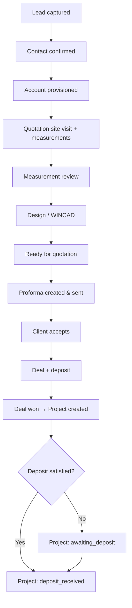
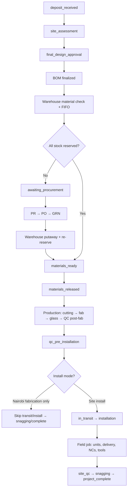
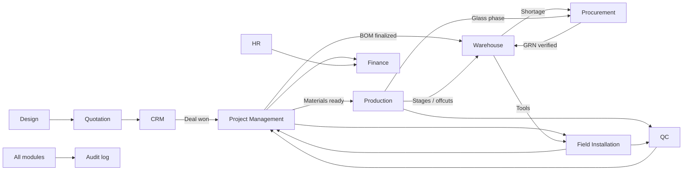

# BIBO Glass & Windows — Enterprise Resource Management System

**Document Version 2.0 · 2026**

Integrated ERM for **Bibo Glass & Windows**: sales → design → quotation → project → materials → production → QC → field installation → handover. The **project** is the spine that binds every operational module.

---

## Table of Contents

1. [What the System Does](#1-what-the-system-does)
2. [End-to-End Logic Flow](#2-end-to-end-logic-flow)
3. [System Principles](#3-system-principles)
4. [Modules](#4-modules)
5. [Cross-Module Integration](#5-cross-module-integration)
6. [Technical Architecture](#6-technical-architecture)
7. [Repository Structure](#7-repository-structure)
8. [Getting Started](#8-getting-started)
9. [User Access Model](#9-user-access-model)
10. [Detailed Module Plans](#10-detailed-module-plans)

---

## 1. What the System Does

BiboERM runs the full glass & aluminium window/door lifecycle for a fabrication and installation business:

| Domain | What it covers |
|--------|----------------|
| **Sales** | Lead capture, outreach, accounts/contacts, site visits, measurements, quotations, deals, deposits |
| **Design** | Measurement packages → WINCAD design jobs → fabrication/BOM-ready uploads |
| **Projects** | Stage-gated execution, BOM, documents, design change orders, dispatch, client progress |
| **Materials** | Warehouse stock (FIFO), tools, offcuts; procurement (PR → PO → GRN → glass orders) |
| **Manufacturing** | Production orders, cutting → fabrication → glass assembly, misfits |
| **Quality** | Checklists and inspections across warehouse, production, and site |
| **Field** | On-site installation jobs, delivery records, unit progress, non-conformities, tool custody |
| **Support** | HR, finance, IT/devices, analytics, client portal, workspace |

Every meaningful action is attributable to a **user**, often a **project**, and is audited.

---

## 2. End-to-End Logic Flow

### 2.1 Sales → Project handoff



| Phase | Logic |
|-------|--------|
| **Lead** | Intake (reception, Field Day GPS pins, marketing). Pipeline: `new_lead` → `contact_confirmed` → `account_provisioned` → site visit → measurements → design → quotation → deposit → `deal_won` / `project_created` (or `cold` / `lost`). |
| **Account** | Client hub after interest: contacts, documents, quotation visits, measurements (for quoting). |
| **Site ops (quotation)** | Field team captures openings in **mm**; visit goes through assign → capture → review. |
| **Design** | Approved measurements become a design job; WINCAD files uploaded and reviewed → ready for quotation. |
| **Quotation** | Accounting workbook / line enrichment → proforma → send → accept/revise. |
| **Deal** | Commercial record (value, negotiation, payments). Project is created when the deal is **won**. |
| **Deposit** | Tracked on the deal/project. Project starts at `awaiting_deposit` or advances to `deposit_received` when the threshold is met. |

**Important split:** CRM/quotation measurements are for **pricing**. After handoff, Project Management runs **production** site assessment measurements that drive fabrication.

### 2.2 Project → Materials → Production → Install



| Step | Owner | Logic |
|------|--------|--------|
| 1 | **PM** | After deposit: production site assessment → design approval → BOM upload & finalize |
| 2 | **Warehouse** | On `ProjectBomFinalized`: stock check + **all-or-nothing FIFO** reservation |
| 3 | **Procurement** | On shortage: auto/manual PR → approve → PO → delivery → GRN verify → inbound stock |
| 4 | **Warehouse** | Re-reserve → `materials_ready` → stage materials → `materials_released` |
| 5 | **Production** | Production order (FIFO schedule) → material prep → QC pre-check → cutting (offcuts) → fabrication → sash → glass assembly → finishing → QC post-fab |
| 6 | **Procurement** | Glass is **not warehouse stock**; glass orders trigger from fabrication completion |
| 7 | **QC** | Gates at receiving, production pre/post, site install, snagging |
| 8 | **Field** | After workshop QC: install jobs (Nairobi site vs outside full), delivery notes, unit progress, photos, non-conformities, tool issue/return |
| 9 | **PM** | Sole writer of `projects.stage` via `ProjectStageService` (other modules emit events) |
| 10 | **Finance / Client** | Payments & invoices; client portal shows controlled progress |

### 2.3 Project stages (canonical)

Only **Project Management** advances these (directly or via event listeners calling `ProjectStageService`):

| # | Stage | Typical trigger |
|---|--------|-----------------|
| 1 | `awaiting_deposit` | Project created, deposit not yet met |
| 2 | `deposit_received` | Deposit recorded / threshold met |
| 3 | `site_assessment` | Production measurements |
| 4 | `final_design_approval` | Design signed off |
| 5 | `bom_finalized` | BOM locked |
| 6 | `material_check` | Warehouse running stock check |
| 7 | `materials_reserved` | FIFO reservation complete (when used) |
| 8 | `awaiting_procurement` | Shortage detected |
| 9 | `materials_ready` | All stockable BOM lines reserved |
| 10 | `materials_released` | Staged for shop-floor pickup |
| 11 | `cutting_stage` | Production cutting |
| 12 | `fabrication_stage` | Frame / sash |
| 13 | `glass_assembly` | Glass fit |
| 14 | `qc_pre_installation` | Ready to dispatch / install |
| 15 | `in_transit` | Dispatch (skipped for fabrication-only) |
| 16 | `installation` | Field install in progress |
| 17 | `site_qc` | Site QC |
| 18 | `snagging` | Punch-list |
| 19 | `project_complete` | Closed |

**Install modes:** `nairobi_fabrication_only` | `nairobi_site_install` | `outside_full_install` — control whether transit/install stages apply.

---

## 3. System Principles

| Principle | Description |
|-----------|-------------|
| **Project-centric** | Operational work ties back to a project (and account) |
| **PM owns stage** | Only `ProjectStageService` writes `projects.stage` |
| **Events between modules** | WH / PROC / PROD / Field notify PM; they do not mutate stage directly |
| **FIFO materials** | First project in the reservation queue gets stock first (ops override audited) |
| **Glass not stocked** | Glass ordered per project; aluminium/accessories/rubbers live in warehouse |
| **Role + permission access** | Department landing + Spatie permissions; optional device lock |
| **Audit trail** | Actions logged (who / what / when / device) |
| **mm measurements** | Dimensional capture uses millimetres end-to-end |
| **Client visibility** | Portal shows progress without exposing internal ops |

---

## 4. Modules

Workspace apps and department nav are defined in `frontend/lib/navigation.ts`.

### 4.1 Workspace

Personal hub: home, today, tasks, calendar. Entry point after login before diving into a department module.

### 4.2 CRM

**Purpose:** Revenue pipeline from lead to won deal and project handoff.

| Area | Capability |
|------|------------|
| Leads | Capture, pipeline stages, notes, attachments, site images |
| Contacts & Accounts | People and companies; account is the client workspace |
| Deals | Commercial stages, negotiation, payments, create project |
| Activities | Calls, meetings, tasks, site visits, Field Day |
| Reports / analytics | Conversion and pipeline views |

**Lead pipeline (high level):** New → Contact confirmed → Account provisioned → Site visit → Measurements → Design → Quotation → Accept → Deposit → Deal won → Project created (or Cold / Lost).

### 4.3 Site Operations & Field

**Purpose:** Field capture and on-site work, separated from desk CRM.

| Area | Capability |
|------|------------|
| Field Day | Start/end day, GPS pins, convert pins to leads |
| Quotation visits | Pre-deal measurement visits + review queue |
| Production visits | Post-handoff production measurement visits |
| Installation jobs | Field Installation module UI (`/field-installation/jobs`) |

Field roles typically land on “my visits” / today queues; managers use full visit lists and review.

### 4.4 Design

**Purpose:** Turn approved measurements into fabrication-ready design packages.

| Area | Capability |
|------|------------|
| Design queue / jobs | Jobs from measurement packages |
| Measurement packages | Bundles for designers |
| WINCAD uploads | Design file upload workflow |
| Design review | Approve → ready for quotation / production BOM path |

### 4.5 Quotation

**Purpose:** Cost and sell from measurements / accounting extracts.

| Area | Capability |
|------|------------|
| Quotation requests | Incoming work for estimators |
| Proforma quotations | Draft → review → send → accept/revise |
| Line enrichment | Accounting Excel extraction, product mapping |
| PDF | Client-facing quotation documents |

### 4.6 Project Management

**Purpose:** Central execution record after deal won.

| Area | Capability |
|------|------------|
| Projects & pipeline | List, stage board, filters |
| Design / fabrication / installation views | Ops-focused project subsets |
| BOM | Upload, parse, finalize → triggers warehouse check |
| Documents | Designs, plans, attachments |
| Design change orders | Remeasure / remake when site NC or design drift |
| Material status | Reservations, shortages, procurement linkage |
| Dispatch | Drivers, transit for install |
| Timeline & delays | Projected vs actual, delay reasons |
| Client portal (staff link) | Access to client-facing progress |

### 4.7 Warehouse

**Purpose:** Stock, locations, reservations, tools, offcuts.

| Area | Capability |
|------|------------|
| Inventory | Aluminium / accessories / rubbers by deck → section → bin |
| Receive / movements | Inbound (GRN), outbound, transfer, adjustment |
| Reservations | FIFO project reservations; available = on-hand − reserved |
| Offcuts | Length/profile logging, reuse before new buy |
| Tools | Register, issue/return, incidents (damage/loss) |
| Master data | Profiles, accessories, rubbers, door types, catalog import |
| Stock take | Periodic counts |
| Project pipeline | WH view of projects awaiting materials |

**Glass is not held as warehouse inventory.**

### 4.8 Procurement

**Purpose:** Buy what warehouse cannot reserve and project-specific glass.

| Area | Capability |
|------|------------|
| Dashboard & stock views | Demand / shortage visibility |
| Requisitions | Triggers: BOM shortage, low stock, glass, client addon, manual |
| Purchase orders | Approve → send → receive |
| Goods receipts | Verify with photos → warehouse putaway |
| Suppliers & drivers | Directory, occupancy for transport |
| Glass orders | Per-project glass (not bin stock) |
| Transport | Delivery coordination |
| Glass price analytics | Projection / pricing insight |

**Flow:** Shortage event → PR → approval → PO → supplier delivery → GRN verified → `GoodsReceiptVerified` → warehouse inbound → re-reserve.

### 4.9 Production

**Purpose:** Workshop manufacturing after materials are ready.

| Area | Capability |
|------|------------|
| Schedule | Calendar / FIFO queue |
| Orders | Create from project readiness; status & teams |
| Stages | `material_prep` → `qc_pre_check` → `cutting` → `fabrication` → `sash` → `glass_assembly` → `finishing` → `qc_post_fabrication` |
| Cutting sheets | From BOM; offcut logging |
| Misfits | Units that fail fit / need remake attention |
| Stage evidence | Photos on stage complete |

Production **does not** own on-site install — that is Field Installation after post-fab QC.

### 4.10 Quality Control

**Purpose:** Formal inspections and defects across the chain.

| Context examples | When |
|------------------|------|
| Warehouse receiving / audits | GRN & stock quality |
| Production QC pre-check / post-fab / in-process | Shop floor gates |
| Site receiving / installation / snagging | Field quality |

Includes checklist **templates**, **schedules**, **inspections**, **defects** (severity + status), and photo evidence.

### 4.11 Field Installation

**Purpose:** On-site install after workshop completion.

| Area | Capability |
|------|------------|
| Jobs | Per project; start / complete / hold |
| Members | Crew assignment |
| Daily logs & photos | Progress evidence |
| Delivery records | Especially outside Nairobi |
| Unit progress | Per opening / unit status |
| Non-conformities | Shortage, damage, measurement mismatch, etc. |
| Tools | Issue/return via Warehouse tools API |

Handoff: Production ends at `qc_post_fabrication` → PM `qc_pre_installation` → Field job → PM `site_qc` / snagging / complete.

### 4.12 Finance

**Purpose:** Money in and out tied to sales and ops.

| Area | Capability |
|------|------------|
| Deposit requests & receipts | Deal / project deposits |
| Invoices & payments | Client billing |
| Expenses | Operating costs |
| Reports | Finance summaries |

### 4.13 HR

**Purpose:** People operations.

| Area | Capability |
|------|------------|
| Employees | Profiles, IDs, contracts |
| Payroll | Kenya-oriented NHIF/NSSF/PAYE config |
| Leave | Requests & review |
| Documents | HR file store |

### 4.14 IT Admin

**Purpose:** Access control and platform hygiene.

| Area | Capability |
|------|------------|
| Users & invitations | Onboarding |
| Roles & permissions | Spatie roles |
| Devices | Registration / lock (configurable) |
| Audit log | Cross-module trail |

### 4.15 Analytics & Client Portal

| Module | Purpose |
|--------|---------|
| **Analytics** | Management overview: pipeline, projects, stock, production, payments |
| **Client Portal** | Client verifies project reference + phone → short-lived token → read-only progress |

---

## 5. Cross-Module Integration

Authoritative contract: [`docs/INTEGRATION_CONTRACT.MD`](docs/INTEGRATION_CONTRACT.MD).



| From | To | Integration |
|------|-----|-------------|
| CRM deal won | PM | `DealProjectCreated` → project + initial stage |
| Design approved | Quotation / PM | Ready for proforma or production BOM |
| PM BOM finalize | Warehouse | `ProjectBomFinalized` → stock check + FIFO |
| Warehouse shortage | Procurement | `ProjectMaterialShortageDetected` → PR |
| GRN verified | Warehouse | Inbound + re-reserve → materials ready |
| Materials ready | Production | Production order + schedule |
| Production stage done | PM / WH / PROC | Stage sync, offcuts, glass orders |
| Post-fab QC | Field | Install job; tools from warehouse |
| Field complete | PM / QC | Site QC & snagging |
| Measurement NC | Design change order | Remeasure / remake path |

**Golden rule:** Warehouse, Procurement, Production, and Field **emit events**; Project Management **writes** `projects.stage`.

---

## 6. Technical Architecture

| Layer | Technology |
|-------|------------|
| Frontend | Next.js (App Router), React, Tailwind, shadcn/ui |
| Backend | PHP 8.2+ / Laravel API (`/api/v1/...`) |
| Auth | Sanctum / sessions, Spatie permissions, optional 2FA & device lock |
| Database | PostgreSQL or MySQL |
| Files | Bibo storage disk (profiles, CRM, BOM, QC, field photos, etc.) |
| Brand | Primary `#ec2024`, radius `10px` |

API route groups live under `backend/routes/api/` (crm, projects, warehouse, procurement, production, qc, field-installation, design, quotation, site-ops, hr, workspace, …).

---

## 7. Repository Structure

```
BiboERM/
├── README.md                 # This document
├── docs/                     # Module plans & integration contract
├── frontend/                 # Next.js application
│   ├── app/                  # App Router pages
│   ├── components/           # UI by domain
│   └── lib/                  # Navigation, API clients, domain helpers
└── backend/                  # Laravel API
    ├── app/                  # Models, services, events, enums
    ├── database/migrations/
    ├── routes/api/
    └── tests/
```

---

## 8. Getting Started

### Prerequisites

- Node.js 18+
- PHP 8.2+ and Composer
- PostgreSQL or MySQL

### Backend

```powershell
cd backend
composer install
# Configure .env (DB, APP_URL, etc.)
php artisan migrate:fresh --seed
php artisan serve
```

### Frontend

```bash
cd frontend
npm install
npm run dev
```

Open [http://localhost:3000](http://localhost:3000).

| Script | Description |
|--------|-------------|
| `npm run dev` | Development server |
| `npm run build` | Production build |
| `npm run start` | Serve production build |
| `npm run lint` | ESLint |

---

## 9. User Access Model

- **Department** — default landing module (CRM, Warehouse, Production, etc.)
- **Role + permissions** — what actions are allowed (cumulative)
- **Super admin** — full access

| Department (examples) | Default focus |
|-----------------------|---------------|
| Sales / Reception | CRM, Field Day |
| Site / Field | Site ops, installation jobs |
| Design | Design queue, WINCAD |
| Project Management | Projects, BOM, stages |
| Warehouse | Inventory, reservations, tools |
| Procurement | PRs, POs, GRNs, glass |
| Production | Schedule, stages, misfits |
| QC | Inspections, defects |
| Finance / HR / IT | Their respective modules |

Detailed onboarding: [`docs/USER_ONBOARDING.MD`](docs/USER_ONBOARDING.MD).

---

## 10. Detailed Module Plans

| Doc | Topic |
|-----|--------|
| [`docs/SALES_CRM.MD`](docs/SALES_CRM.MD) | CRM baseline |
| [`docs/SALES_CRM_FLOW_UPDATE.MD`](docs/SALES_CRM_FLOW_UPDATE.MD) | Account-centric sales flow |
| [`docs/PROJECT_MANAGEMENT.MD`](docs/PROJECT_MANAGEMENT.MD) | Projects & stages |
| [`docs/WAREHOUSE.MD`](docs/WAREHOUSE.MD) | Warehouse |
| [`docs/WAREHOUSE_MIGRATION_SPEC.MD`](docs/WAREHOUSE_MIGRATION_SPEC.MD) | Warehouse schema |
| [`docs/PROCUREMENT.MD`](docs/PROCUREMENT.MD) | Procurement |
| [`docs/PRODUCTION.MD`](docs/PRODUCTION.MD) | Production |
| [`docs/FIELD_INSTALLATION.MD`](docs/FIELD_INSTALLATION.MD) | Field install |
| [`docs/QUALITY_CONTROL.MD`](docs/QUALITY_CONTROL.MD) | QC |
| [`docs/INTEGRATION_CONTRACT.MD`](docs/INTEGRATION_CONTRACT.MD) | Events & ownership |
| [`docs/CROSS_MODULE_FLOW_GAP_AUDIT.md`](docs/CROSS_MODULE_FLOW_GAP_AUDIT.md) | Flow coverage & gaps |
| [`docs/USER_ONBOARDING.MD`](docs/USER_ONBOARDING.MD) | Users, roles, HR |

---

## License & Confidentiality

Proprietary system for **Bibo Glass & Windows**. Unauthorized distribution is prohibited.

---

*— BiboERM README v2.0 —*
