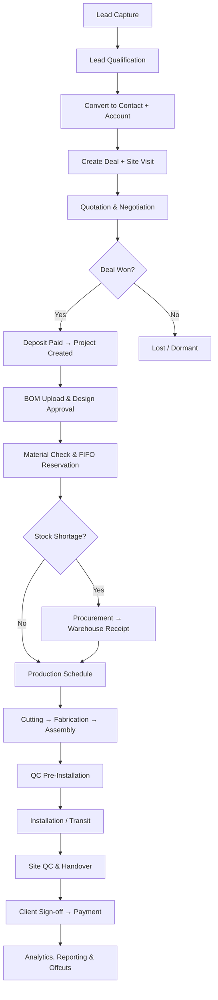
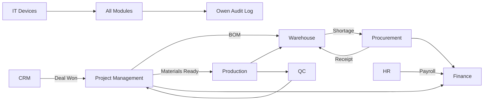

# BIBO Glass & Windows — Enterprise Resource Management System

**Document Version 1.0 · 2026**

A comprehensive, integrated Enterprise Resource Management (ERM) platform for **Bibo Glass & Windows**, streamlining operations from lead capture through project delivery, production, quality control, and installation.

---

## Table of Contents

1. [Executive Summary](#1-executive-summary)
2. [Core Business Flow](#2-core-business-flow)
3. [System Principles](#3-system-principles)
4. [Technical Architecture](#4-technical-architecture)
5. [Repository Structure](#5-repository-structure)
   - [Database Migrations](#51-database-migrations)
6. [Getting Started](#6-getting-started)
7. [User Onboarding & Management](#7-user-onboarding--management)
8. [Modules](#8-modules)
   - [CRM](#81-crm-module)
   - [Project Management](#82-project-management-module)
   - [Warehouse](#83-warehouse-module)
   - [Procurement](#84-procurement-module)
   - [Production](#85-production-module)
   - [Quality Control](#86-quality-control-module)
   - [HR](#87-hr-module)
   - [Finance](#88-finance-module)
   - [IT / Device Management](#89-it--device-management-module)
9. [Analytics & Reporting](#9-analytics--reporting)
10. [Cross-Module Integration](#10-cross-module-integration)
11. [Frontend (Current Implementation)](#11-frontend-current-implementation)
12. [Roadmap & Backend](#12-roadmap--backend)

---

## Document Information

| Field | Value |
|-------|--------|
| **Project Name** | Bibo Glass & Windows ERM System |
| **Prepared For** | Bibo Glass & Windows Management |
| **Document Type** | System Design Plan |
| **Scope** | Full ERP: CRM, Projects, Warehouse, Procurement, Production, QC, HR, Finance |
| **Backend Language** | PHP |
| **Database** | PostgreSQL / MySQL (relational) |
| **Logging** | Owen (PHP logging library) |
| **Authentication** | Session-based with optional 2FA |
| **Frontend** | React / Next.js |
| **Version** | 1.0 — Initial Design |

---

## 1. Executive Summary

Bibo Glass & Windows requires an integrated ERM system to manage the full operational lifecycle: sales, engineering, materials, manufacturing, quality, installation, and finance.

The system is **project-centric** — a project is the backbone that binds every module together. Every activity is traceable to a **project**, **employee**, **device**, and **timestamp**.

---

## 2. Core Business Flow



| Step | Stage |
|------|--------|
| 1 | Lead capture (field officers, reception, marketing) |
| 2 | Lead qualification (calls, SMS, site visits, meetings) |
| 3 | Convert lead → contact + account |
| 4 | Create deal → site visit & measurements |
| 5 | Quotation & negotiation |
| 6 | Deal won → deposit paid → project created |
| 7 | BOM upload & final design approval |
| 8 | Material check & stock reservation (FIFO) |
| 9 | Procurement (if shortage) → warehouse receives stock |
| 10 | Production schedule → cutting → fabrication → assembly |
| 11 | QC inspection (pre-installation) |
| 12 | Installation (Nairobi = fabrication only; outside = full project) |
| 13 | Site QC inspection & handover |
| 14 | Client sign-off → payment completion |
| 15 | Analytics, reporting & offcut tracking |

---

## 3. System Principles

| Principle | Description |
|-----------|-------------|
| **Project-centric** | Every action ties to a project |
| **Role-driven access** | Department sets default view; role determines permissions |
| **Device-locked** | Users log in only from registered devices |
| **Full audit trail** | All actions logged via Owen (who, what, where, when) |
| **FIFO material reservation** | First project in line gets stock reserved first |
| **Connected modules** | CRM → Project → Warehouse → Procurement → Production → QC → Finance |
| **Client visibility** | Client dashboard tracks project progress in real time |

---

## 4. Technical Architecture

### 4.1 Technology Stack

| Layer | Technology | Purpose |
|-------|------------|---------|
| **Backend** | PHP (latest stable) | Core application logic, API endpoints |
| **Database** | PostgreSQL or MySQL | Relational data storage |
| **Logging** | Owen (PHP) | Structured audit logging |
| **Authentication** | PHP sessions + bcrypt | Session-based auth with optional 2FA |
| **Email** | Gmail API (OAuth2) | Send/receive per-user Gmail |
| **File storage** | Local / Firebase | BOMs, images, drawings, documents |
| **Frontend** | React / Next.js | Responsive web UI |
| **Device security** | Browser fingerprint + device UUID | Login restricted to registered devices |
| **2FA** | TOTP / email OTP | Optional two-factor authentication |
| **PDF** | DomPDF / mPDF | Quotations, reports, BOMs |
| **Queue** | Database queue or Redis | Email dispatch, notifications |

### 4.2 Authentication & Security

**Session management**

- Short-lived sessions with configurable inactivity timeout (e.g. 30 minutes)
- Session regeneration on login (anti-fixation)
- Secure, HttpOnly, SameSite cookies
- Server-side session storage (database or Redis)
- Concurrent session detection — flag or terminate older sessions

**Device registration (IT module)**

- Each device registered with unique UUID and fingerprint
- Login validates: credentials + registered active device + user assignment
- Unrecognized device → access denied + IT alert
- Device record: name, type, OS, MAC, UUID, assigned user, status

**Password management**

- Forgot password via email OTP (15-minute token)
- Strength enforcement; bcrypt hashing
- Forced reset on first login or admin trigger

**Two-factor authentication (optional)**

- TOTP (Google Authenticator, Authy) or email OTP
- User-enabled or admin-enforced per role
- Backup codes on setup

### 4.3 Audit Logging (Owen)

Every system action is logged. Each entry includes:

| Field | Description |
|-------|-------------|
| `user_id` | Who performed the action |
| `device_id` | Registered device used |
| `module` | CRM, Warehouse, Production, etc. |
| `action` | create, update, delete, view, login, export |
| `entity_type` | lead, project, stock_movement, etc. |
| `entity_id` | Specific record ID |
| `old_values` | JSON snapshot before change |
| `new_values` | JSON snapshot after change |
| `ip_address` | Client IP |
| `user_agent` | Browser / device agent |
| `timestamp` | UTC date/time |

---

## 5. Repository Structure

```
BiboERM/
├── README.md                 # This document
├── docs/                     # Module implementation plans (see §8)
├── frontend/                 # Next.js web application (active)
│   ├── app/                  # App Router pages & layouts
│   ├── components/           # UI components (sidebar, CRM, warehouse, etc.)
│   ├── lib/                  # Navigation, utilities
│   └── public/               # Static assets (logo, favicon, backgrounds)
└── backend/                  # Laravel API & business logic (in progress)
    └── database/migrations/  # Schema migrations (catalog below)
```

### 5.1 Database Migrations

All migration files live in `backend/database/migrations/`. **Planned** rows describe sibling migrations defined in module plans but not yet committed.

#### CRM

| Migration | Status | Tables / changes |
|-----------|--------|------------------|
| `2025_05_19_200000_create_crm_tables.php` | Applied | `accounts`, `contacts`, `leads`, `deals`, `crm_activities` |
| `2025_05_23_100000_expand_crm_module.php` | Applied | CRM lookups (`crm_lead_sources`, `crm_counties`, …), `site_visits`, `measurement_lines`, `site_visit_photos`, `quotations`, `quotation_lines`, `deal_payments`, `field_days`, `field_day_pins`, `lead_attachments` |
| `2026_05_26_120000_add_timestamps_to_crm_line_tables.php` | Applied | Adds `updated_at` / timestamps on `measurement_lines`, `deal_payments`, `quotation_lines` |
| `2026_05_26_120001_seed_crm_lookup_tables.php` | Applied | Seeds CRM lookup reference data (lead sources, counties, etc.) |

#### Project Management

| Migration | Status | Tables / changes |
|-----------|--------|------------------|
| `2025_05_19_300000_create_projects_tables.php` | Applied | `projects`, `project_stage_logs`, `project_documents` |
| `2025_05_19_300001_expand_project_bom_tables.php` | **Planned** | `project_boms`, `project_bom_lines`, `project_engineers`, `project_delays`, `project_floors`, `project_stage_requirements`, `project_addon_requests` — see [docs/PROJECT_MANAGEMENT.MD](docs/PROJECT_MANAGEMENT.MD) §7 |

#### Warehouse

| Migration | Status | Tables / changes |
|-----------|--------|------------------|
| `2025_05_19_400000_create_warehouse_tables.php` | Applied (stub — refactor pending) | Current: `warehouses`, `warehouse_sections`, `warehouse_bins`, `inventory_items`, `stock_movements`, `stock_reservations`, `offcuts`. Target: 18-table deck/bin/stock model per [docs/WAREHOUSE.MD](docs/WAREHOUSE.MD) §6 and [docs/WAREHOUSE_MIGRATION_SPEC.MD](docs/WAREHOUSE_MIGRATION_SPEC.MD) |

#### Procurement

| Migration | Status | Tables / changes |
|-----------|--------|------------------|
| `2025_05_19_500000_create_procurement_tables.php` | Applied | `suppliers`, `purchase_requisitions`, `purchase_orders`, `purchase_order_lines` |
| `2025_05_19_500001_expand_procurement_tables.php` | **Planned** | `purchase_requisition_lines`, `goods_receipts`, `goods_receipt_lines`, `goods_receipt_attachments`, `transport_orders`, `procurement_delays`, `glass_orders`, `project_addon_requests`, `supplier_item_prices`, `procurement_project_watchers` — see [docs/PROCUREMENT.MD](docs/PROCUREMENT.MD) §6 |

#### Production

| Migration | Status | Tables / changes |
|-----------|--------|------------------|
| `2025_05_19_600000_create_production_tables.php` | Applied | `production_orders`, `production_stage_logs` |
| `2025_05_19_600001_expand_production_tables.php` | **Planned** | `production_order_teams`, `production_material_releases`, `cutting_sheets` — see [docs/PRODUCTION.MD](docs/PRODUCTION.MD) §7 |

#### Field Installation

| Migration | Status | Tables / changes |
|-----------|--------|------------------|
| `2025_05_19_650000_create_field_installation_tables.php` | **Planned** | `field_installation_jobs`, `field_installation_job_members`, `field_installation_daily_logs`, `field_installation_photos` — see [docs/FIELD_INSTALLATION.MD](docs/FIELD_INSTALLATION.MD) §6 |
| `2025_05_19_650001_expand_field_installation_tables.php` | **Planned** | `field_delivery_records`, `field_delivery_lines`, `field_non_conformities`, `field_installation_units`, `field_tool_assignments` — see [docs/FIELD_INSTALLATION.MD](docs/FIELD_INSTALLATION.MD) §6 |

#### Quality Control

| Migration | Status | Tables / changes |
|-----------|--------|------------------|
| `2025_05_19_700000_create_qc_tables.php` | Applied | `qc_checklist_templates`, `qc_inspections`, `qc_defects` |

#### Finance

| Migration | Status | Tables / changes |
|-----------|--------|------------------|
| `2025_05_19_800000_create_finance_tables.php` | Applied | `invoices`, `payments`, `expenses` |

#### Auth, HR & platform (2026_05_22+)

| Migration | Status | Tables / changes |
|-----------|--------|------------------|
| `0001_01_01_000000_create_users_table.php` | Applied | `users`, `password_reset_tokens`, `sessions` |
| `0001_01_01_000001_create_cache_table.php` | Applied | `cache`, `cache_locks` |
| `0001_01_01_000002_create_jobs_table.php` | Applied | `jobs`, `job_batches`, `failed_jobs` |
| `2026_05_22_193038_create_permission_tables.php` | Applied | Spatie permissions: `permissions`, `roles`, pivots |
| `2026_05_22_193039_create_personal_access_tokens_table.php` | Applied | `personal_access_tokens` (Sanctum) |
| `2026_05_22_193040_create_departments_table.php` | Applied | `departments` |
| `2026_05_22_193041_create_user_department_roles_table.php` | Applied | `user_department_roles` |
| `2026_05_23_010000_create_user_invitations_table.php` | Applied | `user_invitations` |
| `2026_05_23_010001_create_user_profiles_table.php` | Applied | `user_profiles` |
| `2026_05_23_010002_create_employee_profiles_table.php` | Applied | `employee_profiles` |
| `2026_05_23_010003_create_audit_logs_table.php` | Applied | `audit_logs` (Owen audit trail) |
| `2026_05_23_010004_create_user_devices_table.php` | Applied | `user_devices` |
| `2026_05_23_120001_add_two_factor_to_users_table.php` | Applied | 2FA columns on `users` |
| `2026_05_23_120002_create_login_otp_codes_table.php` | Applied | `login_otp_codes` |
| `2026_05_23_130001_create_profile_change_requests_table.php` | Applied | `profile_change_requests` |
| `2026_05_23_140001_create_leave_requests_table.php` | Applied | `leave_requests` |
| `2026_05_23_140002_create_hr_documents_table.php` | Applied | `hr_documents` |

Run a full reset with seed data (PowerShell):

```powershell
cd backend; php artisan migrate:fresh --seed
```

---

## 6. Getting Started

### Prerequisites

- **Node.js** 18+ (for frontend)
- **npm** or **pnpm**
- **PHP** 8.2+ and **Composer** (backend)
- **PostgreSQL** or **MySQL**

### Backend setup

After configuring `.env` and the database connection:

```powershell
cd backend
composer install
php artisan migrate:fresh --seed
php artisan serve
```

See [§5.1 Database Migrations](#51-database-migrations) for the full migration catalog.

### Frontend development

```bash
cd frontend
npm install
npm run dev
```

Open [http://localhost:3000](http://localhost:3000).

| Script | Description |
|--------|-------------|
| `npm run dev` | Start development server (Turbopack) |
| `npm run build` | Production build |
| `npm run start` | Run production build (requires `build` first) |
| `npm run lint` | ESLint |

### Branding (frontend)

| Asset | Path |
|-------|------|
| Logo | `/public/image.png` |
| Favicon | `/public/favicon.png` |
| Login background | `/public/background.jpeg` |
| Primary color | `#ec2024` |
| Border radius | `10px` |

---

## 7. User Onboarding & Management

> **Implementation plan:** [docs/USER_ONBOARDING.MD](docs/USER_ONBOARDING.MD)

Foundation module for access control. All other modules depend on it.

### 7.1 Department vs Role

- **Department** — where someone belongs; sets default module landing page
- **Role** — what they can do; can grant access beyond department; cumulative (multiple roles)

| Department | Default Module | Notes |
|------------|----------------|-------|
| Sales / Marketing | CRM | Field officers also use Field Day |
| Production | Production | Cutting, fabrication, assembly |
| Warehouse / Inventory | Warehouse | Accessories Manager, Aluminium Manager |
| Procurement | Procurement | Stock visibility |
| Quality Control | QC | View production & project status |
| HR | HR | Payroll, leave, employee info |
| Finance | Finance | Invoices, payments, expenses |
| IT | IT / Device Management | Devices, users, audit |
| Project Management | Projects | PM team, engineers |
| Operations / Admin | Dashboard (all modules) | Full visibility |
| Reception | CRM / Lead Entry | Lead capture |

### 7.2 Roles

| Role | Key Permissions |
|------|-----------------|
| Super Admin | Full access, user management, configuration |
| Operations Manager | Full visibility, reports, approvals |
| Sales Representative | CRM pipeline, lead to project |
| Field Officer | Lead capture, field day, location pins |
| Project Manager | Projects, team assignment, client updates |
| Production Manager | Production pipeline, scheduling |
| Warehouse Manager (Accessories) | Accessories stock, bins, movements |
| Warehouse Manager (Aluminium) | Profile stock, sections, bins |
| Procurement Officer | POs, suppliers, glass orders |
| QC Inspector | Checklists, inspections, defects |
| HR Manager | Employee info, payroll, leave |
| Finance Officer | Invoices, payments, payroll |
| IT Admin | Devices, users, audit logs |
| Reception | Lead entry, scheduling |
| Client (External) | Read-only client dashboard |

### 7.3 User Master Fields

| Field | Type | Notes |
|-------|------|-------|
| Full Name | VARCHAR | Legal name |
| Email | VARCHAR UNIQUE | Login + communications |
| Phone | VARCHAR | Primary contact |
| Department | FK → departments | Primary department |
| Job Title | VARCHAR | Formal title |
| Profile Photo | VARCHAR (path) | Optional |
| Status | ENUM | Active, Inactive, Suspended |
| Date Joined | DATE | Employment start |
| Created By | FK → users | IT admin |
| Last Login | TIMESTAMP | Last access |

### 7.4 Employee Info (HR Extension)

Extends users with: emergency contacts, residence, salary (encrypted bank details), National ID / KRA / NHIF / NSSF, contract type and dates, employee number, HR notes.

---

## 8. Modules

### 8.1 CRM Module

> **Implementation plan:** [docs/SALES_CRM.MD](docs/SALES_CRM.MD)

Entry point for revenue. Manages lead → contact → deal → project.

**Lead sources:** field visits (GPS), reception, calls/SMS, social/web.

**Lead statuses:** New → Contacted → Qualified → Site Visit Scheduled → Quotation Sent → Negotiation → Won / Lost / Dormant.

**Sales pipeline**

1. Lead capture  
2. Qualification (calls, SMS, meetings)  
3. Convert to contact + account  
4. Create deal  
5. Site visit & measurements  
6. Quotation (itemised from measurements)  
7. Send quote (Gmail API)  
8. Negotiation  
9. Deal won + deposit  
10. Project created — execution begins  

**Activities:** call logging (device dialer + notes), Gmail OAuth integration, tasks with due dates and priorities.

**Field Day:** start/end day, GPS pins linked to leads/contacts/visits, map view for managers.

**Contacts & accounts:** contact = person; account = company (optional); full lead history retained.

---

### 8.2 Project Management Module

> **Implementation plan:** [docs/PROJECT_MANAGEMENT.MD](docs/PROJECT_MANAGEMENT.MD)

Central entity binding all operational modules.

**Core fields:** client (from CRM), name, type (supply only / fabrication / full install), location (Nairobi vs outside), dates, overage buffer, sales rep, PM, engineers, deal reference, priority, apartment/floor tracking.

**Project stages (18)**

1. Awaiting Deposit  
2. Deposit Received  
3. Site Assessment  
4. Final Design & Approval  
5. BOM Finalized  
6. Material Check  
7. Materials Reserved (FIFO)  
8. Awaiting Procurement  
9. Materials Ready  
10. Cutting Stage (~3 days)  
11. Fabrication Stage  
12. Glass Assembly  
13. QC Pre-Installation  
14. In Transit  
15. Installation  
16. Site QC  
17. Snagging  
18. Project Complete  

**Timeline:** projected vs actual, delay logging with reasons, % completion, alerts when deadline is within 3 days of risk.

**BOM & documents:** Excel BOM parse, design PDFs/DWG, works plan, version history.

**Material tracking:** BOM ↔ warehouse items, FIFO reservation, procurement on shortage, stage-based release, offcut logging.

**Client dashboard:** read-only portal — stage, dates, photos, PM notes, appropriate delay notifications.

---

### 8.3 Warehouse Module

> **Implementation plan:** [docs/WAREHOUSE.MD](docs/WAREHOUSE.MD) · Migration refactor spec: [docs/WAREHOUSE_MIGRATION_SPEC.MD](docs/WAREHOUSE_MIGRATION_SPEC.MD)

Two stock categories: **Accessories** and **Aluminium Profiles** (separate manager roles). **Glass is not stored** — sourced per project.

**Hierarchy:** Warehouse → Section → Bin → Item  
Example: SEC5FG (sliding door) → BIN2 (hinges).

**Master data:** profiles, accessories, rubbers/gaskets, door types with standard accessory quantities.

**Stock:** levels per bin, movements (inbound/outbound/transfer/adjustment), FIFO reservations, available = total − reserved, low-stock alerts, monthly stock-take.

**Offcut warehouse:** length/profile logging, allocation before new procurement, monthly efficiency analytics.

**Tools:** registration, project assignment, issuance/return, damage reports.

---

### 8.4 Procurement Module

> **Implementation plan:** [docs/PROCUREMENT.MD](docs/PROCUREMENT.MD)

Sources aluminium, accessories, rubbers, and **project-specific glass**.

**Triggers:** low-stock alert, BOM shortage, glass at assembly stage, manual requisition.

**PO flow:** requisition → supplier → PO → approval → send → delivery → GRN → stock update → invoice match → payment.

**Suppliers:** profiles, price history, preferred flags, performance metrics, glass directory.

**Delays:** logged per project; analytics by supplier/category/month.

**Transport orders:** delivery coordination, vehicle/driver, GRN on arrival.

---

### 8.5 Production Module

> **Implementation plan:** [docs/PRODUCTION.MD](docs/PRODUCTION.MD) · v1.1

Manufacturing from material prep through assembly.

**Pipeline:** production order → schedule (FIFO) → material prep → QC pre-check → cutting → fabrication → sash → glass assembly → finishing → QC post-fabrication.

**Scheduling:** calendar, team assignment, stage completion logging, next-stage notifications.

**Offcuts:** cutting sheet from BOM, immediate offcut logging, staged warehouse release.

**On-site install:** see [Field Installation](#855-field-installation-module) — not part of the Production developer scope.

---

### 8.55 Field Installation Module

> **Implementation plan:** [docs/FIELD_INSTALLATION.MD](docs/FIELD_INSTALLATION.MD) · v1.0

On-site execution after workshop production completes. Per-project jobs with daily progress logs, photo evidence, delivery receipts, and non-conformity tracking.

**Nairobi site install:** install pre-fabricated units at client premises; daily logs + photos.

**Outside Nairobi:** record goods delivery (photos, counts), log transport/install issues, then full on-site install with daily progress.

**Tools:** field engineers receive tools via Warehouse issue API; assignments linked to jobs; return required before job close.

**Handoff:** Production ends at `qc_post_fabrication`; Field Installation starts when PM reaches `qc_pre_installation` / `installation` (see `projects.install_mode`).

---

### 8.6 Quality Control Module

QC at three stages: pre-cutting, post-fabrication, post-installation.

| Stage | Trigger | Output |
|-------|---------|--------|
| Pre-production material check | Materials for cutting | Approve / reject + defects |
| Post-fabrication | Final assembly complete | Pass/fail checklist + photos |
| Pre-installation | Ready to dispatch | Damage check, dispatch approval |
| Site installation QC | Installation complete | Site checklist |
| Snagging sign-off | Snagging resolved | Handover + client sign-off |

**Checklists:** templates per product type, pass/fail items, defect severity (Critical/Major/Minor), photos, inspector attribution.

**Analytics:** defect rates, common types, inspector performance, resolution time.

---

### 8.7 HR Module

Employee data, payroll, documentation. Attendance is external.

**Scope:** personal info, emergency contacts, residence, salary & encrypted bank, government IDs, contracts, salary history, HR notes.

**Payroll:** monthly run, NHIF/NSSF/PAYE, payslips (PDF), finance approval, history retention.

---

### 8.8 Finance Module

Client payments, procurement costs, payroll, expenses.

**Scope:** milestone invoices, partial/full payments, expenses, payroll from HR, profit per project, supplier invoice matching, P&L, receivables ageing.

---

### 8.9 IT / Device Management Module

Hardware-layer access control.

**Device registration:** name, type, OS, MAC, serial, UUID, assigned users, status (Active/Suspended/Decommissioned).

**IT admin:** user CRUD, roles, 2FA enforcement, audit log filters, password reset, suspend accounts.

---

## 9. Analytics & Reporting

### Management dashboard

- Active projects (count, stages, on-time vs delayed)  
- Sales pipeline (leads, conversion, deal value)  
- Revenue (MTD, YTD vs target)  
- Production schedule by stage  
- Stock alerts  
- Outstanding payments  

### Module reports

| Module | Key Reports |
|--------|-------------|
| CRM | Conversion rate, rep performance, pipeline value, field day map |
| Projects | On-time rate, delays by reason, profitability, stage duration |
| Warehouse | Stock levels, movements, offcut reuse, wastage per project |
| Procurement | Spend by supplier, price trends, delivery performance |
| Production | Units/month, stage duration, cutting yield, productivity |
| QC | Defect rates, common defects, site resolution time |
| HR | Headcount, payroll summary, tenure |
| Finance | P&L, revenue vs costs, receivables, payroll costs |

---

## 10. Cross-Module Integration

> **Integration contract (Agents 1–5):** [docs/INTEGRATION_CONTRACT.MD](docs/INTEGRATION_CONTRACT.MD) — **v1.2 · Field Installation added** · Developer handoff: contract §12

The **project** is the central binding entity.



| From | To | Integration |
|------|-----|-------------|
| CRM (Lead) | CRM (Contact + Deal) | Lead converted |
| CRM (Deal Won) | Project Management | Project auto-created |
| Project | Warehouse | BOM → stock check & reservation |
| Project / Warehouse | Procurement | Shortage → PO |
| Procurement | Warehouse | Delivery → stock update |
| Project | Production | Materials ready → production order |
| Production | Warehouse | Stage release; offcuts |
| Production | QC | Stage complete → inspection |
| QC | Project | Result → stage update |
| Project (Installation) | QC | Site checklist |
| Project (Complete) | Finance | Final invoice |
| HR (Payroll) | Finance | Approved payroll → payment |
| Procurement | Finance | Invoice ↔ PO payment |
| All modules | Audit Log | Owen entry every action |
| IT (Devices) | All modules | Device check on login |

---

## 11. Frontend (Current Implementation)

The `frontend/` package is a **Next.js 16** application with:

- **Workspace hub** — app launcher for all modules  
- **Dynamic sidebar** — workspace nav vs department-specific grouped navigation  
- **Sticky global topbar** — search, notifications, profile, sidebar toggle  
- **Department pages** — CRM (leads, contacts, deals), warehouse, procurement, QC, production, projects, analytics  
- **UI** — Tailwind CSS v4, shadcn/ui, brand colors (`#ec2024`), liquid-glass login  

### Key routes (examples)

| Route | Purpose |
|-------|---------|
| `/` | Login |
| `/workspace` | App hub (default after login) |
| `/analytics` | Management dashboard |
| `/crm/leads` | Lead management |
| `/warehouse/inventory` | Stock management |
| `/procurement/orders` | Purchase orders |
| `/production/schedule` | Production schedule |
| `/qc/inspections` | QC inspections |

Navigation definitions live in `frontend/lib/navigation.ts`.

---

## 12. Roadmap & Backend

| Phase | Status | Description |
|-------|--------|-------------|
| UI shell & navigation | **In progress** | Next.js frontend, module layouts, department pages |
| Auth, onboarding & HR | **In progress** | Sessions, invitations, profiles, departments/roles — partially implemented ([docs/USER_ONBOARDING.MD](docs/USER_ONBOARDING.MD)) |
| CRM & deal-to-project | **In progress** | Backend partial — leads, deals, quotations, site visits; handoff service exists ([docs/SALES_CRM.MD](docs/SALES_CRM.MD)) |
| Project Management | **Schema defined — implementation starting** | Base `projects` tables applied; BOM expansion planned ([docs/PROJECT_MANAGEMENT.MD](docs/PROJECT_MANAGEMENT.MD)) |
| Warehouse FIFO & BOM | **Schema defined — implementation starting** | Stub migration applied; refactor per [docs/WAREHOUSE_MIGRATION_SPEC.MD](docs/WAREHOUSE_MIGRATION_SPEC.MD) |
| Procurement | **Schema defined — implementation starting** | Suppliers/POs applied; GRN/glass expansion planned ([docs/PROCUREMENT.MD](docs/PROCUREMENT.MD)) |
| Production | **Schema defined — implementation starting** | Base orders applied; expansion planned ([docs/PRODUCTION.MD](docs/PRODUCTION.MD)) |
| Field Installation | **Schema defined — implementation starting** | Migrations `650000`/`650001` planned ([docs/FIELD_INSTALLATION.MD](docs/FIELD_INSTALLATION.MD)) |
| QC & Finance | **Schema defined** | Checklist/invoice tables in migrations; services not yet built |
| Owen audit logging | **Planned / partial** | `audit_logs` table exists; full cross-module Owen integration pending |
| Gmail & PDF integrations | Planned | Quotes, emails, documents |
| Cross-module event wiring | Schema defined — implementation starting | Per [docs/INTEGRATION_CONTRACT.MD](docs/INTEGRATION_CONTRACT.MD) §11 resolved decisions |

---

## License & Confidentiality

Proprietary system design and software for **Bibo Glass & Windows**. Unauthorized distribution is prohibited.

---

*— End of System Design Plan · README v1.0 —*
