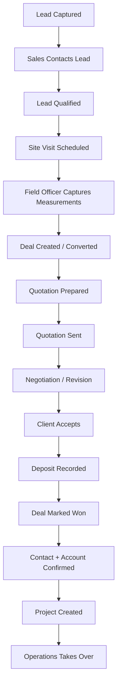

# Sales & CRM Module — Implementation Plan

**Module:** CRM · Sales Pipeline · Field Visits · Quotations · Deal-to-Project Handoff  
  
**References:** [README.md](../../README.md) §8.1 (CRM), [USER_ONBOARDING.MD](./USER_ONBOARDING.MD) (auth, departments, roles, permissions)  
**Version:** 1.0 · 2026

---

## Table of Contents

1. [Goals & Object Model Summary](#1-goals--object-model-summary)
2. [Connecting Users to CRM by Department](#2-connecting-users-to-crm-by-department)
3. [Repository & Module Folder Structure](#3-repository--module-folder-structure)
4. [Overall BIBO Sales Flow](#4-overall-bibo-sales-flow)
5. [Entity Relationship Model](#5-entity-relationship-model)
6. [Database Schema](#6-database-schema)
7. [Pipelines & Stages](#7-pipelines--stages)
8. [New Lead Form Specification](#8-new-lead-form-specification)
9. [Lead Conversion (Contact + Account + Deal)](#9-lead-conversion-contact--account--deal)
10. [Contacts & Accounts](#10-contacts--accounts)
11. [Deals & Quotations](#11-deals--quotations)
12. [Site Visits & Measurements](#12-site-visits--measurements)
13. [Deposits & Deal Won](#13-deposits--deal-won)
14. [Project Handoff](#14-project-handoff)
15. [Stage Actions & UI Buttons](#15-stage-actions--ui-buttons)
16. [API Endpoints](#16-api-endpoints)
17. [Permissions & Data Scoping](#17-permissions--data-scoping)
18. [CRM Seed Data](#18-crm-seed-data)
19. [Frontend Routes (Existing + Planned)](#19-frontend-routes-existing--planned)
20. [Audit Logging](#20-audit-logging)
21. [Implementation Phases](#21-implementation-phases)
22. [Practical Example (End-to-End)](#22-practical-example-end-to-end)

---

## 1. Goals & Object Model Summary

### What CRM owns


| Object              | Purpose                                                  |
| ------------------- | -------------------------------------------------------- |
| **Lead**            | Someone who *may* be interested — qualification pipeline |
| **Contact**         | Real person you communicate with                         |
| **Account**         | Company, estate, developer, contractor, or org           |
| **Deal**            | Sales opportunity — value, quote, negotiation, deposit   |
| **Site Visit**      | Field measurement visit (linked to lead or deal)         |
| **Measurement**     | Structured room/opening dimensions from visit            |
| **Quotation**       | Priced offer sent to client                              |
| **Deal Payment**    | Deposit / partial payment toward deal                    |
| **Activity / Task** | Calls, follow-ups, meetings (README §8.1)                |


### What CRM does **not** own (handoff only)


| Object               | Owner module                                 |
| -------------------- | -------------------------------------------- |
| **Project**          | Project Management (created when deal = Won) |
| **BOM / Production** | Project → Warehouse → Production             |


### Golden rules

1. **Lead** = interest · **Deal** = money · **Project** = execution
2. Deal moves to **Won** only after **deposit recorded** (management override optional).
3. **Convert Lead** creates Contact + Account + Deal together (default).
4. Field officers see **only assigned visits**; sales reps see **owned leads/deals** unless manager role.
5. All CRM routes require **Sales / Marketing department** and/or CRM permissions (see §2).

---

## 2. Connecting Users to CRM by Department

CRM access is **not** automatic for every logged-in user. It is granted through the onboarding model in [USER_ONBOARDING.MD](./USER_ONBOARDING.MD).

### 2.1 Department → default CRM landing

From `DepartmentSeeder` (`sales_marketing`):


| Department slug   | `default_module` | CRM landing route                   |
| ----------------- | ---------------- | ----------------------------------- |
| `sales_marketing` | `crm`            | `/crm/leads`                        |
| `reception`       | `crm`            | `/crm/leads` (lead entry only)      |
| `operations`      | `workspace`      | Full CRM if role grants             |
| `it`              | `it`             | Admin/audit only unless role grants |


When a user with primary department `sales_marketing` logs in, frontend reads `departments_cache` from `/auth/me` and redirects to `/crm/leads` (or last visited CRM page).

### 2.2 Roles that access CRM


| Role slug              | CRM access level                                          |
| ---------------------- | --------------------------------------------------------- |
| `super_admin`          | Full CRM + all records                                    |
| `operations_manager`   | Read all; approve discounts                               |
| `sales_representative` | Full sales pipeline on **owned** records                  |
| `field_officer`        | Field Day, site visits, measurements; limited lead create |
| `reception`            | Create/view leads; no deal approval                       |
| `project_manager`      | Read deals/projects linked to assigned projects           |
| `client`               | No CRM (client portal only)                               |


### 2.3 Permission keys (extend `PermissionSeeder`)

```
# Leads
leads.view
leads.view_all          # managers — see team/company pipeline
leads.create
leads.update
leads.delete
leads.convert
leads.assign

# Contacts & Accounts
contacts.view
contacts.view_all
contacts.create
contacts.update
accounts.view
accounts.view_all
accounts.create
accounts.update

# Deals
deals.view
deals.view_all
deals.create
deals.update
deals.approve_discount
deals.mark_won
deals.mark_lost
deals.create_project

# Site visits & field
site_visits.view
site_visits.view_all
site_visits.schedule
site_visits.execute       # field officer — start/complete visit
site_visits.approve       # sales — approve measurements

# Quotations
quotations.view
quotations.create
quotations.send
quotations.approve

# Payments (deposit)
deal_payments.record
deal_payments.view

# Activities
activities.view
activities.create
activities.complete

# Field day
field_day.view
field_day.create
field_day.manage          # ops manager
```

### 2.4 Route middleware pattern

```php
// routes/api.php
Route::middleware(['auth:sanctum', 'active', 'permission:leads.view'])
    ->prefix('crm')
    ->group(function () {
        Route::get('/leads', [LeadController::class, 'index']);
        // ...
    });
```

**Department guard (optional extra layer):**

```php
// EnsureUserHasDepartment:sales_marketing,reception,operations
```

Use **permissions as primary**; department guard only for module entry (workspace app tile visibility).

### 2.5 Data scoping (who sees which records)


| Role                                 | Scope rule                                                                       |
| ------------------------------------ | -------------------------------------------------------------------------------- |
| `sales_representative`               | `lead_owner_id = auth()->id()` OR `assigned_sales_user_id = auth()->id()`        |
| `field_officer`                      | Site visits where `assigned_field_officer_id = auth()->id()`; leads they created |
| `operations_manager` / `super_admin` | No owner filter (`leads.view_all`)                                               |
| `reception`                          | Leads created today / all leads with `leads.view` per policy                     |


Implement via **Laravel Policies** + global scope `OwnedByUserScope` toggled by permission.

```php
// LeadPolicy
public function view(User $user, Lead $lead): bool
{
    if ($user->can('leads.view_all')) return true;
    return $lead->lead_owner_id === $user->id
        || $lead->assigned_sales_user_id === $user->id;
}
```

### 2.6 Linking users to CRM records (FK pattern)

Every CRM entity stores **user foreign keys** from `users.id`:


| Column                      | Used on                      |
| --------------------------- | ---------------------------- |
| `lead_owner_id`             | leads, deals                 |
| `assigned_sales_user_id`    | leads                        |
| `assigned_field_officer_id` | leads, site_visits, deals    |
| `created_by`                | all tables                   |
| `updated_by`                | all tables                   |
| `prepared_by`               | quotations                   |
| `received_by`               | deal_payments (finance user) |


**Do not** duplicate user name/email on CRM tables — join `users` + `user_profiles` for display.

### 2.7 Frontend connection (`/auth/me` → CRM sidebar)

```json
{
  "user": { "id": 5, "name": "Jane Doe", "email": "jane@bibo.com" },
  "departments": [
    { "id": 1, "slug": "sales_marketing", "name": "Sales / Marketing", "is_primary": true }
  ],
  "roles": ["sales_representative"],
  "permissions": ["leads.view", "leads.create", "deals.view", "deals.create", "site_visits.schedule"],
  "default_module": "crm"
}
```

`frontend/lib/navigation.ts` department `crm` paths map 1:1 to API modules. Sidebar shows CRM when `permissions` includes any `leads.*` or `deals.*`.

---

## 3. Repository & Folder Structure (match User Onboarding)

CRM code follows the **same layout as the implemented user onboarding backend** — domain subfolders under `app/`, not a flat `Controllers/` or `Modules/Crm` monolith.

### 3.1 Convention used in onboarding (implemented today)

| Layer | Pattern | Example |
|-------|---------|---------|
| **Controllers** | `app/Http/Controllers/{Domain}/` | `Auth/LoginController`, `Admin/InviteUserController`, `Hr/HrEmployeeProfileController` |
| **Form requests** | `app/Http/Requests/{Domain}/` | `Auth/LoginRequest`, `Admin/InviteUserRequest` |
| **Services** | `app/Services/{Domain}/` | `Auth/InvitationService`, `Audit/OwenAuditLogger`, `Media/AvatarStorageService` |
| **Models** | `app/Models/` (core user tables flat today) | `User.php`, `UserProfile.php`, `EmployeeProfile.php` |
| **Mail** | `app/Mail/` | `UserInvitedMail.php` |
| **Middleware** | `app/Http/Middleware/` | `EnsureUserIsActive.php` |
| **Routes** | `routes/api.php` grouped by prefix | `auth/*`, `admin/*`, `hr/*` |

**CRM applies the same rules**, with **`Crm`** as the domain and **subfolders per aggregate** (Leads, Deals, SiteVisits, …) so no single directory holds 15+ controllers.

**Namespaces:**

| Path | Namespace |
|------|-----------|
| `app/Http/Controllers/Crm/Leads/LeadController.php` | `App\Http\Controllers\Crm\Leads` |
| `app/Services/Crm/Leads/LeadConversionService.php` | `App\Services\Crm\Leads` |
| `app/Models/Crm/Lead.php` | `App\Models\Crm` |
| `app/Models/Crm/Lookup/LeadSource.php` | `App\Models\Crm\Lookup` |
| `app/Policies/Crm/LeadPolicy.php` | `App\Policies\Crm` |
| `app/Enums/Crm/LeadStatus.php` | `App\Enums\Crm` |

> Laravel PSR-4 autoload (`App\` → `app/`) picks up nested folders automatically — no extra composer config.

### 3.2 Onboarding reference tree (do not duplicate in CRM)

```
app/
├── Http/
│   ├── Controllers/
│   │   ├── Auth/              # login, logout, invite accept, password, refresh
│   │   ├── Admin/             # invite, resend, revoke, user management
│   │   ├── Hr/                # employee profile, approve
│   │   └── ProfileController.php
│   ├── Middleware/
│   └── Requests/
│       ├── Auth/
│       ├── Admin/
│       ├── Hr/
│       └── Profile/
├── Services/
│   ├── Auth/
│   ├── Audit/
│   ├── Device/
│   ├── Media/
│   └── Roles/
└── Models/                    # User, UserProfile, EmployeeProfile, …
```

**Shared from onboarding (inject, do not reimplement):**

- `App\Models\User`, `Department`, `UserDepartmentRole`
- `App\Services\Audit\OwenAuditLogger`
- `App\Services\Media\AvatarStorageService` → extend as `CrmAttachmentStorageService` for lead/visit photos

### 3.3 CRM folder structure (planned)

```
backend/
├── app/
│   ├── Enums/
│   │   └── Crm/
│   │       ├── LeadStatus.php
│   │       ├── DealStage.php
│   │       ├── ContactStatus.php
│   │       ├── AccountStatus.php
│   │       ├── SiteVisitStatus.php
│   │       └── QuotationStatus.php
│   ├── Http/
│   │   ├── Controllers/
│   │   │   └── Crm/
│   │   │       ├── Leads/
│   │   │       │   ├── LeadController.php           # index, show, store, update
│   │   │       │   ├── ConvertLeadController.php    # POST convert
│   │   │       │   └── UpdateLeadStatusController.php
│   │   │       ├── Contacts/
│   │   │       │   └── ContactController.php
│   │   │       ├── Accounts/
│   │   │       │   └── AccountController.php
│   │   │       ├── Deals/
│   │   │       │   ├── DealController.php
│   │   │       │   ├── UpdateDealStageController.php
│   │   │       │   ├── MarkDealWonController.php
│   │   │       │   ├── MarkDealLostController.php
│   │   │       │   └── CreateProjectFromDealController.php
│   │   │       ├── SiteVisits/
│   │   │       │   ├── SiteVisitController.php      # schedule, list
│   │   │       │   ├── TodaySiteVisitsController.php  # field officer
│   │   │       │   ├── StartSiteVisitController.php
│   │   │       │   ├── SubmitSiteVisitController.php
│   │   │       │   └── ApproveSiteVisitController.php
│   │   │       ├── Measurements/
│   │   │       │   └── StoreMeasurementLinesController.php
│   │   │       ├── Quotations/
│   │   │       │   ├── QuotationController.php
│   │   │       │   ├── SendQuotationController.php
│   │   │       │   └── AcceptQuotationController.php
│   │   │       ├── Payments/
│   │   │       │   └── DealPaymentController.php
│   │   │       ├── Activities/
│   │   │       │   └── CrmActivityController.php
│   │   │       └── FieldDay/
│   │   │           └── FieldDayController.php
│   │   ├── Requests/
│   │   │   └── Crm/
│   │   │       ├── Leads/
│   │   │       │   ├── StoreLeadRequest.php
│   │   │       │   ├── UpdateLeadRequest.php
│   │   │       │   ├── ConvertLeadRequest.php
│   │   │       │   └── UpdateLeadStatusRequest.php
│   │   │       ├── Deals/
│   │   │       │   ├── StoreDealRequest.php
│   │   │       │   ├── UpdateDealStageRequest.php
│   │   │       │   └── MarkDealLostRequest.php
│   │   │       ├── SiteVisits/
│   │   │       │   ├── ScheduleSiteVisitRequest.php
│   │   │       │   └── StoreMeasurementLinesRequest.php
│   │   │       ├── Quotations/
│   │   │       │   └── StoreQuotationRequest.php
│   │   │       └── Payments/
│   │   │           └── StoreDealPaymentRequest.php
│   │   └── Resources/
│   │       └── Crm/
│   │           ├── LeadResource.php
│   │           ├── LeadDetailResource.php
│   │           ├── DealResource.php
│   │           ├── ContactResource.php
│   │           ├── AccountResource.php
│   │           ├── SiteVisitResource.php
│   │           └── QuotationResource.php
│   ├── Models/
│   │   └── Crm/
│   │       ├── Lead.php
│   │       ├── LeadAttachment.php
│   │       ├── Account.php
│   │       ├── Contact.php
│   │       ├── Deal.php
│   │       ├── SiteVisit.php
│   │       ├── SiteVisitPhoto.php
│   │       ├── MeasurementLine.php
│   │       ├── Quotation.php
│   │       ├── QuotationLine.php
│   │       ├── DealPayment.php
│   │       ├── CrmActivity.php
│   │       ├── FieldDay.php
│   │       ├── FieldDayPin.php
│   │       └── Lookup/
│   │           ├── LeadSource.php
│   │           ├── LeadType.php
│   │           ├── ProductInterest.php
│   │           ├── County.php
│   │           ├── LossReason.php
│   │           └── VisitPurpose.php
│   ├── Services/
│   │   └── Crm/
│   │       ├── Leads/
│   │       │   ├── LeadConversionService.php
│   │       │   ├── LeadStageService.php
│   │       │   └── LeadNumberGenerator.php
│   │       ├── Deals/
│   │       │   ├── DealStageService.php
│   │       │   └── DealToProjectService.php
│   │       ├── SiteVisits/
│   │       │   └── SiteVisitWorkflowService.php
│   │       ├── Quotations/
│   │       │   ├── QuotationCalculatorService.php
│   │       │   └── QuotationPdfService.php
│   │       ├── Payments/
│   │       │   └── DealPaymentService.php
│   │       └── Media/
│   │           └── CrmAttachmentStorageService.php   # wraps AvatarStorage / Firebase
│   ├── Policies/
│   │   └── Crm/
│   │       ├── LeadPolicy.php
│   │       ├── DealPolicy.php
│   │       ├── ContactPolicy.php
│   │       ├── AccountPolicy.php
│   │       └── SiteVisitPolicy.php
│   ├── Observers/
│   │   └── Crm/
│   │       └── LeadObserver.php
│   └── Mail/
│       └── Crm/
│           ├── QuotationSentMail.php
│           └── SiteVisitAssignedMail.php
├── database/
│   ├── migrations/
│   │   └── crm/                                       # optional subfolder
│   └── seeders/
│       └── CrmLookupSeeder.php
└── routes/
    ├── api.php                                        # require CRM route files
    └── api/
        └── crm/
            ├── leads.php
            ├── deals.php
            ├── contacts.php
            ├── accounts.php
            ├── site-visits.php
            ├── quotations.php
            ├── payments.php
            ├── activities.php
            └── field-day.php
```

### 3.4 Why subfolders per aggregate

| Without folders | With `Crm/Leads/`, `Crm/Deals/`, … |
|-----------------|-------------------------------------|
| 20+ controllers in one `Crm/` directory | ~3–5 files per feature area |
| Hard to navigate in IDE | Mirrors `Auth/`, `Admin/`, `Hr/` onboarding style |
| Unclear ownership in PRs | Team can own `Services/Crm/Deals/*` |

**Rule:** One **invokable or focused controller per action** when the action is non-trivial (same as `Admin/ResendInviteController`, `Auth/ForgotPasswordController`). CRUD stays in `LeadController`; conversion stays in `ConvertLeadController`.

### 3.5 Models — grouped under `App\Models\Crm`

| Subfolder | Models | Notes |
|-----------|--------|-------|
| `Models/Crm/` | `Lead`, `Deal`, `Contact`, `Account`, … | Eloquent `$table` unchanged (`leads`, `deals`) |
| `Models/Crm/Lookup/` | `LeadSource`, `County`, … | Small reference tables |

**Relationships across namespaces:**

```php
// App\Models\Crm\Lead.php
namespace App\Models\Crm;

use App\Models\User;
use Illuminate\Database\Eloquent\Model;

class Lead extends Model
{
    public function leadOwner(): BelongsTo
    {
        return $this->belongsTo(User::class, 'lead_owner_id');
    }

    public function convertedDeal(): BelongsTo
    {
        return $this->belongsTo(Deal::class, 'converted_deal_id');
    }
}
```

**Optional later (onboarding alignment):** move `User`, `UserProfile`, `EmployeeProfile` → `App\Models\User\` — not required for CRM phase 1.

### 3.6 Routes — split files, single prefix

`routes/api.php`:

```php
Route::middleware(['auth:sanctum', 'active', 'device.trusted'])
    ->prefix('crm')
    ->group(function () {
        require __DIR__.'/api/crm/leads.php';
        require __DIR__.'/api/crm/deals.php';
        require __DIR__.'/api/crm/site-visits.php';
        // ...
    });
```

`routes/api/crm/leads.php`:

```php
use App\Http\Controllers\Crm\Leads\LeadController;
use App\Http\Controllers\Crm\Leads\ConvertLeadController;
use Illuminate\Support\Facades\Route;

Route::middleware('permission:leads.view')->get('leads', [LeadController::class, 'index']);
Route::middleware('permission:leads.create')->post('leads', [LeadController::class, 'store']);
Route::middleware('permission:leads.convert')->post('leads/{lead}/convert', [ConvertLeadController::class, 'store']);
```

### 3.7 Controller → Service mapping

| Controller | Service(s) |
|------------|------------|
| `ConvertLeadController` | `LeadConversionService` |
| `UpdateLeadStatusController` | `LeadStageService` |
| `UpdateDealStageController` | `DealStageService` |
| `CreateProjectFromDealController` | `DealToProjectService` |
| `ApproveSiteVisitController` | `SiteVisitWorkflowService` |
| `DealPaymentController` | `DealPaymentService` |
| `SendQuotationController` | `QuotationPdfService` + Mail |

Controllers stay **thin** (validate → authorize → delegate → resource/json).

### 3.8 Registration checklist (Laravel)

- [ ] `AuthServiceProvider` or `AppServiceProvider`: `Gate::policy(Lead::class, LeadPolicy::class)` for `App\Models\Crm\Lead`
- [ ] Observers registered for `Lead::class` in `AppServiceProvider::boot`
- [ ] No manual binding needed for services (constructor injection)

---

## 4. Overall BIBO Sales Flow




| Step           | System action                                               |
| -------------- | ----------------------------------------------------------- |
| Lead captured  | `POST /api/crm/leads` — status `new`                        |
| Sales contacts | Update status → `contacted` / `interested`; log activity    |
| Qualified      | Status → `qualified`; optional site visit flag              |
| Site visit     | `POST /api/crm/site-visits` — assign field officer          |
| Measurements   | Field officer completes visit → `measurements_captured`     |
| Deal           | Convert lead OR create deal from lead                       |
| Quotation      | `POST /api/crm/quotations` from approved measurements       |
| Sent           | Email via Gmail API (phase 2); status `sent`                |
| Negotiation    | Deal stage → `negotiation_revision`; revised quotation      |
| Accepted       | Quotation `accepted`; deal → `accepted`                     |
| Deposit        | `POST /api/crm/deal-payments`                               |
| Won            | Deal stage → `won` (requires deposit unless override)       |
| Project        | `POST /api/crm/deals/{id}/create-project` → Projects module |


---

## 5. Entity Relationship Model

```
Lead (1) ──optional──> (1) Contact
Lead (1) ──optional──> (1) Account
Lead (1) ──convert──> (1) Deal

Account (1) ──< (N) Contact
Account (1) ──< (N) Deal
Contact (1) ──< (N) Deal

Deal (1) ──< (N) SiteVisit
Deal (1) ──< (N) Quotation
Deal (1) ──< (N) DealPayment
Deal (1) ──optional──> (1) Project

SiteVisit (1) ──< (N) MeasurementLine
Quotation (1) ──< (N) QuotationLine

Lead/Deal/Contact ──< (N) CrmActivity (tasks, calls, notes)
FieldDay (1) ──< (N) FieldDayPin ──> optional Lead/Contact
```

---

## 6. Database Schema

### 6.1 Lookup tables (`CrmLookupSeeder`)

`crm_lead_sources`, `crm_lead_types`, `crm_product_interests`, `crm_counties`, `crm_loss_reasons`, etc. — slug + label, `is_active`.

### 6.2 `leads`

Core table — stores all New Lead form sections (§8). Grouped columns:


| Group            | Key columns                                                                                                                                                  |
| ---------------- | ------------------------------------------------------------------------------------------------------------------------------------------------------------ |
| Basic            | `lead_number`, `name`, `lead_type_id`, `lead_source_id`, `status`, `priority`, `lead_owner_id`, `assigned_sales_user_id`, `assigned_field_officer_id`        |
| Contact person   | `contact_person_name`, `phone`, `whatsapp`, `email`, `job_title`, `preferred_contact_method`, `preferred_contact_time`                                       |
| Account (inline) | `account_name`, `account_type`, `industry`, `company_phone`, `company_email`, `website`, `kra_pin`, `billing_address`                                        |
| Requirement      | `product_interests` (JSON array), `requirement_description`, `property_site_type`, `estimated_scope`, `estimated_budget`, `expected_timeline`, `urgency`     |
| Location         | `site_name`, `site_address`, `county_id`, `area_estate`, `latitude`, `longitude`, `landmark`, `site_contact_name`, `site_contact_phone`                      |
| Qualification    | `has_budget`, `decision_maker_identified`, `has_existing_supplier`, `need_site_visit`, `expected_decision_date`, `lead_quality_score`, `qualification_notes` |
| Follow-up        | `next_action`, `next_follow_up_at`, `internal_notes`                                                                                                         |
| Conversion       | `converted_at`, `converted_contact_id`, `converted_account_id`, `converted_deal_id`                                                                          |
| Audit            | `created_by`, `updated_by`, `timestamps`, `soft_deletes`                                                                                                     |


```sql
CREATE TABLE leads (
    id                          BIGSERIAL PRIMARY KEY,
    lead_number                 VARCHAR(30) NOT NULL UNIQUE,
    name                        VARCHAR(255) NOT NULL,
    lead_type_id                BIGINT REFERENCES crm_lead_types(id),
    lead_source_id              BIGINT REFERENCES crm_lead_sources(id),
    status                      VARCHAR(50) NOT NULL DEFAULT 'new',
    priority                    VARCHAR(20) NULL,
    lead_owner_id               BIGINT NOT NULL REFERENCES users(id),
    assigned_sales_user_id      BIGINT NULL REFERENCES users(id),
    assigned_field_officer_id   BIGINT NULL REFERENCES users(id),
    -- contact person
    contact_person_name         VARCHAR(255) NOT NULL,
    phone                       VARCHAR(50) NOT NULL,
    whatsapp                    VARCHAR(50) NULL,
    email                       VARCHAR(255) NULL,
    job_title                   VARCHAR(100) NULL,
    preferred_contact_method    VARCHAR(30) NULL,
    preferred_contact_time      VARCHAR(50) NULL,
    -- account inline
    account_name                VARCHAR(255) NULL,
    account_type                VARCHAR(50) NULL,
    industry                    VARCHAR(100) NULL,
    company_phone               VARCHAR(50) NULL,
    company_email               VARCHAR(255) NULL,
    website                     VARCHAR(255) NULL,
    kra_pin                     VARCHAR(50) NULL,
    billing_address             TEXT NULL,
    -- requirement
    product_interests           JSONB NULL,
    requirement_description     TEXT NOT NULL,
    property_site_type          VARCHAR(50) NULL,
    estimated_scope             VARCHAR(255) NULL,
    estimated_budget            DECIMAL(15,2) NULL,
    expected_timeline           VARCHAR(50) NULL,
    urgency                     VARCHAR(20) NULL,
    -- location
    site_name                   VARCHAR(255) NULL,
    site_address                TEXT NULL,
    county_id                   BIGINT NULL,
    area_estate                 VARCHAR(100) NULL,
    latitude                    DECIMAL(10,7) NULL,
    longitude                   DECIMAL(10,7) NULL,
    landmark                    VARCHAR(255) NULL,
    site_contact_name           VARCHAR(255) NULL,
    site_contact_phone          VARCHAR(50) NULL,
    -- qualification
    has_budget                  VARCHAR(20) NULL,
    decision_maker_identified   VARCHAR(20) NULL,
    has_existing_supplier       VARCHAR(20) NULL,
    need_site_visit             BOOLEAN NOT NULL DEFAULT FALSE,
    expected_decision_date      DATE NULL,
    lead_quality_score          VARCHAR(20) NULL,
    qualification_notes         TEXT NULL,
    -- follow-up
    next_action                 VARCHAR(50) NULL,
    next_follow_up_at           TIMESTAMP NULL,
    internal_notes              TEXT NULL,
    -- conversion
    converted_at                TIMESTAMP NULL,
    converted_contact_id        BIGINT NULL,
    converted_account_id        BIGINT NULL,
    converted_deal_id           BIGINT NULL,
    created_by                  BIGINT NOT NULL REFERENCES users(id),
    updated_by                  BIGINT NULL REFERENCES users(id),
    created_at                  TIMESTAMP NOT NULL,
    updated_at                  TIMESTAMP NOT NULL,
    deleted_at                  TIMESTAMP NULL
);
```

**Attachments:** `lead_attachments` (`lead_id`, `file_path`, `firebase_url`, `uploaded_by`).

### 6.3 `accounts`

```sql
CREATE TABLE accounts (
    id                  BIGSERIAL PRIMARY KEY,
    account_number      VARCHAR(30) NOT NULL UNIQUE,
    name                VARCHAR(255) NOT NULL,
    account_type        VARCHAR(50) NULL,
    industry            VARCHAR(100) NULL,
    phone               VARCHAR(50) NULL,
    email               VARCHAR(255) NULL,
    website             VARCHAR(255) NULL,
    kra_pin             VARCHAR(50) NULL,
    billing_address     TEXT NULL,
    physical_address    TEXT NULL,
    county_id           BIGINT NULL,
    status              VARCHAR(50) NOT NULL DEFAULT 'prospect',
    account_owner_id    BIGINT NOT NULL REFERENCES users(id),
    primary_contact_id  BIGINT NULL,
    source_lead_id      BIGINT NULL REFERENCES leads(id),
    created_by          BIGINT NOT NULL REFERENCES users(id),
    created_at          TIMESTAMP NOT NULL,
    updated_at          TIMESTAMP NOT NULL,
    deleted_at          TIMESTAMP NULL
);
```

### 6.4 `contacts`

```sql
CREATE TABLE contacts (
    id                      BIGSERIAL PRIMARY KEY,
    contact_number          VARCHAR(30) NOT NULL UNIQUE,
    name                    VARCHAR(255) NOT NULL,
    phone                   VARCHAR(50) NOT NULL,
    whatsapp                VARCHAR(50) NULL,
    email                   VARCHAR(255) NULL,
    job_title               VARCHAR(100) NULL,
    preferred_contact_method VARCHAR(30) NULL,
    status                  VARCHAR(50) NOT NULL DEFAULT 'new_contact',
    account_id              BIGINT NULL REFERENCES accounts(id),
    contact_owner_id        BIGINT NOT NULL REFERENCES users(id),
    source_lead_id          BIGINT NULL REFERENCES leads(id),
    notes                   TEXT NULL,
    created_by              BIGINT NOT NULL REFERENCES users(id),
    created_at              TIMESTAMP NOT NULL,
    updated_at              TIMESTAMP NOT NULL,
    deleted_at              TIMESTAMP NULL
);
```

### 6.5 `deals`

```sql
CREATE TABLE deals (
    id                          BIGSERIAL PRIMARY KEY,
    deal_number                 VARCHAR(30) NOT NULL UNIQUE,
    name                        VARCHAR(255) NOT NULL,
    account_id                  BIGINT NOT NULL REFERENCES accounts(id),
    primary_contact_id          BIGINT NOT NULL REFERENCES contacts(id),
    source_lead_id              BIGINT NULL REFERENCES leads(id),
    deal_owner_id               BIGINT NOT NULL REFERENCES users(id),
    assigned_field_officer_id   BIGINT NULL REFERENCES users(id),
    stage                       VARCHAR(50) NOT NULL DEFAULT 'new_deal',
    product_interests           JSONB NULL,
    requirement_summary         TEXT NULL,
    site_address                TEXT NULL,
    latitude                    DECIMAL(10,7) NULL,
    longitude                   DECIMAL(10,7) NULL,
    estimated_value             DECIMAL(15,2) NULL,
    expected_close_date         DATE NULL,
    probability                 SMALLINT NULL,
    quotation_amount            DECIMAL(15,2) NULL,
    discount_requested          DECIMAL(15,2) NULL,
    final_agreed_amount         DECIMAL(15,2) NULL,
    deposit_required_percent    DECIMAL(5,2) NULL,
    deposit_required_amount     DECIMAL(15,2) NULL,
    deposit_paid_amount         DECIMAL(15,2) NULL DEFAULT 0,
    payment_status              VARCHAR(30) DEFAULT 'not_paid',
    expected_installation_date  DATE NULL,
    competitor                  VARCHAR(255) NULL,
    loss_reason_id              BIGINT NULL,
    loss_notes                  TEXT NULL,
    project_id                  BIGINT NULL,  -- FK when Projects module exists
    won_at                      TIMESTAMP NULL,
    lost_at                     TIMESTAMP NULL,
    created_by                  BIGINT NOT NULL REFERENCES users(id),
    created_at                  TIMESTAMP NOT NULL,
    updated_at                  TIMESTAMP NOT NULL,
    deleted_at                  TIMESTAMP NULL
);
```

### 6.6 `site_visits`

```sql
CREATE TABLE site_visits (
    id                          BIGSERIAL PRIMARY KEY,
    visit_number                VARCHAR(30) NOT NULL UNIQUE,
    title                       VARCHAR(255) NOT NULL,
    lead_id                     BIGINT NULL REFERENCES leads(id),
    deal_id                     BIGINT NULL REFERENCES deals(id),
    account_id                  BIGINT NULL REFERENCES accounts(id),
    contact_id                  BIGINT NULL REFERENCES contacts(id),
    site_address                TEXT NULL,
    latitude                    DECIMAL(10,7) NULL,
    longitude                   DECIMAL(10,7) NULL,
    assigned_field_officer_id   BIGINT NOT NULL REFERENCES users(id),
    scheduled_by                BIGINT NOT NULL REFERENCES users(id),
    visit_date                  DATE NOT NULL,
    visit_time                  TIME NULL,
    visit_purpose               VARCHAR(50) NULL,
    status                      VARCHAR(50) NOT NULL DEFAULT 'scheduled',
    notes_for_field_officer     TEXT NULL,
    actual_latitude             DECIMAL(10,7) NULL,
    actual_longitude            DECIMAL(10,7) NULL,
    arrival_at                  TIMESTAMP NULL,
    completion_at               TIMESTAMP NULL,
    client_present              BOOLEAN NULL,
    visit_outcome               VARCHAR(50) NULL,
    follow_up_required          BOOLEAN NULL,
    field_officer_notes         TEXT NULL,
    approved_by                 BIGINT NULL REFERENCES users(id),
    approved_at                 TIMESTAMP NULL,
    created_at                  TIMESTAMP NOT NULL,
    updated_at                  TIMESTAMP NOT NULL
);
```

### 6.7 `measurement_lines`

```sql
CREATE TABLE measurement_lines (
    id                  BIGSERIAL PRIMARY KEY,
    site_visit_id       BIGINT NOT NULL REFERENCES site_visits(id) ON DELETE CASCADE,
    room_area_name      VARCHAR(255) NOT NULL,
    width               DECIMAL(10,2) NULL,
    height              DECIMAL(10,2) NULL,
    quantity            INT DEFAULT 1,
    material_preference VARCHAR(100) NULL,
    installation_notes  TEXT NULL,
    obstacles_notes     TEXT NULL,
    client_comments     TEXT NULL,
    sort_order          INT DEFAULT 0,
    created_at          TIMESTAMP NOT NULL
);
```

**Photos:** `site_visit_photos` (`site_visit_id`, `file_path`, `firebase_url`).

### 6.8 `quotations` + `quotation_lines`

```sql
CREATE TABLE quotations (
    id                  BIGSERIAL PRIMARY KEY,
    quotation_number    VARCHAR(30) NOT NULL UNIQUE,
    deal_id             BIGINT NOT NULL REFERENCES deals(id),
    account_id          BIGINT NOT NULL REFERENCES accounts(id),
    contact_id          BIGINT NOT NULL REFERENCES contacts(id),
    prepared_by         BIGINT NOT NULL REFERENCES users(id),
    status              VARCHAR(50) NOT NULL DEFAULT 'draft',
    subtotal            DECIMAL(15,2) DEFAULT 0,
    discount_amount     DECIMAL(15,2) DEFAULT 0,
    tax_amount          DECIMAL(15,2) DEFAULT 0,
    total_amount        DECIMAL(15,2) DEFAULT 0,
    valid_until         DATE NULL,
    terms_conditions    TEXT NULL,
    sent_at             TIMESTAMP NULL,
    accepted_at         TIMESTAMP NULL,
    revision_of_id      BIGINT NULL REFERENCES quotations(id),
    created_at          TIMESTAMP NOT NULL,
    updated_at          TIMESTAMP NOT NULL
);

CREATE TABLE quotation_lines (
    id                  BIGSERIAL PRIMARY KEY,
    quotation_id        BIGINT NOT NULL REFERENCES quotations(id) ON DELETE CASCADE,
    description         VARCHAR(255) NOT NULL,
    quantity            DECIMAL(10,2) NOT NULL,
    unit_price          DECIMAL(15,2) NOT NULL,
    line_total          DECIMAL(15,2) NOT NULL,
    measurement_line_id BIGINT NULL REFERENCES measurement_lines(id),
    sort_order          INT DEFAULT 0
);
```

### 6.9 `deal_payments`

```sql
CREATE TABLE deal_payments (
    id                  BIGSERIAL PRIMARY KEY,
    deal_id             BIGINT NOT NULL REFERENCES deals(id),
    quotation_id        BIGINT NULL REFERENCES quotations(id),
    payment_reference   VARCHAR(100) NOT NULL,
    payment_date        DATE NOT NULL,
    amount_paid         DECIMAL(15,2) NOT NULL,
    payment_method      VARCHAR(30) NOT NULL,
    payment_status      VARCHAR(30) NOT NULL,
    received_by         BIGINT NOT NULL REFERENCES users(id),
    proof_file_path     VARCHAR(500) NULL,
    proof_firebase_url  VARCHAR(500) NULL,
    notes               TEXT NULL,
    created_at          TIMESTAMP NOT NULL
);
```

### 6.10 `crm_activities`

Tasks, calls, meetings linked to lead/contact/deal.

```sql
CREATE TABLE crm_activities (
    id                  BIGSERIAL PRIMARY KEY,
    activity_type       VARCHAR(30) NOT NULL,
    subject             VARCHAR(255) NOT NULL,
    description         TEXT NULL,
    due_at              TIMESTAMP NULL,
    completed_at        TIMESTAMP NULL,
    priority            VARCHAR(20) NULL,
    status              VARCHAR(30) NOT NULL DEFAULT 'pending',
    lead_id             BIGINT NULL,
    contact_id          BIGINT NULL,
    deal_id             BIGINT NULL,
    assigned_to         BIGINT NOT NULL REFERENCES users(id),
    created_by          BIGINT NOT NULL REFERENCES users(id),
    created_at          TIMESTAMP NOT NULL,
    updated_at          TIMESTAMP NOT NULL
);
```

---

## 7. Pipelines & Stages

### 7.1 Lead pipeline (recommended)

```
new → contacted → interested → qualified → site_visit_required → site_visit_scheduled → measurements_captured → converted
```


| Status                  | Meaning                         |
| ----------------------- | ------------------------------- |
| `new`                   | Captured, not contacted         |
| `contacted`             | Outreach made                   |
| `interested`            | Client showed interest          |
| `not_reachable`         | Could not reach                 |
| `unqualified`           | Not worth pursuing              |
| `qualified`             | Real interest, budget, timeline |
| `site_visit_required`   | Visit needed                    |
| `site_visit_scheduled`  | Officer assigned, date set      |
| `measurements_captured` | Visit complete                  |
| `converted`             | Became deal                     |


**Terminal side paths:** `not_reachable`, `unqualified` (no conversion).

### 7.2 Deal pipeline (recommended)

```
new_deal → site_visit_pending → measurements_completed → quotation_preparation → quotation_sent → negotiation_revision → accepted → deposit_pending → deposit_recorded → won → project_created
```


| Stage             | Meaning                              |
| ----------------- | ------------------------------------ |
| `lost`            | Terminal — requires `loss_reason_id` |
| `project_created` | Terminal — linked `project_id` set   |


### 7.3 Contact status

`new_contact` → `active` → `decision_maker` / `influencer` → `customer` → `inactive`

### 7.4 Account status

`prospect` → `active_opportunity` → `active_customer` → `repeat_customer` → `dormant` / `blacklisted`

### 7.5 Site visit status

`scheduled` → `assigned` → `in_progress` → `measurements_captured` → `submitted_for_review` → `approved` / `revisit_required` / `cancelled`

### 7.6 Quotation status

`draft` → `internal_review` → `sent` → `revision_requested` → `revised` → `accepted` / `rejected` / `expired`

### 7.7 Stage transition rules (server-side)

Enforced in `LeadStageService` / `DealStageService`:


| From                    | To                     | Preconditions                          |
| ----------------------- | ---------------------- | -------------------------------------- |
| `qualified`             | `site_visit_scheduled` | Site visit record exists               |
| `measurements_captured` | `converted`            | Deal created                           |
| `quotation_sent`        | `accepted`             | Quotation status = `accepted`          |
| `accepted`              | `deposit_recorded`     | `deal_payments` sum ≥ deposit required |
| `deposit_recorded`      | `won`                  | Payment validated                      |
| `won`                   | `project_created`      | `POST create-project` success          |


---

## 8. New Lead Form Specification

**Endpoint:** `POST /api/crm/leads`  
**Permission:** `leads.create`  
**UI:** `/crm/leads` → **+ New Lead** button (existing frontend page).

### Form sections → API payload

Map 1:1 to `leads` columns (§6.2).


| Section           | Required fields                                                                     |
| ----------------- | ----------------------------------------------------------------------------------- |
| A. Basic          | `name`, `lead_type_id`, `lead_source_id`, `lead_owner_id`, `status` (default `new`) |
| B. Contact person | `contact_person_name`, `phone`                                                      |
| C. Account        | `account_name` required if `lead_type` ≠ individual                                 |
| D. Requirement    | `product_interests[]`, `requirement_description`                                    |
| E. Location       | `site_address`, `county_id` recommended if `need_site_visit`                        |
| F. Qualification  | `need_site_visit` required                                                          |
| G. Follow-up      | `next_action`, `next_follow_up_at`, `assigned_sales_user_id`                        |


**Auto fields:** `lead_number` (`LD-{YEAR}-{SEQ}`), `created_by`, `created_at`.

**Side effects on create:**

1. Insert `crm_activities` task from `next_action` + `next_follow_up_at`.
2. If `need_site_visit` and officer assigned → optionally pre-create draft `site_visit`.
3. Owen audit: `crm.lead.created`.

### Validation highlights

- Phone: Kenya format normalization `+254...`
- `assigned_field_officer_id` required when `need_site_visit = true`
- `product_interests` min 1 item
- Duplicate detection (soft): warn if same `phone` has open lead in last 30 days

---

## 9. Lead Conversion (Contact + Account + Deal)

**Endpoint:** `POST /api/crm/leads/{id}/convert`  
**Permission:** `leads.convert`  
**Allowed when:** `status` in (`qualified`, `site_visit_scheduled`, `measurements_captured`)

### Request

```json
{
  "create_contact": true,
  "create_account": true,
  "create_deal": true,
  "deal_name": "Prime Offices Roller Blinds Project",
  "estimated_value": 850000,
  "expected_close_date": "2026-06-30"
}
```

### `LeadConversionService` (DB transaction)

1. Create **Account** from lead account fields (or link existing if `account_id` passed).
2. Create **Contact** from contact person fields → link `account_id`.
3. Set account `primary_contact_id`.
4. Create **Deal** → link `account_id`, `primary_contact_id`, `source_lead_id`.
5. Update lead: `status = converted`, `converted_*_id`, `converted_at`.
6. Copy site visits / measurements to deal context if applicable.
7. Set deal stage `quotation_preparation` if measurements already approved.
8. Audit log + return `{ lead, account, contact, deal }`.

---

## 10. Contacts & Accounts


| Endpoint                           | Permission        |
| ---------------------------------- | ----------------- |
| `GET /api/crm/contacts`            | `contacts.view`   |
| `GET /api/crm/contacts/{id}`       | `contacts.view`   |
| `PUT /api/crm/contacts/{id}`       | `contacts.update` |
| `GET /api/crm/accounts`            | `accounts.view`   |
| `GET /api/crm/accounts/{id}`       | `accounts.view`   |
| `GET /api/crm/accounts/{id}/deals` | `deals.view`      |


**Business rules:**

- Contact can belong to one account; many deals per contact.
- Account status auto-updates: `active_opportunity` when open deal exists; `active_customer` when any deal `won`.

---

## 11. Deals & Quotations

### Deal CRUD


| Endpoint                             | Permission        |
| ------------------------------------ | ----------------- |
| `GET /api/crm/deals`                 | `deals.view`      |
| `POST /api/crm/deals`                | `deals.create`    |
| `PATCH /api/crm/deals/{id}/stage`    | `deals.update`    |
| `POST /api/crm/deals/{id}/mark-lost` | `deals.mark_lost` |


### Quotation flow


| Endpoint                               | Permission          |
| -------------------------------------- | ------------------- |
| `POST /api/crm/deals/{id}/quotations`  | `quotations.create` |
| `PATCH /api/crm/quotations/{id}`       | `quotations.create` |
| `POST /api/crm/quotations/{id}/send`   | `quotations.send`   |
| `POST /api/crm/quotations/{id}/accept` | `deals.update`      |
| `POST /api/crm/quotations/{id}/revise` | `quotations.create` |


**Send quotation (phase 1):** PDF generation (DomPDF) + download link.  
**Phase 2:** Gmail API send per README §8.1.

**Discount:** If `discount_amount` > threshold → require `deals.approve_discount` (Operations Manager).

---

## 12. Site Visits & Measurements

### Schedule visit

`POST /api/crm/site-visits` from lead or deal.

- Sets lead status → `site_visit_scheduled` if linked to lead.
- Notifies field officer (email/push phase 2).

### Field officer mobile view

`GET /api/crm/site-visits/today` — `permission:site_visits.execute`  
Filter: `assigned_field_officer_id = auth()->id()`, `visit_date = today`.

### Start / complete visit


| Endpoint                                      | Action                                                   |
| --------------------------------------------- | -------------------------------------------------------- |
| `POST /api/crm/site-visits/{id}/start`        | GPS + `in_progress`                                      |
| `POST /api/crm/site-visits/{id}/measurements` | Bulk insert `measurement_lines` + photos                 |
| `POST /api/crm/site-visits/{id}/submit`       | `submitted_for_review`                                   |
| `POST /api/crm/site-visits/{id}/approve`      | Sales user → `approved`; deal → `measurements_completed` |


---

## 13. Deposits & Deal Won

**Flow:** Client accepts → `deposit_pending` → record payment → `deposit_recorded` → `won`.

`POST /api/crm/deals/{id}/payments` — `permission:deal_payments.record`

```json
{
  "payment_reference": "BANK-98321",
  "payment_date": "2026-05-20",
  "amount_paid": 426000,
  "payment_method": "bank_transfer",
  "quotation_id": 12,
  "proof": "<file>"
}
```

**Rules:**

- Sum payments → update `deals.deposit_paid_amount`, `payment_status`.
- When `deposit_paid_amount >= deposit_required_amount` → allow stage → `deposit_recorded`.
- `POST /api/crm/deals/{id}/mark-won` — requires `deposit_recorded` unless user has `deals.mark_won` + `override_deposit` (super admin only).

---

## 14. Project Handoff

**Endpoint:** `POST /api/crm/deals/{id}/create-project`  
**Permission:** `deals.create_project`  
**Precondition:** `deal.stage = won`

### `DealToProjectService`

Maps deal → project (Projects module):


| Project field           | Source                    |
| ----------------------- | ------------------------- |
| `name`                  | `deal.name`               |
| `account_id`            | CRM account (sync or FK)  |
| `primary_contact_id`    | deal contact              |
| `deal_id`               | deal.id                   |
| `project_value`         | `final_agreed_amount`     |
| `deposit_paid`          | sum payments              |
| `site_location`         | deal site fields          |
| `sales_rep_id`          | `deal_owner_id`           |
| `status`                | `new_project`             |
| `approved_quotation_id` | latest accepted quotation |


Update deal: `stage = project_created`, `project_id = {new id}`.

Emit event: `DealProjectCreated` for Operations notification.

---

## 15. Stage Actions & UI Buttons

### Lead actions (frontend): map to API


| Stage                   | Primary buttons                                  |
| ----------------------- | ------------------------------------------------ |
| `new`                   | Contact Lead → log activity + status `contacted` |
| `contacted`             | Mark Interested / Not Interested                 |
| `interested`            | Qualify Lead                                     |
| `qualified`             | Schedule Site Visit · Convert to Deal            |
| `site_visit_scheduled`  | View Visit                                       |
| `measurements_captured` | Convert to Deal                                  |
| `converted`             | View Deal                                        |


### Deal actions


| Stage                    | Primary buttons                              |
| ------------------------ | -------------------------------------------- |
| `new_deal`               | Schedule Site Visit                          |
| `measurements_completed` | Prepare Quotation                            |
| `quotation_preparation`  | Send Quotation                               |
| `quotation_sent`         | Mark Accepted · Request Revision · Mark Lost |
| `negotiation_revision`   | Create Revised Quotation                     |
| `accepted`               | Record Deposit                               |
| `deposit_recorded`       | Mark Won                                     |
| `won`                    | Create Project                               |


---

## 16. API Endpoints

### Summary table


| Method | Path                                 | Permission             |
| ------ | ------------------------------------ | ---------------------- |
| GET    | `/api/crm/leads`                     | `leads.view`           |
| POST   | `/api/crm/leads`                     | `leads.create`         |
| GET    | `/api/crm/leads/{id}`                | `leads.view`           |
| PUT    | `/api/crm/leads/{id}`                | `leads.update`         |
| PATCH  | `/api/crm/leads/{id}/status`         | `leads.update`         |
| POST   | `/api/crm/leads/{id}/convert`        | `leads.convert`        |
| GET    | `/api/crm/contacts`                  | `contacts.view`        |
| GET    | `/api/crm/accounts`                  | `accounts.view`        |
| GET    | `/api/crm/deals`                     | `deals.view`           |
| POST   | `/api/crm/deals`                     | `deals.create`         |
| PATCH  | `/api/crm/deals/{id}/stage`          | `deals.update`         |
| POST   | `/api/crm/deals/{id}/mark-won`       | `deals.mark_won`       |
| POST   | `/api/crm/deals/{id}/mark-lost`      | `deals.mark_lost`      |
| POST   | `/api/crm/deals/{id}/create-project` | `deals.create_project` |
| GET    | `/api/crm/site-visits`               | `site_visits.view`     |
| GET    | `/api/crm/site-visits/today`         | `site_visits.execute`  |
| POST   | `/api/crm/site-visits`               | `site_visits.schedule` |
| POST   | `/api/crm/site-visits/{id}/start`    | `site_visits.execute`  |
| POST   | `/api/crm/site-visits/{id}/submit`   | `site_visits.execute`  |
| POST   | `/api/crm/site-visits/{id}/approve`  | `site_visits.approve`  |
| POST   | `/api/crm/deals/{id}/quotations`     | `quotations.create`    |
| POST   | `/api/crm/quotations/{id}/send`      | `quotations.send`      |
| POST   | `/api/crm/deals/{id}/payments`       | `deal_payments.record` |
| GET    | `/api/crm/activities`                | `activities.view`      |
| POST   | `/api/crm/activities`                | `activities.create`    |
| GET    | `/api/crm/field-days`                | `field_day.view`       |
| POST   | `/api/crm/field-days`                | `field_day.create`     |


---

## 17. Permissions & Data Scoping

### Role → permission mapping (add to `RolePermissionSeeder`)


| Role                   | Permissions                                                                                              |
| ---------------------- | -------------------------------------------------------------------------------------------------------- |
| `sales_representative` | `leads.`*, `contacts.*`, `accounts.*`, `deals.*`, `quotations.*`, `site_visits.schedule`, `activities.*` |
| `field_officer`        | `leads.create`, `leads.view`, `site_visits.execute`, `field_day.*`                                       |
| `reception`            | `leads.create`, `leads.view`, `contacts.view`                                                            |
| `operations_manager`   | `leads.view_all`, `deals.view_all`, `deals.approve_discount`, `deals.mark_won`, `site_visits.approve`    |
| `super_admin`          | all CRM permissions                                                                                      |


### Department check for module access

```php
public function canAccessCrmModule(User $user): bool
{
    return $user->hasPermission('leads.view')
        || $user->hasPermission('deals.view')
        || $user->departments()->whereIn('slug', ['sales_marketing', 'reception', 'operations'])->exists();
}
```

---

## 18. CRM Seed Data

Add to `php artisan db:seed` **after** `RolePermissionSeeder`:

```php
// DatabaseSeeder.php
$this->call([
    DepartmentSeeder::class,
    RoleSeeder::class,
    PermissionSeeder::class,
    RolePermissionSeeder::class,
    CrmLookupSeeder::class,      // NEW
    DefaultAdminSeeder::class,
]);
```

### `CrmLookupSeeder` contents

- **Lead sources:** walk_in, website, whatsapp, referral, field_visit, call, social_media, existing_client, campaign  
- **Lead types:** individual, contractor, architect, developer, estate, company, government, other  
- **Product interests:** blinds, curtains, glass, aluminium, flooring, interior_works, custom  
- **Counties:** Nairobi, Mombasa, Kisumu, Nakuru, etc.  
- **Loss reasons:** price, competitor, timeline, no_budget, no_response, other  
- **Visit purposes:** measurement, inspection, follow_up, installation_survey

All `updateOrCreate` by `slug`.

---

## 19. Frontend Routes (Existing + Planned)

### Current (`frontend/app/(dashboard)/crm/`)


| Route             | Status   | Backend needed              |
| ----------------- | -------- | --------------------------- |
| `/crm/leads`      | UI shell | Leads API + New Lead form   |
| `/crm/contacts`   | UI shell | Contacts API                |
| `/crm/accounts`   | UI shell | Accounts API                |
| `/crm/deals`      | UI shell | Deals API + kanban by stage |
| `/crm/activities` | UI shell | Activities API              |
| `/crm/field-day`  | UI shell | Field day API               |


### New pages to add


| Route                    | Purpose                            |
| ------------------------ | ---------------------------------- |
| `/crm/leads/new`         | Full New Lead form (§8)            |
| `/crm/leads/[id]`        | Lead detail + stage buttons        |
| `/crm/deals/[id]`        | Deal detail + quotation + payments |
| `/crm/site-visits`       | Sales schedule view                |
| `/crm/site-visits/today` | Field officer mobile view          |
| `/crm/quotations/[id]`   | Quote preview / send               |


### API client

```
frontend/lib/api/crm/
  leads.ts
  deals.ts
  site-visits.ts
  quotations.ts
```

Use `withCredentials: true` per USER_ONBOARDING §18.

---

## 20. Audit Logging


| Action                  | Module | Entity       |
| ----------------------- | ------ | ------------ |
| `lead.created`          | crm    | lead         |
| `lead.status_changed`   | crm    | lead         |
| `lead.converted`        | crm    | lead         |
| `deal.stage_changed`    | crm    | deal         |
| `quotation.sent`        | crm    | quotation    |
| `deal.payment_recorded` | crm    | deal_payment |
| `deal.won`              | crm    | deal         |
| `deal.project_created`  | crm    | deal         |
| `site_visit.approved`   | crm    | site_visit   |


Include `old_values` / `new_values` for stage and amount changes.

---

## 21. Implementation Phases

### Phase 1 — CRM foundation (Week 1–2)

- Migrations: lookups, leads, accounts, contacts, deals  
- `CrmLookupSeeder` + extend `PermissionSeeder` with CRM permissions  
- Models + policies + owner scoping  
- `POST/GET /api/crm/leads` + New Lead form on frontend  
- Lead list filters (status, owner, date)

### Phase 2 — Conversion & deals (Week 2–3)

- `LeadConversionService`  
- Contacts + Accounts CRUD  
- Deal pipeline API + kanban UI  
- Stage transition services

### Phase 3 — Field operations (Week 3–4)

- Site visits schedule + field officer today view  
- Measurements + photo upload (Firebase)  
- Approve visit → update deal stage

### Phase 4 — Quotations & payments (Week 4–5)

- Quotation builder + PDF  
- Send / accept / revise flow  
- Deal payments + mark won rules

### Phase 5 — Project handoff (Week 5–6)

- `DealToProjectService` + Projects module stub  
- Deal → `project_created` stage  
- Operations notification

### Phase 6 — Activities & polish (Week 6)

- Tasks/calls linked to leads/deals  
- Field day module (README §8.1)  
- Gmail integration (phase 2 / optional)

---

## 22. Practical Example (End-to-End)

**Lead:** Westlands Office Blinds Inquiry · Brian Otieno · Prime Offices Ltd · Field Visit · Status `new`


| Step | Action                                   | Status / stage                             |
| ---- | ---------------------------------------- | ------------------------------------------ |
| 1    | `POST /crm/leads`                        | `new`                                      |
| 2    | Log call, `PATCH status`                 | `contacted`                                |
| 3    | Qualify                                  | `qualified`                                |
| 4    | `POST /crm/site-visits`                  | `site_visit_scheduled`                     |
| 5    | Field officer submits measurements       | `measurements_captured`                    |
| 6    | `POST /crm/leads/{id}/convert`           | `converted` + deal `quotation_preparation` |
| 7    | `POST /crm/deals/{id}/quotations` + send | `quotation_sent`                           |
| 8    | Client revises                           | `negotiation_revision`                     |
| 9    | Accept quote                             | `accepted`                                 |
| 10   | `POST .../payments` KES 426,000          | `deposit_recorded`                         |
| 11   | `POST .../mark-won`                      | `won`                                      |
| 12   | `POST .../create-project`                | `project_created` → Operations             |


---

## Appendix — Alignment with README


| README §8.1 feature     | This plan                                        |
| ----------------------- | ------------------------------------------------ |
| Lead sources & statuses | §7.1, `CrmLookupSeeder`                          |
| Pipeline 10 steps       | §4, §9, §11                                      |
| Call logging            | `crm_activities` type `call`                     |
| Gmail API               | Phase 6 / deal quotations                        |
| Field Day               | `field_days` + `field_day_pins` (extend Phase 6) |
| Contact vs Account      | §10                                              |
| Deal → Project          | §14                                              |


---

*End of Sales & CRM Implementation Plan v1.0*