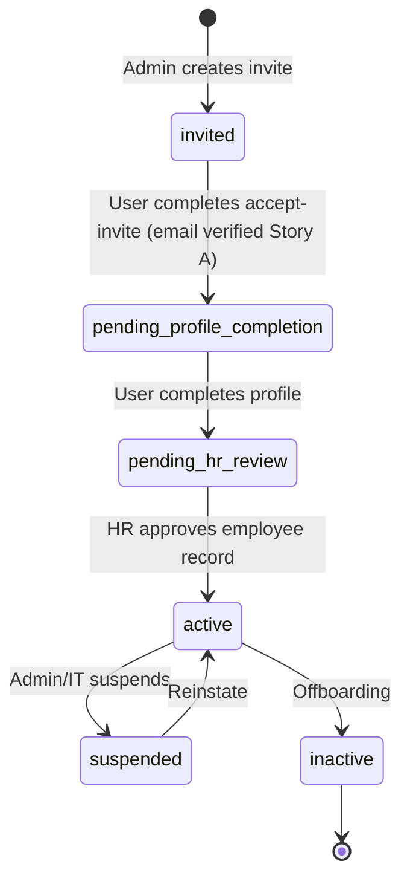
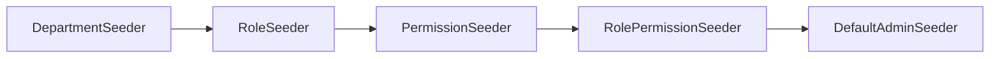

# User Onboarding & Authentication — Implementation Plan

**Module:** Auth · Users · Invitations · Profiles · HR · Access Control  
**Stack:** PHP 8.3+ · Laravel 12 · **SQLite (local dev)** · **PostgreSQL (staging/production)** — switch via `DB_*` in `.env` · Next.js SPA  
**Reference:** [README.md](../../README.md) §4 (Architecture), §7 (User Onboarding), §12 (Roadmap)  
**Version:** 1.2 · 2026  

**RBAC:** [spatie/laravel-permission](https://github.com/spatie/laravel-permission) only — roles, permissions, and pivots are created by Spatie migrations; **`user_department_roles`** captures org placement (department + role) and must **stay in sync** with Spatie’s `model_has_roles` so `$user->can(…)` and route middleware stay correct.

**Email verification (Story A):** Invitees are **verified at `POST /api/auth/accept-invite`** (`email_verified_at`). No separate **`pending_email_verification`** status in v1 invite flow.

---

## Table of Contents

1. [Goals & Principles](#1-goals--principles)
2. [Architecture Overview](#2-architecture-overview)
3. [Authentication Model](#3-authentication-model)
4. [Database Schema](#4-database-schema)
5. [User Lifecycle & Statuses](#5-user-lifecycle--statuses)
6. [Onboarding Flow](#6-onboarding-flow)
7. [Invitations](#7-invitations)
8. [Database Seeding (`db:seed`)](#8-database-seeding-php-artisan-dbseed)
9. [API Endpoints](#9-api-endpoints)
10. [Middleware & Access Control](#10-middleware--access-control)
11. [Email Notifications](#11-email-notifications)
12. [Firebase Storage (Profile Media)](#12-firebase-storage-profile-media)
13. [Environment Variables](#13-environment-variables)
14. [Laravel Module Structure](#14-laravel-module-structure)
15. [Security Checklist](#15-security-checklist)
16. [Audit Logging (Owen)](#16-audit-logging-owen)
17. [Implementation Phases](#17-implementation-phases)
18. [Frontend Integration Notes](#18-frontend-integration-notes)

---

## 1. Goals & Principles

### Goals

- Secure **cookie-based session auth** for the Next.js web app (CSRF-protected).
- **Refresh tokens** stored on the user record (hashed) for session renewal / future API clients.
- **Controlled onboarding** — users are not fully active immediately after invite.
- **Multi-department, multi-role** assignments per user (aligned with README §7.1–7.2).
- **Spatie middleware** (`role:…`, `permission:…`) on protected routes wherever appropriate.
- **IT/HR separation:** login identity vs personal profile vs HR employee record.
- **Invite-only** provisioning for standard users; **auto-seeded Super Admin** from `.env`.

### Design principles

| Principle | Implementation |
|-----------|----------------|
| Do not overload `users` | Split: `users`, `user_profiles`, `employee_profiles` |
| Never store raw tokens | Hash invite tokens, reset tokens, refresh tokens |
| Do not expose invite passwords to admins | Generate server-side; email only to user |
| Regenerate session on login | Laravel `session()->regenerate()` |
| Email before full access | `email_verified_at` required for `active`; **Story A**: set at **`POST /api/auth/accept-invite`** for invite-only users |
| HR vs user fields | User edits personal; HR edits employment |
| Align with ERM README | Departments, roles, device lock (phase 2), Owen audit |

### Recommended Laravel packages

| Package | Purpose |
|---------|---------|
| **Laravel Breeze** (API + session) or custom | Auth scaffolding |
| **Laravel Sanctum** | SPA cookie authentication + optional API tokens |
| **spatie/laravel-permission** | **Required** — roles & permissions; publish migrations; alias package middleware (`role`, `permission`) |
| **kreait/laravel-firebase** (or Google Cloud Storage SDK) | Firebase Storage uploads |
| **Owen** (custom channel) | Structured audit logs per README §4.3 |

---

## 2. Architecture Overview

```mermaid
flowchart TB
    subgraph Frontend["Next.js SPA"]
        LOGIN["/login"]
        INVITE["/accept-invite"]
        ONBOARD["/onboarding/profile"]
        APP["/workspace"]
    end

    subgraph Backend["Laravel API"]
        SANCTUM["Sanctum SPA Auth\n(session + CSRF)"]
        AUTH["Auth Controller"]
        INV["Invitation Service"]
        MW["Middleware\nRole · Onboarding · Active"]
        PROF["Profile Controller"]
        HR["HR Controller"]
    end

    subgraph RBAC[(Spatie — published)]
        SPM[(permissions)]
        SRL[(roles)]
        MHR[(model_has_roles)]
        RHP[(role_has_permissions)]
    end

    subgraph Data["App tables"]
        USERS[(users)]
        INV_T[(user_invitations)]
        PROF_T[(user_profiles)]
        EMP[(employee_profiles)]
        UDR[(user_department_roles)]
    end

    subgraph External["External"]
        MAIL[SMTP / Mailgun]
        FB[Firebase Storage]
    end

    LOGIN --> SANCTUM
    INVITE --> INV
    ONBOARD --> PROF
    APP --> MW
    SANCTUM --> AUTH
    AUTH --> USERS
    INV --> INV_T
    INV --> MAIL
    PROF --> FB
    MW --> UDR
    MW --> MHR
```

**Request flow (authenticated page)**

1. Browser sends session cookie + `X-XSRF-TOKEN` (from `XSRF-TOKEN` cookie).
2. `auth:sanctum` (or `web` + Sanctum stateful) resolves user.
3. `EnsureUserIsActive` → status must be `active`.
4. `EnsureOnboardingComplete` → redirect if profile incomplete (unless on onboarding routes).
5. Spatie **`role`** / **`permission`** middleware (`role:super_admin,it_admin`) → authorize actions (checks `model_has_roles` / permissions).

---

## 3. Authentication Model

### 3.1 Session + CSRF (primary for web app)

Use **Laravel session cookies** for the browser SPA, not JWT in `localStorage`.

| Setting | Value |
|---------|--------|
| `SESSION_DRIVER` | `database` or `redis` (production) |
| `SESSION_SECURE_COOKIE` | `true` (production HTTPS) |
| `SESSION_HTTP_ONLY` | `true` |
| `SESSION_SAME_SITE` | `lax` |
| `SANCTUM_STATEFUL_DOMAINS` | `localhost:3000`, production frontend host |

**Canonical URL layout**

- **Stateful auth JSON** (credentials + cookie): **`POST /api/auth/…`**, **`GET /api/auth/me`**, etc. Full URL = `{APP_URL}/api/auth/…` when `NEXT_PUBLIC_API_URL` points at the Laravel origin.
- **CSRF warmup** stays on Sanctum’s default **`GET /sanctum/csrf-cookie`** (not under **`/api`** unless you explicitly relocate it — this doc assumes Laravel defaults). Frontend: `{API_ORIGIN}/sanctum/csrf-cookie`.

**Sanctum SPA setup**

- Frontend calls **`GET /sanctum/csrf-cookie`** (same origin / cookie domain as SPA config) **before first state-changing `/api` request**.
- Login: **`POST /api/auth/login`** with credentials → Laravel starts session.
- Subsequent API calls: `credentials: 'include'` + `X-XSRF-TOKEN` header.
- Logout: **`POST /api/auth/logout`** + invalidate session.

### 3.2 Refresh tokens (stored on `users`)

Refresh tokens support **long-lived re-authentication** without keeping password in memory, and future mobile/API clients.

| Field | Location | Notes |
|-------|----------|-------|
| `refresh_token_hash` | `users` | `hash('sha256', $plainToken)` |
| `refresh_token_expires_at` | `users` | e.g. 30 days |
| `refresh_token_issued_at` | `users` | rotation tracking |

**Flow**

1. On successful login (and after invite acceptance), issue a new refresh token (random 64-byte string).
2. Store **hash only** in `users`; return plain token in **HttpOnly cookie** `refresh_token` **or** secure response body (prefer HttpOnly cookie for web).
3. `POST /api/auth/refresh` — validate cookie/body token against hash + expiry → rotate token (invalidate old hash, issue new).
4. On logout / password reset / suspend → clear refresh token fields.

> **Note:** Session cookie remains the primary auth for SPA pages. Refresh endpoint renews session when session expires but refresh token is valid.

### 3.3 Password rules

- Minimum 8 characters, at least one upper, lower, digit, symbol (configurable).
- `bcrypt` / Laravel `Hash::make()`.
- Forced change on first login after invite (optional flag `must_change_password`).

### 3.4 What we do **not** do in v1

- JWT in `localStorage` (XSS risk).
- Storing plaintext passwords for invites in admin UI.
- Activating users immediately on invite create.

---

## 4. Database Schema

### Dev (SQLite) vs production (PostgreSQL)

- **No conflict** if tables are created with **Laravel migrations** using the schema builder (`$table->id()`, `$table->string()`, `$table->json()`, foreign keys, indexes). The same migration files run on SQLite locally and on PostgreSQL when you change `.env`.
- The **raw SQL below** is **PostgreSQL-shaped** (e.g. `BIGSERIAL`, `JSONB`) and explains the **logical** model. **Do not** paste it into SQLite; implement **one** set of migrations and let Laravel emit the correct dialect.
- **Caveats when mixing drivers:** avoid raw `DB::statement()` with PG-only syntax; avoid relying on driver-specific behavior (exotic indexes, partial unique indexes, `WHERE` in unique constraints) unless you add **driver-conditional** migrations or accept PG-only paths. For this onboarding module, standard columns and FKs stay portable.
- **Before production:** run the full test suite and `php artisan migrate:fresh --seed` (or deploy migrations) against **PostgreSQL** at least once so any subtle differences surface early.

### 4.1 Entity separation

```
users                         → authentication & account status
user_profiles                 → personal data (user-editable)
employee_profiles             → HR/work data (HR-editable)
departments                   → org structure
Spatie roles + permissions    → published tables (see §4.6): `roles`, `permissions`, `role_has_permissions`, `model_has_roles`, `model_has_permissions`
user_department_roles          → canonical org chart: user + department + links to Spatie `roles.id`; **must stay synced** with `model_has_roles` on `User`
user_invitations              → invite tokens (hashed)
password_reset_tokens         → Laravel default or custom
audit_logs                    → Owen integration
```

### 4.2 `users`

```sql
CREATE TABLE users (
    id                  BIGSERIAL PRIMARY KEY,
    name                VARCHAR(255) NOT NULL,
    email               VARCHAR(255) NOT NULL UNIQUE,
    password            VARCHAR(255) NOT NULL,
    status              VARCHAR(50) NOT NULL DEFAULT 'invited',
    email_verified_at   TIMESTAMP NULL,
    invited_by          BIGINT NULL REFERENCES users(id),
    onboarding_completed_at TIMESTAMP NULL,
    must_change_password BOOLEAN DEFAULT FALSE,
    refresh_token_hash  VARCHAR(255) NULL,
    refresh_token_expires_at TIMESTAMP NULL,
    refresh_token_issued_at TIMESTAMP NULL,
    last_login_at       TIMESTAMP NULL,
    remember_token      VARCHAR(100) NULL,
    created_at          TIMESTAMP NOT NULL,
    updated_at          TIMESTAMP NOT NULL
);

CREATE INDEX idx_users_status ON users(status);
CREATE INDEX idx_users_email ON users(email);
```

**Status enum values** — see [§5](#5-user-lifecycle--statuses).

> **Departments & roles JSON (optional cache):**  
> For fast middleware reads, add nullable JSON columns `departments_cache` and `roles_cache` on `users`, rebuilt whenever `user_department_roles` changes. **Source of truth remains** `user_department_roles` + Spatie’s `roles`/`model_has_roles` — not JSON alone.

```sql
-- Optional denormalized cache (rebuilt on assignment change)
ALTER TABLE users ADD COLUMN departments_cache JSONB NULL;
ALTER TABLE users ADD COLUMN roles_cache JSONB NULL;
-- Example roles_cache: ["super_admin", "sales_representative"]
-- Example departments_cache: [{"id":1,"name":"Sales / Marketing","is_primary":true}]
```

### 4.3 `user_profiles`

```sql
CREATE TABLE user_profiles (
    id                  BIGSERIAL PRIMARY KEY,
    user_id             BIGINT NOT NULL UNIQUE REFERENCES users(id) ON DELETE CASCADE,
    phone               VARCHAR(50) NULL,
    avatar_url          VARCHAR(500) NULL,
    avatar_path         VARCHAR(500) NULL,
    gender              VARCHAR(20) NULL,
    address             TEXT NULL,
    emergency_contact_name  VARCHAR(255) NULL,
    emergency_contact_phone VARCHAR(50) NULL,
    emergency_contact_relationship VARCHAR(100) NULL,
    preferences         JSONB NULL,
    created_at          TIMESTAMP NOT NULL,
    updated_at          TIMESTAMP NOT NULL
);
```

### 4.4 `employee_profiles` (HR)

```sql
CREATE TABLE employee_profiles (
    id                  BIGSERIAL PRIMARY KEY,
    user_id             BIGINT NOT NULL UNIQUE REFERENCES users(id) ON DELETE CASCADE,
    employee_number     VARCHAR(50) NOT NULL UNIQUE,
    job_title           VARCHAR(255) NULL,
    employment_type     VARCHAR(50) NULL,
    start_date          DATE NULL,
    salary_grade        VARCHAR(50) NULL,
    reporting_manager_id BIGINT NULL REFERENCES users(id),
    work_location       VARCHAR(255) NULL,
    contract_type       VARCHAR(50) NULL,
    contract_end_date   DATE NULL,
    hr_notes            TEXT NULL,
    created_at          TIMESTAMP NOT NULL,
    updated_at          TIMESTAMP NOT NULL
);

CREATE INDEX idx_employee_profiles_number ON employee_profiles(employee_number);
```

### 4.5 `departments`

Seed from README §7.1.

```sql
CREATE TABLE departments (
    id          BIGSERIAL PRIMARY KEY,
    name        VARCHAR(255) NOT NULL UNIQUE,
    slug        VARCHAR(255) NOT NULL UNIQUE,
    default_module VARCHAR(100) NULL,
    is_active   BOOLEAN DEFAULT TRUE,
    created_at  TIMESTAMP NOT NULL,
    updated_at  TIMESTAMP NOT NULL
);
```

### 4.6 Roles & permissions — **Spatie only**

**Do not** hand-maintain duplicate `roles` / `permissions` / pivot tables besides Spatie’s. **Install:**

```bash
composer require spatie/laravel-permission
php artisan vendor:publish --provider="Spatie\Permission\PermissionServiceProvider"
```

Run migrations before app tables so `roles.id` exists for FKs below. Spatie publishes (names may vary slightly by package version):

| Table | Role |
|-------|------|
| `permissions` | One row per ability string (e.g. `users.invite`) |
| `roles` | One row per job role (`super_admin`, `sales_representative`, …) |
| `role_has_permissions` | Which permissions belong to each role |
| `model_has_roles` | Which Spatie roles are attached to each `User` |
| `model_has_permissions` | Direct user→permission overrides (avoid for v1 unless needed) |

**`User` model:** use the `HasRoles` trait from Spatie. Use **one guard consistently** (e.g. `web`) for Sanctum cookie sessions — set `defaults.guard` in **`config/auth.php`** and match **`guard_name`** in **`config/permission.php`**.

Convention for this project: **`roles.name` = stable machine slug** (`super_admin`, `hr_manager`) so route middleware matches (`role:super_admin`). UI labels (“Super Admin”) can be a frontend map or an optional **`display_name`** column added via your own migration on Spatie’s `roles` table (not required by the package).

**Example permission names** (seed as Spatie permissions; align with README modules):

```
users.invite
users.view
users.update
users.suspend
leads.view
leads.create
deals.approve_discount
employees.view
employees.update_hr_details
payroll.view
warehouse.stock.view
...
```

Super Admin bypass: **do not rely on a magic `*` string** unless you seed it yourself; typical pattern is `syncPermissions(Permission::all())` for the `super_admin` role — see §8.6.

### 4.7 `user_department_roles`

Canonical assignment table (user can have multiple rows). **`role_id` references Spatie `roles.id`.**

Whenever `user_department_roles` is created / updated / deleted, **reconcile Spatie**:

1. After saving pivots (inside the same DB transaction): **`$user->syncRoles`** using the **distinct** Spatie roles from all `user_department_roles` rows for that user (by role name or id). Invites and admin reassignment endpoints must invoke the **same reconciler** so `$user->can(…)` never drifts from org data.
2. **Authorization** is Spatie-first: `$user->can('employees.approve')`, `middleware('permission:…')` — never duplicate permission matrices in PHP or custom joins.
3. **Department-aware UX** still comes only from **`user_department_roles`** (and caches), not from Spatie.

```sql
CREATE TABLE user_department_roles (
    id              BIGSERIAL PRIMARY KEY,
    user_id         BIGINT NOT NULL REFERENCES users(id) ON DELETE CASCADE,
    department_id   BIGINT NOT NULL REFERENCES departments(id),
    role_id         BIGINT NOT NULL REFERENCES roles(id),
    is_primary      BOOLEAN DEFAULT FALSE,
    assigned_by     BIGINT NULL REFERENCES users(id),
    assigned_at     TIMESTAMP NOT NULL DEFAULT NOW(),
    UNIQUE (user_id, department_id, role_id)
);

CREATE INDEX idx_udr_user ON user_department_roles(user_id);
```

**Example:** Jane has:

| department | role |
|------------|------|
| Sales / Marketing | Sales Representative |
| Operations | Field Officer |

### 4.8 `user_invitations`

```sql
CREATE TABLE user_invitations (
    id              BIGSERIAL PRIMARY KEY,
    email           VARCHAR(255) NOT NULL,
    name            VARCHAR(255) NULL,
    department_id   BIGINT NOT NULL REFERENCES departments(id),
    role_id         BIGINT NOT NULL REFERENCES roles(id),
    token_hash      VARCHAR(255) NOT NULL,
    invited_by      BIGINT NOT NULL REFERENCES users(id),
    expires_at      TIMESTAMP NOT NULL,
    accepted_at     TIMESTAMP NULL,
    revoked_at      TIMESTAMP NULL,
    created_at      TIMESTAMP NOT NULL,
    updated_at      TIMESTAMP NOT NULL
);

CREATE INDEX idx_invitations_email ON user_invitations(email);
CREATE INDEX idx_invitations_token_hash ON user_invitations(token_hash);
```

---

## 5. User Lifecycle & Statuses



**Story A — email verified at invite acceptance**

Invited users do **not** pass through **`pending_email_verification`**. Proving inbox access is the **invite token**: on successful **`POST /api/auth/accept-invite`** the backend sets **`email_verified_at = now()`** and **`status = pending_profile_completion`**, optionally issues session + refresh (see §7.2).

If someone signs in early with **only** the emailed temp password (`status` still **`invited`**) treat that **either** as disallowed (**redirect frontend to **`/accept-invite`**) **or**, if you explicitly allow login with temp password **before** accepting, set **`email_verified_at`** on that successful login—the **recommended v1 UX** is: **invite link first** → accept → onboarding.

| Status | Description | Can login? | Module access |
|--------|-------------|------------|---------------|
| `invited` | Invite sent; **has not completed accept-invite** | No (**use accept-invite**; temp-password-only login discouraged) | None |
| `pending_profile_completion` | **Email verified** (Story A: at **`accept-invite`**); profile incomplete | Limited | Onboarding only |
| `pending_hr_review` | Profile done; HR must complete employee record | Limited | Onboarding + read-only home |
| `active` | Fully onboarded | Yes | Per role permissions |
| `suspended` | Blocked by admin | No | None |
| `inactive` | Left company | No | None |

**Unused in v1 (reserved):**

- **`pending_email_verification`** — keep only if you add a **later** channel (e.g. public self-registration + Laravel **`MustVerifyEmail`**) **without** an invite-token proof. Omit from enums/migrations unless needed.

**Rules**

- Do **not** set `active` on invite creation.
- **Story A:** set **`email_verified_at`** when **`accept-invite`** succeeds, not via a separate verify-email mail for invite flows.
- Set `onboarding_completed_at` only when **user profile** minimum fields are saved (phone, emergency contact, avatar optional).
- HR moves `pending_hr_review` → `active` after `employee_profiles` is complete.

---

## 6. Onboarding Flow

### Step-by-step

| Step | Actor | Action | System |
|------|-------|--------|--------|
| 1 | IT/Admin/HR | Create invitation (email, name, department, role) | Insert `user_invitations`, email with credentials |
| 2 | User | Open invite link | Validate token hash + expiry |
| 3 | User | Submit **`POST /api/auth/accept-invite`** (token + chosen password **or** confirm temp flow) | Hash password; **`email_verified_at` (Story A)**; **`accepted_at`**; **`status` → `pending_profile_completion`**; session + refresh if spec’d in §7.2 |
| 4 | User | Optional: sign in **`POST /api/auth/login`** if session not retained | Session + refresh; **`last_login_at`** _(already verified)_ |
| 5 | User | Complete **`/onboarding/profile`** UI → **`PUT /api/profile`** | Update **`user_profiles`**; set **`onboarding_completed_at`** |
| 6 | HR | Complete `employee_profiles` | Employee number, job title, manager, etc. |
| 7 | HR/Admin | Approve account | Status → `active` |

### Minimum profile fields (user)

- Phone number  
- Emergency contact (name + phone)  
- Optional: avatar, address, gender  

### Minimum employee fields (HR)

- Employee number (unique)  
- Job title  
- Department (confirm primary)  
- Employment type  
- Start date  
- Reporting manager  

### Middleware redirect (pseudo)

```php
if (! auth()->check()) {
    return redirect()->guest(route('login'));
}

if (auth()->user()->status !== 'active') {
    if (in_array(auth()->user()->status, ['invited'])) {
        abort(403, 'Please accept your invitation.');
    }
    if (! auth()->user()->onboarding_completed_at) {
        return redirect()->to(config('app.frontend_url') . '/onboarding/profile');
    }
    if (auth()->user()->status === 'pending_hr_review') {
        return redirect()->to(config('app.frontend_url') . '/onboarding/pending-hr');
    }
}
```

---

## 7. Invitations

### 7.1 Admin invite flow

**Endpoint:** `POST /api/admin/users/invite`  
**Permission:** `users.invite` (Super Admin, IT Admin, HR Manager)

**Request body**

```json
{
  "email": "jane@bibo.com",
  "name": "Jane Doe",
  "department_id": 1,
  "role_id": 3,
  "additional_assignments": [
    { "department_id": 9, "role_id": 4 }
  ]
}
```

**Server actions**

1. Reject if email already exists (active or pending).
2. Generate **temporary password** (16+ chars, random) — **never returned in API response**.
3. Generate invite token: `Str::random(64)` → store `hash('sha256', $token)`.
4. Create `users` row: `status = invited`, hashed temp password, `invited_by`, `must_change_password = true`.
5. Create `user_department_roles` rows.
6. Create `user_invitations` row, `expires_at = now() + 72 hours`.
7. Queue email: credentials + invite link + login URL.
8. Log audit: `user.invited`.

### 7.2 Invite link format

```
{FRONTEND_URL}/accept-invite?token={plain_token}
```

**Accept endpoint:** `POST /api/auth/accept-invite`

```json
{
  "token": "plain_token_from_url",
  "password": "NewSecurePass1!",
  "password_confirmation": "NewSecurePass1!"
}
```

- Validate token hash + not expired + not accepted.
- Update password (user-chosen password and/or rotated from emailed temp secret per product rules).
- **Story A:** set **`email_verified_at = now()`** — invite token satisfies inbox verification; **no** separate verify-email mail for this path.
- Set **`accepted_at`** on **`user_invitations`**.
- Status → **`pending_profile_completion`** (email already accounted for via **`email_verified_at`**).
- Issue session + refresh token **if returning an authenticated SPA session from this POST** (see §3).

> **Consistency:** Frontend should rely on **`email_verified_at != null`** and **`status`** from **`GET /api/auth/me`**, not a separate `pending_email_verification` bucket.

### 7.3 Re-invite / revoke

- `POST /api/admin/users/{id}/resend-invite` — new token, new temp password, new email.
- `POST /api/admin/invitations/{id}/revoke` — set `revoked_at`.

---

## 8. Database Seeding (`php artisan db:seed`)

All default **departments**, **roles**, **permissions**, and the **Super Admin** user are seeded through a single orchestrated command. This is the standard way to bootstrap a fresh environment after migrations.

### 8.1 Command

```bash
# Fresh install (recommended)
php artisan migrate --force
php artisan db:seed

# Or fresh migrate + seed
php artisan migrate:fresh --seed

# Run one seeder only (optional)
php artisan db:seed --class=DepartmentSeeder
php artisan db:seed --class=RoleSeeder
php artisan db:seed --class=PermissionSeeder
php artisan db:seed --class=RolePermissionSeeder
php artisan db:seed --class=DefaultAdminSeeder
```

**Production / CI:**

```bash
php artisan migrate --force && php artisan db:seed --force
```

### 8.2 `DatabaseSeeder` — execution order

Seeders **must** run in this order (dependencies):

```php
// database/seeders/DatabaseSeeder.php

namespace Database\Seeders;

use Illuminate\Database\Seeder;

class DatabaseSeeder extends Seeder
{
    public function run(): void
    {
        $this->call([
            DepartmentSeeder::class,      // 1 — all departments
            RoleSeeder::class,            // 2 — all roles
            PermissionSeeder::class,      // 3 — granular permissions
            RolePermissionSeeder::class,  // 4 — map roles → permissions
            DefaultAdminSeeder::class,    // 5 — admin user (last)
        ]);
    }
}
```



### 8.3 Idempotent seeding rules (all seeders)

Reference-data seeders remain **idempotent** so `db:seed` can be re-run: departments keyed by **`slug`**; roles/permissions by Spatie **`name` + `guard_name`** (`findOrCreate`).

| Seeder | Unique key | On re-run |
|--------|------------|-----------|
| `DepartmentSeeder` | `slug` | Update name / `default_module` |
| `RoleSeeder` | Spatie **`name`** + **`guard_name`** | **`Role::findOrCreate`** (per guard) |
| `PermissionSeeder` | Spatie **`name`** + **`guard_name`** | **`Permission::findOrCreate`** (per guard) |
| `RolePermissionSeeder` | Spatie role × permission per guard | `syncPermissions` on each Role (no duplicates) |
| `DefaultAdminSeeder` | `email` | **Skip entire seeder** if user exists |

**Never** overwrite admin password on re-seed.

### 8.4 `DepartmentSeeder` — all departments

**File:** `database/seeders/DepartmentSeeder.php`  
**Source:** README §7.1

```php
$departments = [
    ['name' => 'Sales / Marketing',       'slug' => 'sales_marketing',       'default_module' => 'crm'],
    ['name' => 'Production',             'slug' => 'production',             'default_module' => 'production'],
    ['name' => 'Warehouse / Inventory',  'slug' => 'warehouse',              'default_module' => 'warehouse'],
    ['name' => 'Procurement',            'slug' => 'procurement',            'default_module' => 'procurement'],
    ['name' => 'Quality Control',        'slug' => 'quality_control',        'default_module' => 'qc'],
    ['name' => 'HR',                     'slug' => 'hr',                     'default_module' => 'hr'],
    ['name' => 'Finance',                'slug' => 'finance',                'default_module' => 'finance'],
    ['name' => 'IT',                     'slug' => 'it',                     'default_module' => 'it'],
    ['name' => 'Project Management',     'slug' => 'project_management',     'default_module' => 'projects'],
    ['name' => 'Operations / Admin',     'slug' => 'operations',             'default_module' => 'workspace'],
    ['name' => 'Reception',             'slug' => 'reception',                'default_module' => 'crm'],
];

foreach ($departments as $dept) {
    Department::updateOrCreate(
        ['slug' => $dept['slug']],
        ['name' => $dept['name'], 'default_module' => $dept['default_module'], 'is_active' => true]
    );
}
```

### 8.5 `RoleSeeder` — all roles (**Spatie**)

**File:** `database/seeders/RoleSeeder.php`  
**Source:** README §7.2

Use **`Spatie\Permission\Models\Role`**; **`name`** equals the middleware slug (`super_admin`, `hr_manager`). UI display names (“Super Admin”) remain a frontend mapping or optional DB column via your own migration on Spatie’s `roles`.

```php
use Spatie\Permission\Models\Role;

$guard = config('permission.defaults.guard', 'web');

foreach ([
    'super_admin',
    'operations_manager',
    'sales_representative',
    'field_officer',
    'project_manager',
    'production_manager',
    'warehouse_manager_accessories',
    'warehouse_manager_aluminium',
    'procurement_officer',
    'qc_inspector',
    'hr_manager',
    'finance_officer',
    'it_admin',
    'reception',
    'client',
] as $name) {
    Role::findOrCreate($name, $guard);
}
```

### 8.6 `PermissionSeeder` + `RolePermissionSeeder` (**Spatie**)

**`PermissionSeeder`** — upsert **`Spatie\Permission\Models\Permission`** rows (`findOrCreate($name, $guard)` loop). Optionally add columns (e.g. `module`) with a migration that extends Spatie’s `permissions` table if you want labels in one place — not required.

**Examples** below (expand so every seeded permission maps to README modules):

| Permission | Module |
|------------|--------|
| `users.invite` | users |
| `users.view` | users |
| `users.update` | users |
| `users.suspend` | users |
| `employees.view` | hr |
| `employees.update_hr_details` | hr |
| `employees.approve` | hr |
| `leads.view` | crm |
| `leads.create` | crm |
| `deals.approve_discount` | crm |
| `projects.view` | projects |
| `warehouse.stock.view` | warehouse |
| `procurement.po.create` | procurement |
| `production.schedule.manage` | production |
| `qc.inspect` | qc |
| `payroll.view` | finance |
| `audit.view` | it |

After permissions exist, **`super_admin`** receives **every** seeded permission via `syncPermissions(...)` — no magic `*` permission string required.

**`RolePermissionSeeder`** — for each **`Spatie\Permission\Models\Role`**, call `syncPermissions([...])` with explicit permission **`name`** strings matching the `PermissionSeeder` list (exact list in code).

| Role `name` | Permissions (summary) |
|-----------|-------------------------|
| `super_admin` | `Permission::where('guard_name', $guard)->get()` → `syncPermissions` |
| `operations_manager` | Broad read + approve across modules |
| `it_admin` | `users.*`, `audit.view`, device permissions (phase 2) |
| `hr_manager` | `employees.*`, `users.invite`, `users.view` |
| `sales_representative` | `leads.*`, `deals.*` (no approve_discount unless granted) |
| `field_officer` | `leads.create`, `leads.view`, field-day permissions |
| `project_manager` | `projects.*` |
| `production_manager` | `production.*`, `warehouse.stock.view` |
| `warehouse_manager_accessories` | `warehouse.*` |
| `warehouse_manager_aluminium` | `warehouse.*` |
| `procurement_officer` | `procurement.*`, `warehouse.stock.view` |
| `qc_inspector` | `qc.inspect`, `projects.view` |
| `finance_officer` | `payroll.view`, finance permissions |
| `reception` | `leads.create`, `leads.view` |
| `client` | `projects.view` (own projects only — enforced in policy) |

```php
use Spatie\Permission\Models\{Role, Permission};

$guard = config('permission.defaults.guard', 'web');

Role::findByName('super_admin', $guard)
    ->syncPermissions(Permission::where('guard_name', $guard)->get());

// Other roles — pass explicit arrays of permission names, e.g.
Role::findByName('sales_representative', $guard)
    ->syncPermissions(['leads.view', 'leads.create', /* ... */]);
```

### 8.7 `DefaultAdminSeeder` — Super Admin user

Runs **after** departments and roles exist.

#### Environment

```env
ADMIN_NAME="Bibo System Admin"
ADMIN_EMAIL=admin@bibo.com
ADMIN_PASSWORD=Admin@2026!!
ADMIN_SEED_ON_BOOT=false
```

> Store production password only in secrets manager; rotate after first deploy.

#### Seeder logic

**File:** `database/seeders/DefaultAdminSeeder.php`

```php
// use Spatie\Permission\Models\Role;

public function run(): void
{
    $email = config('bibo.admin.email');

    if (User::where('email', $email)->exists()) {
        $this->command?->warn('Default admin already exists — skipping user creation.');
        return;
    }

    $operationsDept = Department::where('slug', 'operations')->firstOrFail();
    // Spatie model — aligns with FK on user_department_roles.role_id
    $superAdminRole = Role::findByName('super_admin', config('permission.defaults.guard', 'web'));

    $user = User::create([
        'name'                  => config('bibo.admin.name'),
        'email'                 => $email,
        'password'              => Hash::make(config('bibo.admin.password')),
        'status'                => 'active',
        'email_verified_at'     => now(),
        'onboarding_completed_at' => now(),
        'must_change_password'  => false,
    ]);

    UserDepartmentRole::create([
        'user_id'       => $user->id,
        'department_id' => $operationsDept->id,
        'role_id'       => $superAdminRole->id,
        'is_primary'    => true,
        'assigned_at'   => now(),
    ]);

    $user->assignRole($superAdminRole);

    UserProfile::create(['user_id' => $user->id]);

    EmployeeProfile::create([
        'user_id'           => $user->id,
        'employee_number'   => 'SYS-0001',
        'job_title'         => 'System Administrator',
        'employment_type'   => 'permanent',
        'start_date'        => now()->toDateString(),
        'work_location'     => 'Head Office',
    ]);

    // Rebuild optional JSON cache on user
    $user->syncRolesAndDepartmentsCache();

    $this->command?->info("Default admin seeded: {$email}");
}
```

**Idempotent rule:** If `admin@bibo.com` exists → skip (no duplicate, **no password overwrite**).

### 8.8 Optional boot-time seed

Only if `ADMIN_SEED_ON_BOOT=true` in `.env` (discouraged in production; prefer explicit `db:seed` in deploy):

```php
// AppServiceProvider::boot() — optional
if (config('bibo.admin.seed_on_boot') && app()->environment('local')) {
    Artisan::call('db:seed', ['--class' => 'DefaultAdminSeeder', '--force' => true]);
}
```

Prefer **CI/deploy script** calling full `db:seed`, not boot-time seeding.

### 8.9 Expected console output

```
Seeding: DepartmentSeeder .............. 11 departments
Seeding: RoleSeeder .................... 15 roles
Seeding: PermissionSeeder .............. 40 permissions
Seeding: RolePermissionSeeder ........ mapped
Seeding: DefaultAdminSeeder ............ admin@bibo.com (or skipped)
Database seeding completed.
```

### 8.10 Verification after seed

```bash
php artisan tinker
>>> Department::count();   // 11
>>> Role::count();         // 15
>>> Permission::count();   // 40+
>>> User::where('email', 'admin@bibo.com')->exists();  // true (first run)
```

Login with `admin@bibo.com` / `Admin@2026!!` (from `.env`) on first environment setup.

---

## 9. API Endpoints

**Prefixes**

- Stateful JSON endpoints run under **`/api/…`** (`Route::prefix('api')`).
- **All auth JSON routes** documented here use **`/api/auth/…`** (canonical).
- **CSRF warmup** (`Sanctum`) remains **`GET /sanctum/csrf-cookie`** on the Laravel app origin by default (**not** under **`/api`**); see §3.1.
- **`/api/profile`**, **`/api/admin/**`, **`/api/hr/**`** are outside the **`auth`** group but remain under **`/api`**.

Auth mechanism: Sanctum session + CSRF (`Accept: application/json` / `credentials: include`).

### 9.1 Public (guest)

| Method | Path | Description |
|--------|------|-------------|
| `GET` | `/sanctum/csrf-cookie` | CSRF cookie for SPA (**see §3.1 — not `/api`**) |
| `POST` | `/api/auth/login` | Email + password → session |
| `POST` | `/api/auth/accept-invite` | Accept invitation + set password (**Story A** sets **`email_verified_at`**) |
| `POST` | `/api/auth/forgot-password` | Send reset link to email |
| `POST` | `/api/auth/reset-password` | Reset with token from email |
| `POST` | `/api/auth/recover-email` | Recover login email via employee number |
| `POST` | `/api/auth/refresh` | Rotate refresh token + renew session |

### 9.2 Authenticated (Sanctum; route-specific middleware stacks apply)

| Method | Path | Description |
|--------|------|-------------|
| `POST` | `/api/auth/logout` | Invalidate session + refresh token |
| `GET` | `/api/auth/me` | Current user + roles + departments + permissions |
| `POST` | `/api/auth/change-password` | Change password (authenticated) |

**Invite path (Story A):** **`POST /api/auth/verify-email/resend`** is **omitted from v1** — email is verified at **`accept-invite`**. Add only if you introduce a channel that signs up **without** an invite-token proof.

Other authenticated resources:

| Method | Path | Description |
|--------|------|-------------|
| `PUT` | `/api/profile` | Update personal profile |
| `POST` | `/api/profile/avatar` | Upload avatar → Firebase |

### 9.3 Admin / HR (role-protected)

| Method | Path | Permission |
|--------|------|------------|
| `POST` | `/api/admin/users/invite` | `users.invite` |
| `GET` | `/api/admin/users` | `users.view` |
| `PATCH` | `/api/admin/users/{id}/status` | `users.suspend` |
| `PUT` | `/api/admin/users/{id}/assignments` | `users.update` |
| `PUT` | `/api/hr/employees/{userId}` | `employees.update_hr_details` |
| `POST` | `/api/hr/employees/{userId}/approve` | `employees.approve` → `active` |

---

### 9.4 Endpoint specifications

#### `POST /api/auth/login`

```json
// Request
{ "email": "jane@bibo.com", "password": "..." }

// Response 200
{
  "user": { "id": 1, "name": "...", "email": "...", "status": "active" },
  "roles": ["sales_representative"],
  "departments": [{ "id": 1, "name": "Sales / Marketing", "is_primary": true }],
  "permissions": ["leads.view", "leads.create"],
  "redirect": "/workspace"
}
```

- Regenerate session.
- Issue refresh token (HttpOnly cookie).
- Update `last_login_at`.
- Audit: `auth.login`.

#### `POST /api/auth/forgot-password`

```json
{ "email": "jane@bibo.com" }
```

- Always return generic message: *"If that email exists, we sent a reset link."*
- Token: Laravel `Password::createToken()` or custom hashed token in `password_reset_tokens`.
- Link: `{FRONTEND_URL}/reset-password?token=...&email=...`
- Expiry: 15 minutes (per README security).

#### `POST /api/auth/reset-password`

```json
{
  "email": "jane@bibo.com",
  "token": "...",
  "password": "NewPass1!",
  "password_confirmation": "NewPass1!"
}
```

- Invalidate all refresh tokens for user.
- Audit: `auth.password_reset`.

#### `POST /api/auth/recover-email`

User forgot which email they use — lookup by **employee number** (not password; password recovery is separate).

```json
{ "employee_number": "EMP-1042" }
```

**Response (always generic for security):**

```json
{ "message": "If a matching account exists, we sent your login email address." }
```

**Server:** Find `employee_profiles.employee_number` → linked `users.email` → send email with masked hint e.g. `j***e@bibo.com` or full email to registered address only.

> If you intended "employee number + verification code" for identity proof, add optional `last_name` or `phone` match before sending.

#### `PUT /api/profile`

```json
{
  "phone": "+254...",
  "address": "...",
  "emergency_contact_name": "...",
  "emergency_contact_phone": "...",
  "emergency_contact_relationship": "spouse",
  "gender": "female"
}
```

- User can only update **own** `user_profiles`.
- On minimum fields met → set `onboarding_completed_at`, status `pending_hr_review` if employee record incomplete.

#### `POST /api/profile/avatar`

- `multipart/form-data` — `avatar` file.
- Validate: `image|max:2048` (2MB), mime jpeg/png/webp.
- Upload to Firebase → save `avatar_url`, `avatar_path` on `user_profiles`.
- Return public/signed URL.

---

## 10. Middleware & Access Control

### 10.1 Middleware stack (order)

| Alias | Provider | Purpose |
|-------|-----------|---------|
| `auth:sanctum` | Sanctum | Session user |
| `active` | `EnsureUserIsActive` | Blocks `suspended`, `inactive`, `invited` |
| `onboarding` | `EnsureOnboardingComplete` | Redirect to profile wizard |
| `role` | `\Spatie\Permission\Middleware\RoleMiddleware` (registered as **`role`**) | e.g. `role:super_admin|it_admin` — user must satisfy **Spatie roles** assigned on the user |
| `permission` | `\Spatie\Permission\Middleware\PermissionMiddleware` (**`permission`**) | e.g. `permission:users.invite` |

Register aliases exactly as [Spatie’s docs](https://spatie.be/docs/laravel-permission) specify for your Laravel version (`bootstrap/app.php` or legacy `Kernel`). **Do not** ship parallel `CheckRole` / `CheckPermission` duplicates unless wrapping Spatie for logging.

### 10.2 `role` middleware (Spatie example)

```php
// routes/api.php
Route::middleware(['auth:sanctum', 'active', 'role:super_admin|it_admin'])
    ->prefix('admin')
    ->group(function () {
        Route::post('/users/invite', [InviteController::class, 'store']);
    });
```

**Requirement:** Middleware checks **`model_has_roles`** / Spatie helpers. Maintain consistency with **`user_department_roles`** via the sync rules in §4.7 whenever department-role rows change.

### 10.3 `permission` middleware (Spatie example)

```php
Route::middleware(['permission:leads.create'])->post('/crm/leads', ...);
```

In controllers/policies, prefer `$user->can('leads.create')` (`hasPermissionTo` under the hood).

### 10.4 Building permission list for SPA (`GET /api/auth/me`)

```php
$permissions = $user->getAllPermissions()->pluck('name')->values();
$roles = $user->getRoleNames()->values(); // mirrors Spatie (distinction from §4 org rows if needed)

// Return JSON for Next.js middleware / sidebar
```

(Optional: include department payload from **`user_department_roles`**, unrelated to Spatie internals.)

### 10.5 Frontend route guard (mirror)

Next.js middleware checks **`GET /api/auth/me`** (permissions array in JSON) before rendering department routes.

---

## 11. Email Notifications

### 11.1 Mail configuration

```env
MAIL_MAILER=smtp
MAIL_HOST=
MAIL_PORT=587
MAIL_USERNAME=
MAIL_PASSWORD=
MAIL_FROM_ADDRESS=noreply@bibo.com
MAIL_FROM_NAME="Bibo ERM"
FRONTEND_URL=http://localhost:3000
```

### 11.2 Templates (Blade → HTML email)

| Template | Trigger | Contents |
|----------|---------|----------|
| `emails.invite` | User invited | Logo, name, **login URL**, email, **temporary password**, accept-invite link, expiry notice |
| `emails.password-reset` | Forgot password | Reset link, 15 min expiry |
| `emails.email-recovery` | Recover email | Masked or full registered email |
| `emails.verify-email` | _(Reserved)_ — Story A verifies at **`accept-invite`**; omit until a non-invite signup flow exists |
| `emails.welcome-active` | HR approves | Account active, link to workspace |

### 11.3 Invite email design requirements

- Modern HTML: Bibo red `#ec2024`, white card, 10px radius.
- Clear CTA button: **Accept invitation** → `{FRONTEND_URL}/accept-invite?token=...`
- Secondary: **Login** → `{FRONTEND_URL}/login`
- State: temporary password shown **once** in email only.
- Footer: IT support contact, do not share password.

### 11.4 Queue

Use `ShouldQueue` on mailables — `QUEUE_CONNECTION=database` in v1.

---

## 12. Firebase Storage (Profile Media)

### 12.1 Files & env

```
backend/
  storage/
    firebase-credentials.json   # Gitignored — CI uploads secret
  .env
    FIREBASE_PROJECT_ID=
    FIREBASE_STORAGE_BUCKET=bibo-erm.appspot.com
    FIREBASE_CREDENTIALS_PATH=storage/firebase-credentials.json
```

**Pipeline:** Upload `firebase-credentials.json` as secure file artifact; inject path via env in deploy.

### 12.2 Upload path convention

```
avatars/{user_id}/{uuid}.{ext}
```

- Store `avatar_path` in DB.
- Return signed URL (1h) or public URL if bucket policy allows.

### 12.3 Server-side validation

- Max 2MB, images only.
- Strip EXIF if needed.
- Virus scan (phase 2).

---

## 13. Environment Variables

```env
# App
APP_URL=http://localhost:8000
FRONTEND_URL=http://localhost:3000
APP_ENV=local

# Database — local dev (SQLite file in database/)
DB_CONNECTION=sqlite
# DB_DATABASE is optional for sqlite; Laravel uses database/database.sqlite if unset
# Create file: `touch database/database.sqlite` (Unix) or empty file on Windows

# Database — staging / production (switch when ready; no code conflict if migrations are portable)
# DB_CONNECTION=pgsql
# DB_HOST=127.0.0.1
# DB_PORT=5432
# DB_DATABASE=bibo_erm
# DB_USERNAME=
# DB_PASSWORD=

# Session / Sanctum
SESSION_DRIVER=database
SESSION_SECURE_COOKIE=false
SESSION_HTTP_ONLY=true
SESSION_SAME_SITE=lax
SANCTUM_STATEFUL_DOMAINS=localhost:3000,127.0.0.1:3000

# Admin seed
ADMIN_NAME="Bibo System Admin"
ADMIN_EMAIL=admin@bibo.com
ADMIN_PASSWORD=Admin@2026!!
ADMIN_SEED_ON_BOOT=false

# Mail
MAIL_MAILER=smtp
MAIL_FROM_ADDRESS=noreply@bibo.com
FRONTEND_URL=http://localhost:3000

# Invite
INVITE_EXPIRY_HOURS=72

# Firebase
FIREBASE_PROJECT_ID=
FIREBASE_STORAGE_BUCKET=
FIREBASE_CREDENTIALS_PATH=storage/firebase-credentials.json

# Refresh token
REFRESH_TOKEN_EXPIRE_DAYS=30
```

---

## 14. Laravel Module Structure

```
backend/
├── app/
│   ├── Http/
│   │   ├── Controllers/
│   │   │   ├── Auth/
│   │   │   │   ├── LoginController.php
│   │   │   │   ├── LogoutController.php
│   │   │   │   ├── InviteAcceptController.php
│   │   │   │   ├── ForgotPasswordController.php
│   │   │   │   ├── ResetPasswordController.php
│   │   │   │   ├── RecoverEmailController.php
│   │   │   │   └── RefreshTokenController.php
│   │   │   ├── ProfileController.php
│   │   │   └── Admin/
│   │   │       ├── InviteUserController.php
│   │   │       └── UserManagementController.php
│   │   ├── Middleware/
│   │   │   ├── EnsureUserIsActive.php
│   │   │   └── EnsureOnboardingComplete.php
│   │   └── Requests/
│   │       ├── LoginRequest.php
│   │       ├── InviteUserRequest.php
│   │       └── UpdateProfileRequest.php
│   ├── Models/
│   │   ├── User.php
│   │   ├── UserProfile.php
│   │   ├── EmployeeProfile.php
│   │   ├── Department.php
│   │   ├── UserDepartmentRole.php
│   │   └── UserInvitation.php          # role_id FK → Spatie roles.id
│   ├── Services/
│   │   ├── Roles/
│   │   │   └── SyncDepartmentRolesToSpatie.php    # reconcile model_has_roles from user_department_roles
│   │   ├── Auth/
│   │   │   ├── RefreshTokenService.php
│   │   │   └── InvitationService.php
│   │   ├── Firebase/
│   │   │   └── AvatarStorageService.php
│   │   └── Audit/
│   │       └── OwenAuditLogger.php
│   ├── Mail/
│   │   ├── UserInvitedMail.php
│   │   ├── PasswordResetMail.php
│   │   └── EmailRecoveryMail.php
│   └── Policies/
│       ├── UserPolicy.php
│       └── EmployeeProfilePolicy.php
├── config/
│   ├── bibo.php          # admin seed, invite expiry
│   ├── sanctum.php
│   └── permission.php    # spatie
├── database/
│   ├── migrations/
│   └── seeders/
│       ├── DatabaseSeeder.php          # orchestrates all seeders
│       ├── DepartmentSeeder.php      # 11 departments
│       ├── RoleSeeder.php              # 15 roles
│       ├── PermissionSeeder.php
│       ├── RolePermissionSeeder.php
│       └── DefaultAdminSeeder.php      # admin@bibo.com (skip if exists)
└── routes/
    ├── api.php
    └── web.php
```

---

## 15. Security Checklist

- [ ] `SESSION_SECURE_COOKIE=true` in production  
- [ ] `SESSION_HTTP_ONLY=true`  
- [ ] `SESSION_SAME_SITE=lax`  
- [ ] CSRF on all state-changing routes (`VerifyCsrfToken`)  
- [ ] `session()->regenerate()` on login  
- [ ] Hash invite tokens, reset tokens, refresh tokens  
- [ ] Invite expiry 24–72 hours  
- [ ] Generic responses on forgot-password / recover-email (no enumeration)  
- [ ] Rate limit: login 5/min, forgot-password 3/min, invite 10/hour  
- [ ] Admin seeder password from env only — never commit real prod password  
- [ ] `firebase-credentials.json` in `.gitignore`  
- [ ] Validate & scan file uploads  
- [ ] HR routes protected by `employees.update_hr_details`  
- [ ] Log all HR edits + invite actions to Owen audit  
- [ ] Clear refresh token on password reset / suspend  
- [ ] CORS: only `FRONTEND_URL` origin with credentials  

---

## 16. Audit Logging (Owen)

Log these actions (README §4.3):

| Module | Actions |
|--------|---------|
| Auth | `login`, `logout`, `login_failed`, `password_reset`, `refresh_token` |
| Users | `invite`, `resend_invite`, `revoke_invite`, `suspend`, `activate` |
| Profiles | `profile.update`, `avatar.upload` |
| HR | `employee.create`, `employee.update`, `employee.approve` |

Each log: `user_id`, `device_id` (phase 2), `module`, `action`, `entity_type`, `entity_id`, `old_values`, `new_values`, `ip`, `user_agent`, `timestamp`.

---

## 17. Implementation Phases

### Phase 1 — Foundation (Week 1–2)

- [ ] Laravel project scaffold + Sanctum + DB migrations  
- [ ] Publish **Spatie** migrations **before** `user_department_roles` (foreign key targets `roles.id`)  
- [ ] **`DatabaseSeeder`** — departments → Spatie roles/permissions/sync → DefaultAdmin (`php artisan db:seed`)  
- [ ] `users`, `departments`, Spatie tables, `user_department_roles`  
- [ ] **`HasRoles`** on `User`; reconcile Spatie **`assignRole/syncRoles`** from `user_department_roles` via `SyncDepartmentRolesToSpatie` (or equivalent) from invite/admin assignment flows  
- [ ] Register Spatie **`role`** + **`permission`** middleware aliases  
- [ ] Login / logout / CSRF / **`GET /api/auth/me`** (permissions via `getAllPermissions`); **`Route::prefix('api/auth')`** for session auth  
- [ ] Refresh token service  

### Phase 2 — Invitations (Week 2–3)

- [ ] `user_invitations` table + `InvitationService`  
- [ ] Admin invite endpoint + invite email template  
- [ ] Accept-invite flow + frontend page  
- [ ] Temp password generation (not exposed to admin API)  

### Phase 3 — Profile & HR (Week 3–4)

- [ ] `user_profiles`, `employee_profiles`  
- [ ] **`PUT /api/profile`**, onboarding middleware  
- [ ] Firebase avatar upload  
- [ ] HR employee endpoints + approve → `active`  

### Phase 4 — Recovery & polish (Week 4)

- [ ] Forgot password + reset password  
- [ ] Recover email by employee number  
- [ ] Owen audit integration  
- [ ] Rate limiting + tests  

### Phase 5 — Device lock (later, README §12.2)

- [ ] Device registration table  
- [ ] Login device validation middleware  

---

## 18. Frontend Integration Notes

| Page | Route | Backend |
|------|-------|---------|
| Login | `/` or `/login` | `GET /sanctum/csrf-cookie` then **`POST /api/auth/login`** |
| Accept invite | `/accept-invite?token=` | **`POST /api/auth/accept-invite`** |
| Onboarding | `/onboarding/profile` | **`PUT /api/profile`** |
| Pending HR | `/onboarding/pending-hr` | Poll **`GET /api/auth/me`** for `status` |
| Forgot password | `/forgot-password` | **`POST /api/auth/forgot-password`** |
| Reset password | `/reset-password` | **`POST /api/auth/reset-password`** |
| Recover email | `/recover-email` | **`POST /api/auth/recover-email`** |
| Workspace | `/workspace` | Requires `status === active` |

**Axios/fetch config**

```javascript
// NEXT_PUBLIC_API_URL = Laravel origin without trailing path, e.g. http://localhost:8000
const API_ORIGIN = process.env.NEXT_PUBLIC_API_URL;

const api = axios.create({
  baseURL: `${API_ORIGIN}/api`,
  withCredentials: true,
  headers: { 'X-Requested-With': 'XMLHttpRequest' },
});

// Before first state-changing request to /api/... :
await axios.get(`${API_ORIGIN}/sanctum/csrf-cookie`, { withCredentials: true });
// e.g. await api.post('/auth/login', credentials);
```

Subsequent calls use paths like **`/auth/login`**, **`/auth/me`** relative to **`${API_ORIGIN}/api`** (full URLs **`/api/auth/...`** ).

Store `permissions` and `roles` from **`GET /api/auth/me`** in context for sidebar and route guards.

---

## Appendix A — Seed data quick reference

Full seeder implementation: [§8 Database Seeding](#8-database-seeding-php-artisan-dbseed).

**Command:** `php artisan db:seed`

| Seeder | Count | Idempotent key |
|--------|-------|----------------|
| `DepartmentSeeder` | 11 | `slug` |
| `RoleSeeder` | 15 | Spatie **`roles.name`** + **`guard_name`** |
| `PermissionSeeder` | 40+ | Spatie **`permissions.name`** + **`guard_name`** |
| `RolePermissionSeeder` | — | sync pivot |
| `DefaultAdminSeeder` | 1 | `email` (skip if exists) |

**Departments (11):** `sales_marketing`, `production`, `warehouse`, `procurement`, `quality_control`, `hr`, `finance`, `it`, `project_management`, `operations`, `reception`

**Roles (15, Spatie `roles.name`):** `super_admin`, `operations_manager`, `sales_representative`, `field_officer`, `project_manager`, `production_manager`, `warehouse_manager_accessories`, `warehouse_manager_aluminium`, `procurement_officer`, `qc_inspector`, `hr_manager`, `finance_officer`, `it_admin`, `reception`, `client`

---

## Appendix B — Sample `users.invite` audit payload

```json
{
  "module": "users",
  "action": "invite",
  "entity_type": "user",
  "entity_id": 42,
  "new_values": {
    "email": "jane@bibo.com",
    "status": "invited",
    "department_id": 1,
    "role_id": 3
  }
}
```

---

*End of User Onboarding Implementation Plan v1.2*
