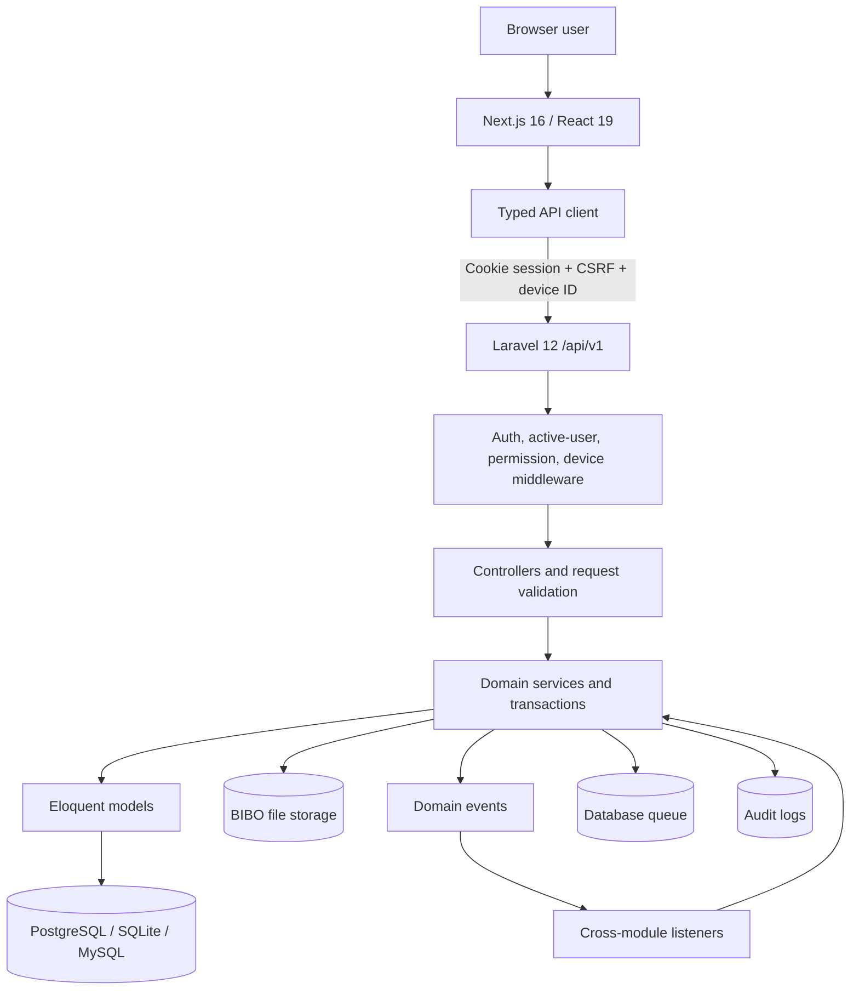
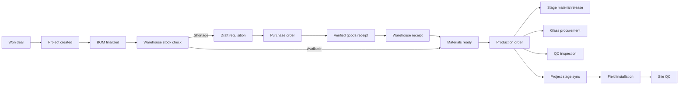

# BIBO Glass & Windows ERM: End-to-End Case Study

**Assessment date:** 27 July 2026  
**System:** BIBO Glass & Windows Enterprise Resource Management platform  
**Repository scope:** Laravel API, Next.js web application, relational schema, file storage, seed data, and automated tests  
**Document purpose:** An evidence-based case study of the business problem, implemented solution, operating model, architecture, end-to-end workflows, current maturity, risks, and recommended next steps

---

## 1. Executive summary

BIBO ERM is a custom, project-centred operating system for a glass, aluminium, window, and installation business. Its central design decision is that a customer engagement should not become disconnected records in sales, design, stores, procurement, production, quality, and installation. Instead, the system carries one commercial opportunity forward into a traceable project and uses that project to coordinate every downstream department.

The product addresses a difficult operational chain:

> lead capture → qualification → site measurement → quotation → deposit → project → design/BOM → stock reservation → procurement → production → quality control → installation → handover

The repository shows that this is no longer only a design concept. It contains a large working implementation:

- A Laravel 12 backend with 187 declared versioned API routes, 110 domain models, 177 controllers, and 128 service classes.
- A Next.js 16 and React 19 frontend with 174 page routes, 256 reusable TSX components, and 47 API-client modules.
- A relational model built through 61 migrations, with 119 distinct table creation declarations.
- Role-based access built around 17 seeded roles, 13 departments, and 152 permission slugs.
- An event-and-listener integration layer connecting CRM, projects, warehouse, procurement, production, QC, and field installation.
- Automated coverage across 64 backend test files and six frontend test files.

The strongest part of the solution is the operational core from CRM through production and field work. The design captures business rules that generic ERP software would struggle to model cleanly: site measurements, drawing and workbook extraction, FIFO project material reservation, aluminium offcuts, project-specific glass procurement, production-stage material release, field evidence, and context-specific QC.

The application is best described as a **feature-rich pre-production or controlled-pilot system**, not yet a finished enterprise deployment. The most important constraints are:

- Finance has database foundations but no dedicated finance API, while visible deposit and receipt pages are “coming soon.”
- Some management dashboard cards still use mock data.
- Device trust exists but is disabled by default and is not applied uniformly to every read/write route group.
- The frontend build configuration ignores TypeScript errors; the lint command is not operational with the installed ESLint version.
- The full backend suite exceeded a two-minute verification window, and one focused warehouse offcut test fails because its call signature is stale.
- An environment example contains default/demo credentials and a database password value, which should be removed and rotated before deployment.
- The root README understates the present implementation in some sections and overstates planned capabilities in others.

The system has a credible foundation and substantial domain depth. Its next phase should prioritize hardening, reconciliation, observability, finance completion, and pilot validation rather than adding broad new modules.

---

## 2. Organization and operating context

BIBO Glass & Windows operates across several tightly coupled disciplines:

- Sales and field prospecting
- Site assessment and measurements
- Estimation and quotations
- Project and design coordination
- Aluminium, accessories, rubber, and tool inventory
- Supplier and purchase-order management
- Fabrication and assembly
- Quality inspection
- Delivery and on-site installation
- HR, payroll, and employee services
- Client payment and financial control

The core product is not just an item sold from stock. A job can involve a unique site, many measured openings, custom configurations, approved designs, a project-specific bill of materials, staged workshop work, purchased glass, installation teams, and evidence-backed handover. This makes the company’s information flow inherently project-oriented.

### 2.1 The fragmentation problem

Without an integrated system, the same job can acquire different identities across departments:

- Sales knows a lead and a quotation.
- Project management knows a job name and deadline.
- Warehouse knows material requests.
- Procurement knows requisitions and supplier orders.
- Production knows cutting sheets and workshop stages.
- QC knows inspection references.
- Field teams know a site and daily work log.
- Finance knows deposits and receipts.

That fragmentation creates predictable failure modes:

- Measurements are retyped into quotations or fabrication sheets.
- A won deal is handed over without complete commercial or site context.
- Stock is promised to multiple projects because “available” stock does not subtract reservations.
- Procurement reacts late because shortages are discovered only when production is ready to start.
- Materials leave stores without a project, stage, performer, or movement record.
- Glass is ordered too early, too late, or without current opening data.
- Production progress is reported informally.
- QC becomes a final checkbox instead of a gated workflow.
- Installation problems lack photographs, ownership, and resolution history.
- Managers depend on calls and spreadsheets to understand status.

### 2.2 The target operating model

BIBO ERM replaces these disconnected handoffs with a controlled digital thread:

1. A lead is captured with identity, location, source, ownership, and activity history.
2. Qualification and field work create a verified commercial and site record.
3. A quotation moves through drafting, internal review, approval, issue, revision, and acceptance.
4. A won deal and its deposit state create a project.
5. Design documents and the latest BOM become project-controlled artifacts.
6. Warehouse checks real availability, honours FIFO demand, and reserves stock.
7. Shortages create procurement work; verified receipts flow back into stock.
8. Material readiness creates a production order.
9. Production stage events release materials, request glass, create QC work, and update the project.
10. Field installation records people, tools, delivery, units, daily activity, photographs, and non-conformities.
11. QC decisions and project-stage gates govern completion.

The system’s value therefore comes less from any single screen and more from preserving context between departments.

---

## 3. Case-study objective and method

This case study was produced from the repository as implemented, not solely from planning documents.

The assessment inspected:

- The root [README](README.md) and module guides in [docs](docs/)
- Backend route composition in [backend/routes/api.php](backend/routes/api.php)
- Models, controllers, services, enums, events, listeners, policies, middleware, and configuration under [backend/app](backend/app/)
- All database migrations and seeders under [backend/database](backend/database/)
- Next.js routes under [frontend/app](frontend/app/)
- Frontend components, navigation, auth context, and API clients
- Package manifests and environment examples
- Static implementation counts
- Backend and frontend test execution

Where documentation and code disagreed, current code was treated as the stronger source of truth. This matters because the root README still labels several now-implemented modules as planned or early-stage, while also mentioning aspirational capabilities such as a full client portal and complete Finance workflows that are not yet present end to end.

No production telemetry, live user interviews, financial baselines, or real operational data were available in the repository. Consequently, this study distinguishes:

- **Implemented capability** — supported by current code and routes
- **Design intent** — described in documentation but incomplete in code
- **Expected business outcome** — a measurable hypothesis, not a claimed realized result

---

## 4. Solution at a glance

### 4.1 Product footprint

| Area | Repository evidence |
|---|---:|
| Backend framework | Laravel 12, PHP 8.2+ |
| Frontend framework | Next.js 16.2.6, React 19, TypeScript |
| Declared API routes | 187: 93 GET, 75 POST, 13 PATCH, 5 DELETE, 1 PUT |
| Frontend pages | 174 `page.tsx` routes |
| Reusable frontend components | 256 TSX component files |
| Frontend API modules | 47 |
| Domain models | 110 |
| Controllers | 177 |
| Service classes | 128 |
| Migrations | 61 |
| Distinct table-create declarations | 119 |
| Seeded permissions | 152 |
| Seeded roles | 17 |
| Seeded departments | 13 |
| Domain events/listeners | 20 events and 21 listeners |
| Automated test files | 64 backend and 6 frontend |

Counts are a snapshot, not a quality score. They demonstrate the breadth of the implementation and explain why governance and regression control now matter.

### 4.2 Main modules

| Module | Primary responsibility | Current maturity |
|---|---|---|
| Identity and onboarding | Invitations, login, recovery, profiles, roles, departments, 2FA | Substantially implemented |
| CRM | Leads, accounts, contacts, activities, deals, field day, site visits, quotations | Substantially implemented |
| Site operations | Scheduled visits, measurements, sketches, reports, photos | Substantially implemented |
| Quotation and design | Requests, proforma workflow, revisions, PDFs, workbook extraction, design jobs | Substantially implemented |
| Project management | Project activation, stages, documents, BOMs, assignments, delays, material status | Substantially implemented |
| Warehouse | Structure, master data, stock, movements, reservations, offcuts, tools, stock take | Substantially implemented; one stale unit test |
| Procurement | Requisitions, approvals, POs, suppliers, prices, GRNs, drivers, transport, glass | Substantially implemented |
| Production | Orders, schedule, teams, cutting sheets, stages, releases, offcuts | Substantially implemented |
| Quality control | Templates, inspections, evidence, defects, schedules, dashboards | Substantially implemented |
| Field installation | Jobs, members, logs, deliveries, unit progress, photos, NCRs, tools | Substantially implemented |
| HR and payroll | Employees, leave, HR documents, payroll runs, approvals, payslips | Implemented, with finance handoff still limited |
| Workspace | Today view, tasks, calendar, personal documents, payslips, settings | Implemented |
| Finance | Schema and commercial-payment touchpoints | Partial; dedicated finance workflows are incomplete |
| IT/device administration | User administration, assignments, device trust model | Partial; no complete device-management surface |
| Executive analytics | Pipeline and selected module dashboards | Mixed; some top-level dashboard data remains mocked |

---

## 5. Stakeholders and user journeys

The system recognizes that department membership and operational authority are different concepts.

- A **department** determines organizational placement and the default module.
- A **role** determines actions a user can perform.
- A user may receive multiple department-role assignments.
- Permissions are cumulative and enforced in both backend routes/policies and frontend navigation/guards.

The seeded organization includes Sales/Marketing, Production, Warehouse, Procurement, Quality Control, HR, Finance, IT, Project Management, Operations/Admin, Reception, Field Operations, and Field Installation.

The seeded roles include super admin, operations manager, sales representative, field officer, project manager, production manager, two warehouse manager variants, procurement officer, QC inspector, HR manager, finance officer, IT admin, reception, client, installation lead, and field installation engineer.

### 5.1 Representative users

**Sales representative**

- Captures and qualifies leads
- Logs activities
- Coordinates site visits
- Builds or requests quotations
- Records negotiation and payment context
- Converts successful work into a project

**Field officer**

- Starts a field day
- Records geolocated prospect pins
- Executes assigned site visits
- Completes measurement lines and structured site forms
- Adds sketches, photos, and notes

**Project manager**

- Owns the delivery timeline
- Reviews site assessment and design artifacts
- Uploads/finalizes the BOM
- Monitors material readiness
- Coordinates production, QC, and installation
- Handles delays and cross-department exceptions

**Warehouse manager**

- Maintains location and product master data
- Receives, transfers, adjusts, reserves, and issues stock
- Allocates aluminium offcuts
- Runs stock takes
- Issues and receives tools

**Procurement officer**

- Reviews system-generated or manual requisitions
- Selects suppliers and manages item prices
- Produces and sends purchase orders
- Coordinates transport and drivers
- Records and verifies deliveries
- Orders project-specific glass

**Production manager and operator**

- Plans the FIFO production schedule
- Assigns stage teams
- Generates and edits cutting sheets
- Starts and completes production stages
- Logs offcuts and monitors material releases

**QC inspector**

- Uses context-specific checklist templates
- Records pass/fail responses
- Adds required photographic evidence
- Raises and resolves defects
- Submits a controlled inspection result

**Installation lead**

- Starts field installation work
- Allocates team members and tools
- Records daily progress, delivery, and unit state
- Reports non-conformities
- Completes the site job for QC/handover

**Employee and HR manager**

- Employee: manages profile, leave, documents, security settings, and payslips
- HR: manages identity and employment details, reviews changes and leave, runs payroll, and issues documents

---

## 6. End-to-end business journey

This section follows one hypothetical commercial job through the implementation.

### Stage 1: Lead capture and qualification

A prospect enters through reception, a sales representative, import, or field activity. The lead record stores ownership, contact and company context, product interest, construction stage, location, source, priority, and notes. The system supports Kenya-specific administrative location handling, including county/sub-county mapping.

Field acquisition has a dedicated “Field Day” workflow. An officer starts a working session and records GPS pins, photos, addresses, and observations. A pin can be converted into a lead while preserving provenance.

The CRM does more than store status. Lead pipeline services, activities, assignments, and account provisioning form an explicit workflow. Calls, meetings, tasks, visits, and follow-ups create a time-ordered engagement record.

**Control gained:** Every opportunity has an owner, next action, source, and history rather than existing only in personal notes or messaging threads.

### Stage 2: Contact, account, and deal formation

Qualification can convert the lead into:

- A contact representing a person
- An account representing the customer or organization
- A deal representing the commercial opportunity

The implementation preserves links back to the lead. It validates account eligibility and prevents accidental creation of disconnected commercial records.

The deal carries estimated/final value, owner, stage, site, primary contact, and payment state. Stage-change services and explicit mark-won/mark-lost actions make the pipeline auditable.

**Control gained:** The business can distinguish “who the customer is” from “what opportunity is being sold” and “what project will be delivered.”

### Stage 3: Site visit and structured measurement

A site visit is scheduled and assigned to an eligible field or production officer. The workflow supports:

- Open and today queues
- Starting and submitting a visit
- Measurement lines
- A unified site-measurement form
- Rough and automatically generated sketches
- Opening photographs
- Site-visit photographs
- Review and approval
- Production versus quotation measurement contexts

The frontend includes form-lock rules for submitted/approved measurements, while the backend has structured measurement entities and report services.

**Control gained:** The quotation and eventual fabrication package can be traced to reviewed site evidence.

### Stage 4: Quotation, review, negotiation, and acceptance

Quotation logic exists in both CRM and a dedicated quotation workspace. The implemented lifecycle separates:

- Drafting
- Internal review
- Approval
- Release/send
- Revision
- Negotiation notes
- Acceptance

Quotation services calculate lines and totals, produce PDFs, and preserve revisions. The design and project services can extract priced lines, dimensions, profile information, and embedded drawings from Excel workbooks. This reflects a practical business reality: estimating and fabrication knowledge already exists in specialist spreadsheets and must be ingested rather than discarded.

Currency support includes an exchange-rate lookup and USD-to-KES pricing helpers. Default tax and exchange-rate values are configurable.

**Control gained:** Commercial approval is distinct from customer issuance, and revisions do not erase negotiation history.

### Stage 5: Deal won, deposit, and project creation

A project can only be created from a won deal linked to an account. The service prevents duplicate project creation for the same deal.

Project activation contains an additional business constraint: an account may have only one active in-flight project. A new project can be created but held inactive if another account project is already active.

The initial project stage depends on whether the deposit requirement is satisfied:

- `awaiting_deposit`
- `deposit_received`

The project copies the commercial context: deal, account, contact, amount, site, sales representative, construction stage, and deposit state. The deal then moves to a project-created stage.

**Control gained:** Operations receives a project only from a valid commercial outcome, without losing sales ownership or payment context.

### Stage 6: Project planning, design, and BOM

The project becomes the system backbone. Its lifecycle has 19 current stages:

1. Awaiting deposit
2. Deposit received
3. Site assessment
4. Final design approval
5. BOM finalized
6. Material check
7. Materials reserved
8. Awaiting procurement
9. Materials ready
10. Materials released
11. Cutting
12. Fabrication
13. Glass assembly
14. QC pre-installation
15. In transit
16. Installation
17. Site QC
18. Snagging
19. Project complete

Stage changes are not arbitrary. The backend uses enums, transition rules, stage logs, permissions, and readiness gates. For example:

- Design stages require appropriate project documents.
- BOM readiness requires a latest BOM with actual lines.
- BOM finalization requires a finalized status.
- Invalid stage skips are rejected.
- Stage responsibility can be limited to sales, warehouse, production, or project roles.

Design jobs can receive documents, download packages, extract workbook content, upload accounting data, and approve outputs.

**Control gained:** A project cannot progress merely because someone changed a status dropdown; readiness evidence and department authority matter.

### Stage 7: BOM stock check and FIFO reservation

When the BOM is finalized, an event triggers warehouse processing. The material orchestrator:

1. Records project demand in a FIFO queue registry.
2. Checks each stockable BOM line.
3. Calculates available stock after reservations.
4. Considers usable aluminium offcuts.
5. Accounts for earlier queued demand.
6. Either creates a reservation or emits a shortage event.

If stock is sufficient, a project reservation is created with a FIFO sequence. Reservation events update project material state and can declare the project materials ready.

If stock is insufficient, the shortage event contains item-level required, available, and short quantities. This becomes input to Procurement.

**Control gained:** Physical stock, reserved stock, usable offcuts, and queue priority are treated as separate concepts. This reduces double allocation and protects earlier projects.

### Stage 8: Procurement and goods receipt

Procurement supports multiple triggers:

- Project material shortage
- Low stock
- Glass demand
- Project add-on
- Manual requisition

A shortage listener can automatically draft a purchase requisition. The procurement workflow supports:

- Requisition creation, submission, approval, and rejection
- Supplier and item-price history
- Purchase-order draft, batching, approval, PDF, and send
- Drivers and transport orders
- Goods receipt and attachments
- Received line updates
- Verification
- Project watchers and delay logging
- Project-specific glass orders

A verified goods receipt dispatches an event consumed by Warehouse. The receipt service resolves warehouse items and put-away locations, then creates inbound stock movement. Reservation fulfilment can re-evaluate previously short projects.

QC has a warehouse-receiving inspection context, allowing incoming material to be inspected rather than immediately assumed usable.

**Control gained:** Procurement demand originates from a known business reason, and delivered material does not become stock without receipt, verification, location, and movement history.

### Stage 9: Production order and scheduling

When project materials become ready, listeners create a production order and notify production management.

Production has an eight-stage internal pipeline:

1. Material preparation
2. QC pre-check
3. Cutting
4. Fabrication
5. Sash fabrication
6. Glass assembly
7. Final assembly and finishing
8. QC post-fabrication

The module supports:

- Production order list and detail
- FIFO schedule
- Team assignment
- Stage start, complete, and authorized skip
- Cutting-sheet generation and editing
- Production material release records
- Offcut logging
- Glass status
- Links to QC inspections

Starting relevant stages releases only the reservation material needed for that stage. Completing defined stages emits events that synchronize the project. Glass-assembly progress can notify Procurement to order or track glass. QC pre-check and post-fabrication events create inspections.

**Control gained:** “Production started” becomes a staged and attributable process, not a single opaque status.

### Stage 10: Offcut recovery

Aluminium offcuts are first-class inventory records. The system records:

- Profile/item
- Length
- Number of pieces
- Storage area
- Bin where applicable
- Source project and movement
- Status and allocation
- Logger and timestamp

The stock check can count usable offcut length, and production can log new offcuts from cutting work. Analytics services calculate reuse and waste-related metrics.

**Control gained:** Recoverable material is visible for future work, improving yield and reducing unnecessary purchasing.

### Stage 11: Quality control

QC is implemented as a contextual subsystem rather than one generic inspection form. Contexts include production checks, warehouse receiving, and site installation.

An inspection resolves the best checklist template for its context and project. It supports:

- Required and custom checklist items
- Draft saving
- Inspector assignment
- Notes and restricted internal notes
- Photos associated with an inspection, checklist item, or defect
- Defect severity and status
- Pass, conditional pass, fail, and pending states

Submission enforces key rules:

- Required checklist responses must exist.
- Failed “photo required” items must have evidence.
- Open critical defects prevent a pass.
- Failed checklist answers force a failure.
- Completed and failed events preserve the result for downstream work.

**Control gained:** Quality is evidence-based and linked to the actual receipt, production order, field job, or project.

### Stage 12: Field installation

Workshop completion hands work into Field Installation. A field job models:

- Job type and status
- Team members
- Daily logs
- Delivery records and lines
- Installed units and per-unit progress
- Photos
- Non-conformities
- Tool assignments

The team can document delivery condition, site progress, problems, and photographic evidence. Non-conformity events notify the project manager. Tools issued through Warehouse are linked to the installation job and can require return before close.

When installation completes, an event updates the project and can create a site-installation QC inspection.

**Control gained:** The last mile is not an unstructured handoff; site activity remains connected to the project, assets, people, and QC.

### Stage 13: Site QC, snagging, and handover

The final project stages provide space for:

- Site inspection
- Defect resolution
- Snagging
- Client handover
- Completion

The schema and stage model support this lifecycle, and QC can create site inspections from field-job completion.

However, the complete commercial closeout is not finished. Dedicated Finance invoicing, receipt reconciliation, project profitability, and a working external client portal are not implemented end to end. These are important remaining pieces of the intended closed loop.

---

## 7. Architecture

### 7.1 Logical architecture

### 7.2 Frontend

The frontend uses the Next.js App Router. Route groups separate authentication and dashboard experiences, while department-aware navigation exposes CRM, projects, site operations, warehouse, procurement, production, QC, field installation, HR, IT, Finance, analytics, and workspace surfaces.

Key UI characteristics include:

- Tailwind CSS 4
- Radix/shadcn-style primitives
- React Hook Form and Zod
- Recharts for data visualization
- Leaflet for field mapping
- jsPDF and HTML-to-canvas utilities
- Permission guards and department-aware navigation
- Responsive layouts and reusable operational workspaces

The frontend API layer centralizes:

- Base URL normalization
- Cookie credentials
- CSRF-cookie acquisition
- XSRF headers
- Device identifier headers
- Single-flight session refresh
- JSON and form-data handling
- Standard API errors
- Short in-memory GET caching and mutation invalidation

### 7.3 Backend

Laravel exposes versioned `/api/v1` endpoints organized into route files per bounded module. Controllers are generally thin relative to domain services, which is appropriate for a workflow-heavy ERP.

Important backend patterns include:

- PHP enums for project, CRM, production, procurement, warehouse, field, and QC states
- Database transactions around multi-record operations
- Dedicated reference generators
- Policy and permission authorization
- Domain audit loggers
- Event-driven cross-module coordination
- Storage services and upload validation
- PDF and Excel-processing services
- Notifications and database queues

### 7.4 Cross-module event choreography

The integration layer is one of the most consequential design choices.

This avoids direct hard-coding between every pair of modules. For example, Production only needs to emit a stage-completed event; Warehouse, Procurement, Projects, and QC decide independently whether that event matters to them.

The trade-off is operational complexity: if event registration, idempotency, or error visibility is weak, cross-module work can fail silently. The system should therefore add event observability and integration-contract tests as it moves toward production.

### 7.5 Data architecture

The relational model is broad and normalized around major aggregates:

- Identity: users, profiles, employees, departments, roles/permissions, invitations, devices
- CRM: leads, accounts, contacts, deals, activities, payments, visits, quotations
- Projects: projects, stage logs, documents, floors, engineers, BOMs, delays
- Warehouse: warehouses, decks, sections, bins, items, levels, movements, reservations, offcuts, tools
- Procurement: requisitions, POs, suppliers, prices, GRNs, drivers, transport, glass
- Production: orders, teams, stage logs, releases, cutting sheets
- QC: templates, inspections, photos, defects, schedules
- Field installation: jobs, members, logs, deliveries, photos, units, NCRs, tools
- HR/Finance: leave, documents, payroll, invoices, payments, expenses
- Platform: audit, notifications, queue, cache, sessions, workspace calendar

Foreign keys added in later migrations explicitly strengthen the BOM-to-warehouse and procurement-to-warehouse links.

### 7.6 File and document architecture

The repository includes a storage root outside the backend application directory:

- Public profile media
- Private field-work and operational documents
- Category-specific limits and accepted content types

File access is routed through an authenticated stored-file controller. Services sanitize images, validate upload size/type, generate controlled paths, and resolve public/private URLs. This is a good base for protecting HR, project, procurement, CRM, and field evidence.

---

## 8. Security and governance

### 8.1 Authentication

The web application uses Laravel Sanctum with stateful cookies and CSRF protection. The API stack explicitly adds cookie encryption, queued cookies, session startup, CSRF validation, and session authentication.

Supported flows include:

- Login and logout
- Session refresh
- Password change
- Forgot/reset password
- Email recovery
- User invitations
- Optional email-OTP two-factor authentication
- 2FA enable/disable

Authentication-sensitive endpoints are rate limited. Limits exist for login, refresh, invitations, recovery, uploads, and 2FA verification/resend.

### 8.2 Authorization

Spatie roles and permissions provide the main authorization layer. The API combines:

- `auth:sanctum`
- active-user checks
- device-trust checks on selected route groups
- permission middleware
- role-or-permission middleware
- model policies

Super administrators receive a gate override. Department-role assignments are synchronized into Spatie roles.

The frontend mirrors these controls for navigation and action visibility. This improves usability, but backend authorization remains the real security boundary.

### 8.3 Device trust

The frontend sends an `X-Device-Id` header, and the backend contains device records, a device-trust service, and middleware. Enforcement is configuration-driven and defaults to disabled. The example configuration targets high-risk roles such as super admin and IT admin.

This should be described as **available conditional enforcement**, not universal device locking. Some route groups also omit `device.trusted`, particularly read-heavy CRM, Procurement, QC, workspace, and site-operations groups. The intended policy should be documented and consistently applied according to risk.

### 8.4 Auditability

The platform includes an `audit_logs` table and module-specific audit loggers for CRM, Procurement, Warehouse, Production, Field Installation, and QC. Records can include performer, module/action, entity, before/after context, request/device details, and time.

This supports accountability, but the older documentation’s claim that every view and every action is logged should not be assumed. Audit coverage should be measured endpoint by endpoint before making a compliance promise.

### 8.5 Security issues to resolve before production

1. Remove default credentials and real-looking secrets from environment examples and repository history; rotate any value that may have been used.
2. Do not expose development temporary passwords in normal UI error messaging.
3. Enable secure cookies, disable debug mode, and use a restricted production CORS allow-list.
4. Define the exact device-enforcement matrix by role and route sensitivity.
5. Add security headers, dependency scanning, secret scanning, and an explicit vulnerability-response process.
6. Verify authorization on downloads, exports, reports, IDs, and all cross-project resources.
7. Encrypt or tokenize sensitive payroll, bank, government-ID, and HR fields at rest.
8. Establish audit retention, immutable export, and administrator access review.

---

## 9. Reporting, analytics, and workspace

The application provides several types of operational visibility:

- CRM home and sales reports
- Pipeline dashboard
- Procurement dashboard and stock analytics
- Warehouse inventory, low stock, movements, offcuts, and stock take
- Production schedule and stage queues
- QC dashboard, inspections, defects, and schedules
- Project pipeline and project-detail operational tabs
- Field-day and site-operations reports
- Workspace “today,” tasks, and calendar

The workspace is especially useful because it aggregates assignable work across module boundaries rather than forcing every employee to visit each application separately.

The top-level executive dashboard is not yet a reliable source of truth. Several components still import mock metrics, activities, and projects. It should not be used for management decisions until every card is backed by live, permission-scoped APIs and has a defined metric contract.

---

## 10. Quality strategy and verification results

### 10.1 Test design present in the repository

Backend tests cover:

- Authentication, invitations, recovery, onboarding, middleware, and device trust
- CRM activities, lead/account pipeline, site visits, field day, quotations, and reports
- HR employee, leave, and payroll flows
- Project stage gates, material status, design queues, quotation workspaces, and listeners
- Procurement stock and glass orders
- Warehouse structure, inventory, movements, FIFO reservations, offcuts, tools, low stock, and stock take
- Production flow
- QC inspection flow
- Excel extraction and document/storage support

Frontend tests cover:

- Unified measurement-form rules
- Auto-sketch grouping
- Kenya location resolution
- Quotation status semantics
- Requisition PDF output
- Purchase-order PDF output

### 10.2 Verification performed for this case study

**Frontend tests**

- Result: **passed**
- Six test files
- 17 tests
- Vitest 3.2.4

**Backend tests**

- The full suite was started but exceeded a 120-second execution window.
- All displayed suites passed until the warehouse offcut service test.
- A focused rerun reproduced one failure:
  - `OffcutServiceTest::test_log_offcut_records_piece_and_stock`
  - Cause: the test calls `OffcutLoggingService::log()` with old named scalar parameters, while the current service expects an `OffcutLogPayload`.
  - Interpretation: this is a stale test-to-service contract, not evidence from the focused run of an incorrect stock calculation.
- The full suite cannot be represented as green because it did not complete.
- PHPUnit also reports deprecated doc-comment metadata that will break under PHPUnit 12 unless converted to attributes.

**Frontend lint**

- Result: **not operational**
- ESLint 9.39.4 cannot find the new flat `eslint.config.*` configuration.

**Frontend type check**

- Result: **failed**
- TypeScript reports syntax errors in generated `.next/dev/types/routes.d.ts`.
- Next.js is also configured with `typescript.ignoreBuildErrors: true`, allowing production builds to bypass type failures.

### 10.3 Quality assessment

The backend has meaningful domain-level coverage, particularly for warehouse and project workflow rules. The frontend has useful tests but too little coverage relative to 174 pages and the risk of its operational forms.

Before production, the delivery pipeline should enforce:

1. Fresh install and migration
2. Backend unit/feature tests
3. Frontend unit tests
4. ESLint
5. TypeScript without generated-artifact contamination
6. Next.js production build without ignored type errors
7. API contract tests
8. End-to-end browser tests for critical paths
9. Dependency and secret scans

---

## 11. Deployment and operations

### 11.1 Current deployment shape

The intended runtime is:

- Next.js frontend, with a Vercel configuration present
- Laravel API on a PHP-capable host
- PostgreSQL as the documented production database
- Database-backed sessions, cache, and queue by default
- SMTP mail
- BIBO-managed filesystem storage

Local development expects the frontend and backend to use compatible hostnames so Sanctum/XSRF cookies work correctly. The frontend base URL must be provided through `NEXT_PUBLIC_API_URL`.

### 11.2 Operational strengths

- API health endpoint
- Versioned API surface
- Database queue support
- Configurable storage path
- Per-category upload constraints
- Environment-driven CORS, session, mail, device, rate, and pricing settings
- PostgreSQL, SQLite, and MySQL configuration options

### 11.3 Operational gaps

The repository does not yet demonstrate a complete production operating model:

- No container or infrastructure-as-code baseline
- No CI workflow in the assessed tree
- No deployment runbook, rollback procedure, or migration safety policy
- No backup and restore test
- No centralized error monitoring or tracing configuration
- No service-level objectives
- No documented queue-worker supervision
- No disaster-recovery target
- No production smoke-test suite

The Vercel build command references a `.v0` script, while the repository listing should be verified to ensure that artifact exists in every deployment context.

### 11.4 Recommended production topology

For an initial controlled deployment:

- Managed PostgreSQL with point-in-time recovery
- Separate Laravel web and queue-worker processes
- Object storage for private operational files, with signed access
- Redis for cache, locks, queues, and rate-limit coordination when load warrants it
- Same parent domain for frontend and API to simplify secure Sanctum cookies
- Central application logs, error tracking, queue monitoring, and uptime checks
- Nightly backup plus regular restore rehearsal
- Staging environment with sanitized data
- Blue/green or versioned rollback for frontend and API

---

## 12. Business value and measurable outcomes

The repository does not include production KPI evidence, so the following are expected outcomes and recommended measures.

### 12.1 Revenue operations

**Expected value**

- Faster lead response
- Higher follow-up completion
- Better quotation turnaround
- Clearer conversion and loss analysis

**Measures**

- Median lead-to-first-contact time
- Lead-to-site-visit conversion
- Site-visit-to-quotation time
- Quotation acceptance rate
- Average revision count
- Deal win/loss reason distribution

### 12.2 Project delivery

**Expected value**

- Fewer uncontrolled handoffs
- Earlier visibility of blocked stages
- Better owner accountability
- More reliable delivery forecasts

**Measures**

- Time in each project stage
- Percentage of stages completed on plan
- Delay count and duration by cause/department
- Deposit-to-production lead time
- Production-complete-to-handover lead time

### 12.3 Inventory and procurement

**Expected value**

- Less double allocation
- Earlier shortage discovery
- Lower emergency purchasing
- Better supplier accountability
- Higher offcut reuse

**Measures**

- Reservation fulfilment rate
- Stock accuracy after stock take
- Shortage value by project
- Emergency purchase rate
- Supplier on-time and in-full delivery
- Purchase price variance
- Aluminium yield and offcut reuse rate

### 12.4 Production and quality

**Expected value**

- Better work-in-progress visibility
- Traceable stage ownership
- Fewer late glass orders
- Lower rework and defect escape

**Measures**

- Production order cycle time
- Queue age and schedule adherence
- Stage first-pass yield
- Defects per project/unit
- Critical defect closure time
- Rework hours
- QC pass rate by context

### 12.5 Field installation

**Expected value**

- Better daily progress evidence
- Faster issue escalation
- Fewer lost tools
- Clearer site completion

**Measures**

- Installed units per team-day
- Field NCR rate
- NCR resolution time
- Tool return compliance
- Planned versus actual installation duration
- Handover first-pass rate

### 12.6 Adoption and control

**Measures**

- Weekly active users by role
- Percentage of active projects with current stage updates
- Percentage of material issues linked to project and reservation
- Percentage of inspections with required evidence
- Number of unauthorized/blocked actions
- Data completeness score per module

---

## 13. Key design decisions and lessons

### 13.1 Project as the shared business identity

The most successful architectural choice is making the project the downstream anchor. This gives every department a shared answer to “which customer outcome is this work serving?”

**Lesson:** Integration is not just synchronizing tables; it requires a stable business identity that survives departmental handoffs.

### 13.2 Preserve real specialist workflows

Excel extraction, site sketches, cutting sheets, offcuts, glass procurement, and field photographs show that the solution was shaped around actual trade practices.

**Lesson:** A vertical ERP succeeds when it captures domain-specific work instead of forcing every activity into generic tasks and inventory transactions.

### 13.3 Use events for consequential handoffs

Domain events allow one business occurrence—such as material readiness—to create production work, notify managers, and update project state without coupling all modules into one service.

**Lesson:** Events are effective at ERP boundaries, but require idempotency, monitoring, replay/repair tools, and explicit ownership.

### 13.4 Separate on-hand, reserved, and available inventory

The FIFO reservation design recognizes that physical stock can already be committed.

**Lesson:** Inventory truth is a calculation and a ledger, not a single mutable quantity.

### 13.5 Make QC contextual

Receiving, production, and site work require different evidence and templates.

**Lesson:** Quality control should follow the risk context and block downstream work where necessary.

### 13.6 Documentation must track implementation

The root README is simultaneously behind current functionality and ahead of some unfinished outcomes.

**Lesson:** Status documentation should be generated or reviewed with releases; otherwise it stops being a reliable governance artifact.

---

## 14. Risks and gaps

| Priority | Risk/gap | Business impact | Recommended response |
|---|---|---|---|
| Critical | Secrets/default credentials in environment example | Unauthorized access if reused | Remove, rotate, scan history, add secret scanning |
| Critical | Finance is incomplete | Commercial lifecycle cannot close in one system | Implement invoices, receipts, reconciliation, ageing, and project margin |
| High | Type errors are ignored in Next.js build | Defects can ship unnoticed | Remove `ignoreBuildErrors`, fix generated-route issue, gate CI |
| High | Lint command is broken | Code-quality regressions go unchecked | Add ESLint 9 flat config and enforce it |
| High | Full backend suite not currently verified green | Regression risk | Fix stale offcut test, remove deprecations, optimize and run full suite in CI |
| High | Executive dashboard contains mock data | Managers may act on fictitious numbers | Replace with live metric APIs and label non-live environments |
| High | Device trust is conditional/inconsistent | Security promise may exceed enforcement | Define and test route/role enforcement policy |
| High | Event failures lack visible operational controls | Cross-module state can diverge silently | Add queued events, retries, dead-letter monitoring, idempotency, repair commands |
| High | No production runbook/CI/backup evidence | Deployment and recovery risk | Establish CI/CD, rollback, backup/restore, incident playbooks |
| Medium | Client portal is not implemented end to end | Intended client visibility is unavailable | Build after internal data quality is stable |
| Medium | Finance tables exist without a cohesive service boundary | Duplicate or inconsistent accounting logic | Define a Finance aggregate/API before adding more pages |
| Medium | Audit coverage is not proven universal | Compliance and dispute risk | Build an audit coverage matrix and immutable export |
| Medium | Frontend automated coverage is narrow | Form and permission regressions | Add integration and Playwright tests for critical journeys |
| Medium | Some legacy mock/data adapters remain | Confusing source-of-truth boundaries | Remove or isolate demo-only data |
| Medium | Multi-database claim needs continuous verification | Production-specific failures | Test PostgreSQL in CI; treat other databases as explicit support tiers |

---

## 15. Recommended roadmap

### Phase 0: Immediate security containment

**Target: days**

- Remove and rotate repository-visible credentials.
- Verify no production secret appears in history, logs, fixtures, or frontend bundles.
- Disable development password disclosure outside local environments.
- Set production cookie, CORS, debug, and session policies.

**Exit criteria:** Secret scan passes; credentials are managed externally; production security configuration is documented and tested.

### Phase 1: Build and test integrity

**Target: 1–2 weeks**

- Fix the stale `OffcutServiceTest`.
- Run and stabilize the full backend suite.
- Replace deprecated PHPUnit doc-comment metadata with attributes.
- Add ESLint 9 flat configuration.
- Resolve generated Next route declarations.
- Remove `typescript.ignoreBuildErrors`.
- Add CI for migrations, backend tests, frontend tests, lint, type check, and build.

**Exit criteria:** A clean checkout produces a fully green CI result without bypasses.

### Phase 2: Operational reconciliation

**Target: 2–4 weeks**

- Add integration tests for every registered event/listener.
- Add idempotency to cross-module consumers.
- Surface failed jobs and incomplete handoffs.
- Create reconciliation reports:
  - won deal without valid project
  - finalized BOM without material outcome
  - ready project without production order
  - verified GRN without stock movement
  - completed production stage without project sync/QC
  - completed field job without site QC
- Add administrator repair/replay tools.

**Exit criteria:** Every automated handoff is observable, reconcilable, and safe to retry.

### Phase 3: Replace non-live decision surfaces

**Target: 2–3 weeks**

- Replace dashboard mock metrics and recent activity.
- Define metric formulas, scope, time zone, and permissions.
- Add freshness timestamps and drill-down links.
- Remove dead or placeholder navigation.

**Exit criteria:** Every management KPI is live, traceable, and defined.

### Phase 4: Finance completion

**Target: 4–8 weeks**

- Define invoice, receipt, allocation, credit, expense, and supplier-liability workflows.
- Integrate accepted quotations, deposits, project milestones, GRNs/POs, and approved payroll.
- Add receivables ageing, payment reconciliation, project cost/margin, and financial audit controls.
- Decide whether the module is a subledger or integrates with an external accounting platform.

**Exit criteria:** The system can trace commercial value from quotation through cash and project cost without spreadsheet reconciliation.

### Phase 5: Controlled pilot

**Target: 4–6 weeks**

- Select a small cross-functional group and a limited set of new projects.
- Clean master data before go-live.
- Train by role using real scenarios.
- Run daily reconciliation and weekly feedback.
- Track baseline and target KPIs.
- Maintain a rollback/export path.

**Exit criteria:** Pilot projects complete through handover with acceptable data quality, adoption, inventory accuracy, and no unresolved critical control failures.

### Phase 6: Client visibility and scale

**Target: after internal stabilization**

- Implement secure client access with project-level scoping.
- Expose only approved milestones, documents, photos, and messages.
- Add notification preferences and consent.
- Improve infrastructure, caching, queues, storage, and reporting based on measured load.

**Exit criteria:** Client access cannot reveal internal, HR, commercial, or cross-client data and reflects verified internal status.

---

## 16. Pilot acceptance checklist

### Business readiness

- [ ] Named process owner for each module
- [ ] Agreed project-stage definitions and owners
- [ ] Approved material, location, supplier, and QC master data
- [ ] Finance scope and interim reconciliation process agreed
- [ ] User roles reviewed for least privilege

### Technical readiness

- [ ] Full CI pipeline green
- [ ] PostgreSQL migration tested from a clean database
- [ ] Backup and restore tested
- [ ] Queue worker, scheduler, and failed-job monitoring active
- [ ] Error tracking and uptime monitoring active
- [ ] Production secrets managed outside source control
- [ ] File-storage retention and access policies tested

### Workflow readiness

- [ ] Lead-to-project happy path tested
- [ ] Shortage-to-GRN-to-reservation path tested
- [ ] Production material release and offcut path tested
- [ ] Production-to-QC path tested
- [ ] Installation-to-site-QC path tested
- [ ] Rejection, defect, delay, cancellation, and retry paths tested
- [ ] Reconciliation reports show no unexplained orphaned records

### Adoption readiness

- [ ] Role-based training complete
- [ ] Quick-reference guides available
- [ ] Pilot support channel and escalation owner assigned
- [ ] KPI baseline captured
- [ ] Daily pilot review cadence agreed

---

## 17. Final assessment

BIBO ERM is an ambitious and unusually domain-aware system. It does not merely reproduce departmental spreadsheets in a browser; its architecture attempts to coordinate a real manufacturing-and-installation value stream.

The implementation’s strongest achievements are:

- A coherent lead-to-project handoff
- Structured site measurement and design ingestion
- Project stage gates
- FIFO-aware stock reservation
- Automatic procurement demand
- Verified receipt-to-stock integration
- Production-stage material and QC orchestration
- Offcut recovery
- Evidence-backed field installation
- Granular role and permission design

Its current limitation is not lack of breadth. The system already has significant breadth. The constraint is **production assurance**: build quality gates, security hygiene, reconciliation, operational monitoring, complete Finance, live analytics, and controlled user validation.

The recommended strategic decision is therefore to stop treating the repository as an early prototype while also resisting a full company-wide launch. It should enter a hardening-and-pilot phase. If the team makes every cross-module handoff observable, completes financial closure, replaces mock decision data, and proves the critical journeys through a controlled pilot, BIBO ERM can become the company’s authoritative operational system rather than another layer alongside spreadsheets and messaging.

---

## Appendix A: Evidence map

| Topic | Primary repository evidence |
|---|---|
| API composition and middleware | [backend/routes/api.php](backend/routes/api.php), [backend/bootstrap/app.php](backend/bootstrap/app.php) |
| Cross-module listeners and rate limits | [backend/app/Providers/AppServiceProvider.php](backend/app/Providers/AppServiceProvider.php) |
| Project lifecycle | [backend/app/Enums/ProjectStage.php](backend/app/Enums/ProjectStage.php), [backend/app/Support/ProjectStageGate.php](backend/app/Support/ProjectStageGate.php) |
| Deal-to-project handoff | [backend/app/Services/Crm/Deals/DealToProjectService.php](backend/app/Services/Crm/Deals/DealToProjectService.php) |
| FIFO material orchestration | [backend/app/Services/Warehouse/Reservations/ProjectMaterialReservationOrchestrator.php](backend/app/Services/Warehouse/Reservations/ProjectMaterialReservationOrchestrator.php) |
| Production stages | [backend/app/Enums/Production/ProductionStage.php](backend/app/Enums/Production/ProductionStage.php) |
| QC rules | [backend/app/Services/QualityControl/QcInspectionService.php](backend/app/Services/QualityControl/QcInspectionService.php) |
| Offcut workflow | [backend/app/Services/Warehouse/Offcuts/OffcutLoggingService.php](backend/app/Services/Warehouse/Offcuts/OffcutLoggingService.php) |
| Roles and permissions | [backend/database/seeders/RoleSeeder.php](backend/database/seeders/RoleSeeder.php), [backend/database/seeders/PermissionSeeder.php](backend/database/seeders/PermissionSeeder.php) |
| Departments | [backend/database/seeders/DepartmentSeeder.php](backend/database/seeders/DepartmentSeeder.php) |
| Frontend API behavior | [frontend/lib/api/client.ts](frontend/lib/api/client.ts) |
| Frontend auth and permission context | [frontend/contexts/auth-context.tsx](frontend/contexts/auth-context.tsx) |
| Frontend navigation | [frontend/lib/navigation.ts](frontend/lib/navigation.ts) |
| Frontend build configuration | [frontend/next.config.mjs](frontend/next.config.mjs) |
| Production status audit | [docs/PRODUCTION_GAP_AUDIT.md](docs/PRODUCTION_GAP_AUDIT.md) |
| Warehouse frontend guide | [docs/WAREHOUSE_FRONTEND_GUIDE.md](docs/WAREHOUSE_FRONTEND_GUIDE.md) |

## Appendix B: Terminology

| Term | Meaning |
|---|---|
| BOM | Bill of materials |
| ERP/ERM | Enterprise resource planning/management system |
| FIFO | First in, first out; here also used for project demand priority |
| GRN | Goods receipt note |
| NCR | Non-conformity report |
| Offcut | Recoverable remaining length after cutting material |
| PO | Purchase order |
| QC | Quality control |
| SPA | Single-page web application |
| XSRF/CSRF | Protection against cross-site request forgery |
