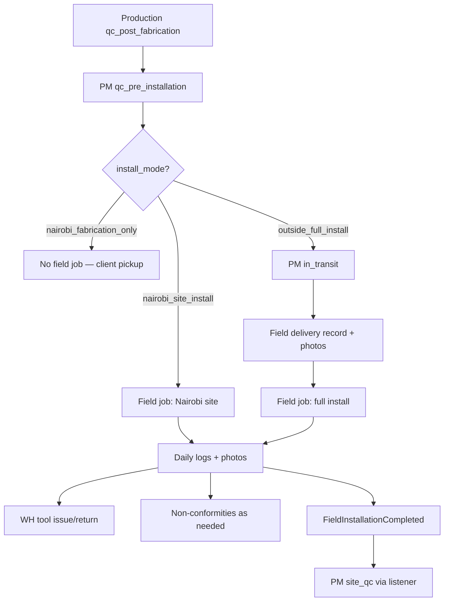
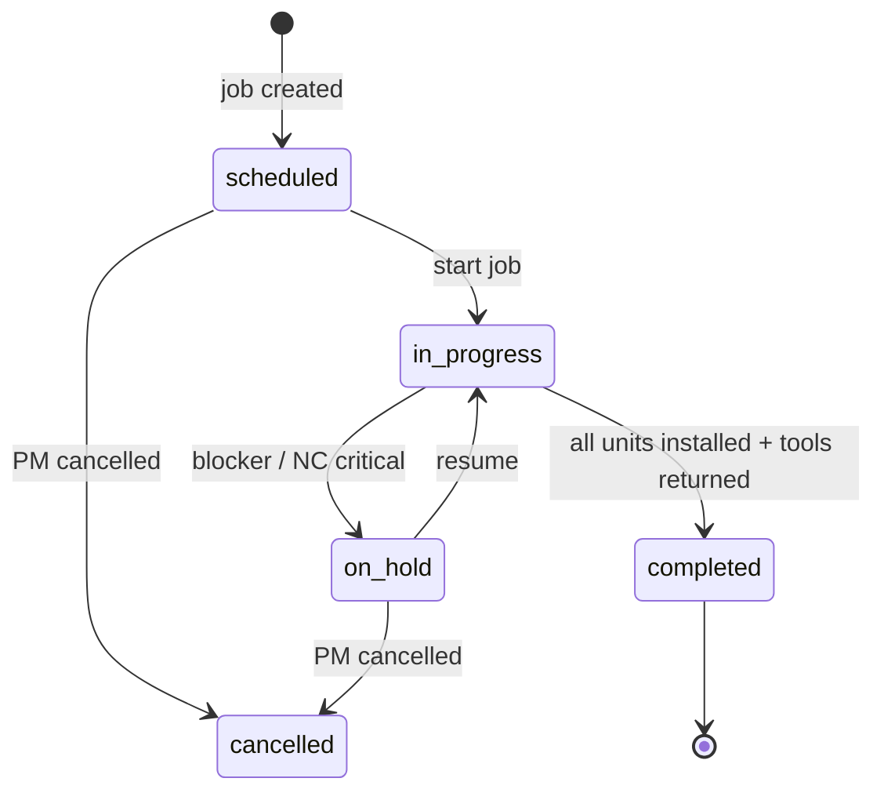
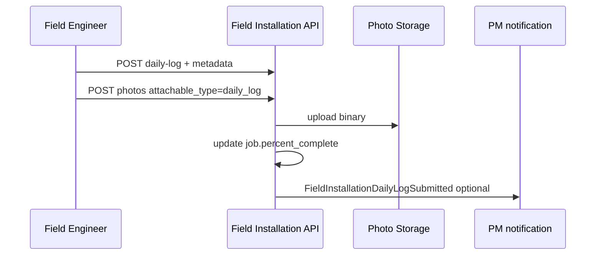
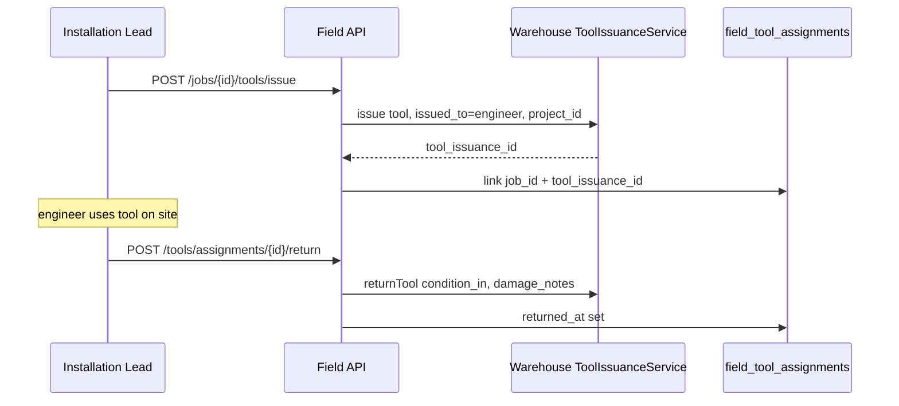
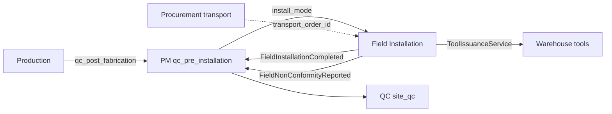

# Field Installation — Implementation Plan

**Module:** Field Installation · On-Site Progress · Delivery & Non-Conformities · Tool Custody  
**Stack:** PHP 8.2+ · Laravel 11 · PostgreSQL/MySQL · Next.js SPA  
**References:** [README.md](../README.md) §8 (Modules), §8.2 (Project stages 14–16), [INTEGRATION_CONTRACT.MD](./INTEGRATION_CONTRACT.MD) **v1.2**, [PROJECT_MANAGEMENT.MD](./PROJECT_MANAGEMENT.MD) §3, [PRODUCTION.MD](./PRODUCTION.MD) (handoff at `qc_post_fabrication`), [WAREHOUSE.MD](./WAREHOUSE.MD) §14 (Tools), [PROCUREMENT.MD](./PROCUREMENT.MD) §9 (Transport), [USER_ONBOARDING.MD](./USER_ONBOARDING.MD)  
**Version:** 1.0 · 2026

> **Developer entry point:** Read [INTEGRATION_CONTRACT.MD §12](./INTEGRATION_CONTRACT.MD#12-developer-handoff) first, then this document. **Dev 5** owns Field Installation. **Dev 4 (Production)** ends at workshop `qc_post_fabrication` — do not implement on-site install here. Backend + PHPUnit only.

---

## Table of Contents

0. [Backend Implementation Status](#0-backend-implementation-status)
1. [Goals & Scope](#1-goals--scope)
2. [Connecting Users by Department](#2-connecting-users-by-department)
3. [Installation Modes — Nairobi vs Outside Nairobi](#3-installation-modes--nairobi-vs-outside-nairobi)
4. [Repository & Folder Structure](#4-repository--folder-structure)
5. [Parallel Development & Conflict Prevention](#5-parallel-development--conflict-prevention)
6. [Database Schema & Migrations](#6-database-schema--migrations)
7. [Field Installation Job Lifecycle](#7-field-installation-job-lifecycle)
8. [Daily Progress Logs & Photos](#8-daily-progress-logs--photos)
9. [Delivery Records & Transport Handoff](#9-delivery-records--transport-handoff)
10. [Non-Conformities (What Can Go Wrong)](#10-non-conformities-what-can-go-wrong)
11. [Tools — Issue, Track, Return](#11-tools--issue-track-return)
12. [Unit / BOM Line Progress](#12-unit--bom-line-progress)
13. [Domain Events — Publish & Listen](#13-domain-events--publish--listen)
14. [Project Stage Sync — PM Only](#14-project-stage-sync--pm-only)
15. [API Endpoints](#15-api-endpoints)
16. [Permissions & Role Scoping](#16-permissions--role-scoping)
17. [Frontend Routes](#17-frontend-routes)
18. [Cross-Module Integration](#18-cross-module-integration)
19. [Audit Logging](#19-audit-logging)
20. [Implementation Phases](#20-implementation-phases)
21. [Resolved Integration Decisions](#21-resolved-integration-decisions)
22. [Remaining Open Questions](#22-remaining-open-questions)
23. [Seed Data](#23-seed-data)
24. [PHPUnit Test Plan](#24-phpunit-test-plan)

---

## 0. Backend Implementation Status

| Area | Status | Notes |
|------|--------|-------|
| Field Installation migrations | **Planned (Dev 5)** | `650000`, `650001` — §6 |
| Models / services / controllers | **Missing** | No `Services/FieldInstallation/` yet |
| Routes | **Missing** | No `routes/api/field-installation/` |
| WH tool issue/return API | **Exists** | [`ToolIssuanceService`](../backend/app/Services/Warehouse/Tools/ToolIssuanceService.php), `/api/v1/warehouse/tools/*` |
| PM install stages 14–16 | **Defined** | [`ProjectStage`](../backend/app/Enums/ProjectStage.php) — Field Installation **reads** stage; PM **writes** via events |
| Production install tables | **Moved here** | `installation_checklists` **removed** from [PRODUCTION.MD](./PRODUCTION.MD) `600001` — owned by Dev 5 only |
| QC site inspections | **Schema exists** | `qc_inspections` stage `site_qc` — QC module consumes Field Installation completion event |

---

## 1. Goals & Scope

### Business goals

Field Installation is the **on-site execution module**. After workshop production completes (`qc_post_fabrication` → PM `qc_pre_installation`), the field team:

| Goal | Description |
|------|-------------|
| **Per-project jobs** | One active `field_installation_job` per project (phase 1); optional floor splits phase 2 |
| **Nairobi on-site install** | Install **pre-fabricated units** at client site; daily progress + photos |
| **Outside Nairobi full install** | Record **delivery** of goods, transport issues, then full on-site install with daily progress + photos |
| **Non-conformities** | Log shortages, wrong items, measurement mismatches, damage, delays — with photos |
| **Tool custody** | Each field engineer assigned tools via **Warehouse** issue API; must return; damage flagged |
| **PM stage handoff** | Emit events when install complete — PM advances to `site_qc`; never write `projects.stage` directly |

### Out of scope (other modules)

| Topic | Owner |
|-------|-------|
| Workshop cutting / fabrication / assembly | [PRODUCTION.MD](./PRODUCTION.MD) |
| FIFO reservations, stock movements | [WAREHOUSE.MD](./WAREHOUSE.MD) |
| PO / GRN / supplier transport booking | [PROCUREMENT.MD](./PROCUREMENT.MD) |
| Formal QC inspection checklists & defect sign-off | QC module (`qc_inspections`) |
| Project stage enum definition | [PROJECT_MANAGEMENT.MD](./PROJECT_MANAGEMENT.MD) |

### End-to-end handoff



---

## 2. Connecting Users by Department

| Department slug | Default module | Landing route |
|-----------------|----------------|---------------|
| `field_installation` | `field_installation` | `/field-installation/jobs` |

### Roles

| Role slug | Scope |
|-----------|--------|
| `installation_lead` | Create/close jobs, assign team, approve daily logs, acknowledge NCs |
| `field_installation_engineer` | Submit daily logs, photos, delivery records, NCs; request tools |
| `operations_manager` | All field jobs + override |
| `project_manager` | Read-only job status on project detail |
| `super_admin` | All permissions |

Team members use **mobile-friendly** daily log API (`device.trusted` middleware where required).

---

## 3. Installation Modes — Nairobi vs Outside Nairobi

Stored on `projects.install_mode` (PM migration `300001` — **PM owns column**; Field Installation reads only).

| `install_mode` | Workshop production | Field Installation | PM stages 14–16 |
|----------------|--------------------|--------------------|-----------------|
| `nairobi_fabrication_only` | Yes | **Skipped** — no Bibo on-site install | **Skipped** (contract Q10) |
| `nairobi_site_install` | Yes — units fabricated in workshop | **Yes** — install fabricated units at Nairobi client site | `in_transit` optional skip → `installation` → `site_qc` |
| `outside_full_install` | Yes | **Yes** — delivery record + full remote install | `in_transit` → `installation` → `site_qc` |

### Nairobi site install (typical flow)

1. Production completes → PM at `qc_pre_installation`.
2. PM schedules field team → PM advances to `installation` (local transport may be informal — no PROC transport order required).
3. Field job `job_type = nairobi_site_install` — install pre-fabricated doors/windows per BOM units.
4. Daily logs until all units `installed` or job `completed`.
5. `FieldInstallationCompleted` → PM → `site_qc`.

### Outside Nairobi full install (typical flow)

1. PM advances to `in_transit` when dispatch leaves workshop.
2. Field team creates **delivery record** on arrival: photos of truck/load, count check, condition.
3. Log **non-conformities** for transport issues before install starts.
4. PM → `installation`; field job `job_type = outside_full_install`.
5. Daily install progress + photos until complete → `site_qc`.

---

## 4. Repository & Folder Structure

Legend: ⬜ planned (Dev 5 owns all ⬜ paths)

```
backend/app/
├── Enums/FieldInstallation/
│   ├── FieldJobStatus.php              ⬜ scheduled, in_progress, on_hold, completed, cancelled
│   ├── FieldJobType.php                ⬜ nairobi_site_install, outside_full_install
│   ├── NonConformityType.php           ⬜ §10
│   ├── NonConformitySeverity.php       ⬜ critical, major, minor
│   ├── NonConformityStatus.php         ⬜ open, acknowledged, resolved, waived
│   └── DeliveryCondition.php           ⬜ complete, partial, rejected
├── Events/FieldInstallation/
│   ├── FieldInstallationJobStarted.php
│   ├── FieldInstallationDailyLogSubmitted.php
│   ├── FieldDeliveryRecorded.php
│   ├── FieldNonConformityReported.php
│   ├── FieldInstallationCompleted.php
│   └── FieldToolReturnOverdue.php      ⬜ optional phase 2
├── Listeners/FieldInstallation/
│   ├── CreateFieldJobOnProjectReady.php    ⬜ optional auto-create when PM → installation
│   └── NotifyPmOnFieldNonConformity.php    ⬜ alert PM on critical NC
├── Http/Controllers/FieldInstallation/
│   ├── FieldInstallationJobController.php
│   ├── FieldDailyLogController.php
│   ├── FieldPhotoController.php
│   ├── FieldDeliveryRecordController.php
│   ├── FieldNonConformityController.php
│   ├── FieldUnitProgressController.php
│   └── FieldToolAssignmentController.php   ⬜ wraps WH tool API + local link row
├── Http/Requests/FieldInstallation/
│   ├── StoreFieldJobRequest.php
│   ├── StoreDailyLogRequest.php
│   ├── StoreDeliveryRecordRequest.php
│   ├── StoreNonConformityRequest.php
│   └── StoreFieldPhotoRequest.php
├── Http/Resources/FieldInstallation/
│   ├── FieldInstallationJobResource.php
│   ├── FieldDailyLogResource.php
│   ├── FieldDeliveryRecordResource.php
│   ├── FieldNonConformityResource.php
│   └── FieldUnitProgressResource.php
├── Models/FieldInstallation/
│   ├── FieldInstallationJob.php
│   ├── FieldInstallationJobMember.php
│   ├── FieldInstallationDailyLog.php
│   ├── FieldInstallationPhoto.php
│   ├── FieldDeliveryRecord.php
│   ├── FieldDeliveryLine.php
│   ├── FieldNonConformity.php
│   ├── FieldInstallationUnit.php
│   └── FieldToolAssignment.php
├── Services/FieldInstallation/
│   ├── FieldInstallationJobService.php
│   ├── FieldDailyLogService.php
│   ├── FieldDeliveryRecordService.php
│   ├── FieldNonConformityService.php
│   ├── FieldUnitProgressService.php
│   ├── FieldPhotoStorageService.php        ⬜ wraps BiboStorage / Firebase pattern
│   └── FieldToolAssignmentService.php      ⬜ calls WH ToolIssuanceService — no duplicate tool logic
├── Policies/FieldInstallation/
│   └── FieldInstallationJobPolicy.php
└── routes/api/field-installation/
    ├── jobs.php
    ├── daily-logs.php
    ├── deliveries.php
    ├── non-conformities.php
    ├── photos.php
    ├── units.php
    └── tools.php
```

**Do not create** under `Services/Production/` or `Listeners/Production/` — installation is Dev 5 only.

---

## 5. Parallel Development & Conflict Prevention

### 5.1 Dev 5 vs Dev 4 (Production) — critical split

| Topic | Production (Dev 4) | Field Installation (Dev 5) |
|-------|-------------------|------------------------------|
| Ends at | `qc_post_fabrication` | Starts at PM `qc_pre_installation` / `installation` |
| Tables | `production_orders`, `cutting_sheets`, … | `field_installation_*` only |
| `installation_checklists` | **Removed from PROD plan** | Replaced by `field_installation_jobs` + `field_installation_units` |
| FK to production | — | `production_order_id` nullable **read-only** reference |
| Routes prefix | `/api/v1/production` | `/api/v1/field-installation` |

**Merge rule:** If both devs touch `600001`, Dev 4 must **not** include any installation table. All install schema in `650000`/`650001` only.

### 5.2 Owned paths (Dev 5)

| Path prefix | Owner |
|-------------|-------|
| `backend/app/Services/FieldInstallation/` | Dev 5 |
| `backend/app/Http/Controllers/FieldInstallation/` | Dev 5 |
| `backend/app/Models/FieldInstallation/` | Dev 5 |
| `backend/app/Events/FieldInstallation/` | Dev 5 |
| `backend/app/Listeners/FieldInstallation/` | Dev 5 |
| `backend/app/Enums/FieldInstallation/` | Dev 5 |
| `backend/routes/api/field-installation/` | Dev 5 |
| `backend/database/migrations/2025_05_19_650000_*` | Dev 5 |
| `backend/database/migrations/2025_05_19_650001_*` | Dev 5 |
| `backend/tests/Feature/FieldInstallation/` | Dev 5 |

### 5.3 Shared files — edit rules

| File | Dev 5 may do | Dev 5 must NOT do |
|------|--------------|-------------------|
| `backend/routes/api.php` | Add **one** `require` for `field-installation` routes | Edit production/PM/WH routes |
| `AppServiceProvider.php` | Add `registerFieldInstallationListeners()` | Edit Production/WH listeners |
| `PermissionSeeder.php` | Append `field_installation.*` keys | Rename existing keys |

### 5.4 Dev 5 must NOT

| Forbidden | Owner |
|-----------|-------|
| Write `projects.stage` directly | PM — emit `FieldInstallationCompleted` |
| Create/alter `production_orders`, `production_stage_logs` | Production |
| Create/alter `warehouse_tools`, `tool_issuances` rows directly | WH — call issue/return API or inject `ToolIssuanceService` |
| Mutate `stock_levels` / reservations | WH |
| Create POs / GRNs | Procurement |
| Write `qc_inspections` / `qc_defects` | QC module |
| Add `install_mode` column to `projects` | PM migration `300001` |

### 5.5 Migration order

CRM → Projects (`300000`) → Warehouse → Procurement → Production (`600000`) → **Field Installation (`650000`)** → QC (`700000`) → Finance

Field Installation runs **after** `production_orders` exists (nullable FK) and **before** QC expansion if QC links to field job IDs later.

---

## 6. Database Schema & Migrations

### 6.1 Base migration — Dev 5 creates

**File:** `backend/database/migrations/2025_05_19_650000_create_field_installation_tables.php`

```sql
CREATE TABLE field_installation_jobs (
    id                  BIGSERIAL PRIMARY KEY,
    reference           VARCHAR(30) NOT NULL UNIQUE,
    project_id          BIGINT NOT NULL REFERENCES projects(id) ON DELETE CASCADE,
    production_order_id BIGINT NULL REFERENCES production_orders(id) ON DELETE SET NULL,
    job_type            VARCHAR(40) NOT NULL,   -- FieldJobType
    status              VARCHAR(32) NOT NULL DEFAULT 'scheduled',
    team_lead_id        BIGINT NULL REFERENCES users(id) ON DELETE SET NULL,
    scheduled_start     DATE NULL,
    scheduled_end       DATE NULL,
    actual_start        TIMESTAMP NULL,
    actual_end          TIMESTAMP NULL,
    percent_complete    DECIMAL(5,2) NOT NULL DEFAULT 0,
    site_address        TEXT NULL,
    site_contact_name   VARCHAR(120) NULL,
    site_contact_phone  VARCHAR(30) NULL,
    notes               TEXT NULL,
    created_by          BIGINT NOT NULL REFERENCES users(id),
    created_at          TIMESTAMP NOT NULL,
    updated_at          TIMESTAMP NOT NULL
);

CREATE TABLE field_installation_job_members (
    id          BIGSERIAL PRIMARY KEY,
    job_id      BIGINT NOT NULL REFERENCES field_installation_jobs(id) ON DELETE CASCADE,
    user_id     BIGINT NOT NULL REFERENCES users(id) ON DELETE CASCADE,
    role        VARCHAR(50) NOT NULL DEFAULT 'engineer',  -- lead, engineer, helper
    assigned_at TIMESTAMP NOT NULL,
    assigned_by BIGINT NOT NULL REFERENCES users(id),
    removed_at  TIMESTAMP NULL,
    UNIQUE (job_id, user_id)
);

CREATE TABLE field_installation_daily_logs (
    id              BIGSERIAL PRIMARY KEY,
    job_id          BIGINT NOT NULL REFERENCES field_installation_jobs(id) ON DELETE CASCADE,
    log_date        DATE NOT NULL,
    submitted_by    BIGINT NOT NULL REFERENCES users(id),
    summary         TEXT NOT NULL,
    units_completed INT NOT NULL DEFAULT 0,
    percent_today   DECIMAL(5,2) NULL,
    weather         VARCHAR(80) NULL,
    site_conditions TEXT NULL,
    blockers        TEXT NULL,
    submitted_at    TIMESTAMP NOT NULL,
    created_at      TIMESTAMP NOT NULL,
    updated_at      TIMESTAMP NOT NULL,
    UNIQUE (job_id, log_date, submitted_by)
);

CREATE TABLE field_installation_photos (
    id              BIGSERIAL PRIMARY KEY,
    job_id          BIGINT NOT NULL REFERENCES field_installation_jobs(id) ON DELETE CASCADE,
    attachable_type VARCHAR(40) NOT NULL,  -- daily_log, delivery, non_conformity, unit_progress, general
    attachable_id   BIGINT NOT NULL,
    file_path       VARCHAR(500) NOT NULL,
    firebase_url    VARCHAR(500) NULL,
    caption         TEXT NULL,
    taken_at        TIMESTAMP NULL,
    uploaded_by     BIGINT NOT NULL REFERENCES users(id),
    created_at      TIMESTAMP NOT NULL
);

CREATE INDEX idx_field_photos_attach ON field_installation_photos (attachable_type, attachable_id);
CREATE INDEX idx_field_jobs_project ON field_installation_jobs (project_id, status);
CREATE INDEX idx_field_daily_logs_job ON field_installation_daily_logs (job_id, log_date DESC);
```

### 6.2 Expansion migration — Dev 5 creates

**File:** `backend/database/migrations/2025_05_19_650001_expand_field_installation_tables.php`

```sql
CREATE TABLE field_delivery_records (
    id                  BIGSERIAL PRIMARY KEY,
    job_id              BIGINT NOT NULL REFERENCES field_installation_jobs(id) ON DELETE CASCADE,
    project_id          BIGINT NOT NULL REFERENCES projects(id) ON DELETE CASCADE,
    transport_order_id  BIGINT NULL,            -- PROC transport_orders.id — index only if table exists
    received_by         BIGINT NOT NULL REFERENCES users(id),
    received_at         TIMESTAMP NOT NULL,
    delivery_condition  VARCHAR(32) NOT NULL,   -- DeliveryCondition
    vehicle_reg         VARCHAR(30) NULL,
    driver_name         VARCHAR(120) NULL,
    packing_list_ref    VARCHAR(60) NULL,
    expected_units      INT NULL,
    received_units      INT NULL,
    notes               TEXT NULL,
    created_at          TIMESTAMP NOT NULL,
    updated_at          TIMESTAMP NOT NULL
);

CREATE TABLE field_delivery_lines (
    id                  BIGSERIAL PRIMARY KEY,
    delivery_record_id  BIGINT NOT NULL REFERENCES field_delivery_records(id) ON DELETE CASCADE,
    project_bom_line_id BIGINT NULL,              -- PM project_bom_lines.id
    warehouse_item_id   BIGINT NULL,              -- WH warehouse_items.id
    description         VARCHAR(255) NOT NULL,
    qty_expected        DECIMAL(15,3) NOT NULL,
    qty_received        DECIMAL(15,3) NOT NULL,
    unit                VARCHAR(20) NOT NULL DEFAULT 'each',
    condition_notes     TEXT NULL,
    created_at          TIMESTAMP NOT NULL
);

CREATE TABLE field_non_conformities (
    id                  BIGSERIAL PRIMARY KEY,
    job_id              BIGINT NOT NULL REFERENCES field_installation_jobs(id) ON DELETE CASCADE,
    project_id          BIGINT NOT NULL REFERENCES projects(id) ON DELETE CASCADE,
    delivery_record_id  BIGINT NULL REFERENCES field_delivery_records(id) ON DELETE SET NULL,
    daily_log_id        BIGINT NULL REFERENCES field_installation_daily_logs(id) ON DELETE SET NULL,
    nc_type             VARCHAR(50) NOT NULL,     -- NonConformityType
    severity            VARCHAR(20) NOT NULL,
    status              VARCHAR(20) NOT NULL DEFAULT 'open',
    title               VARCHAR(200) NOT NULL,
    description         TEXT NOT NULL,
    project_bom_line_id BIGINT NULL,
    warehouse_item_id   BIGINT NULL,
    qty_affected        DECIMAL(15,3) NULL,
    reported_by         BIGINT NOT NULL REFERENCES users(id),
    reported_at         TIMESTAMP NOT NULL,
    acknowledged_by     BIGINT NULL REFERENCES users(id),
    acknowledged_at     TIMESTAMP NULL,
    resolved_by         BIGINT NULL REFERENCES users(id),
    resolved_at         TIMESTAMP NULL,
    resolution_notes    TEXT NULL,
    created_at          TIMESTAMP NOT NULL,
    updated_at          TIMESTAMP NOT NULL
);

CREATE TABLE field_installation_units (
    id                  BIGSERIAL PRIMARY KEY,
    job_id              BIGINT NOT NULL REFERENCES field_installation_jobs(id) ON DELETE CASCADE,
    project_bom_line_id BIGINT NULL,
    project_floor_id    BIGINT NULL,              -- PM project_floors.id
    unit_label          VARCHAR(100) NOT NULL,    -- e.g. "Ground floor - Sliding door 1"
    status              VARCHAR(32) NOT NULL DEFAULT 'pending',  -- pending, in_progress, installed, snagged, waived
    installed_at        TIMESTAMP NULL,
    installed_by        BIGINT NULL REFERENCES users(id),
    snag_notes          TEXT NULL,
    sort_order          INT NOT NULL DEFAULT 0,
    created_at          TIMESTAMP NOT NULL,
    updated_at          TIMESTAMP NOT NULL
);

CREATE TABLE field_tool_assignments (
    id                  BIGSERIAL PRIMARY KEY,
    job_id              BIGINT NOT NULL REFERENCES field_installation_jobs(id) ON DELETE CASCADE,
    tool_issuance_id    BIGINT NOT NULL,          -- WH tool_issuances.id — unique per open assignment
    assigned_by         BIGINT NOT NULL REFERENCES users(id),
    expected_return_date DATE NULL,
    returned_at         TIMESTAMP NULL,
    notes               TEXT NULL,
    created_at          TIMESTAMP NOT NULL,
    UNIQUE (tool_issuance_id)
);

CREATE INDEX idx_field_nc_job ON field_non_conformities (job_id, status);
CREATE INDEX idx_field_nc_project ON field_non_conformities (project_id, severity);
CREATE INDEX idx_field_units_job ON field_installation_units (job_id, status);
CREATE INDEX idx_field_delivery_job ON field_delivery_records (job_id);
CREATE UNIQUE INDEX idx_field_jobs_one_active ON field_installation_jobs (project_id)
    WHERE status IN ('scheduled', 'in_progress', 'on_hold');
```

**Note:** `installation_checklists` from the old Production plan is **not** created — superseded by `field_installation_jobs` + `field_installation_units`.

---

## 7. Field Installation Job Lifecycle



| Status | Meaning |
|--------|---------|
| `scheduled` | Team assigned; not yet on site |
| `in_progress` | Active daily logging |
| `on_hold` | Blocked (NC, weather, client, missing materials) |
| `completed` | All required units installed; emits `FieldInstallationCompleted` |
| `cancelled` | PM abort; no stage auto-advance |

### Job creation gate

| Check | Rule |
|-------|------|
| Project stage | `>= qc_pre_installation` and install_mode ≠ `nairobi_fabrication_only` |
| Active job | At most **one** active job per project (partial unique index) |
| Production order | Optional FK — copy from project's active `production_orders` row if exists |

---

## 8. Daily Progress Logs & Photos

### 8.1 Daily log rules

| Rule | Detail |
|------|--------|
| **One log per engineer per day per job** | Unique `(job_id, log_date, submitted_by)` — lead may also submit team summary log |
| **Required fields** | `summary`, `log_date`; recommend `units_completed` or link unit progress updates |
| **Photos** | At least **one photo** per daily log before end of day (policy enforce in phase 2; warn in phase 1) |
| **Offline** | Phase 2 — mobile queue; phase 1 online only |

### 8.2 Photo categories (`attachable_type`)

| Type | Use |
|------|-----|
| `daily_log` | Work-in-progress on site |
| `delivery` | Truck, packaging, goods on arrival |
| `non_conformity` | Damage, wrong parts, shortage evidence |
| `unit_progress` | Completed unit installed |
| `general` | Site access, client sign-off draft |

Storage via `FieldPhotoStorageService` — same pattern as CRM `site_visit_photos` (`file_path` + `firebase_url`).

### 8.3 Sequence



---

## 9. Delivery Records & Transport Handoff

Required for **`outside_full_install`** before install daily logs begin. Optional for Nairobi local moves.

| Step | Action |
|------|--------|
| 1 | Link optional `transport_order_id` from PROC if formal transport booked |
| 2 | Field lead records arrival: vehicle, driver, timestamp |
| 3 | Count `field_delivery_lines` against BOM / packing list |
| 4 | Upload **delivery photos** (load, seals, labels, damage) |
| 5 | Create **non-conformities** for any mismatch before signing receipt |
| 6 | PM notified; may stay at `in_transit` until delivery accepted |

### Delivery condition enum

| Value | Meaning |
|-------|---------|
| `complete` | All expected units/materials received OK |
| `partial` | Short shipment — NCs required |
| `rejected` | Refuse delivery — critical NC; PM + PROC alerted |

---

## 10. Non-Conformities (What Can Go Wrong)

### 10.1 `NonConformityType` enum

| Value | Label | Typical phase |
|-------|-------|---------------|
| `shortage` | Quantity short vs packing list / BOM | Delivery, install |
| `wrong_item` | Wrong SKU / profile / accessory delivered | Delivery |
| `wrong_measurement` | Unit dimensions do not match site opening | Install |
| `dimension_mismatch` | Fabricated unit does not fit opening | Install (post-Nairobi fab) |
| `damage_transit` | Damage during transport | Delivery |
| `damage_site` | Damage during installation | Install |
| `missing_hardware` | Handles, screws, seals missing | Install |
| `incorrect_quantity` | Extra/unexpected items | Delivery |
| `delivery_delay` | Late arrival vs schedule | Delivery |
| `site_not_ready` | Client site inaccessible / unfinished masonry | Install |
| `tool_failure` | Required tool broken or missing | Install |
| `documentation_error` | Wrong labels, missing paperwork | Delivery |
| `other` | Free-text with mandatory description | Any |

### 10.2 Severity & workflow

| Severity | Escalation |
|----------|------------|
| `critical` | Notify PM + operations immediately; job → `on_hold` |
| `major` | Notify installation lead + PM within SLA |
| `minor` | Logged; install may continue |

Status flow: `open` → `acknowledged` (lead/PM) → `resolved` | `waived` (operations approval).

Link to PM `project_delays` optionally via PM listener on critical NC (PM owns delay rows).

### 10.3 Procurement / WH follow-up

| NC type | Downstream action (other modules) |
|---------|-----------------------------------|
| `shortage`, `wrong_item` | PM/PROC may raise addon PR — Field does **not** create PRs |
| `damage_transit` | Link `transport_order_id`; PROC delay record |
| `missing_hardware` | WH stock check — Field logs only |

---

## 11. Tools — Issue, Track, Return

Warehouse owns tool master data and issuances ([WAREHOUSE.MD §14](./WAREHOUSE.MD#14-tools-management)). Field Installation **tracks assignment context** only.

### 11.1 Flow



### 11.2 Rules

| Rule | Detail |
|------|--------|
| Issue | Call WH `POST /api/v1/warehouse/tools/{tool}/issue` — requires `warehouse.tools.issue` on acting user |
| Return | Call WH `POST /api/v1/warehouse/tools/issuances/{issuance}/return` |
| Job closure gate | Job cannot `complete` while linked issuances have `return_date IS NULL` on WH row |
| Damage | WH emits `ToolReplacementRequired` — Field module does not duplicate |
| Assignment row | `field_tool_assignments.tool_issuance_id` UNIQUE — one job link per issuance |

### 11.3 Permissions

Field engineers receive `warehouse.tools.issue` **only** when on active job membership (policy check + optional role grant to `field_installation_engineer`).

---

## 12. Unit / BOM Line Progress

`field_installation_units` generated from active BOM when job starts:

1. `FieldUnitProgressService::generateFromBom($job)` — one row per installable BOM line (doors, windows, partitions).
2. Engineers update unit status via mobile API.
3. `job.percent_complete` = installed units / total units (weighted by floor optional phase 2).

| Unit status | Meaning |
|-------------|---------|
| `pending` | Not started |
| `in_progress` | Partially fitted |
| `installed` | Fitted; photo recommended |
| `snagged` | Defect — may link NC |
| `waived` | Client agreed to skip — operations approval |

---

## 13. Domain Events — Publish & Listen

Scalar IDs only ([INTEGRATION_CONTRACT.MD](./INTEGRATION_CONTRACT.MD) §11 Q11).

### Events Field Installation PUBLISHES

| Event | Trigger | Payload |
|-------|---------|---------|
| `FieldInstallationJobStarted` | Job → `in_progress` | `jobId`, `projectId`, `startedByUserId` |
| `FieldInstallationDailyLogSubmitted` | Daily log created | `jobId`, `projectId`, `dailyLogId`, `submittedByUserId` |
| `FieldDeliveryRecorded` | Delivery record saved | `jobId`, `projectId`, `deliveryRecordId`, `receivedByUserId` |
| `FieldNonConformityReported` | NC created | `jobId`, `projectId`, `nonConformityId`, `severity`, `reportedByUserId` |
| `FieldInstallationCompleted` | Job → `completed` | `jobId`, `projectId`, `completedByUserId` |

### Events Field Installation LISTENS to

| Event | Publisher | Listener action |
|-------|-----------|-----------------|
| *(optional)* PM stage → `installation` | PM | Auto-create scheduled job if none exists |

### Listener registration (Dev 5)

```php
protected function registerFieldInstallationListeners(): void
{
    // PM registers listeners for FieldInstallationCompleted → site_qc
    Event::listen(FieldNonConformityReported::class, NotifyPmOnFieldNonConformity::class);
}
```

**PM listener (Dev 1 owns — not Dev 5):**

```php
Event::listen(FieldInstallationCompleted::class, OnFieldInstallationCompleted::class);
// → ProjectStageService::transition($project, ProjectStage::SiteQc, ...)
```

---

## 14. Project Stage Sync — PM Only

Field Installation **never** writes `projects.stage`.

| Field action | PM stage effect |
|--------------|-----------------|
| Job started (Nairobi) | PM may already be at `installation` — no auto transition |
| Delivery accepted (outside) | PM listener optional → `installation` |
| Job completed | `FieldInstallationCompleted` → PM → `site_qc` |
| Critical NC + on_hold | PM notified — may insert `project_delays` |

---

## 15. API Endpoints

Base: **`/api/v1/field-installation`** · Auth: `auth:sanctum`, `active`, `device.trusted`

Register in `api.php`:

```php
Route::middleware(['auth:sanctum', 'active', 'device.trusted'])
    ->prefix('field-installation')
    ->group(function () {
        require __DIR__.'/api/field-installation/jobs.php';
        require __DIR__.'/api/field-installation/daily-logs.php';
        require __DIR__.'/api/field-installation/deliveries.php';
        require __DIR__.'/api/field-installation/non-conformities.php';
        require __DIR__.'/api/field-installation/photos.php';
        require __DIR__.'/api/field-installation/units.php';
        require __DIR__.'/api/field-installation/tools.php';
    });
```

### Jobs

| Method | Path | Permission | Purpose |
|--------|------|------------|---------|
| GET | `/jobs` | `field_installation.view` | List jobs (filter project, status) |
| GET | `/jobs/{id}` | `field_installation.view` | Job detail + members + progress |
| POST | `/jobs` | `field_installation.manage` | Create job (gate: project stage + install_mode) |
| PATCH | `/jobs/{id}` | `field_installation.manage` | Update schedule, notes, status |
| POST | `/jobs/{id}/start` | `field_installation.manage` | → `in_progress` |
| POST | `/jobs/{id}/complete` | `field_installation.manage` | Validate units + tools returned → complete |
| POST | `/jobs/{id}/members` | `field_installation.manage` | Assign team |
| DELETE | `/jobs/{id}/members/{userId}` | `field_installation.manage` | Remove member |

### Daily logs & photos

| Method | Path | Permission | Purpose |
|--------|------|------------|---------|
| GET | `/jobs/{id}/daily-logs` | `field_installation.view` | List logs |
| POST | `/jobs/{id}/daily-logs` | `field_installation.log` | Submit daily progress |
| POST | `/photos` | `field_installation.log` | Upload photo (multipart) |
| GET | `/photos?job_id=` | `field_installation.view` | Gallery filter |

### Delivery & NC

| Method | Path | Permission | Purpose |
|--------|------|------------|---------|
| POST | `/jobs/{id}/deliveries` | `field_installation.deliver` | Record delivery + lines |
| GET | `/jobs/{id}/deliveries` | `field_installation.view` | List deliveries |
| POST | `/jobs/{id}/non-conformities` | `field_installation.log` | Report NC |
| PATCH | `/non-conformities/{id}` | `field_installation.manage` | Acknowledge / resolve |

### Units & tools

| Method | Path | Permission | Purpose |
|--------|------|------------|---------|
| GET | `/jobs/{id}/units` | `field_installation.view` | Unit progress board |
| PATCH | `/units/{id}` | `field_installation.log` | Update unit status |
| POST | `/jobs/{id}/tools/issue` | `field_installation.tools` | Proxy WH issue + link row |
| POST | `/tool-assignments/{id}/return` | `field_installation.tools` | Proxy WH return |

### Cross-module reads

| Method | Path | Owner |
|--------|------|-------|
| GET | `/api/v1/projects/{id}` | PM |
| GET | `/api/v1/production/orders?project_id=` | Production |
| GET | `/api/v1/procurement/transport-orders?project_id=` | Procurement |
| GET | `/api/v1/warehouse/tools` | Warehouse |

---

## 16. Permissions & Role Scoping

Append to `PermissionSeeder` — **no renames**:

```
field_installation.view
field_installation.manage
field_installation.log
field_installation.deliver
field_installation.tools
```

| Role | Permissions |
|------|-------------|
| `installation_lead` | all `field_installation.*`, `warehouse.tools.issue` |
| `field_installation_engineer` | `view`, `log`, `tools`, `deliver` |
| `operations_manager` | all + override NC waive |
| `project_manager` | `field_installation.view` |
| `super_admin` | all |

---

## 17. Frontend Routes

Coordinator-owned — listed for contract completeness.

| Route | Purpose |
|-------|---------|
| `/field-installation/jobs` | Active jobs list |
| `/field-installation/jobs/{id}` | Job hub: units, logs, NCs, tools |
| `/field-installation/jobs/{id}/daily-log` | Mobile daily log + camera |
| `/field-installation/jobs/{id}/delivery` | Delivery receipt wizard |
| `/field-installation/jobs/{id}/non-conformities` | NC list + create |

**API client:** `frontend/lib/api/field-installation.ts`

---

## 18. Cross-Module Integration



| From | To | Integration |
|------|-----|-------------|
| Production | Field | Handoff when PM at `qc_pre_installation`; optional `production_order_id` FK |
| PM | Field | `install_mode`, project stage gate, stage advance on complete |
| Field | PM | Events only — never direct stage writes |
| Field | WH | Tool issue/return API; no direct tool table writes |
| Field | PROC | Read `transport_orders`; NC may reference transport |
| Field | QC | `site_qc` inspections reference `project_id` — QC dev links optionally |

---

## 19. Audit Logging

| Action | Module | `entity_type` |
|--------|--------|---------------|
| `field.job_created` | field_installation | `field_installation_job` |
| `field.job_started` | field_installation | `field_installation_job` |
| `field.job_completed` | field_installation | `field_installation_job` |
| `field.daily_log_submitted` | field_installation | `field_installation_daily_log` |
| `field.delivery_recorded` | field_installation | `field_delivery_record` |
| `field.non_conformity_reported` | field_installation | `field_non_conformity` |
| `field.unit_installed` | field_installation | `field_installation_unit` |
| `field.tool_linked` | field_installation | `field_tool_assignment` |

WH continues to audit `tool.issued` / `tool.returned` — Field does not duplicate.

---

## 20. Implementation Phases

### Phase 1 — Schema & jobs (Week 1)

- [ ] Migrations `650000`, `650001`
- [ ] Enums + models + factories
- [ ] `FieldInstallationJobService` — create, start, complete gates
- [ ] Register routes + permissions

### Phase 2 — Daily logs & photos (Week 2)

- [ ] `FieldDailyLogService` + photo upload
- [ ] Unit generation from BOM
- [ ] `FieldInstallationDailyLogSubmitted` event

### Phase 3 — Delivery & NC (Week 3)

- [ ] Delivery record + lines
- [ ] Non-conformity CRUD + severity escalation
- [ ] PM notification listener for critical NC

### Phase 4 — Tools (Week 4)

- [ ] `FieldToolAssignmentService` wrapping WH API
- [ ] Complete-job gate: all tools returned

### Phase 5 — PM & QC integration (Week 5)

- [ ] Coordinate PM `OnFieldInstallationCompleted` listener (Dev 1)
- [ ] Feature tests end-to-end
- [ ] Document QC handoff for `site_qc`

---

## 21. Resolved Integration Decisions

| Topic | Decision |
|-------|----------|
| Module ownership | **Dev 5** — all `field_installation_*` tables; Production **does not** own install checklists |
| Nairobi Bibo install | `install_mode = nairobi_site_install` — field team installs fabricated units on site with daily logs |
| Nairobi no install | `nairobi_fabrication_only` — skip field module entirely (Q10) |
| PM stages | Field emits events; PM owns `in_transit`, `installation`, `site_qc` transitions |
| Tools | WH `tool_issuances` single source of truth; Field links via `field_tool_assignments` |
| Photos | Field-owned `field_installation_photos`; Firebase/storage pattern like CRM |
| FK naming | `warehouse_item_id`, `project_bom_line_id` in new tables only (Q2) |
| Event payloads | Scalar IDs only (Q11) |

---

## 22. Remaining Open Questions

| # | Topic | Notes |
|---|-------|-------|
| 1 | `projects.install_mode` column | PM adds in `300001` — confirm enum values with PM dev |
| 2 | Auto-create job on PM → `installation` | Optional listener vs manual job create |
| 3 | Minimum photos per daily log | Warn phase 1; enforce phase 2 |
| 4 | Client sign-off capture | Phase 2 PDF/signature on job complete |
| 5 | Floor-split jobs | One job per `project_floor_id` phase 2 |
| 6 | Offline mobile sync | Phase 2 |

---

## 23. Seed Data

| Source | Content |
|--------|---------|
| `PermissionSeeder` | `field_installation.*` keys |
| `RoleSeeder` | `installation_lead`, `field_installation_engineer` roles |
| Demo jobs | Local env only — link to seeded projects with `outside_full_install` |

---

## 24. PHPUnit Test Plan

**Path:** `backend/tests/Feature/FieldInstallation/FieldInstallationFlowTest.php`

| Test | Assert |
|------|--------|
| Cannot create job when `nairobi_fabrication_only` | 422 |
| Create job when `outside_full_install` + stage `qc_pre_installation` | 201 |
| One active job per project | Second create fails |
| Daily log + photo upload | Rows created; event dispatched |
| Delivery partial → NC required | Policy or validation |
| Tool issue proxies WH | `field_tool_assignments` + WH issuance |
| Complete blocked with open tool | 422 |
| Complete emits `FieldInstallationCompleted` | Event + PM listener mock |
| NC critical sets job on_hold | Optional |

---

## Appendix A — Related documents

| Document | Status |
|----------|--------|
| [INTEGRATION_CONTRACT.MD](./INTEGRATION_CONTRACT.MD) | v1.2 — Dev 5 handoff |
| [PRODUCTION.MD](./PRODUCTION.MD) | v1.1 — workshop only |
| [PROJECT_MANAGEMENT.MD](./PROJECT_MANAGEMENT.MD) | PM stages + `install_mode` |
| [WAREHOUSE.MD](./WAREHOUSE.MD) | Tools §14 |
| [PROCUREMENT.MD](./PROCUREMENT.MD) | Transport §9 |

---

*End of Field Installation Implementation Plan v1.0*
