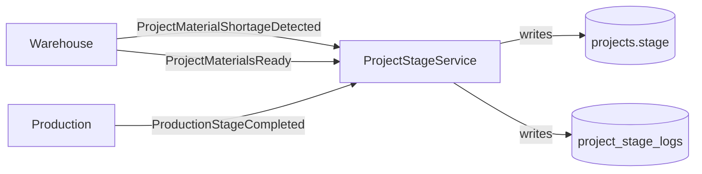
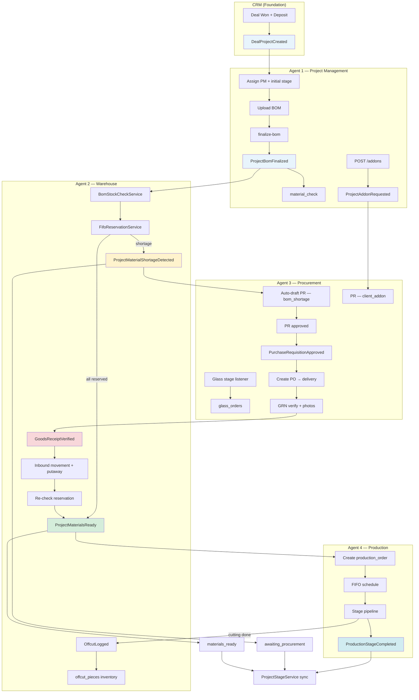

# Cross-Module Integration Contract

**Purpose:** Single source of truth for Agents 1–4 (Project Management, Warehouse, Procurement, Production) building in parallel.  
**Foundation (not parallel agent tracks):** [USER_ONBOARDING.MD](./USER_ONBOARDING.MD), [SALES_CRM.MD](./SALES_CRM.MD)  
**Master plan:** [four_module_integration_plan_a3882cfc.plan.md](../../.cursor/plans/four_module_integration_plan_a3882cfc.plan.md)  
**References:** [README.md](../README.md) §2, §8.2–8.5, §10 · [Raw_Plam.txt](./Raw_Plam.txt) §5–8 · [WAREHOUSE.MD](./WAREHOUSE.MD) §8, §17 · [SALES_CRM.MD](./SALES_CRM.MD) §14  
**Version:** 1.1 · 2026 (integration questions resolved)

---

## Table of Contents

1. [Purpose & Principles](#1-purpose--principles)
2. [Shared Enums](#2-shared-enums)
3. [Domain Events Catalog](#3-domain-events-catalog)
4. [FK Naming Conventions](#4-fk-naming-conventions)
5. [API Response Shape Conventions](#5-api-response-shape-conventions)
6. [Cross-Module Read Endpoints](#6-cross-module-read-endpoints)
7. [Agent Boundary Rules](#7-agent-boundary-rules)
8. [File Ownership Matrix](#8-file-ownership-matrix)
9. [Integration Smoke Test Checklist](#9-integration-smoke-test-checklist)
10. [End-to-End Event Flow](#10-end-to-end-event-flow)
11. [Resolved Decisions](#11-resolved-decisions)
12. [Developer Handoff](#12-developer-handoff)

---

## 1. Purpose & Principles

This document defines **stable contracts** — event names, enum values, foreign-key column names, API response shapes, and ownership boundaries — so four agents can implement PM, Warehouse, Procurement, and Production without merge conflicts or divergent integration logic.

### 1.1 Project-centric design

Every operational action ties to a **`project_id`**. CRM creates the project at deal handoff; all downstream modules read or react via events and read-only integration endpoints — never by duplicating project master data.

| Principle | Rule |
|-----------|------|
| **Project is the backbone** | BOM, reservations, requisitions, GRNs, production orders, and offcuts all reference `project_id` where applicable |
| **PM owns project stage** | Only `ProjectStageService` writes `projects.stage` and `project_stage_logs` |
| **Other modules emit events** | WH, PROC, PROD notify PM via domain events; listeners call `ProjectStageService` — they never `UPDATE projects SET stage = …` directly |
| **Glass is not warehouse stock** | Glass lines use `is_procurement_only = true` on BOM; tracked in `glass_orders`, not `stock_levels` |
| **FIFO reservation** | First project in queue gets stock reserved first ([WAREHOUSE.MD](./WAREHOUSE.MD) §8) |
| **Audit everything** | All cross-module side effects also log via Owen ([README.md](../README.md) §4.3) |

### 1.2 Stage ownership



**Golden rule:** `ProjectStageService` is the **sole writer** of `projects.stage`. Listeners in any module may call:

```php
// Allowed pattern — delegate to PM service
app(ProjectStageService::class)->advance($project, ProjectStage::MaterialsReady, $reason);
```

Direct Eloquent updates to `projects.stage` from WH, PROC, or PROD code are **forbidden**.

### 1.3 Existing CRM handoff (do not rename)

CRM already emits [`DealProjectCreated`](../../backend/app/Events/Crm/DealProjectCreated.php) from [`DealToProjectService`](../../backend/app/Services/Crm/Deals/DealToProjectService.php) when `POST /api/crm/deals/{id}/create-project` succeeds ([SALES_CRM.MD](./SALES_CRM.MD) §14). Agent 1 registers the PM listener; **do not rename this event**.

---

## 2. Shared Enums

All agents import these enums. **Extend existing enums; do not duplicate string literals** in migrations, services, or frontend types.

| Enum | Planned path | Used by |
|------|--------------|---------|
| `ProjectStage` | [`backend/app/Enums/ProjectStage.php`](../../backend/app/Enums/ProjectStage.php) | PM, WH, PROC, PROD |
| `StockMovementType` | `backend/app/Enums/Warehouse/StockMovementType.php` | WH, PROC |
| `RequisitionTrigger` | `backend/app/Enums/Procurement/RequisitionTrigger.php` | WH, PROC, PM |
| `ProductionStage` | `backend/app/Enums/Production/ProductionStage.php` | PROD, PM |

### 2.1 `ProjectStage` (exists — do not rename values)

Source: [`backend/app/Enums/ProjectStage.php`](../../backend/app/Enums/ProjectStage.php) · [README.md](../README.md) §8.2 (18 stages)

| # | Enum case | DB value | Typical trigger |
|---|-----------|----------|-----------------|
| 1 | `AwaitingDeposit` | `awaiting_deposit` | Project created; deposit not yet confirmed |
| 2 | `DepositReceived` | `deposit_received` | Deposit confirmed; design/BOM work begins |
| 3 | `SiteAssessment` | `site_assessment` | Engineers visit site |
| 4 | `FinalDesignApproval` | `final_design_approval` | Client approves drawings |
| 5 | `BomFinalized` | `bom_finalized` | PM finalizes BOM → emits `ProjectBomFinalized` |
| 6 | `MaterialCheck` | `material_check` | WH runs stock check |
| 7 | `MaterialsReserved` | `materials_reserved` | FIFO reservation complete — **all** stockable lines fully reserved (all-or-nothing) |
| 8 | `AwaitingProcurement` | `awaiting_procurement` | Shortage detected → PR draft |
| 9 | `MaterialsReady` | `materials_ready` | All stockable BOM lines satisfied |
| 10 | `CuttingStage` | `cutting_stage` | Production cutting in progress (~3 days) |
| 11 | `FabricationStage` | `fabrication_stage` | Frame/sash assembly |
| 12 | `GlassAssembly` | `glass_assembly` | Glass sourced & fitted (procurement, not WH stock) |
| 13 | `QcPreInstallation` | `qc_pre_installation` | QC sign-off before dispatch |
| 14 | `InTransit` | `in_transit` | Materials/units in transport |
| 15 | `Installation` | `installation` | On-site work |
| 16 | `SiteQc` | `site_qc` | Site inspection |
| 17 | `Snagging` | `snagging` | Defects being resolved |
| 18 | `ProjectComplete` | `project_complete` | Client sign-off; project closed |

### 2.2 `StockMovementType` (document only — Agent 2 implements)

Source: [WAREHOUSE.MD](./WAREHOUSE.MD) §7, §12

| Value | Meaning | Typical `reference_type` |
|-------|---------|--------------------------|
| `inbound` | Stock received into bin | `goods_receipt`, `purchase_order`, `offcut` |
| `outbound` | Stock issued to production/project | `production_order`, `project` |
| `transfer` | Bin-to-bin move | `stock_transfer` |
| `adjustment` | Stock-take variance | `stock_take` |

### 2.3 `RequisitionTrigger` (document only — Agent 3 implements)

Source: [README.md](../README.md) §8.4 · [Raw_Plam.txt](./Raw_Plam.txt) §7.1 · master plan

| Value | Meaning | Publisher |
|-------|---------|-----------|
| `bom_shortage` | BOM stock check found insufficient qty | WH → PROC listener on `ProjectMaterialShortageDetected` |
| `low_stock` | Item below `min_stock_qty` threshold | WH periodic check |
| `glass_order` | Project reached glass assembly phase | PM or PROD → PROC listener |
| `client_addon` | Non-manufactured client-requested item | PM → `ProjectAddonRequested` |
| `manual` | Procurement officer raises PR independently | PROC UI |

Stored on `purchase_requisition_lines.trigger_type` (and optionally header-level `trigger_type` on requisitions).

### 2.4 `ProductionStage` (document only — Agent 4 implements)

Source: [README.md](../README.md) §8.5 · [Raw_Plam.txt](./Raw_Plam.txt) §8.1

Aligned with the production pipeline; each completion emits `ProductionStageCompleted` and syncs the corresponding `ProjectStage` via `ProjectStageService`.

| Value | Label | Syncs to `ProjectStage` | Notes |
|-------|-------|-------------------------|-------|
| `material_prep` | Material Preparation | `materials_ready` (start) | WH partial release requested |
| `qc_pre_check` | QC Pre-Check (materials) | — | QC module (future); log only for now |
| `cutting` | Cutting | `cutting_stage` | Triggers offcut logging |
| `fabrication` | Fabrication | `fabrication_stage` | Frame assembly |
| `sash` | Sash Fabrication | `fabrication_stage` | Sub-stage; may not advance PM stage separately |
| `glass_assembly` | Glass Assembly | `glass_assembly` | Triggers glass procurement notification |
| `finishing` | Final Assembly & Finishing | `glass_assembly` or sub-log | Hardware, seals |
| `qc_post_fabrication` | QC Post-Fabrication | `qc_pre_installation` | Ready for dispatch |

**Order constraint:** stages run in the order above unless Operations Manager overrides schedule (FIFO reservation order is **not** overridable).

---

## 3. Domain Events Catalog

All events are Laravel classes under `backend/app/Events/{Module}/`. Listeners register in `AppServiceProvider` using **named methods** (e.g. `registerWarehouseListeners()`). Event class names below are **stable** — do not rename.

### 3.1 Summary table

| Event | Publisher | Primary listeners | PM stage effect |
|-------|-----------|-------------------|-----------------|
| `DealProjectCreated` | CRM | PM | Initial project setup |
| `ProjectBomFinalized` | PM | WH | → `material_check` |
| `ProjectMaterialShortageDetected` | WH | PM, PROC | → `awaiting_procurement` |
| `PurchaseRequisitionApproved` | PROC | PROC (internal) | — |
| `GoodsReceiptVerified` | PROC | WH | May reduce shortage |
| `ProjectMaterialsReady` | WH | PM, PROD | → `materials_ready` |
| `ProductionStageCompleted` | PROD | PM, PROC | Maps to stages 10–13 |
| `OffcutLogged` | PROD / WH | WH | — |
| `ProjectAddonRequested` | PM | PROC | — |

### 3.2 Event specifications

#### `DealProjectCreated`

| Field | Value |
|-------|-------|
| **Class** | [`App\Events\Crm\DealProjectCreated`](../../backend/app/Events/Crm/DealProjectCreated.php) (**exists — do not rename**) |
| **Publisher** | CRM — `DealToProjectService` after project row created |
| **Payload** | `Deal $deal`, `Project $project` |
| **Listeners** | **Agent 1 (PM):** assign default PM, set initial stage (`awaiting_deposit` or `deposit_received` per deposit status), notify operations |
| **Side effects** | Owen: `deal.project_created`; optional notification to `project_management` department |
| **Must NOT** | PM agent must not re-implement deal→project creation in parallel with CRM |

#### `ProjectBomFinalized`

| Field | Value |
|-------|-------|
| **Class** | `App\Events\Projects\ProjectBomFinalized` |
| **Publisher** | PM — `POST /api/projects/{id}/finalize-bom` |
| **Payload** | `int $projectId`, `int $bomId`, `int $version`, `int $finalizedByUserId`, `array $lineSummary` (optional: `{ warehouse_item_id, qty_required }[]`) |
| **Listeners** | **Agent 2 (WH):** queue `BomStockCheckService` → FIFO reservation |
| **Side effects** | PM: `ProjectStageService` → `material_check`; Owen: `project.bom_finalized` |
| **Must NOT** | WH must not finalize BOM or upload BOM files |

#### `ProjectMaterialShortageDetected`

| Field | Value |
|-------|-------|
| **Class** | `App\Events\Warehouse\ProjectMaterialShortageDetected` |
| **Publisher** | WH — `BomStockCheckService` / `FifoReservationService` |
| **Payload** | `int $projectId`, `int $reservationId` (nullable), `array $shortageLines` — each: `{ project_bom_line_id?, warehouse_item_id, qty_required, qty_available, qty_short }` |
| **Listeners** | **Agent 1 (PM):** `ProjectStageService` → `awaiting_procurement`; **Agent 3 (PROC):** auto-draft PR with `trigger_type = bom_shortage` |
| **Side effects** | Delay log on project (PM); notification to procurement; Owen: `warehouse.shortage_detected` |
| **Must NOT** | PROC must not run stock checks; PM must not create PR lines without this event or manual addon flow |

#### `PurchaseRequisitionApproved`

| Field | Value |
|-------|-------|
| **Class** | `App\Events\Procurement\PurchaseRequisitionApproved` |
| **Publisher** | PROC — requisition approval action |
| **Payload** | `int $purchaseRequisitionId`, `int $projectId` (nullable), `int $approvedByUserId`, `RequisitionTrigger $trigger` |
| **Listeners** | **Agent 3 (PROC):** unlock PO creation workflow (internal state machine) |
| **Side effects** | Status on PR → `approved`; Owen: `procurement.requisition_approved`; optional notify Operations Manager |
| **Must NOT** | WH must not approve requisitions; PM must not create POs |

#### `GoodsReceiptVerified`

| Field | Value |
|-------|-------|
| **Class** | `App\Events\Procurement\GoodsReceiptVerified` |
| **Publisher** | PROC — GRN qty + quality verification complete |
| **Payload** | `int $goodsReceiptId`, `int $purchaseOrderId`, `int $projectId` (nullable), `int $verifiedByUserId`, `array $acceptedLines` — each: `{ purchase_order_line_id, warehouse_item_id, qty_accepted, to_bin_id? }` |
| **Listeners** | **Agent 2 (WH):** `ReceiveStockController` → inbound `stock_movements`, update `stock_levels`, re-run shortage check for linked project |
| **Side effects** | Attach receipt/invoice images already stored on GRN; if project reservation fulfilled → may emit `ProjectMaterialsReady`; Owen: `procurement.grn_verified`, `stock.received` |
| **Must NOT** | WH must not verify GRN quality/qty; PROC must not write `stock_levels` directly |

#### `ProjectMaterialsReady`

| Field | Value |
|-------|-------|
| **Class** | `App\Events\Warehouse\ProjectMaterialsReady` |
| **Publisher** | WH — all stockable BOM lines reserved (offcuts may satisfy profile lines) |
| **Payload** | `int $projectId`, `int $reservationId`, `int $fifoSequence` |
| **Listeners** | **Agent 1 (PM):** `ProjectStageService` → `materials_ready`; **Agent 4 (PROD):** create `production_order` with `fifo_position` |
| **Side effects** | Notify production manager; Owen: `warehouse.materials_ready`, `production.order_created` |
| **Must NOT** | PROD must not mark materials ready; PM must not create production orders directly |

#### `ProductionStageCompleted`

| Field | Value |
|-------|-------|
| **Class** | `App\Events\Production\ProductionStageCompleted` |
| **Publisher** | PROD — `POST /api/production/orders/{id}/complete-stage` |
| **Payload** | `int $productionOrderId`, `int $projectId`, `ProductionStage $stage`, `int $completedByUserId`, `Carbon $completedAt` |
| **Listeners** | **Agent 1 (PM):** `ProjectStageService` sync (see §2.4 mapping); **Agent 3 (PROC):** if `$stage === glass_assembly` or prior stage `fabrication` complete → create/notify `glass_orders` |
| **Side effects** | `production_stage_logs` row; partial WH release for next stage; Owen: `production.stage_completed` |
| **Must NOT** | PM must not log production stages; WH must not complete production stages |

#### `OffcutLogged`

| Field | Value |
|-------|-------|
| **Class** | `App\Events\Production\OffcutLogged` (or `App\Events\Warehouse\OffcutLogged` if logged from WH UI) |
| **Publisher** | PROD (primary) or WH — cutting complete |
| **Payload** | `int $offcutPieceId`, `int $warehouseItemId`, `int $lengthMm`, `int $binId`, `int $sourceProjectId`, `int $loggedByUserId` |
| **Listeners** | **Agent 2 (WH):** ensure `offcut_pieces` + inbound movement on offcuts deck; update availability for future BOM checks |
| **Side effects** | Owen: `offcut.logged`; offcut searchable before new profile procurement |
| **Must NOT** | PROC must not log offcuts; PM must not write offcut inventory |

#### `ProjectAddonRequested`

| Field | Value |
|-------|-------|
| **Class** | `App\Events\Projects\ProjectAddonRequested` |
| **Publisher** | PM — `POST /api/projects/{id}/addons` |
| **Payload** | `int $projectId`, `int $addonRequestId`, `string $description`, `bool $clientRequested`, `int $requestedByUserId` |
| **Listeners** | **Agent 3 (PROC):** create `project_addon_requests` + PR line with `trigger_type = client_addon` |
| **Side effects** | Owen: `project.addon_requested`; notify procurement |
| **Must NOT** | Items Bibo manufactures must stay on BOM — addons are **non-manufactured** only |

### 3.3 Listener registration pattern

```php
// backend/app/Providers/AppServiceProvider.php — illustrative
protected function registerIntegrationListeners(): void
{
    Event::listen(DealProjectCreated::class, AssignProjectManager::class);
    Event::listen(ProjectBomFinalized::class, QueueBomStockCheck::class);
    Event::listen(ProjectMaterialShortageDetected::class, [AdvanceProjectToAwaitingProcurement::class, DraftPurchaseRequisition::class]);
    Event::listen(GoodsReceiptVerified::class, ReceiveGoodsIntoWarehouse::class);
    Event::listen(ProjectMaterialsReady::class, [AdvanceProjectToMaterialsReady::class, CreateProductionOrder::class]);
    Event::listen(ProductionStageCompleted::class, [SyncProjectStageFromProduction::class, NotifyGlassProcurement::class]);
    Event::listen(OffcutLogged::class, RegisterOffcutInventory::class);
    Event::listen(ProjectAddonRequested::class, CreateAddonRequisition::class);
}
```

Each listener lives under `backend/app/Listeners/{Module}/` — one subfolder per agent.

---

## 4. FK Naming Conventions

**Never invent alternate column names.** Cross-module joins depend on these exact names.

### 4.1 Core entity keys

| Column | References | Used on |
|--------|------------|---------|
| `project_id` | `projects.id` | BOM, reservations, requisitions, GRNs, production orders, offcuts, addons, delays |
| `deal_id` | `deals.id` | `projects` (CRM handoff) |
| `warehouse_item_id` | `warehouse_items.id` | BOM lines, movement lines, reservation lines, PO lines, requisition lines |
| `item_id` | `warehouse_items.id` | **Legacy alias** — prefer `warehouse_item_id` on new tables; do not mix both on same table |
| `purchase_requisition_id` | `purchase_requisitions.id` | PR lines, PO header (optional) |
| `purchase_order_id` | `purchase_orders.id` | PO lines, GRNs, transport orders |
| `goods_receipt_id` | `goods_receipts.id` | GRN lines, attachments |
| `production_order_id` | `production_orders.id` | Stage logs, material releases, cutting sheets |
| `stock_reservation_id` | `stock_reservations.id` | Reservation lines, material releases |
| `stock_movement_id` | `stock_movements.id` | Movement lines |
| `project_bom_line_id` | `project_bom_lines.id` | Requisition lines, cutting sheets |
| `bom_id` | `project_boms.id` | BOM lines |

### 4.2 Warehouse location keys

| Column | References |
|--------|------------|
| `warehouse_id` | `warehouses.id` |
| `deck_id` | `warehouse_decks.id` |
| `section_id` | `warehouse_sections.id` |
| `bin_id` / `from_bin_id` / `to_bin_id` | `warehouse_bins.id` |

### 4.3 User attribution keys

| Column | Usage |
|--------|-------|
| `created_by`, `updated_by` | All mutable entities |
| `performed_by` | Stock movements |
| `verified_by` | GRN verification |
| `finalized_by`, `reserved_by`, `logged_by` | Domain-specific |
| `*_user_id` | Assignments (PM, engineer, approver) |

### 4.4 Document / media storage

Match CRM and HR pattern ([SALES_CRM.MD](./SALES_CRM.MD), [USER_ONBOARDING.MD](./USER_ONBOARDING.MD)):

| Column | Purpose |
|--------|---------|
| `path` | Local or canonical storage path (required) |
| `firebase_url` | Optional public/signed URL |
| `file_path` | **Legacy CRM alias** — new modules use `path` consistently |

BOM uploads, design PDFs/DWG, GRN photos, and proof-of-payment attachments all follow `path` + optional `firebase_url`.

### 4.5 Polymorphic references

| Column pair | Values |
|-------------|--------|
| `reference_type`, `reference_id` | `goods_receipt`, `purchase_order`, `project`, `production_order`, `stock_take` on `stock_movements` |

---

## 5. API Response Shape Conventions

### 5.1 Paginated list responses

All module list endpoints return:

```json
{
  "data": [ /* array of resource objects */ ],
  "meta": {
    "current_page": 1,
    "last_page": 5,
    "per_page": 25,
    "total": 118,
    "from": 1,
    "to": 25
  }
}
```

| Rule | Detail |
|------|--------|
| **Wrapper keys** | Always `data` + `meta` — never bare arrays at root |
| **Pagination** | Laravel `paginate()` defaults; query params: `page`, `per_page` (max 100) |
| **Sorting** | `sort=created_at` + `direction=desc` where supported |
| **Filtering** | Module-specific query params documented in each module plan |

### 5.2 Single resource responses

```json
{
  "data": { /* resource object */ }
}
```

Create/update actions return `201` / `200` with `{ "data": … }`. Validation errors: `422` with Laravel standard `{ "message", "errors" }`.

### 5.3 Cross-module aggregate reads

Read models that combine data from multiple modules (e.g. material status) are **owned by PM** but may embed WH/PROC summaries — see §6. Consumer modules treat these as read-only.

### 5.4 Frontend API clients

| Agent | Client path |
|-------|-------------|
| 1 | `frontend/lib/api/projects.ts` |
| 2 | `frontend/lib/api/warehouse.ts` |
| 3 | `frontend/lib/api/procurement.ts` |
| 4 | `frontend/lib/api/production.ts` |

Use `withCredentials: true` per [USER_ONBOARDING.MD](./USER_ONBOARDING.MD) §18.

---

## 6. Cross-Module Read Endpoints

These endpoints support UI deep links and dashboards. **Write operations stay in the owning module.**

| Method | Path | Owner | Consumers | Purpose |
|--------|------|-------|-----------|---------|
| GET | `/api/projects` | PM (Agent 1) | All | Project list with stage filters |
| GET | `/api/projects/{id}` | PM | All | Project detail hub |
| GET | `/api/projects/{id}/material-status` | PM (aggregate) | PM UI, PROD schedule | WH reservation + PROC open PRs/POs + shortage summary |
| GET | `/api/projects/{id}/production-status` | PM or PROD | PM UI | Active production order + current `ProductionStage` |
| POST | `/api/projects/{id}/finalize-bom` | PM | — | Emits `ProjectBomFinalized` |
| POST | `/api/projects/{id}/addons` | PM | — | Emits `ProjectAddonRequested` |
| POST | `/api/warehouse/projects/{project}/stock-check` | WH (Agent 2) | PM | BOM vs stock levels (called by listener or PM refresh) |
| GET | `/api/warehouse/reservations?project_id=` | WH | PM, PROD | FIFO reservation header + lines |
| GET | `/api/warehouse/inventory/search` | WH | PM, PROC | Item lookup by SKU/name |
| GET | `/api/warehouse/offcuts?profile=&min_length=` | WH | PM, PROC | Usable offcuts before procurement |
| GET | `/api/procurement/requisitions?project_id=` | PROC (Agent 3) | PM | Open/approved PRs for project |
| GET | `/api/procurement/goods-receipts?project_id=` | PROC | WH, PM | Pending/verified GRNs |
| GET | `/api/procurement/glass-orders?project_id=` | PROC | PM, PROD | Project glass tracking |
| POST | `/api/procurement/goods-receipts/{id}/verify` | PROC | — | Emits `GoodsReceiptVerified` |
| GET | `/api/production/orders?project_id=` | PROD (Agent 4) | PM | Production orders for project |
| GET | `/api/production/schedule` | PROD | PM | FIFO-sorted calendar |
| GET | `/api/crm/deals/{id}` | CRM | PM | Deal context on project detail (read-only) |

**Deep-link conventions (frontend):**

| From | To |
|------|-----|
| Procurement GRN | `/warehouse/receive?grn={goods_receipt_id}` |
| Project material tab | `/projects/{id}?tab=materials` |
| Production schedule chip | `/production/orders/{production_order_id}` |

---

## 7. Agent Boundary Rules

### 7.1 What every agent MUST do

- Implement against this contract before module-specific UI
- Register listeners only in `AppServiceProvider` named methods
- Append permissions in `PermissionSeeder` — **no renames** of existing keys
- Add routes via `require` in `backend/routes/api.php` for their route file only
- Log side effects to Owen with `module`, `entity_type`, `entity_id`

### 7.2 What Agents 1–4 must NOT do

| Agent | Module | Must NOT |
|-------|--------|----------|
| **Agent 1** | Project Management | Implement warehouse stock mutations; create POs/GRNs; log production stages; rename `DealProjectCreated`; write `stock_levels` or `production_stage_logs` directly |
| **Agent 2** | Warehouse | Finalize BOM; approve requisitions or verify GRNs; create production orders; write `projects.stage` except via listening + calling `ProjectStageService`; store glass in `warehouse_items` |
| **Agent 3** | Procurement | Run FIFO reservation or BOM stock checks; receive stock into bins (inbound movements); complete production stages; write `projects.stage` directly |
| **Agent 4** | Production | Create projects; approve PRs; verify GRNs; write `projects.stage` except via `ProductionStageCompleted` listener chain through PM service; override WH `fifo_sequence` (only `operations_manager` via WH API — see §11 Q14) |

### 7.3 Shared files — coordination rules

| File | Rule |
|------|------|
| `backend/routes/api.php` | Each agent adds one `require` line only |
| `backend/database/seeders/PermissionSeeder.php` | Append new permissions at end of module section |
| `backend/app/Providers/AppServiceProvider.php` | Register listeners in agent-named methods; no unrelated edits |
| `backend/app/Events/` + `Listeners/` | One subfolder per agent (`Projects/`, `Warehouse/`, `Procurement/`, `Production/`) |
| CRM paths | **Out of scope** for Agents 1–4 — read only |

### 7.4 `ProjectStageService` API (Agent 1 owns)

Other agents **must not** duplicate this logic. Expected public methods:

| Method | Purpose |
|--------|---------|
| `advance(Project $project, ProjectStage $stage, ?string $reason, ?int $userId)` | Validated transition + `project_stage_logs` |
| `canAdvance(Project $project, ProjectStage $target): bool` | Guard for manual PM advance |
| `current(Project $project): ProjectStage` | Read current stage |

---

## 8. File Ownership Matrix

From master plan — **conflict-free parallel development.**

| Path prefix | Owner |
|-------------|-------|
| `backend/app/Services/Projects/` | Agent 1 |
| `backend/app/Http/Controllers/Projects/` | Agent 1 |
| `backend/app/Events/Projects/` | Agent 1 |
| `backend/app/Listeners/Projects/` | Agent 1 |
| `backend/app/Services/Warehouse/` | Agent 2 |
| `backend/app/Http/Controllers/Warehouse/` | Agent 2 |
| `backend/app/Events/Warehouse/` | Agent 2 |
| `backend/app/Listeners/Warehouse/` | Agent 2 |
| `backend/app/Enums/Warehouse/` | Agent 2 |
| `backend/app/Services/Procurement/` | Agent 3 |
| `backend/app/Http/Controllers/Procurement/` | Agent 3 |
| `backend/app/Events/Procurement/` | Agent 3 |
| `backend/app/Listeners/Procurement/` | Agent 3 |
| `backend/app/Enums/Procurement/` | Agent 3 |
| `backend/app/Services/Production/` | Agent 4 |
| `backend/app/Http/Controllers/Production/` | Agent 4 |
| `backend/app/Events/Production/` | Agent 4 |
| `backend/app/Listeners/Production/` | Agent 4 |
| `backend/app/Enums/Production/` | Agent 4 |
| `frontend/lib/api/projects.ts` | Agent 1 |
| `frontend/lib/api/warehouse.ts` | Agent 2 |
| `frontend/lib/api/procurement.ts` | Agent 3 |
| `frontend/lib/api/production.ts` | Agent 4 |
| `frontend/app/(dashboard)/projects/` | Agent 1 |
| `frontend/app/(dashboard)/warehouse/` | Agent 2 |
| `frontend/app/(dashboard)/procurement/` | Agent 3 |
| `frontend/app/(dashboard)/production/` | Agent 4 |

**Foundation (pre-existing — do not move without team agreement):**

| Path | Owner |
|------|-------|
| `backend/app/Events/Crm/DealProjectCreated.php` | CRM (exists) |
| `backend/app/Services/Crm/` | CRM |
| Auth, HR, Admin controllers/services | Onboarding track |

---

## 9. Integration Smoke Test Checklist

Run after all four agents wire listeners. Definition of done from master plan.

| # | Step | Verification |
|---|------|--------------|
| 1 | CRM deal won → project created | `DealProjectCreated` fired; project row exists; deal `project_id` set; PM notified |
| 2 | PM uploads BOM + finalizes | `ProjectBomFinalized` → WH stock check runs; project stage → `material_check` |
| 3 | Shortage → PR → PO → GRN → stock in bin | `ProjectMaterialShortageDetected` → PR auto-draft → approve → PO → GRN with photos → `GoodsReceiptVerified` → inbound movement; qty in bin |
| 4 | Materials ready → production scheduled | `ProjectMaterialsReady` → project stage `materials_ready`; production order created with FIFO position |
| 5 | Cutting complete → offcut logged | `ProductionStageCompleted(cutting)` → `OffcutLogged` → offcut in offcuts deck; PM stage → `cutting_stage` |
| 6 | Glass stage → procurement notified | Project or production reaches glass phase → `glass_orders` row or notification; `trigger_type = glass_order` |
| 7 | PM logs client addon | `ProjectAddonRequested` → PR line with `trigger_type = client_addon` |
| 8 | Project detail shows full trail | `/projects/{id}` tabs: Overview, BOM, Documents, Material Status, Production — no blind module switching |

**Suggested test command sequence:**

```powershell
cd backend
php artisan test --filter=CrmSalesFlowTest
# Add: IntegrationSmokeTest (future) covering steps 1–8
```

---

## 10. End-to-End Event Flow

Full target-state flow: CRM → PM → WH → PROC → PROD.



### 10.1 Happy-path sequence (narrative)

1. **CRM:** Deal won → `DealProjectCreated` → PM assigns team.  
2. **PM:** Design approved → BOM uploaded → `ProjectBomFinalized` → stage `material_check`.  
3. **WH:** Stock check + FIFO → if shortage `ProjectMaterialShortageDetected` → PM `awaiting_procurement`; else `ProjectMaterialsReady`.  
4. **PROC:** Shortage PR approved → PO → supplier delivers → GRN verified → `GoodsReceiptVerified`.  
5. **WH:** Inbound to bin → re-check → `ProjectMaterialsReady`.  
6. **PROD:** Production order scheduled → stages complete → `ProductionStageCompleted` → PM stage sync.  
7. **WH/PROD:** Cutting done → `OffcutLogged`.  
8. **PROC:** Glass phase → glass order (not warehouse stock).  
9. **PM:** Client addon → `ProjectAddonRequested` → PROC PR.

---

## 11. Resolved Decisions

**Resolved:** 2026-05-26 · Locked for independent backend development. Module plans reference this table as authoritative.

| # | Topic | **Decision** | Implementation notes |
|---|-------|--------------|----------------------|
| 1 | **Initial project stage after CRM handoff** | **`deposit_received` if deal deposit satisfied; else `awaiting_deposit`** | PM listener on `DealProjectCreated` sets stage from deal payment totals. `DealToProjectService` may create at `awaiting_deposit`; listener or service advances to `deposit_received` when deposit criteria met. |
| 2 | **`item_id` vs `warehouse_item_id`** | **`warehouse_item_id` only** in all new tables and events | No `item_id` column alias in schema. Code may use local variable `$itemId` but FK columns are `warehouse_item_id`. |
| 3 | **`sash` vs `fabrication_stage`** | **PROD tracks `sash` internally; PM stays on `fabrication_stage` until `glass_assembly`** | Log `sash` in `production_stage_logs` only; no separate PM enum value. |
| 4 | **Glass order trigger** | **Single trigger: `ProductionStageCompleted(fabrication)`** | PROC creates `glass_orders` on this event only. PM advance to `glass_assembly` does **not** create glass orders. |
| 5 | **Partial reservation** | **All-or-nothing — no `materials_reserved` until every stockable line is fully reserved** | Any shortage → `awaiting_procurement` directly from `material_check`. No partial reservation state. `materials_ready` when all stockable lines satisfied after receipt/re-reserve. |
| 6 | **QC gates (Phase 1)** | **PROD logs stages only; QC module adds inspection gates later** | No blocking on QC records in Phase 1 backend. |
| 7 | **`PurchaseRequisitionApproved` → PM** | **Both: notification listener + read-model poll** | PM listener sends alert; `GET /projects/{id}/material-status` polls open PRs for dashboard. |
| 8 | **`projects.account_id`** | **Required FK** — every project must have `account_id` | Matches `DealToProjectService` validation; create-project fails without account. |
| 9 | **Low-stock auto-requisition** | **Defer Phase 2 — manual PR only for now** | WH may notify; no auto-draft PR for non-project low stock in Phase 1. |
| 10 | **Nairobi vs outside install** | **`project_type` + `location_type` skip stages 14–16 for Nairobi fabrication-only** | Stages `in_transit`, `installation`, `site_qc` skipped when type/location indicates fabrication-only. |
| 11 | **Event payload shape** | **Scalar IDs only** on all new domain events | e.g. `projectId`, `userId`, `goodsReceiptId` — listeners load models fresh. `DealProjectCreated` unchanged (existing). |
| 12 | **Finance on project complete** | **Out of scope Phase 1** | `ProjectCompleted` → Finance event deferred to Finance module phase. |
| 13 | **`GET /projects/{id}/material-status` permission** | **New permission: `projects.material_status.view`** | Grant to PM, operations, production, warehouse, procurement roles per [PROJECT_MANAGEMENT.MD](./PROJECT_MANAGEMENT.MD) §12. |
| 14 | **FIFO override** | **Production schedule reorder allowed; `operations_manager` may override WH `fifo_sequence` with audit log** | Production manager reorders calendar only. Changing reservation queue requires `operations_manager` + `FifoReservationOverrideService` + Owen audit entry. PROD cannot override reservations. |

### 11.1 Event payload standard (Q11)

All **new** events (not `DealProjectCreated`) use constructor scalar IDs:

```php
// Example — ProjectBomFinalized
public function __construct(
    public int $projectId,
    public int $bomId,
    public int $finalizedByUserId,
) {}
```

### 11.2 PM listener on `PurchaseRequisitionApproved` (Q7)

Agent 1 registers `NotifyProjectManagerOnRequisitionApproved` — in-app/email notification. Dashboard data still loaded via `ProjectMaterialStatusService` poll.

---

## 12. Developer Handoff

Independent backend developers (not AI agents) should read this contract **before** coding. Frontend integration is out of scope per developer — coordinator integrates later.

| Developer | Module plan | Migration files | Owned backend paths |
|-----------|-------------|-----------------|---------------------|
| Dev 1 | [PROJECT_MANAGEMENT.MD](./PROJECT_MANAGEMENT.MD) | `300000`, `300001` | `Services/Projects/`, `Http/Controllers/Projects/` |
| Dev 2 | [WAREHOUSE.MD](./WAREHOUSE.MD), [WAREHOUSE_MIGRATION_SPEC.MD](./WAREHOUSE_MIGRATION_SPEC.MD) | `400000` (refactor) | `Services/Warehouse/`, `Http/Controllers/Warehouse/` |
| Dev 3 | [PROCUREMENT.MD](./PROCUREMENT.MD) | `500000`, `500001` | `Services/Procurement/`, `Http/Controllers/Procurement/` |
| Dev 4 | [PRODUCTION.MD](./PRODUCTION.MD) | `600000`, `600001` | `Services/Production/`, `Http/Controllers/Production/` |

**Also read:** [USER_ONBOARDING.MD](./USER_ONBOARDING.MD) (auth/permissions), [SALES_CRM.MD](./SALES_CRM.MD) §14 (handoff).

**Tests:** `cd backend; php artisan test --filter=YourModuleTest` · **No frontend changes.**

**Migration order:** CRM → Projects → Warehouse → Procurement → Production → Auth/HR.

---

## Appendix A — Related module plans

| Document | Agent | Status |
|----------|-------|--------|
| [docs/PROJECT_MANAGEMENT.MD](./PROJECT_MANAGEMENT.MD) | 1 | Exists |
| [docs/WAREHOUSE.MD](./WAREHOUSE.MD) | 2 | Exists |
| [docs/PROCUREMENT.MD](./PROCUREMENT.MD) | 3 | Exists |
| [docs/PRODUCTION.MD](./PRODUCTION.MD) | 4 | Exists |
| [docs/SALES_CRM.MD](./SALES_CRM.MD) | Foundation | Exists |
| [docs/USER_ONBOARDING.MD](./USER_ONBOARDING.MD) | Foundation | Exists |

---

## Appendix B — Enum file locations (target)

```
backend/app/Enums/
├── ProjectStage.php              # exists
├── Warehouse/
│   └── StockMovementType.php     # Agent 2
├── Procurement/
│   └── RequisitionTrigger.php    # Agent 3
└── Production/
    └── ProductionStage.php       # Agent 4
```

---

*End of Cross-Module Integration Contract v1.1*
