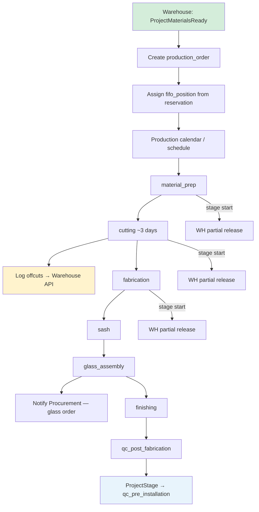
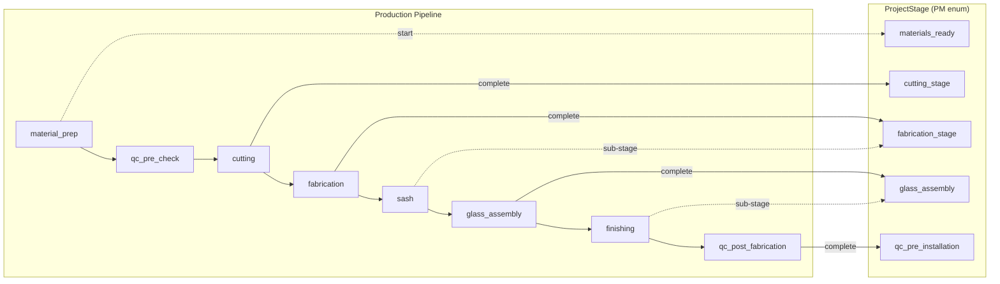
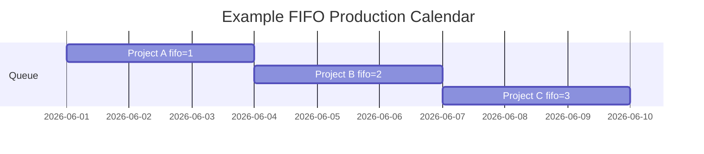
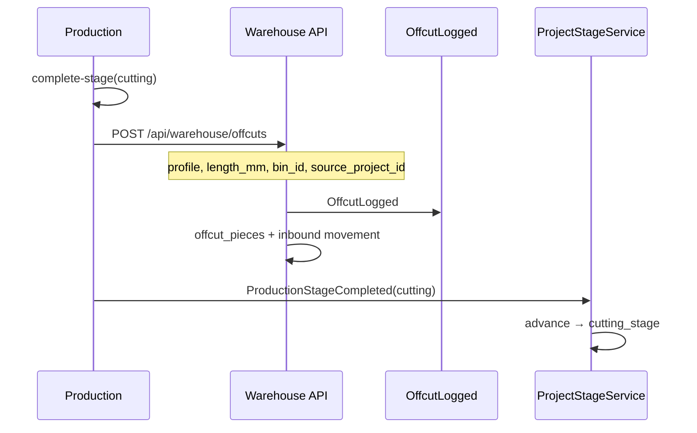
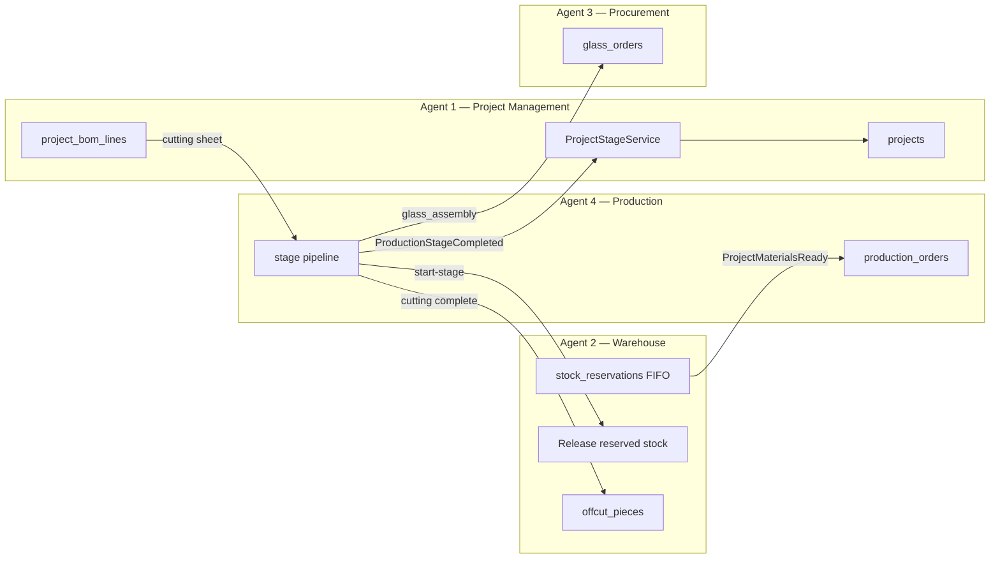

# Production — Implementation Plan

**Module:** Production · Manufacturing Pipeline · FIFO Scheduling · Offcuts · Installation  
**Stack:** PHP 8.2+ · Laravel 11 · PostgreSQL/MySQL · Next.js SPA  
**References:** [README.md](../README.md) §8.5 (Production), §8.2 (Project stages 10–12), §10 (Integrations), [Raw_Plam.txt](./Raw_Plam.txt) §8, [USER_ONBOARDING.MD](./USER_ONBOARDING.MD), [INTEGRATION_CONTRACT.MD](./INTEGRATION_CONTRACT.MD), [WAREHOUSE.MD](./WAREHOUSE.MD) §8.3, §9  
**Version:** 1.0 · 2026

---

## Table of Contents

1. [Goals — Manufacturing Pipeline](#1-goals--manufacturing-pipeline)
2. [Connecting Users to Production by Department](#2-connecting-users-to-production-by-department)
3. [Production Pipeline Stages & Project Stage Mapping](#3-production-pipeline-stages--project-stage-mapping)
4. [Repository & Folder Structure](#4-repository--folder-structure)
5. [FIFO Scheduling](#5-fifo-scheduling)
6. [Database Schema](#6-database-schema)
7. [Material Preparation — Cutting Sheet from BOM](#7-material-preparation--cutting-sheet-from-bom)
8. [Offcut Workflow](#8-offcut-workflow)
9. [Stage-Based Warehouse Release](#9-stage-based-warehouse-release)
10. [Installation Sub-Flow — Nairobi vs Outside Nairobi](#10-installation-sub-flow--nairobi-vs-outside-nairobi)
11. [Domain Events — Publish & Listen](#11-domain-events--publish--listen)
12. [Project Stage Sync — ProjectStageService Only](#12-project-stage-sync--projectstageservice-only)
13. [Glass Assembly — Procurement Coordination (Agent 3)](#13-glass-assembly--procurement-coordination-agent-3)
14. [API Endpoints](#14-api-endpoints)
15. [Permissions & Role Scoping](#15-permissions--role-scoping)
16. [Frontend Routes](#16-frontend-routes)
17. [Cross-Module Integration (Agents 1, 2, 3)](#17-cross-module-integration-agents-1-2-3)
18. [Audit Logging](#18-audit-logging)
19. [Implementation Phases](#19-implementation-phases)
20. [Open Questions](#20-open-questions)

---

## 1. Goals — Manufacturing Pipeline

### Business goals (README §8.5 · Raw_Plam.txt §8.1)

Production covers the full **manufacturing pipeline** from material preparation through assembly and pre-dispatch QC. Every production action ties to a **`project_id`** and a **`production_order_id`**.

| Goal | Description |
|------|-------------|
| **Order creation gate** | Production order created **only** after Warehouse emits `ProjectMaterialsReady` — never before |
| **FIFO scheduling** | Queue order determined by `fifo_position` copied from warehouse reservation sequence |
| **Stage pipeline** | `material_prep` → `cutting` (~3 days) → `fabrication` → `sash` → `glass_assembly` → `finishing` → `qc_post_fabrication` |
| **Project sync** | Each stage completion advances `ProjectStage` via `ProjectStageService` only — never direct `projects.stage` writes |
| **Offcuts** | Logged **immediately** when cutting completes — before next stage starts |
| **Partial WH release** | Materials released from reserved stock at **stage start**, not all at once ([WAREHOUSE.MD](./WAREHOUSE.MD) §8.3) |
| **Glass coordination** | At `glass_assembly`, notify Procurement (Agent 3) — glass is project-specific, not warehouse stock |
| **Installation handoff** | Checklists and team assignment for outside-Nairobi full-install projects; Nairobi = fabrication-only |

### End-to-end production flow



### Critical business rules

| Rule | Enforcement |
|------|-------------|
| Production order **only** after `ProjectMaterialsReady` | `CreateProductionOrder` listener; reject manual create if project stage ≠ `materials_ready` |
| **FIFO queue priority** | `production_orders.fifo_position` set from `stock_reservations.fifo_sequence`; default sort ASC |
| **Offcuts logged immediately after cutting** | `complete-stage(cutting)` must call WH offcut API before stage marked complete |
| **Stage completion via `ProjectStageService` only** | `ProductionStageCompleted` listener calls PM service — PROD never `UPDATE projects SET stage` |
| **Schedule reorder allowed; FIFO reservations locked for PROD** | Production Manager may change `scheduled_start` / calendar slot order. **Cannot** change `fifo_position` or WH `fifo_sequence`. **`operations_manager`** may override reservation queue via WH `FifoReservationOverrideService` + audit log ([INTEGRATION_CONTRACT.MD](./INTEGRATION_CONTRACT.MD) §11 Q14) |

---

## 2. Connecting Users to Production by Department

From [USER_ONBOARDING.MD](./USER_ONBOARDING.MD) §2 and seed data:

| Department slug | Default module | Landing route |
|-----------------|----------------|---------------|
| `production` | `production` | `/production/schedule` |

### Roles & team assignment

| Role slug | Scope |
|-----------|--------|
| `production_manager` | Full pipeline: schedule, team assignment, stage completion, cutting sheets |
| `super_admin` / `operations_manager` | All production operations + override visibility |
| `qc_inspector` | Read production status; QC stages (future QC module owns inspection gates) |
| `project_manager` | Read-only production status on project detail tab |

### Production team roles (per stage)

Assigned via `production_order_teams` — a user may hold multiple stage assignments on one order.

| Team role | Typical stage(s) | Notes |
|-----------|------------------|-------|
| `cutting_lead` | `material_prep`, `cutting` | Generates/approves cutting sheet |
| `fabrication_lead` | `fabrication`, `sash` | Frame and sash assembly |
| `assembly_lead` | `glass_assembly`, `finishing` | Glass fit, hardware, seals |
| `qc_liaison` | `qc_pre_check`, `qc_post_fabrication` | Coordinates with QC module (phase 1: log only) |
| `installation_lead` | Installation sub-flow | Outside-Nairobi projects only |

Department users in **Production** land on `/production/schedule`. Team members without manager role receive stage-scoped views (cutting queue, assembly queue) based on `production_order_teams.stage`.

---

## 3. Production Pipeline Stages & Project Stage Mapping

### 3.1 `ProductionStage` enum

**Path:** `backend/app/Enums/Production/ProductionStage.php`  
**Source of truth:** [INTEGRATION_CONTRACT.MD](./INTEGRATION_CONTRACT.MD) §2.4 — do not duplicate string literals elsewhere.

| Order | Enum case | DB value | Label |
|-------|-----------|----------|-------|
| 1 | `MaterialPrep` | `material_prep` | Material Preparation |
| 2 | `QcPreCheck` | `qc_pre_check` | QC Pre-Check (materials) |
| 3 | `Cutting` | `cutting` | Cutting |
| 4 | `Fabrication` | `fabrication` | Fabrication |
| 5 | `Sash` | `sash` | Sash Fabrication |
| 6 | `GlassAssembly` | `glass_assembly` | Glass Assembly |
| 7 | `Finishing` | `finishing` | Final Assembly & Finishing |
| 8 | `QcPostFabrication` | `qc_post_fabrication` | QC Post-Fabrication |

**Order constraint:** stages run in the order above unless Operations Manager overrides **schedule dates** (FIFO reservation order is **not** overridable).

### 3.2 Production stage ↔ `ProjectStage` mapping table

Maps each `ProductionStage` completion to the corresponding [`ProjectStage`](../backend/app/Enums/ProjectStage.php) value (README §8.2 stages 10–13).

| # | `ProductionStage` | On complete → `ProjectStage` | README stage # | Notes |
|---|-------------------|------------------------------|----------------|-------|
| — | `material_prep` | `materials_ready` | 9 | **Start** of production; PM already at `materials_ready` from WH event — log only unless PM not yet synced |
| — | `qc_pre_check` | — | — | QC module (future); PROD logs stage only; no PM advance in phase 1 |
| 1 | `cutting` | `cutting_stage` | 10 | ~3 days typical; triggers offcut logging |
| 2 | `fabrication` | `fabrication_stage` | 11 | Frame assembly |
| 3 | `sash` | `fabrication_stage` | 11 | Sub-stage; **does not** advance PM separately |
| 4 | `glass_assembly` | `glass_assembly` | 12 | Triggers glass procurement notification |
| 5 | `finishing` | `glass_assembly` | 12 | Sub-stage; hardware, seals — PM stays until `qc_post_fabrication` |
| 6 | `qc_post_fabrication` | `qc_pre_installation` | 13 | Ready for dispatch / pre-installation QC |

### 3.3 Pipeline diagram (manufacturing focus)



Stages **14–18** (`in_transit`, `installation`, `site_qc`, `snagging`, `project_complete`) are owned by **Project Management** (Agent 1) after production handoff — see §10 Installation sub-flow.

---

## 4. Repository & Folder Structure

Same convention as CRM and Warehouse ([SALES_CRM.MD §3](./SALES_CRM.MD), [WAREHOUSE.MD §4](./WAREHOUSE.MD#4-repository--folder-structure)):

```
backend/app/
├── Enums/Production/
│   ├── ProductionStage.php
│   ├── ProductionOrderStatus.php   # scheduled, in_progress, completed, on_hold
│   └── TeamRole.php                # cutting_lead, fabrication_lead, ...
├── Events/Production/
│   ├── ProductionStageCompleted.php
│   └── OffcutLogged.php
├── Listeners/Production/
│   ├── CreateProductionOrder.php          # listens: ProjectMaterialsReady
│   ├── RequestStageMaterialRelease.php    # on stage start
│   └── LogOffcutsAfterCutting.php         # on cutting complete
├── Http/Controllers/Production/
│   ├── ProductionOrderController.php
│   ├── ProductionScheduleController.php
│   ├── StartProductionStageController.php
│   ├── CompleteProductionStageController.php
│   ├── CuttingSheetController.php
│   ├── ProductionTeamController.php
│   └── InstallationChecklistController.php
├── Http/Requests/Production/
│   ├── StoreProductionOrderRequest.php
│   ├── StartStageRequest.php
│   ├── CompleteStageRequest.php
│   ├── StoreCuttingSheetRequest.php
│   └── UpdateScheduleRequest.php
├── Http/Resources/Production/
│   ├── ProductionOrderResource.php
│   ├── ProductionStageLogResource.php
│   ├── CuttingSheetResource.php
│   ├── ScheduleCalendarResource.php
│   └── InstallationChecklistResource.php
├── Models/Production/
│   ├── ProductionOrder.php
│   ├── ProductionStageLog.php
│   ├── ProductionOrderTeam.php
│   ├── ProductionMaterialRelease.php
│   ├── CuttingSheet.php
│   └── InstallationChecklist.php
├── Services/Production/
│   ├── ProductionOrderService.php
│   ├── ProductionScheduleService.php      # FIFO sort + calendar reorder rules
│   ├── ProductionStageService.php         # stage start/complete orchestration
│   ├── CuttingSheetGeneratorService.php   # BOM → cutting lines
│   ├── MaterialReleaseRequestService.php  # calls WH release API
│   └── InstallationChecklistService.php
├── Policies/Production/
│   ├── ProductionOrderPolicy.php
│   └── ProductionSchedulePolicy.php
└── routes/api/production/
    ├── orders.php
    ├── schedule.php
    ├── cutting.php
    └── installation.php
```

**Agent 4 owns** all paths under `Services/Production/`, `Http/Controllers/Production/`, `Events/Production/`, `Listeners/Production/`, and `Enums/Production/`.

---

## 5. FIFO Scheduling

### 5.1 Queue mechanics

When Warehouse emits `ProjectMaterialsReady`:

1. Listener creates `production_orders` row for `project_id`.
2. Copies `fifo_sequence` from `stock_reservations` → `production_orders.fifo_position`.
3. Sets `status = scheduled`, `current_stage = material_prep`.
4. Notifies Production Manager; client notification optional (Raw_Plam.txt §8.1 step 2).

| Column | Purpose |
|--------|---------|
| `fifo_position` | **Immutable** queue priority from WH — lower number = earlier in queue |
| `scheduled_start` / `scheduled_end` | Calendar dates — **may** be reordered by Production Manager |
| `actual_start` / `actual_end` | Set when first stage starts / order completes |

### 5.2 Schedule reorder rules

| Action | Allowed | Notes |
|--------|---------|-------|
| Change calendar slot / `scheduled_start` | ✓ Production Manager | Visual calendar drag-and-drop |
| Change `fifo_position` | ✗ | Read-only from WH reservation |
| Override WH reservation sequence | ✗ | Enforced in `ProductionScheduleService` |
| Start production before `materials_ready` | ✗ | Gate on project stage + event |

### 5.3 Calendar view

`GET /api/production/schedule` returns FIFO-sorted orders with:

- Project name, client, current `ProductionStage`
- `fifo_position`, scheduled vs actual dates
- Team assignments per stage
- Material readiness chip (from PM `/material-status` aggregate)



---

## 6. Database Schema

### 6.1 Base migration (exists)

Source: [`backend/database/migrations/2025_05_19_600000_create_production_tables.php`](../backend/database/migrations/2025_05_19_600000_create_production_tables.php)

```sql
CREATE TABLE production_orders (
    id                  BIGSERIAL PRIMARY KEY,
    reference           VARCHAR(30) NOT NULL UNIQUE,
    project_id          BIGINT NOT NULL REFERENCES projects(id) ON DELETE CASCADE,
    status              VARCHAR(32) NOT NULL DEFAULT 'scheduled',
    current_stage       VARCHAR(64) NOT NULL DEFAULT 'material_prep',
    fifo_position       INT NOT NULL DEFAULT 0,
    scheduled_start     DATE NULL,
    scheduled_end       DATE NULL,
    actual_start        DATE NULL,
    actual_end          DATE NULL,
    assigned_team_lead  BIGINT NULL REFERENCES users(id) ON DELETE SET NULL,
    created_at          TIMESTAMP NOT NULL,
    updated_at          TIMESTAMP NOT NULL
);

CREATE TABLE production_stage_logs (
    id                  BIGSERIAL PRIMARY KEY,
    production_order_id BIGINT NOT NULL REFERENCES production_orders(id) ON DELETE CASCADE,
    stage               VARCHAR(64) NOT NULL,
    status              VARCHAR(32) NOT NULL DEFAULT 'started',
    completed_by        BIGINT NULL REFERENCES users(id) ON DELETE SET NULL,
    started_at          TIMESTAMP NULL,
    completed_at        TIMESTAMP NULL,
    notes               TEXT NULL,
    created_at          TIMESTAMP NOT NULL,
    updated_at          TIMESTAMP NOT NULL
);

CREATE INDEX idx_production_orders_fifo ON production_orders (fifo_position, status);
CREATE INDEX idx_production_orders_project ON production_orders (project_id);
CREATE INDEX idx_production_stage_logs_order ON production_stage_logs (production_order_id, stage);
```

### 6.2 Expansion migration (sibling)

**File:** `backend/database/migrations/2025_05_19_600001_expand_production_tables.php`

```sql
CREATE TABLE production_order_teams (
    id                  BIGSERIAL PRIMARY KEY,
    production_order_id BIGINT NOT NULL REFERENCES production_orders(id) ON DELETE CASCADE,
    user_id             BIGINT NOT NULL REFERENCES users(id) ON DELETE CASCADE,
    stage               VARCHAR(64) NOT NULL,   -- ProductionStage value
    role                VARCHAR(50) NOT NULL,   -- cutting_lead, fabrication_lead, ...
    assigned_at         TIMESTAMP NOT NULL,
    assigned_by         BIGINT NOT NULL REFERENCES users(id),
    notes               TEXT NULL,
    created_at          TIMESTAMP NOT NULL,
    updated_at          TIMESTAMP NOT NULL,
    UNIQUE (production_order_id, user_id, stage)
);

CREATE TABLE production_material_releases (
    id                      BIGSERIAL PRIMARY KEY,
    production_order_id     BIGINT NOT NULL REFERENCES production_orders(id) ON DELETE CASCADE,
    stock_reservation_line_id BIGINT NOT NULL,  -- FK stock_reservation_lines.id (WH module)
    stage                   VARCHAR(64) NOT NULL,
    qty_released            DECIMAL(15,3) NOT NULL,
    released_at             TIMESTAMP NOT NULL,
    released_by             BIGINT NOT NULL REFERENCES users(id),
    stock_movement_id       BIGINT NULL,        -- FK stock_movements.id when WH confirms
    notes                   TEXT NULL,
    created_at              TIMESTAMP NOT NULL
);

CREATE TABLE cutting_sheets (
    id                  BIGSERIAL PRIMARY KEY,
    production_order_id BIGINT NOT NULL REFERENCES production_orders(id) ON DELETE CASCADE,
    project_bom_line_id BIGINT NOT NULL,        -- FK project_bom_lines.id (PM module)
    warehouse_item_id   BIGINT NOT NULL,        -- FK warehouse_items.id
    profile_code        VARCHAR(50) NOT NULL,
    cut_length_mm       INT NOT NULL,
    pieces              INT NOT NULL DEFAULT 1,
    bar_length_mm       INT NULL,
    waste_mm            INT NULL,
    sort_order          INT NOT NULL DEFAULT 0,
    generated_at        TIMESTAMP NOT NULL,
    generated_by        BIGINT NOT NULL REFERENCES users(id),
    created_at          TIMESTAMP NOT NULL,
    updated_at          TIMESTAMP NOT NULL
);

CREATE TABLE installation_checklists (
    id                  BIGSERIAL PRIMARY KEY,
    project_id          BIGINT NOT NULL REFERENCES projects(id) ON DELETE CASCADE,
    production_order_id BIGINT NULL REFERENCES production_orders(id) ON DELETE SET NULL,
    items               JSONB NOT NULL DEFAULT '[]',
    status              VARCHAR(32) NOT NULL DEFAULT 'draft',
    location_type       VARCHAR(30) NOT NULL,   -- nairobi_fabrication_only | outside_full_install
    team_lead_id        BIGINT NULL REFERENCES users(id),
    scheduled_date      DATE NULL,
    completed_at        TIMESTAMP NULL,
    completed_by        BIGINT NULL REFERENCES users(id),
    notes               TEXT NULL,
    created_at          TIMESTAMP NOT NULL,
    updated_at          TIMESTAMP NOT NULL
);

CREATE INDEX idx_cutting_sheets_order ON cutting_sheets (production_order_id);
CREATE INDEX idx_material_releases_order ON production_material_releases (production_order_id, stage);
CREATE INDEX idx_installation_checklists_project ON installation_checklists (project_id);
```

---

## 7. Material Preparation — Cutting Sheet from BOM

### 7.1 Generation flow

1. Production order exists (`ProjectMaterialsReady` received).
2. `CuttingSheetGeneratorService` reads active `project_bom_lines` where `line_type = aluminium_profile`.
3. For each line: expand `measurement_mm` × `quantity` into individual cut rows.
4. Persist to `cutting_sheets`; expose via `GET /api/production/orders/{id}/cutting-sheet`.

| BOM field | Cutting sheet field |
|-----------|---------------------|
| `project_bom_line_id` | `project_bom_line_id` |
| `warehouse_item_id` | `warehouse_item_id` |
| `material_code` | `profile_code` |
| `measurement_mm` | `cut_length_mm` |
| `quantity` | `pieces` (or expanded rows) |

### 7.2 Cutting team workflow

| Step | Action |
|------|--------|
| 1 | Production Manager assigns cutting team (`production_order_teams`) |
| 2 | Cutting lead reviews/edits cutting sheet (optional manual adjustments) |
| 3 | `start-stage(material_prep)` → request WH release for profile lines |
| 4 | `start-stage(cutting)` → cutting in progress (~3 days typical) |
| 5 | `complete-stage(cutting)` → offcuts logged (§8) → PM → `cutting_stage` |

---

## 8. Offcut Workflow

Aligns with [WAREHOUSE.MD §9](./WAREHOUSE.MD#9-offcuts-warehouse).

### Sequence (mandatory on cutting complete)



| Step | Owner | Detail |
|------|-------|--------|
| 1 | PROD | Operator enters offcut: profile code, `length_mm`, offcuts deck bin |
| 2 | PROD → WH | `POST /api/warehouse/offcuts` with `source_project_id` |
| 3 | WH | Creates `offcut_pieces` + inbound movement on offcuts deck |
| 4 | PROD/WH | Emits `OffcutLogged` |
| 5 | PROD | Emits `ProductionStageCompleted(cutting)` only after offcuts submitted |

**Rule:** Offcuts recorded **immediately after cutting** — do not defer to fabrication stage.

---

## 9. Stage-Based Warehouse Release

From [WAREHOUSE.MD §8.3](./WAREHOUSE.MD#83-stage-based-release) and README §8.2:

Materials reserved in FIFO at BOM finalize are **released partially** as each production stage starts — not issued in full at order creation.

| Production stage start | WH release scope |
|------------------------|------------------|
| `material_prep` / `cutting` | Aluminium profile reservation lines |
| `fabrication` / `sash` | Accessories from door-type bins per BOM |
| `glass_assembly` / `finishing` | Rubbers/gaskets; remaining accessories |

### Release flow

1. `POST /api/production/orders/{id}/start-stage` with `{ "stage": "cutting" }`.
2. `MaterialReleaseRequestService` identifies reservation lines for stage ([WAREHOUSE.MD](./WAREHOUSE.MD) rules).
3. Calls WH `POST /api/warehouse/reservations/{id}/release` (Agent 2 owns endpoint).
4. Records `production_material_releases` row per line released.
5. WH creates outbound `stock_movements` + updates `stock_reservation_lines.quantity_released`.

Production Manager has `warehouse.stock.view` and may trigger release via production stage start — WH enforces `warehouse.reservations.release` permission on the underlying API.

---

## 10. Installation Sub-Flow — Nairobi vs Outside Nairobi

Installation stages (PM `ProjectStage` 14–16) are primarily **Agent 1 (PM)** owned; Production module provides checklists and team prep for the manufacturing-to-site handoff.

| Project location | Production scope | Installation scope |
|------------------|------------------|-------------------|
| **Nairobi** | Fabrication through `qc_post_fabrication` | Client-managed or PM-coordinated; Bibo may not install |
| **Outside Nairobi** | Same fabrication pipeline | Full Bibo install: team, tools, on-site updates |

### `installation_checklists` workflow (outside Nairobi)

1. When `qc_post_fabrication` completes, generate checklist from project BOM (door/window counts, floors).
2. Assign `installation_lead` + team; issue tools via WH `POST /api/warehouse/tools/{id}/issue`.
3. PM advances project to `in_transit` → `installation` (Agent 1).
4. Field engineer logs section completion, damage photos on checklist `items` JSON.
5. Site QC and snagging remain PM + QC module (stages 16–17).

For **Nairobi fabrication-only** projects: checklist `location_type = nairobi_fabrication_only`; production order completes at `qc_post_fabrication`; no installation team assignment required.

---

## 11. Domain Events — Publish & Listen

Per [INTEGRATION_CONTRACT.MD](./INTEGRATION_CONTRACT.MD) §3 — stable event names.

### Events Production PUBLISHES

| Event | Trigger | Payload (summary) |
|-------|---------|---------------------|
| `ProductionStageCompleted` | `POST .../complete-stage` | `productionOrderId`, `projectId`, `ProductionStage`, `completedByUserId`, `completedAt` |
| `OffcutLogged` | After cutting + WH offcut API | `offcutPieceId`, `warehouseItemId`, `lengthMm`, `binId`, `sourceProjectId`, `loggedByUserId` |

### Events Production LISTENS to

| Event | Publisher | Listener action |
|-------|-----------|-----------------|
| `ProjectMaterialsReady` | Warehouse | Create `production_order`; set `fifo_position`; notify Production Manager |

### Listener registration (Agent 4)

```php
// AppServiceProvider::registerProductionListeners()
Event::listen(ProjectMaterialsReady::class, CreateProductionOrder::class);
// ProductionStageCompleted listeners live in PM + PROC — PROD publishes only
```

---

## 12. Project Stage Sync — ProjectStageService Only

**Golden rule** ([INTEGRATION_CONTRACT.MD](./INTEGRATION_CONTRACT.MD) §1.2): Production **never** writes `projects.stage` directly.

### Allowed pattern

```php
// Inside SyncProjectStageFromProduction listener (Agent 1 registers; PROD emits event)
app(ProjectStageService::class)->advance(
    $project,
    ProjectStage::CuttingStage,
    'Production cutting stage completed',
    $event->completedByUserId
);
```

### Forbidden

```php
// NEVER in Production module code
$project->update(['stage' => 'cutting_stage']);
```

### Sync mapping on `ProductionStageCompleted`

| `$event->stage` | `ProjectStageService::advance()` target |
|-----------------|----------------------------------------|
| `cutting` | `ProjectStage::CuttingStage` |
| `fabrication` | `ProjectStage::FabricationStage` |
| `sash` | *(no PM advance — sub-stage)* |
| `glass_assembly` | `ProjectStage::GlassAssembly` |
| `finishing` | *(no PM advance — sub-stage)* |
| `qc_post_fabrication` | `ProjectStage::QcPreInstallation` |

Each completion also writes `production_stage_logs` and sets `production_orders.current_stage` to the next pipeline stage.

---

## 13. Glass Assembly — Procurement Coordination (Agent 3)

Glass is **not warehouse stock** ([WAREHOUSE.MD §5.1](./WAREHOUSE.MD#51-item-categories), [INTEGRATION_CONTRACT.MD](./INTEGRATION_CONTRACT.MD) §1.1).

### Trigger timing

When Production completes **`fabrication`** or enters **`glass_assembly`**, the `ProductionStageCompleted` listener in **Agent 3 (Procurement)** should:

1. Create or update `glass_orders` for `project_id`.
2. Set `trigger_type = glass_order` on linked requisition if needed.
3. Notify `procurement_officer` role.

| Coordination point | Agent 3 action |
|--------------------|----------------|
| `ProductionStageCompleted(fabrication)` | Early glass order draft (recommended single trigger per INTEGRATION_CONTRACT open Q4) |
| `ProductionStageCompleted(glass_assembly)` | Confirm glass delivery status; track supplier delivery to production floor |
| PM at `glass_assembly` | Alternative trigger — **avoid duplicate** `glass_orders`; coordinate via contract |

Production UI shows glass order status via read-only `GET /api/procurement/glass-orders?project_id=` (INTEGRATION_CONTRACT §6).

---

## 14. API Endpoints

Base: `/api/production` · Auth: `auth:sanctum`, `active`, `device.trusted`

### Orders & schedule

| Method | Path | Permission | Purpose |
|--------|------|------------|---------|
| GET | `/orders` | `production.orders.view` | List orders; default sort `fifo_position ASC` |
| GET | `/orders/{id}` | `production.orders.view` | Order detail + stage logs + teams |
| GET | `/schedule` | `production.schedule.view` | Calendar / FIFO queue view |
| PATCH | `/orders/{id}/schedule` | `production.schedule.manage` | Reorder calendar dates (**not** `fifo_position`) |
| POST | `/orders/{id}/start-stage` | `production.stages.manage` | Begin stage + WH release request |
| POST | `/orders/{id}/complete-stage` | `production.stages.manage` | Complete stage + emit `ProductionStageCompleted` |

### Cutting & teams

| Method | Path | Permission | Purpose |
|--------|------|------------|---------|
| GET | `/orders/{id}/cutting-sheet` | `production.cutting.view` | BOM-derived cutting lines |
| POST | `/orders/{id}/cutting-sheet` | `production.cutting.manage` | Regenerate or manual overrides |
| GET | `/orders/{id}/teams` | `production.orders.view` | Team assignments |
| POST | `/orders/{id}/teams` | `production.schedule.manage` | Assign user to stage/role |

### Installation

| Method | Path | Permission | Purpose |
|--------|------|------------|---------|
| GET | `/installation/checklists?project_id=` | `production.installation.view` | List checklists |
| POST | `/installation/checklists` | `production.installation.manage` | Create checklist |
| PATCH | `/installation/checklists/{id}` | `production.installation.manage` | Update items / status |

### Cross-module reads (not owned by PROD)

| Method | Path | Owner | Purpose |
|--------|------|-------|---------|
| GET | `/api/projects/{id}/material-status` | PM | Material readiness chip on schedule |
| GET | `/api/warehouse/reservations?project_id=` | WH | Reservation lines for release |
| POST | `/api/warehouse/offcuts` | WH | Log offcut after cutting |
| GET | `/api/procurement/glass-orders?project_id=` | PROC | Glass delivery status |

---

## 15. Permissions & Role Scoping

Append to `PermissionSeeder` (no renames of existing keys):

```
# Production — general
production.orders.view
production.schedule.view
production.schedule.manage
production.stages.manage
production.cutting.view
production.cutting.manage
production.installation.view
production.installation.manage
```

### Role matrix

| Role | Key permissions |
|------|-----------------|
| `production_manager` | `production.*`, `warehouse.stock.view` ([USER_ONBOARDING.MD](./USER_ONBOARDING.MD)) |
| `operations_manager` | `production.*` + read all |
| `super_admin` | All permissions |
| Cutting / fabrication team members | `production.orders.view`, `production.stages.manage` (stage-scoped in policy) |
| `project_manager` | `production.orders.view`, `projects.view` |
| `qc_inspector` | `production.orders.view`, `qc.inspect` |

### Policy rules

| Check | Rule |
|-------|------|
| Create production order | Only via `ProjectMaterialsReady` listener — no public `POST /orders` in phase 1 |
| Reorder schedule | Requires `production.schedule.manage`; reject if request modifies `fifo_position` |
| Complete cutting | Requires offcut lines submitted for order |
| Installation checklist | Outside-Nairobi projects only unless Operations Manager override |

---

## 16. Frontend Routes

Existing shell ([`frontend/lib/navigation.ts`](../frontend/lib/navigation.ts)):

| Route | Purpose |
|-------|---------|
| `/production/schedule` | FIFO calendar — all active orders by stage |
| `/production/orders` | Order list with fifo_position, project stage chip |
| `/production/cutting` | Cutting queue — orders in `material_prep` / `cutting` |
| `/production/assembly` | Fabrication, sash, glass, finishing queues |
| `/production/installation` | Installation checklists (outside Nairobi) |

### Planned UI features

| View | Features |
|------|----------|
| **Schedule** | Calendar + FIFO list toggle; drag to reschedule (dates only); material readiness chip from PM |
| **Orders** | Filter by stage/status; deep-link to project detail Production tab |
| **Cutting** | Cutting sheet table; offcut entry form; complete cutting action |
| **Assembly** | Stage tabs; team assignment; glass order status from PROC |
| **Installation** | Checklist builder; team/tools assignment; photo upload |

**API client:** `frontend/lib/api/production.ts` (Agent 4)

---

## 17. Cross-Module Integration (Agents 1, 2, 3)



| From | To | Agent | Integration |
|------|-----|-------|-------------|
| WH | PROD | 2 → 4 | `ProjectMaterialsReady` → create production order + `fifo_position` |
| PM | PROD | 1 → 4 | BOM lines → cutting sheet generation |
| PROD | WH | 4 → 2 | Stage start → partial reservation release; cutting → offcut API |
| PROD | PM | 4 → 1 | `ProductionStageCompleted` → `ProjectStageService` advance |
| PROD | PROC | 4 → 3 | `glass_assembly` / `fabrication` complete → glass order notification |
| PM | PROD | 1 → 4 | Project detail tab: `GET /production/orders?project_id=` |
| WH | PROD | 2 → 4 | `fifo_sequence` on reservation → schedule priority |

**Agent boundary (Agent 4 must NOT):** create projects; approve PRs; verify GRNs; write `projects.stage` directly; override FIFO reservation order ([INTEGRATION_CONTRACT.MD](./INTEGRATION_CONTRACT.MD) §7.2).

---

## 18. Audit Logging

All production actions log via Owen ([README.md](../README.md) §4.3):

| Action | Module | `entity_type` | Notes |
|--------|--------|---------------|-------|
| `production.order_created` | production | `production_order` | On `ProjectMaterialsReady` |
| `production.stage_started` | production | `production_stage_log` | Stage + release request |
| `production.stage_completed` | production | `production_stage_log` | Includes `ProductionStage` value |
| `production.schedule_reordered` | production | `production_order` | Date change only |
| `production.cutting_sheet_generated` | production | `cutting_sheet` | BOM version reference |
| `production.team_assigned` | production | `production_order_team` | User + stage + role |
| `production.installation_checklist_updated` | production | `installation_checklist` | Outside Nairobi |
| `offcut.logged` | production / warehouse | `offcut_piece` | Cross-module — see WAREHOUSE.MD §18 |

---

## 19. Implementation Phases

### Phase 1 — Schema & enum (Week 1)

- [ ] `ProductionStage` enum per INTEGRATION_CONTRACT §2.4
- [ ] Expansion migration: teams, material releases, cutting sheets, installation checklists
- [ ] Models + factories
- [ ] `CreateProductionOrder` listener on `ProjectMaterialsReady`

### Phase 2 — Stage pipeline API (Week 2)

- [ ] `ProductionStageService` — start/complete with validation
- [ ] `ProductionStageCompleted` event + PM listener wiring (coordinate Agent 1)
- [ ] `production_stage_logs` on each transition
- [ ] Gate: no order before `materials_ready`

### Phase 3 — FIFO schedule & calendar (Week 3)

- [ ] `ProductionScheduleService` — FIFO sort, calendar reorder rules
- [ ] `GET /schedule`, `PATCH /orders/{id}/schedule`
- [ ] Frontend schedule page (replace mock data)

### Phase 4 — Cutting sheet & offcuts (Week 4)

- [ ] `CuttingSheetGeneratorService` from BOM
- [ ] Cutting UI + offcut form
- [ ] Cutting complete → WH offcut API → `OffcutLogged` chain

### Phase 5 — WH release & material tracking (Week 5)

- [ ] `MaterialReleaseRequestService` + stage-start integration
- [ ] `production_material_releases` recording
- [ ] Coordinate with Agent 2 on release line mapping

### Phase 6 — Glass & installation (Week 6)

- [ ] Glass status read from PROC API on assembly view
- [ ] `installation_checklists` for outside-Nairobi projects
- [ ] Project detail Production tab deep links (Agent 1 frontend)

---

## 20. Resolved & Remaining Questions

### Resolved (see [INTEGRATION_CONTRACT.MD](./INTEGRATION_CONTRACT.MD) §11)

| # | Topic | Decision |
|---|-------|----------|
| 1 | `sash` / `finishing` PM advance | Sub-stages log in `production_stage_logs` only — no separate PM advance |
| 2 | Glass trigger | **`ProductionStageCompleted(fabrication)`** — PROC creates `glass_orders` |
| 3 | `qc_pre_check` ownership | Phase 1: PROD logs stage; QC gates later |
| 6 | Nairobi handoff | Skip PM stages 14–16 when fabrication-only (Q10) |
| — | FIFO override | Schedule reorder OK; reservation override **`operations_manager` only** via WH API + audit |

### Remaining open questions

| # | Topic | Gap | Notes |
|---|-------|-----|-------|
| 4 | Manual cutting sheet edits | BOM may not match shop floor cuts | Allow cutting lead PATCH lines with audit reason |
| 5 | Multiple production orders per project | Apartment/floor tracking | One order per project in phase 1; split by floor in phase 2 |
| 7 | Client notification on schedule | Raw_Plam §8.1 step 2 | Defer to notification service; template TBD |
| 8 | Partial cutting completion | Large projects may span >3 days | Support pause/resume or % complete on stage logs |
| 9 | Reference number format | `production_orders.reference` | e.g. `PROD-{YYYY}-{seq}` — align with CRM/PO patterns |
| 10 | Team members without login | Casual workers | Phase 1: all team rows require `user_id`; contractor accounts phase 2 |

---

## Appendix A — Production ↔ Project stage quick reference

| Production completes | → ProjectStage | README # |
|---------------------|----------------|----------|
| `cutting` | `cutting_stage` | 10 |
| `fabrication` | `fabrication_stage` | 11 |
| `glass_assembly` | `glass_assembly` | 12 |
| `qc_post_fabrication` | `qc_pre_installation` | 13 |

Sub-stages (`sash`, `finishing`) and `qc_pre_check` do not advance PM stage independently.

---

## Appendix B — Related documents

| Document | Agent | Status |
|----------|-------|--------|
| [INTEGRATION_CONTRACT.MD](./INTEGRATION_CONTRACT.MD) | All | Exists |
| [WAREHOUSE.MD](./WAREHOUSE.MD) | 2 | Exists |
| [USER_ONBOARDING.MD](./USER_ONBOARDING.MD) | Foundation | Exists |
| `docs/PROJECT_MANAGEMENT.MD` | 1 | Planned |
| `docs/PROCUREMENT.MD` | 3 | Planned |

---

*End of Production Implementation Plan v1.0*
