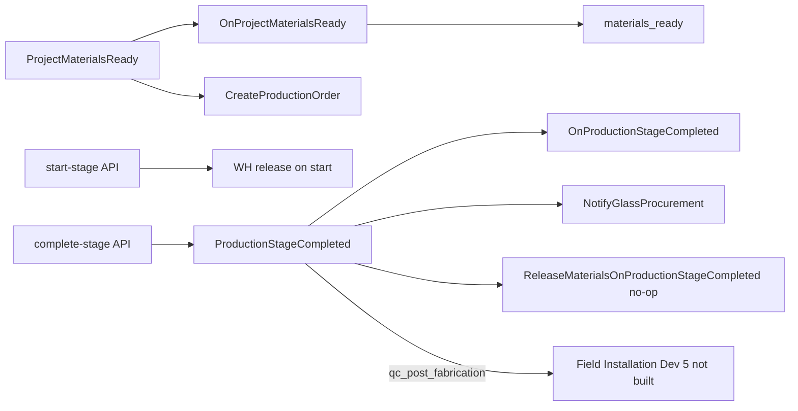
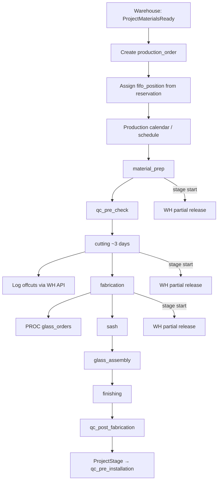
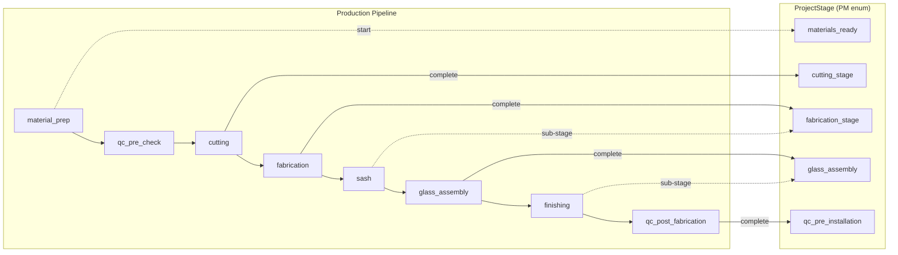
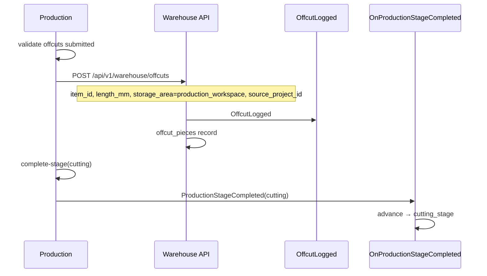
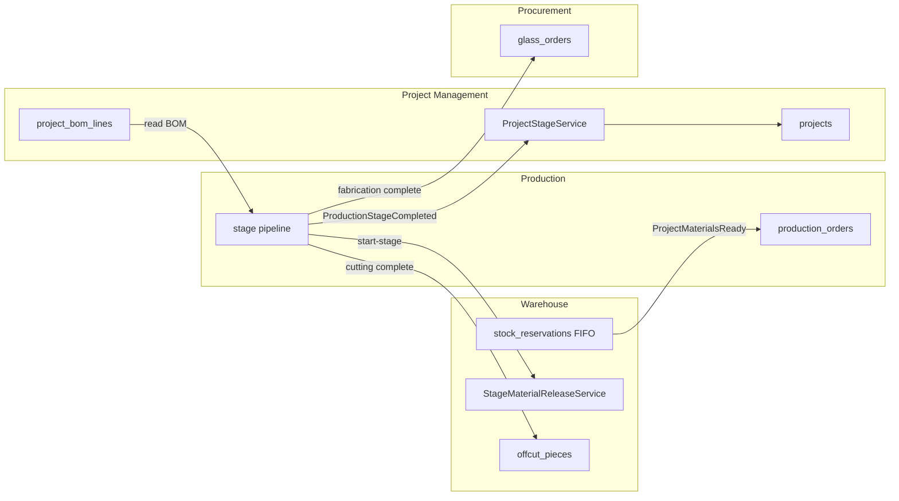

# Production — Implementation Plan

**Module:** Production · Manufacturing Pipeline · FIFO Scheduling · Offcuts  
**Stack:** PHP 8.2+ · Laravel 12 · PostgreSQL/MySQL · Next.js SPA  
**References:** [README.md](../README.md) §8.5 (Production), §8.2 (Project stages 10–13), §10 (Integrations), [Raw_Plam.txt](./Raw_Plam.txt) §8, [USER_ONBOARDING.MD](./USER_ONBOARDING.MD), [INTEGRATION_CONTRACT.MD](./INTEGRATION_CONTRACT.MD) **v1.2**, [PROJECT_MANAGEMENT.MD](./PROJECT_MANAGEMENT.MD), [WAREHOUSE.MD](./WAREHOUSE.MD) §9, [PROCUREMENT.MD](./PROCUREMENT.MD) §3, [FIELD_INSTALLATION.MD](./FIELD_INSTALLATION.MD) (on-site handoff)
**Version:** 1.1 · 2026

> **Developer entry point:** Read [INTEGRATION_CONTRACT.MD §12](./INTEGRATION_CONTRACT.MD#12-developer-handoff) first, then this document. Backend + PHPUnit only — frontend integration is coordinator-owned later.

---

## Table of Contents

1. [Backend Implementation Status](#0-backend-implementation-status)
2. [Goals — Manufacturing Pipeline](#1-goals--manufacturing-pipeline)
3. [Connecting Users to Production by Department](#2-connecting-users-to-production-by-department)
4. [Production Pipeline Stages & Project Stage Mapping](#3-production-pipeline-stages--project-stage-mapping)
5. [Repository & Folder Structure](#4-repository--folder-structure)
6. [Parallel Development & Conflict Prevention](#5-parallel-development--conflict-prevention)
7. [FIFO Scheduling](#6-fifo-scheduling)
8. [Database Schema & Migrations](#7-database-schema--migrations)
9. [Material Preparation — Cutting Sheet from BOM](#8-material-preparation--cutting-sheet-from-bom)
10. [Offcut Workflow](#9-offcut-workflow)
11. [Stage-Based Warehouse Release](#10-stage-based-warehouse-release)
12. [Handoff to Field Installation](#11-handoff-to-field-installation)
13. [Domain Events — Publish & Listen](#12-domain-events--publish--listen)
14. [Project Stage Sync — ProjectStageService Only](#13-project-stage-sync--projectstageservice-only)
15. [Glass Assembly — Procurement Coordination](#14-glass-assembly--procurement-coordination)
16. [API Endpoints](#15-api-endpoints)
17. [Permissions & Role Scoping](#16-permissions--role-scoping)
18. [Frontend Routes](#17-frontend-routes)
19. [Cross-Module Integration](#18-cross-module-integration)
20. [Audit Logging](#19-audit-logging)
21. [Implementation Phases](#20-implementation-phases)
22. [Resolved Integration Decisions](#21-resolved-integration-decisions)
23. [Remaining Open Questions](#22-remaining-open-questions)
24. [Seed Data](#23-seed-data)
25. [PHPUnit Test Plan](#24-phpunit-test-plan)

---

## 0. Backend Implementation Status

Ground truth as of v1.1 — use this table before coding to avoid duplicating work owned by other modules.


| Area                             | Status                 | Path / notes                                                                                                                                                                                                                   |
| -------------------------------- | ---------------------- | ------------------------------------------------------------------------------------------------------------------------------------------------------------------------------------------------------------------------------ |
| Base migration `600000`          | **Applied**            | `[backend/database/migrations/2025_05_19_600000_create_production_tables.php](../backend/database/migrations/2025_05_19_600000_create_production_tables.php)` — `production_orders`, `production_stage_logs`                   |
| Expansion migration `600001` (Production) | **Applied**     | `[backend/database/migrations/2025_05_19_600001_expand_production_tables.php](../backend/database/migrations/2025_05_19_600001_expand_production_tables.php)` — `production_order_teams`, `production_material_releases`, `cutting_sheets` only. **No installation tables** in this file (boundary vs [FIELD_INSTALLATION.MD](./FIELD_INSTALLATION.MD)) |
| Field Installation `650000`/`650001` | **Not implemented (Dev 5)** | On-site install, daily logs, delivery NCs, checklists — separate module; Production ends at `qc_post_fabrication`. Do not add install schema to `600001`. See [FIELD_INSTALLATION.MD](./FIELD_INSTALLATION.MD) §0 |
| `ProductionStage` enum           | **Complete**           | `[backend/app/Enums/Production/ProductionStage.php](../backend/app/Enums/Production/ProductionStage.php)` — 8 pipeline stages                                                                                                    |
| `ProductionStageCompleted` event | **Exists**             | `[backend/app/Events/Production/ProductionStageCompleted.php](../backend/app/Events/Production/ProductionStageCompleted.php)` — scalar IDs                                                                                     |
| PM stage sync listener           | **Exists (PM owns)**   | `[backend/app/Listeners/Projects/OnProductionStageCompleted.php](../backend/app/Listeners/Projects/OnProductionStageCompleted.php)` — **do not edit from Production module**                                                   |
| PROC glass listener              | **Exists (PROC owns)** | `[backend/app/Listeners/Procurement/NotifyGlassProcurement.php](../backend/app/Listeners/Procurement/NotifyGlassProcurement.php)` — fabrication only                                                                           |
| WH stage release listener        | **No-op (Option A)**   | `[backend/app/Listeners/Warehouse/ReleaseMaterialsOnProductionStageCompleted.php](../backend/app/Listeners/Warehouse/ReleaseMaterialsOnProductionStageCompleted.php)` — release on **start-stage** via PROD                    |
| `ProjectMaterialsReady` → PM     | **Exists (PM owns)**   | `[backend/app/Listeners/Projects/OnProjectMaterialsReady.php](../backend/app/Listeners/Projects/OnProjectMaterialsReady.php)`                                                                                                  |
| `CreateProductionOrder` listener | **Exists**             | `[backend/app/Listeners/Production/CreateProductionOrder.php](../backend/app/Listeners/Production/CreateProductionOrder.php)`                                                                                                  |
| Models / services / controllers  | **Implemented**        | `backend/app/Models/Production/`, `Services/Production/`, `Http/Controllers/Production/`                                                                                                                                       |
| Routes                           | **Registered**         | `[backend/routes/api/production/](../backend/routes/api/production/)` under `/api/v1/production`                                                                                                                              |
| Offcut `storage_area`            | **Implemented**        | Migration `2026_06_03_120000_add_offcut_storage_area.php`; `production_workspace` nullable bin                                                                                                                                |
| Permissions (seeded)             | **Coarse keys**        | `production.view`, `production.manage`, `production.schedule.manage`                                                                                                                                                           |
| PHPUnit                          | **16+ tests**          | `[backend/tests/Feature/Production/ProductionFlowTest.php](../backend/tests/Feature/Production/ProductionFlowTest.php)`                                                                                                        |
| Gap audit doc                    | **Exists**             | `[docs/PRODUCTION_GAP_AUDIT.md](./PRODUCTION_GAP_AUDIT.md)`                                                                                                                                                                     |
| Frontend                         | **Live API**           | See [PRODUCTION_FRONTEND_GUIDE.md](./PRODUCTION_FRONTEND_GUIDE.md) — `frontend/lib/api/production.ts`, routes §17                                                                                                               |


### Event wiring (actual `AppServiceProvider`)

```php
Event::listen(ProjectMaterialsReady::class, OnProjectMaterialsReady::class);           // PM — exists
Event::listen(ProductionStageCompleted::class, OnProductionStageCompleted::class);     // PM — exists
Event::listen(ProductionStageCompleted::class, NotifyGlassProcurement::class);         // PROC — exists
Event::listen(ProductionStageCompleted::class, ReleaseMaterialsOnProductionStageCompleted::class); // WH — registered; no-op (Option A)
Event::listen(ProjectMaterialsReady::class, CreateProductionOrder::class);                         // PROD — exists
```




---

## 1. Goals — Manufacturing Pipeline

### Business goals (README §8.5 · Raw_Plam.txt §8.1)

Production covers the full **manufacturing pipeline** from material preparation through assembly and pre-dispatch QC. Every production action ties to a `**project_id`** and a `**production_order_id**`.


| Goal                     | Description                                                                                                                              |
| ------------------------ | ---------------------------------------------------------------------------------------------------------------------------------------- |
| **Order creation gate**  | Production order created **only** after Warehouse emits `ProjectMaterialsReady` — never before                                           |
| **FIFO scheduling**      | Queue order determined by `fifo_position` copied from warehouse reservation sequence                                                     |
| **Stage pipeline**       | `material_prep` → `qc_pre_check` → `cutting` (~3 days) → `fabrication` → `sash` → `glass_assembly` → `finishing` → `qc_post_fabrication` |
| **Project sync**         | Each stage completion advances `ProjectStage` via `ProjectStageService` only — never direct `projects.stage` writes                      |
| **Offcuts**              | Logged **immediately** when cutting completes — before next stage starts; stored in **production workspace** (§9)                        |
| **Partial WH release**   | Materials released from reserved stock at **stage start**, not all at once ([WAREHOUSE.MD](./WAREHOUSE.MD) §9.3)                         |
| **Glass coordination**   | `**ProductionStageCompleted(fabrication)`** triggers PROC `glass_orders` — not PM `glass_assembly` advance (Q4)                          |
| **Field handoff** | Workshop ends at `qc_post_fabrication`. On-site install, daily logs, delivery NCs, tools → [FIELD_INSTALLATION.MD](./FIELD_INSTALLATION.MD) (Dev 5) |


### End-to-end production flow




### Critical business rules


| Rule                                                            | Enforcement                                                                                                                                                                                                                                                                                                |
| --------------------------------------------------------------- | ---------------------------------------------------------------------------------------------------------------------------------------------------------------------------------------------------------------------------------------------------------------------------------------------------------- |
| Production order **only** after `ProjectMaterialsReady`         | `CreateProductionOrder` listener; reject manual create if project stage ≠ `materials_ready`                                                                                                                                                                                                                |
| **FIFO queue priority**                                         | `production_orders.fifo_position` set from `stock_reservations.fifo_sequence`; default sort ASC                                                                                                                                                                                                            |
| **Offcuts logged immediately after cutting**                    | `complete-stage(cutting)` must call WH offcut API before stage marked complete                                                                                                                                                                                                                             |
| **Stage completion via `ProjectStageService` only**             | `ProductionStageCompleted` → PM listener — PROD never `UPDATE projects SET stage`                                                                                                                                                                                                                          |
| `**sash` / `finishing` are PROD sub-stages**                    | Logged in `production_stage_logs`; PM stays on `fabrication_stage` / `glass_assembly` until main stage completes (Q3)                                                                                                                                                                                      |
| **Schedule reorder allowed; FIFO reservations locked for PROD** | Production Manager may change `scheduled_start` / calendar slot order. **Cannot** change `fifo_position` or WH `fifo_sequence`. `**operations_manager`** may override reservation queue via WH `FifoReservationOverrideService` + audit log ([INTEGRATION_CONTRACT.MD](./INTEGRATION_CONTRACT.MD) §11 Q14) |


---

## 2. Connecting Users to Production by Department

From [USER_ONBOARDING.MD](./USER_ONBOARDING.MD) §2 and seed data:


| Department slug | Default module | Landing route          |
| --------------- | -------------- | ---------------------- |
| `production`    | `production`   | `/production/schedule` |


### Roles & team assignment


| Role slug                            | Scope                                                                      |
| ------------------------------------ | -------------------------------------------------------------------------- |
| `production_manager`                 | Full pipeline: schedule, team assignment, stage completion, cutting sheets |
| `super_admin` / `operations_manager` | All production operations + override visibility                            |
| `qc_inspector`                       | Read production status; QC stages (future QC module owns inspection gates) |
| `project_manager`                    | Read-only production status on project detail tab                          |


### Production team roles (per stage)

Assigned via `production_order_teams` — a user may hold multiple stage assignments on one order.


| Team role           | Typical stage(s)                      | Notes                                          |
| ------------------- | ------------------------------------- | ---------------------------------------------- |
| `cutting_lead`      | `material_prep`, `cutting`            | Generates/approves cutting sheet               |
| `fabrication_lead`  | `fabrication`, `sash`                 | Frame and sash assembly                        |
| `assembly_lead`     | `glass_assembly`, `finishing`         | Glass fit, hardware, seals                     |
| `qc_liaison`        | `qc_pre_check`, `qc_post_fabrication` | Coordinates with QC module (phase 1: log only) |
| `installation_lead` | —                                     | **Field Installation module** — not Production   |


Department users in **Production** land on `/production/schedule`. Team members without manager role receive stage-scoped views (cutting queue, assembly queue) based on `production_order_teams.stage`.

---

## 3. Production Pipeline Stages & Project Stage Mapping

### 3.1 `ProductionStage` enum

**Path:** `backend/app/Enums/Production/ProductionStage.php`  
**Source of truth:** [INTEGRATION_CONTRACT.MD](./INTEGRATION_CONTRACT.MD) §2.4 — do not duplicate string literals elsewhere.


| Order | Enum case           | DB value              | Label                      |
| ----- | ------------------- | --------------------- | -------------------------- |
| 1     | `MaterialPrep`      | `material_prep`       | Material Preparation       |
| 2     | `QcPreCheck`        | `qc_pre_check`        | QC Pre-Check (materials)   |
| 3     | `Cutting`           | `cutting`             | Cutting                    |
| 4     | `Fabrication`       | `fabrication`         | Fabrication                |
| 5     | `Sash`              | `sash`                | Sash Fabrication           |
| 6     | `GlassAssembly`     | `glass_assembly`      | Glass Assembly             |
| 7     | `Finishing`         | `finishing`           | Final Assembly & Finishing |
| 8     | `QcPostFabrication` | `qc_post_fabrication` | QC Post-Fabrication        |


**Order constraint:** stages run in the order above unless Operations Manager overrides **schedule dates** (FIFO reservation order is **not** overridable).

**Backend gap (Dev 4):** expand enum to match table above; rename/remove `QcPreInstallation` (`qc_pre_installation`) — PM target stage is `qc_pre_installation` on `**ProjectStage`**, not on `ProductionStage`.

### 3.2 Production stage ↔ `ProjectStage` mapping table

Maps each `ProductionStage` completion to the corresponding `[ProjectStage](../backend/app/Enums/ProjectStage.php)` value (README §8.2 stages 10–13).


| #   | `ProductionStage`     | On complete → `ProjectStage` | README stage # | Notes                                                                             |
| --- | --------------------- | ---------------------------- | -------------- | --------------------------------------------------------------------------------- |
| —   | `material_prep`       | —                            | 9              | **Start** of production; PM already at `materials_ready` from WH event — log only |
| —   | `qc_pre_check`        | —                            | —              | QC module (future); PROD logs stage only; no PM advance in phase 1 (Q6)           |
| 1   | `cutting`             | `cutting_stage`              | 10             | ~3 days typical; triggers offcut logging                                          |
| 2   | `fabrication`         | `fabrication_stage`          | 11             | Frame assembly; **glass order trigger (PROC)**                                    |
| 3   | `sash`                | `fabrication_stage`          | 11             | Sub-stage; PM transition no-ops if already at `fabrication_stage`                 |
| 4   | `glass_assembly`      | `glass_assembly`             | 12             | Does **not** create glass orders                                                  |
| 5   | `finishing`           | `glass_assembly`             | 12             | Sub-stage; PM stays until `qc_post_fabrication`                                   |
| 6   | `qc_post_fabrication` | `qc_pre_installation`        | 13             | Ready for dispatch / pre-installation QC                                          |


### 3.3 Pipeline diagram (manufacturing focus)




Stages **14–18** (`in_transit`, `installation`, `site_qc`, …) are owned by **Project Management** and **[FIELD_INSTALLATION.MD](./FIELD_INSTALLATION.MD)** — see §11.

---

## 4. Repository & Folder Structure

Same convention as CRM and Warehouse ([SALES_CRM.MD §3](./SALES_CRM.MD), [WAREHOUSE.MD §4](./WAREHOUSE.MD#4-repository--folder-structure)).

Legend: ✅ implemented

```
backend/app/
├── Enums/Production/
│   ├── ProductionStage.php                    ✅ 8 pipeline stages
│   ├── ProductionOrderStatus.php              ✅ scheduled, in_progress, completed, on_hold
│   └── TeamRole.php                           ✅ cutting_lead, fabrication_lead, assembly_lead, qc_liaison
├── Events/Production/
│   └── ProductionStageCompleted.php           ✅ scalar IDs + optional completedByUserId
├── Listeners/Production/
│   ├── CreateProductionOrder.php              ✅ ProjectMaterialsReady
│   └── NotifyProductionManagersOfNewOrder.php ✅
├── Http/Controllers/Production/             ✅ orders, schedule, stages, cutting, teams, offcuts
├── Http/Requests/Production/                  ✅
├── Http/Resources/Production/                 ✅
├── Models/Production/                         ✅ incl. CuttingSheet, ProductionMaterialRelease
├── Services/Production/                       ✅ release via MaterialReleaseRequestService on start-stage
├── Policies/Production/                       ✅
└── routes/api/production/                     ✅ orders.php, schedule.php, cutting.php
```

> Release on stage **start** is implemented in `ProductionStageService` (not a separate listener). See [PRODUCTION_GAP_AUDIT.md](./PRODUCTION_GAP_AUDIT.md).

**Do not create** `Events/Production/OffcutLogged.php` — Warehouse owns `App\Events\Warehouse\OffcutLogged` ([WAREHOUSE.MD](./WAREHOUSE.MD) §11).

**Do not create** `Listeners/Projects/OnProductionStageCompleted.php` — PM owns PM listeners.

---

## 5. Parallel Development & Conflict Prevention

Per [INTEGRATION_CONTRACT.MD §7–§8](./INTEGRATION_CONTRACT.MD#7-agent-boundary-rules). Production developer (**Dev 4**) works in isolation on owned paths; integration happens via **events and documented API calls only**.

### 5.1 Owned paths (Dev 4 only)


| Path prefix                                       | Owner                                                          |
| ------------------------------------------------- | -------------------------------------------------------------- |
| `backend/app/Services/Production/`                | Dev 4                                                          |
| `backend/app/Http/Controllers/Production/`        | Dev 4                                                          |
| `backend/app/Http/Requests/Production/`           | Dev 4                                                          |
| `backend/app/Http/Resources/Production/`          | Dev 4                                                          |
| `backend/app/Models/Production/`                  | Dev 4                                                          |
| `backend/app/Policies/Production/`                | Dev 4                                                          |
| `backend/app/Listeners/Production/`               | Dev 4                                                          |
| `backend/app/Enums/Production/`                   | Dev 4                                                          |
| `backend/app/Events/Production/`                  | Dev 4 (extend only — do not rename `ProductionStageCompleted`) |
| `backend/routes/api/production/`                  | Dev 4                                                          |
| `backend/database/migrations/2025_05_19_600001_*` | Dev 4                                                          |
| `backend/tests/Feature/Production/`               | Dev 4                                                          |
| `frontend/lib/api/production.ts`                  | Coordinator (out of scope for Dev 4 backend work)              |


### 5.2 Shared files — edit rules


| File                                                                                                | Dev 4 may do                                                                 | Dev 4 must NOT do                              |
| --------------------------------------------------------------------------------------------------- | ---------------------------------------------------------------------------- | ---------------------------------------------- |
| `[backend/routes/api.php](../backend/routes/api.php)`                                               | Add **one** `require` block for production routes inside `v1` group          | Edit CRM/PM/WH/PROC require lines              |
| `[backend/app/Providers/AppServiceProvider.php](../backend/app/Providers/AppServiceProvider.php)`   | Add `registerProductionListeners()` method; register `CreateProductionOrder` | Edit PM/WH/PROC listener registrations         |
| `[backend/database/seeders/PermissionSeeder.php](../backend/database/seeders/PermissionSeeder.php)` | **Append** production permission keys at end of list                         | Rename existing keys; edit other modules' keys |
| `[backend/database/seeders/DatabaseSeeder.php](../backend/database/seeders/DatabaseSeeder.php)`     | Register `ProductionSeeder` if created                                       | Remove other seeders                           |


### 5.3 Production must NOT


| Forbidden action                                                      | Owner module                              |
| --------------------------------------------------------------------- | ----------------------------------------- |
| Create or update `projects` rows directly                             | PM                                        |
| Write `projects.stage` (except emit `ProductionStageCompleted`)       | PM via `ProjectStageService`              |
| Mutate `stock_levels`, `stock_reservations`, `offcut_pieces` directly | WH — call WH API / inject WH services     |
| Create POs, GRNs, or `glass_orders` directly                          | PROC — emit events; read PROC API         |
| Override WH `fifo_sequence` / reservation queue                       | WH — only `operations_manager` via WH API |
| Add FK columns to PM/WH/PROC tables                                   | Respective module migrations              |


### 5.4 Cross-module FK rules (no migration conflicts)


| Production table column                                  | References                   | Defined in migration                                                              |
| -------------------------------------------------------- | ---------------------------- | --------------------------------------------------------------------------------- |
| `production_orders.project_id`                           | `projects.id`                | `600000` ✅                                                                        |
| `cutting_sheets.project_bom_line_id`                     | `project_bom_lines.id`       | `600001` — PM table must exist first                                              |
| `cutting_sheets.warehouse_item_id`                       | `warehouse_items.id`         | `600001` — WH table must exist first                                              |
| `production_material_releases.stock_reservation_line_id` | `stock_reservation_lines.id` | `600001` — no inline FK if WH migration order differs; use index + app validation |
| `production_material_releases.stock_movement_id`         | `stock_movements.id`         | nullable; WH owns                                                                 |


**Rule (Q2):** use `warehouse_item_id` only in **new** tables — never rename columns on PM/WH existing tables.

### 5.5 Migration ownership


| File                                             | Owner | Status                      |
| ------------------------------------------------ | ----- | --------------------------- |
| `2025_05_19_600000_create_production_tables.php` | Dev 4 | **Applied — do not modify** |
| `2025_05_19_600001_expand_production_tables.php` | Dev 4 | **Create new file only**    |


Migration order: CRM → Projects (`300000`) → Warehouse (`400000`) → Procurement (`500000`) → **Production (`600000`, `600001`)** → Auth/HR.

---

## 6. FIFO Scheduling

### 6.1 Queue mechanics

When Warehouse emits `ProjectMaterialsReady`:

1. `CreateProductionOrder` listener creates `production_orders` row for `project_id`.
2. Copies `fifo_sequence` from `stock_reservations` → `production_orders.fifo_position`.
3. Sets `status = scheduled`, `current_stage = material_prep`.
4. Notifies Production Manager; client notification optional (Raw_Plam.txt §8.1 step 2).


| Column                              | Purpose                                                                |
| ----------------------------------- | ---------------------------------------------------------------------- |
| `fifo_position`                     | **Immutable** queue priority from WH — lower number = earlier in queue |
| `scheduled_start` / `scheduled_end` | Calendar dates — **may** be reordered by Production Manager            |
| `actual_start` / `actual_end`       | Set when first stage starts / order completes                          |


### 6.2 Schedule reorder rules


| Action                                    | Allowed              | Notes                                                                         |
| ----------------------------------------- | -------------------- | ----------------------------------------------------------------------------- |
| Change calendar slot / `scheduled_start`  | ✓ Production Manager | Visual calendar drag-and-drop                                                 |
| Change `fifo_position`                    | ✗                    | Read-only from WH reservation                                                 |
| Override WH reservation sequence          | ✗ for PROD           | `**operations_manager`** only via WH `FifoReservationOverrideService` + audit |
| Start production before `materials_ready` | ✗                    | Gate on project stage + event                                                 |


### 6.3 Calendar view

`GET /api/v1/production/schedule` returns FIFO-sorted orders with:

- Project name, client, current `ProductionStage`
- `fifo_position`, scheduled vs actual dates
- Team assignments per stage
- Material readiness chip (from PM `/material-status` aggregate)

---

## 7. Database Schema & Migrations

### 7.1 Base migration (exists — do not modify)

Source: `[backend/database/migrations/2025_05_19_600000_create_production_tables.php](../backend/database/migrations/2025_05_19_600000_create_production_tables.php)`

```sql
CREATE TABLE production_orders (
    id                  BIGSERIAL PRIMARY KEY,
    reference           VARCHAR(30) NOT NULL UNIQUE,
    project_id          BIGINT NOT NULL REFERENCES projects(id) ON DELETE CASCADE,
    status              VARCHAR(32) NOT NULL DEFAULT 'scheduled',
    current_stage       VARCHAR(64) NOT NULL DEFAULT 'material_prep',
    fifo_position       INT NOT NULL DEFAULT 0,
    scheduled_start     DATE NULL,
    scheduled_end       DATE NULL,
    actual_start        DATE NULL,
    actual_end          DATE NULL,
    assigned_team_lead  BIGINT NULL REFERENCES users(id) ON DELETE SET NULL,
    created_at          TIMESTAMP NOT NULL,
    updated_at          TIMESTAMP NOT NULL
);

CREATE TABLE production_stage_logs (
    id                  BIGSERIAL PRIMARY KEY,
    production_order_id BIGINT NOT NULL REFERENCES production_orders(id) ON DELETE CASCADE,
    stage               VARCHAR(64) NOT NULL,
    status              VARCHAR(32) NOT NULL DEFAULT 'started',
    completed_by        BIGINT NULL REFERENCES users(id) ON DELETE SET NULL,
    started_at          TIMESTAMP NULL,
    completed_at        TIMESTAMP NULL,
    notes               TEXT NULL,
    created_at          TIMESTAMP NOT NULL,
    updated_at          TIMESTAMP NOT NULL
);

CREATE INDEX idx_production_orders_fifo ON production_orders (fifo_position, status);
CREATE INDEX idx_production_orders_project ON production_orders (project_id);
CREATE UNIQUE INDEX idx_production_orders_project_active ON production_orders (project_id)
    WHERE status IN ('scheduled', 'in_progress');  -- phase 1: one active order per project
CREATE INDEX idx_production_stage_logs_order ON production_stage_logs (production_order_id, stage);
```

> **Note:** the unique partial index on `project_id` is recommended in `600001` if not added via alter — enforces phase-1 one-order-per-project rule (§22 Q5).

### 7.2 Expansion migration (Dev 4 creates this file)

**File:** `backend/database/migrations/2025_05_19_600001_expand_production_tables.php`

```sql
CREATE TABLE production_order_teams (
    id                  BIGSERIAL PRIMARY KEY,
    production_order_id BIGINT NOT NULL REFERENCES production_orders(id) ON DELETE CASCADE,
    user_id             BIGINT NOT NULL REFERENCES users(id) ON DELETE CASCADE,
    stage               VARCHAR(64) NOT NULL,   -- ProductionStage value
    role                VARCHAR(50) NOT NULL,   -- TeamRole value
    assigned_at         TIMESTAMP NOT NULL,
    assigned_by         BIGINT NOT NULL REFERENCES users(id),
    notes               TEXT NULL,
    created_at          TIMESTAMP NOT NULL,
    updated_at          TIMESTAMP NOT NULL,
    UNIQUE (production_order_id, user_id, stage)
);

CREATE TABLE production_material_releases (
    id                        BIGSERIAL PRIMARY KEY,
    production_order_id       BIGINT NOT NULL REFERENCES production_orders(id) ON DELETE CASCADE,
    stock_reservation_line_id BIGINT NOT NULL,  -- WH stock_reservation_lines.id
    stage                     VARCHAR(64) NOT NULL,
    qty_released              DECIMAL(15,3) NOT NULL,
    released_at               TIMESTAMP NOT NULL,
    released_by               BIGINT NOT NULL REFERENCES users(id),
    stock_movement_id         BIGINT NULL,      -- WH stock_movements.id when confirmed
    notes                     TEXT NULL,
    created_at                TIMESTAMP NOT NULL
);

CREATE TABLE cutting_sheets (
    id                  BIGSERIAL PRIMARY KEY,
    production_order_id BIGINT NOT NULL REFERENCES production_orders(id) ON DELETE CASCADE,
    project_bom_line_id BIGINT NOT NULL,        -- PM project_bom_lines.id
    warehouse_item_id   BIGINT NOT NULL,        -- WH warehouse_items.id
    profile_code        VARCHAR(50) NOT NULL,
    cut_length_mm       INT NOT NULL,
    pieces              INT NOT NULL DEFAULT 1,
    bar_length_mm       INT NULL,
    waste_mm            INT NULL,
    sort_order          INT NOT NULL DEFAULT 0,
    generated_at        TIMESTAMP NOT NULL,
    generated_by        BIGINT NOT NULL REFERENCES users(id),
    created_at          TIMESTAMP NOT NULL,
    updated_at          TIMESTAMP NOT NULL
);

CREATE INDEX idx_cutting_sheets_order ON cutting_sheets (production_order_id);
CREATE INDEX idx_material_releases_order ON production_material_releases (production_order_id, stage);
CREATE INDEX idx_production_order_teams_order ON production_order_teams (production_order_id, stage);
```

**Conflict rule:** Dev 4 must **not** edit `600000` after it is applied in shared environments. All new columns/tables go in `600001` only. **Do not add installation tables here** — Dev 5 owns `650000` ([FIELD_INSTALLATION.MD](./FIELD_INSTALLATION.MD)).

---

## 8. Material Preparation — Cutting Sheet from BOM

### 8.1 Generation flow

1. Production order exists (`ProjectMaterialsReady` received).
2. `CuttingSheetGeneratorService` reads active `project_bom_lines` where line type is aluminium profile.
3. For each line: expand `measurement_mm` × `quantity` into individual cut rows.
4. Persist to `cutting_sheets`; expose via `GET /api/v1/production/orders/{id}/cutting-sheet`.


| BOM field (`project_bom_lines`) | Cutting sheet field         |
| ------------------------------- | --------------------------- |
| `id`                            | `project_bom_line_id`       |
| `warehouse_item_id`             | `warehouse_item_id`         |
| `material_code`                 | `profile_code`              |
| `measurement_mm`                | `cut_length_mm`             |
| `quantity`                      | `pieces` (or expanded rows) |


**Read-only cross-module access:** load BOM via PM API or shared `ProjectBomLine` model read — **do not** write BOM tables from Production services.

### 8.2 Cutting team workflow


| Step | Action                                                                                                       |
| ---- | ------------------------------------------------------------------------------------------------------------ |
| 1    | Production Manager assigns cutting team (`production_order_teams`)                                           |
| 2    | Cutting lead reviews/edits cutting sheet (optional manual adjustments — §22 Q4)                              |
| 3    | `start-stage(material_prep)` → request WH release for profile lines                                          |
| 4    | `start-stage(cutting)` → cutting in progress (~3 days typical)                                               |
| 5    | `complete-stage(cutting)` → offcuts logged (§9) → `ProductionStageCompleted(cutting)` → PM → `cutting_stage` |


---

## 9. Offcut Workflow

Physical rule: offcuts are stored in the **production workspace** at the cutting station (ground floor), **not** on the warehouse offcuts deck. Inventory is still tracked via Warehouse `offcut_pieces` — Production calls the WH API.

Aligns with [WAREHOUSE.MD §12](./WAREHOUSE.MD#12-offcuts-warehouse) (WH owns persistence and `OffcutLogged` event).

### Sequence (mandatory on cutting complete)




| Step | Owner     | Detail                                                                                                      |
| ---- | --------- | ----------------------------------------------------------------------------------------------------------- |
| 1    | PROD      | Operator enters offcut: profile code, `length_mm`, piece count                                              |
| 2    | PROD → WH | `POST /api/v1/warehouse/offcuts` with `source_project_id`, `storage_area: production_workspace`             |
| 3    | WH        | Creates `offcut_pieces`; `bin_id` nullable when `storage_area = production_workspace` (WH schema follow-up) |
| 4    | WH        | Emits `OffcutLogged`                                                                                        |
| 5    | PROD      | `ProductionStageCompleted(cutting)` only after all required offcut lines submitted                          |


**Rule:** Offcuts recorded **immediately after cutting** — do not defer to fabrication stage.

**Current code gap:** `[OffcutLoggingService](../backend/app/Services/Warehouse/Offcuts/OffcutLoggingService.php)` requires `binId` — coordinate with WH dev for nullable bin + `storage_area` enum (§22).

**Alternative (Dev 4 option):** `POST /api/v1/production/orders/{id}/offcuts` proxy that validates cutting stage and delegates to `OffcutLoggingService` — keeps WH as single writer for `offcut_pieces`.

---

## 10. Stage-Based Warehouse Release

From [WAREHOUSE.MD §9.3](./WAREHOUSE.MD#93-stage-based-release) and README §8.2:

Materials reserved in FIFO at BOM finalize are **released partially** as each production stage **starts** — not issued in full at order creation.


| Production stage start         | WH release scope                       | Physical pick location                       |
| ------------------------------ | -------------------------------------- | -------------------------------------------- |
| `material_prep` / `cutting`    | Aluminium profile reservation lines    | Ground floor — profile subsections (no bins) |
| `fabrication` / `sash`         | Accessories per BOM                    | First floor — door-type section bins         |
| `glass_assembly` / `finishing` | Rubbers/gaskets; remaining accessories | Ground floor rubbers corner + FF bins        |


Glass is **never** released from warehouse — project-specific via PROC ([PROCUREMENT.MD](./PROCUREMENT.MD) §1).

### Target release flow (Dev 4 implements)

1. `POST /api/v1/production/orders/{id}/start-stage` with `{ "stage": "cutting" }`.
2. `MaterialReleaseRequestService` calls WH `StageMaterialReleaseService::releaseForStage($projectId, $stage)` (inject WH service — **do not duplicate release logic**).
3. Records `production_material_releases` row per line released.
4. WH creates outbound `stock_movements` + updates `stock_reservation_lines.quantity_released`.

Production Manager needs `warehouse.reservations.release` (or WH exposes a production-scoped wrapper checked by policy).

### Current wiring vs target (coordinate with WH — no file conflict)


| Behavior   | Target (this spec)                              | Current backend                                              |
| ---------- | ----------------------------------------------- | ------------------------------------------------------------ |
| Trigger    | `start-stage` via PROD `ProductionStageService` | `ReleaseMaterialsOnProductionStageCompleted` on **complete** |
| Service    | `MaterialReleaseRequestService` → WH            | `StageMaterialReleaseService` (WH)                           |
| Categories | Same                                            | cutting → aluminium; fabrication → accessories + rubbers     |


**Resolution (pick one during implementation — document in PR):**

- **Option A (recommended):** PROD calls WH release on `start-stage`; WH removes or disables release-on-complete listener to avoid double-release.
- **Option B:** Keep WH listener on complete until PROD start-stage is stable; PROD `production_material_releases` records both for audit.

WH listener lives in `Listeners/Warehouse/` — **Dev 2 edits only**. Dev 4 opens a coordination note / issue; do not edit WH files without agreement.

---

## 11. Handoff to Field Installation

Production **ends** when `qc_post_fabrication` completes and PM reaches `qc_pre_installation`. All on-site work is owned by **[FIELD_INSTALLATION.MD](./FIELD_INSTALLATION.MD)** (Dev 5).

| Production completes | PM stage | Next module |
|---------------------|----------|-------------|
| `qc_post_fabrication` | `qc_pre_installation` | Field Installation (if `install_mode` requires Bibo on-site install) |

| `install_mode` (PM column) | Production scope | Field Installation |
|----------------------------|------------------|-------------------|
| `nairobi_fabrication_only` | Workshop only | **Skipped** |
| `nairobi_site_install` | Workshop fabrication | Nairobi on-site install + daily logs |
| `outside_full_install` | Workshop fabrication | Delivery record + full remote install |

**Dev 4 must NOT implement:** daily progress logs, delivery photos, non-conformities, installation checklists, or field tool assignment — those are Dev 5 paths only.

---

## 12. Domain Events — Publish & Listen

Per [INTEGRATION_CONTRACT.MD](./INTEGRATION_CONTRACT.MD) §3 — stable event names. Payload standard: **scalar IDs only** (Q11).

### Events Production PUBLISHES


| Event                      | Trigger                   | Payload                                                               |
| -------------------------- | ------------------------- | --------------------------------------------------------------------- |
| `ProductionStageCompleted` | `POST .../complete-stage` | `int $projectId`, `int $productionOrderId`, `string $productionStage` |


Phase 2 may add `completedByUserId` — coordinate contract version bump before changing constructor.

### Events Production LISTENS to


| Event                   | Publisher | Listener (Dev 4)        | Action                                       |
| ----------------------- | --------- | ----------------------- | -------------------------------------------- |
| `ProjectMaterialsReady` | Warehouse | `CreateProductionOrder` | Create order; set `fifo_position`; audit log |


### Events Production does NOT publish


| Event                  | Owner                          |
| ---------------------- | ------------------------------ |
| `OffcutLogged`         | Warehouse — after offcut API   |
| `ProjectStage` changes | PM — via `ProjectStageService` |


### Listener registration (Dev 4 adds to `AppServiceProvider`)

```php
protected function registerProductionListeners(): void
{
    Event::listen(ProjectMaterialsReady::class, CreateProductionOrder::class);
}

// Call from boot():
$this->registerProductionListeners();
```

**Do not re-register** `OnProductionStageCompleted`, `NotifyGlassProcurement`, or `ReleaseMaterialsOnProductionStageCompleted` — already registered.

---

## 13. Project Stage Sync — ProjectStageService Only

**Golden rule** ([INTEGRATION_CONTRACT.MD](./INTEGRATION_CONTRACT.MD) §1.2): Production **never** writes `projects.stage` directly.

### Allowed pattern (PM listener — already implemented)

```php
// backend/app/Listeners/Projects/OnProductionStageCompleted.php (PM owns)
$this->stages->transition($project, ProjectStage::CuttingStage, null, [
    'reason' => "production_stage:{$event->productionStage}",
]);
```

### Forbidden in Production module

```php
// NEVER in Services/Production/*
$project->update(['stage' => 'cutting_stage']);
ProjectStageService::... // PROD must not call directly — emit event instead
```

### Sync mapping on `ProductionStageCompleted` (PM listener)


| `$event->productionStage`       | PM transition target              | Notes                  |
| ------------------------------- | --------------------------------- | ---------------------- |
| `cutting`                       | `ProjectStage::CuttingStage`      |                        |
| `fabrication`, `sash`           | `ProjectStage::FabricationStage`  | `sash` sub-stage       |
| `glass_assembly`                | `ProjectStage::GlassAssembly`     |                        |
| `finishing`                     | *(no transition — sub-stage)*     | Listener returns early |
| `qc_post_fabrication`           | `ProjectStage::QcPreInstallation` |                        |
| `material_prep`, `qc_pre_check` | *(no transition)*                 |                        |


Each completion in PROD also writes `production_stage_logs` and sets `production_orders.current_stage` to the next pipeline stage.

---

## 14. Glass Assembly — Procurement Coordination

Glass is **not warehouse stock** ([WAREHOUSE.MD §5](./WAREHOUSE.MD#5-master-data), [INTEGRATION_CONTRACT.MD](./INTEGRATION_CONTRACT.MD) §1.1).

### Trigger timing (locked — Q4)

**Single trigger:** `ProductionStageCompleted(fabrication)` only.

Already implemented in `[NotifyGlassProcurement](../backend/app/Listeners/Procurement/NotifyGlassProcurement.php)`:

- Creates `glass_orders` row via `GlassOrderService`
- Idempotent — skips if open order exists for project
- PM advance to `glass_assembly` does **not** create glass orders


| Event                                      | PROC action                                                    |
| ------------------------------------------ | -------------------------------------------------------------- |
| `ProductionStageCompleted(fabrication)`    | Create `glass_orders` if none open                             |
| `ProductionStageCompleted(glass_assembly)` | **No auto-create** — track delivery status manually in PROC UI |
| PM `glass_assembly` stage advance          | **No glass order side effect**                                 |


Production UI reads glass status via read-only `GET /api/v1/procurement/glass-orders?project_id=` ([INTEGRATION_CONTRACT.MD](./INTEGRATION_CONTRACT.MD) §6).

**Dev 4 must NOT** write to `glass_orders` or call `GlassOrderService` directly.

---

## 15. API Endpoints

Base: `**/api/v1/production*`* · Auth: `auth:sanctum`, `active`, `device.trusted`

Register in `[backend/routes/api.php](../backend/routes/api.php)` inside the existing `v1` prefix group:

```php
Route::middleware(['auth:sanctum', 'active', 'device.trusted'])
    ->prefix('production')
    ->group(function () {
        require __DIR__.'/api/production/orders.php';
        require __DIR__.'/api/production/schedule.php';
        require __DIR__.'/api/production/cutting.php';
    });
```

### Orders & schedule


| Method | Path                          | Permission (phase 1)         | Purpose                                          |
| ------ | ----------------------------- | ---------------------------- | ------------------------------------------------ |
| GET    | `/orders`                     | `production.view`            | List orders; default sort `fifo_position ASC`    |
| GET    | `/orders/{id}`                | `production.view`            | Order detail + stage logs + teams                |
| GET    | `/schedule`                   | `production.view`            | Calendar / FIFO queue view                       |
| PATCH  | `/orders/{id}/schedule`       | `production.schedule.manage` | Reorder calendar dates (**not** `fifo_position`) |
| POST   | `/orders/{id}/start-stage`    | `production.manage`          | Begin stage + WH release request                 |
| POST   | `/orders/{id}/complete-stage` | `production.manage`          | Complete stage + emit `ProductionStageCompleted` |


### Cutting & teams


| Method | Path                         | Permission (phase 1)         | Purpose                              |
| ------ | ---------------------------- | ---------------------------- | ------------------------------------ |
| GET    | `/orders/{id}/cutting-sheet` | `production.view`            | BOM-derived cutting lines            |
| POST   | `/orders/{id}/cutting-sheet` | `production.manage`          | Regenerate or manual overrides       |
| PATCH  | `/orders/{id}/cutting-sheet/{line}` | `production.manage`   | Manual line edit (requires `reason`) |
| POST   | `/orders/{id}/offcuts`       | `production.manage`          | Optional proxy to WH offcut API (§9) |
| PATCH  | `/orders/{id}/status`        | `production.manage`          | Set `scheduled` / `in_progress` / `on_hold` |
| GET    | `/orders/{id}/teams`         | `production.view`            | Team assignments                     |
| POST   | `/orders/{id}/teams`         | `production.schedule.manage` | Assign user to stage/role            |


### Cross-module reads (not owned by PROD — call only)


| Method | Path                                           | Owner | Purpose                             |
| ------ | ---------------------------------------------- | ----- | ----------------------------------- |
| GET    | `/api/v1/projects/{id}/material-status`        | PM    | Material readiness chip on schedule |
| GET    | `/api/v1/warehouse/reservations?project_id=`   | WH    | Reservation lines                   |
| POST   | `/api/v1/warehouse/offcuts`                    | WH    | Log offcut after cutting            |
| GET    | `/api/v1/procurement/glass-orders?project_id=` | PROC  | Glass delivery status               |


**Phase 1:** no public `POST /orders` — orders created only via `CreateProductionOrder` listener.

---

## 16. Permissions & Role Scoping

### Phase 1 — seeded keys (use today)

From `[PermissionSeeder.php](../backend/database/seeders/PermissionSeeder.php)`:

```
production.view
production.manage
production.schedule.manage
projects.advance_stage_production
```


| Permission                          | Maps to                                                            |
| ----------------------------------- | ------------------------------------------------------------------ |
| `production.view`                   | List orders, schedule read, cutting sheet read, teams read         |
| `production.manage`                 | Start/complete stage, cutting sheet write, teams write, checklists |
| `production.schedule.manage`        | Calendar date reorder                                              |
| `projects.advance_stage_production` | PM production tab actions (PM module)                              |


### Phase 2 — granular keys (append later, no renames)

```
production.orders.view
production.schedule.view
production.stages.manage
production.cutting.view
production.cutting.manage

### Role matrix


| Role                       | Key permissions                                                                              |
| -------------------------- | -------------------------------------------------------------------------------------------- |
| `production_manager`       | `production.view`, `production.manage`, `production.schedule.manage`, `warehouse.stock.view` |
| `operations_manager`       | All production + WH FIFO override (via WH API)                                               |
| `super_admin`              | All permissions                                                                              |
| Cutting / fabrication team | `production.view`, `production.manage` (stage-scoped in policy)                              |
| `project_manager`          | `production.view`, `projects.view`                                                           |
| `qc_inspector`             | `production.view`, `qc.inspect`                                                              |


### Policy rules


| Check                   | Rule                                                                              |
| ----------------------- | --------------------------------------------------------------------------------- |
| Create production order | Only via `ProjectMaterialsReady` listener — no public `POST /orders` in phase 1   |
| Reorder schedule        | Requires `production.schedule.manage`; reject if request modifies `fifo_position` |
| Complete cutting        | Requires offcut lines submitted for order                                         |

Append new keys at end of `PermissionSeeder` — **no renames** ([INTEGRATION_CONTRACT.MD](./INTEGRATION_CONTRACT.MD) §7.1).

---

## 17. Frontend Routes

Coordinator-owned — listed for API contract completeness. Existing shell (`[frontend/lib/navigation.ts](../frontend/lib/navigation.ts)`):


| Route                      | Purpose                                               |
| -------------------------- | ----------------------------------------------------- |
| `/production/schedule`     | FIFO calendar — all active orders by stage            |
| `/production/orders`       | Order list with fifo_position, project stage chip     |
| `/production/cutting`      | Cutting queue — orders in `material_prep` / `cutting` |
| `/production/assembly`     | Fabrication, sash, glass, finishing queues            |

**API client:** `frontend/lib/api/production.ts` — coordinator implements after backend tests pass.

---

## 18. Cross-Module Integration




| From | To   | Integration                                                         | Status                                  |
| ---- | ---- | ------------------------------------------------------------------- | --------------------------------------- |
| WH   | PROD | `ProjectMaterialsReady` → `CreateProductionOrder` + `fifo_position` | **Exists**                              |
| PM   | PROD | BOM lines → cutting sheet generation (read)                         | **Exists**                              |
| PROD | WH   | Stage start → partial reservation release; cutting → offcut API     | **Exists** (Option A; WH complete listener no-op) |
| PROD | PM   | `ProductionStageCompleted` → `ProjectStageService`                  | **Exists**                              |
| PROD | PROC | `ProductionStageCompleted(fabrication)` → `glass_orders`            | **Exists**                              |
| PROD | QC   | `ProductionStageCompleted` → auto inspection (pre/post fab)       | **Exists** (see gap audit)              |
| PM   | PROD | Project tab: `GET /production/orders?project_id=`                   | **Exists** (frontend tab)               |
| WH   | PROD | `fifo_sequence` on reservation → schedule priority                  | **Exists** (via CreateProductionOrder)  |


**Production must NOT:** create projects; approve PRs; verify GRNs; write `projects.stage` directly; override FIFO reservation order ([INTEGRATION_CONTRACT.MD](./INTEGRATION_CONTRACT.MD) §7.2).

---

## 19. Audit Logging

All production actions log via Owen ([README.md](../README.md) §4.3):


| Action                                      | Module     | `entity_type`            | Notes                            |
| ------------------------------------------- | ---------- | ------------------------ | -------------------------------- |
| `production.order_created`                  | production | `production_order`       | On `ProjectMaterialsReady`       |
| `production.stage_started`                  | production | `production_stage_log`   | Stage + release request          |
| `production.stage_completed`                | production | `production_stage_log`   | Includes `ProductionStage` value |
| `production.schedule_reordered`             | production | `production_order`       | Date change only                 |
| `production.cutting_sheet_generated`        | production | `cutting_sheet`          | BOM version reference            |
| `production.team_assigned`                  | production | `production_order_team`  | User + stage + role              |
| `offcut.logged`                             | warehouse  | `offcut_piece`           | WH owns — see WAREHOUSE.MD §21   |


---

## 20. Implementation Phases

Backend-only phases for Dev 4. Frontend is coordinator-owned.

### Phase 1 — Schema & enum (Week 1)

- Expand `ProductionStage` enum per §3.1
- Add `ProductionOrderStatus`, `TeamRole` enums
- Create `600001` expansion migration
- Models + factories under `Models/Production/`
- `CreateProductionOrder` listener on `ProjectMaterialsReady`
- Register `registerProductionListeners()` in `AppServiceProvider`
- Append route require in `api.php`

### Phase 2 — Stage pipeline API (Week 2)

- `ProductionStageService` — start/complete with validation
- `ProductionStageCompleted` event class *(exists)*
- PM / PROC / WH listeners wired *(exists — do not duplicate)*
- `production_stage_logs` on each transition
- Gate: no order before `materials_ready`
- Feature tests: stage transitions + event dispatch

### Phase 3 — FIFO schedule & calendar (Week 3)

- `ProductionScheduleService` — FIFO sort, calendar reorder rules
- `GET /schedule`, `PATCH /orders/{id}/schedule`
- Reject `fifo_position` changes in request validation

### Phase 4 — Cutting sheet & offcuts (Week 4)

- `CuttingSheetGeneratorService` from BOM
- Offcut gate on cutting complete
- Coordinate WH `storage_area` for production workspace offcuts

### Phase 5 — WH release & material tracking (Week 5)

- `MaterialReleaseRequestService` + **start-stage** integration
- `production_material_releases` recording
- Coordinate with WH dev on release trigger timing (§10)

### Phase 6 — Glass status reads (Week 6)

- Glass status read from PROC API on assembly views
- Project detail Production tab deep links (coordinator frontend)

---

## 21. Resolved Integration Decisions

See [INTEGRATION_CONTRACT.MD §11](./INTEGRATION_CONTRACT.MD#11-resolved-decisions) for all 14 locked decisions (2026-05-26).

**Production-specific highlights:**


| Topic                    | Decision                                                                        |
| ------------------------ | ------------------------------------------------------------------------------- |
| Order creation gate      | Only after `ProjectMaterialsReady`                                              |
| Glass trigger            | `**ProductionStageCompleted(fabrication)` only** — PROC creates `glass_orders`  |
| `sash` / `finishing`     | PROD sub-stages; no separate PM advance                                         |
| QC pre-check             | Phase 1: PROD logs `qc_pre_check`; QC gates later (Q6)                          |
| Nairobi fabrication-only | Skip PM install stages 14–16 (Q10)                                              |
| Reservation              | All-or-nothing WH FIFO before production starts (Q5)                            |
| FIFO override            | Schedule dates OK; reservation override = `operations_manager` via WH API (Q14) |
| Event payloads           | Scalar IDs only on new events (Q11)                                             |
| FK naming                | `warehouse_item_id` in new tables only (Q2)                                     |


---

## 22. Remaining Open Questions

### Production module


| #   | Topic                                  | Gap                               | Notes                                                                 |
| --- | -------------------------------------- | --------------------------------- | --------------------------------------------------------------------- |
| 1   | Manual cutting sheet edits             | BOM may not match shop floor cuts | Allow cutting lead PATCH lines with audit reason                      |
| 2   | Multiple production orders per project | Apartment/floor tracking          | One order per project in phase 1; split by floor in phase 2           |
| 3   | Client notification on schedule        | Raw_Plam §8.1 step 2              | Defer to notification service; template TBD                           |
| 4   | Partial cutting completion             | Large projects may span >3 days   | Support pause/resume or % complete on stage logs                      |
| 5   | Reference number format                | `production_orders.reference`     | e.g. `PROD-{YYYY}-{seq}` — align with CRM/PO patterns                 |
| 6   | Team members without login             | Casual workers                    | Phase 1: all team rows require `user_id`; contractor accounts phase 2 |


### Cross-module (coordinate — do not block PROD schema)


| #   | Topic                                     | Owner           | Notes                                                   |
| --- | ----------------------------------------- | --------------- | ------------------------------------------------------- |
| 7   | Offcut `storage_area` + nullable `bin_id` | WH              | Production workspace offcuts (§9)                       |
| 8   | Stage release trigger                     | WH + PROD       | Move release to `start-stage` vs keep on complete (§10) |
| 9   | `ProductionStageCompleted` audit fields   | PROD + contract | Add `completedByUserId` in phase 2?                     |
| 10  | Offcut API entry point                    | PROD vs WH      | Direct WH call vs PROD proxy endpoint                   |


---

## 23. Seed Data

No dedicated `ProductionSeeder` required for phase 1.


| Source                                                                           | Content                                                              |
| -------------------------------------------------------------------------------- | -------------------------------------------------------------------- |
| `[PermissionSeeder.php](../backend/database/seeders/PermissionSeeder.php)`       | `production.view`, `production.manage`, `production.schedule.manage` |
| `[RoleSeeder.php](../backend/database/seeders/RoleSeeder.php)` / department seed | `production_manager` role → production department                    |
| Factories (Dev 4)                                                                | `ProductionOrderFactory` after models exist — for PHPUnit only       |


Optional phase 2: demo production orders linked to seeded projects — **only in local/dev** `DatabaseSeeder`.

---

## 24. PHPUnit Test Plan

**Path:** `backend/tests/Feature/Production/ProductionFlowTest.php`

Run: `cd backend; php artisan test --filter=ProductionFlowTest`


| Test case                                        | Assert                                                            |
| ------------------------------------------------ | ----------------------------------------------------------------- |
| `ProjectMaterialsReady` creates production order | Order row, `fifo_position` from reservation, unique `reference`   |
| Rejects order when project not `materials_ready` | Listener no-op or policy 403                                      |
| One active order per project                     | Second create fails unique constraint                             |
| `start-stage(cutting)` requests WH release       | `production_material_releases` rows or WH service mocked          |
| `complete-stage(cutting)` without offcuts        | 422 validation error                                              |
| `complete-stage(cutting)` with offcuts           | Dispatches `ProductionStageCompleted` with `cutting`              |
| PM sync on cutting complete                      | Project at `cutting_stage` (event fake + listener)                |
| Glass on fabrication complete                    | One `glass_orders` row; second fabrication complete is idempotent |
| `sash` complete                                  | PM remains / at `fabrication_stage`                               |
| Schedule PATCH                                   | Updates `scheduled_start` only; ignores `fifo_position`           |
| FIFO list sort                                   | `GET /orders` returns ascending `fifo_position`                   |
| `GET /schedule`                                  | FIFO queue with material/glass enrichment                         |
| `POST /offcuts` proxy                            | Logs offcut via WH service                                        |
| `qc_pre_check` complete                          | Dispatches `ProductionStageCompleted` for QC listener             |
| `qc_post_fabrication` complete                   | PM → `qc_pre_installation` + QC inspection hook                   |


Use Sanctum actingAs with `production_manager` permissions. See [PRODUCTION_GAP_AUDIT.md](./PRODUCTION_GAP_AUDIT.md) for remaining test gaps. Mock WH services where integration is cross-module to keep tests isolated.

---

## Appendix A — Production ↔ Project stage quick reference


| Production completes  | → ProjectStage        | README # |
| --------------------- | --------------------- | -------- |
| `cutting`             | `cutting_stage`       | 10       |
| `fabrication`         | `fabrication_stage`   | 11       |
| `glass_assembly`      | `glass_assembly`      | 12       |
| `qc_post_fabrication` | `qc_pre_installation` | 13       |


Sub-stages (`sash`, `finishing`) and `qc_pre_check` do not advance PM stage independently.

---

## Appendix B — Related documents


| Document                                             | Module     | Status        |
| ---------------------------------------------------- | ---------- | ------------- |
| [INTEGRATION_CONTRACT.MD](./INTEGRATION_CONTRACT.MD) | All        | Exists · v1.2 |
| [PROJECT_MANAGEMENT.MD](./PROJECT_MANAGEMENT.MD)     | PM         | Exists        |
| [WAREHOUSE.MD](./WAREHOUSE.MD)                       | WH         | Exists · v1.1 |
| [PROCUREMENT.MD](./PROCUREMENT.MD)                   | PROC       | Exists        |
| [FIELD_INSTALLATION.MD](./FIELD_INSTALLATION.MD)     | Field      | Exists · v1.0 |
| [USER_ONBOARDING.MD](./USER_ONBOARDING.MD)           | Foundation | Exists        |
| [PRODUCTION_FRONTEND_GUIDE.MD](./PRODUCTION_FRONTEND_GUIDE.md) | Production | Exists        |
| [SALES_CRM.MD](./SALES_CRM.MD)                       | CRM        | Exists        |


---

*End of Production Implementation Plan v1.1*