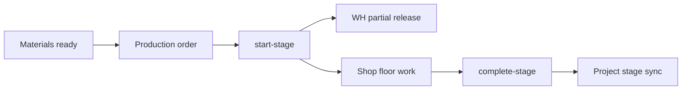

# Production Module — Frontend Implementation Guide

**Audience:** Frontend developers wiring the BIBO ERM production UI  
**Backend:** `/api/v1/production` (see [PRODUCTION.MD](./PRODUCTION.MD))  
**API client:** [`frontend/lib/api/production.ts`](../frontend/lib/api/production.ts)

---

## Routes

| Route | Page | API |
|-------|------|-----|
| `/production/schedule` | FIFO queue + stats | `GET /production/schedule`, `GET /production/orders` |
| `/production/orders` | Order list | `GET /production/orders` |
| `/production/orders/[id]` | Order detail, stage actions, cutting sheet | `GET /production/orders/{id}`, stage/offcut/team endpoints |
| `/production/cutting` | Cutting queue filter | `GET /production/orders` (client filter) |
| `/production/assembly` | Assembly queue + glass badge | `GET /production/orders`, `GET /production/schedule` (`glass_status`) |
| `/production` | Redirect | → `/production/schedule` |

**Project detail:** `/projects/[id]?tab=production` — `GET /production/orders?project_id=`

Field Installation is **not** under Production nav (see [FIELD_INSTALLATION.MD](./FIELD_INSTALLATION.MD)).

---

## Permissions

| Slug | UI |
|------|-----|
| `production.view` | All read-only pages, project Production tab |
| `production.manage` | Start/complete stage, offcuts, cutting sheet regenerate |
| `production.schedule.manage` | PATCH schedule dates (FIFO position is read-only) |

---

## Stage workflow

1. Warehouse emits `ProjectMaterialsReady` → backend creates `production_order` (no manual create in UI).
2. Operator **starts** current stage → partial WH material release.
3. Operator **completes** stage → `ProductionStageCompleted` → PM/PROC listeners.
4. At **cutting** complete: offcuts are optional (`POST .../offcuts` when there are reusable pieces, or complete with none). UI picks profiles from the cutting sheet when logging.
5. QC inspections link from order detail when `qc.view` / `qc.inspect` is granted.

API errors: use `getApiErrorMessage()` from `@/lib/api/errors` in catch blocks (surfaces Laravel 422 field messages).

See [PRODUCTION_GAP_AUDIT.md](./PRODUCTION_GAP_AUDIT.md) for known gaps and remediation status.



---

## Types

Use types from `@/lib/api/production` (`ProductionStageValue`, `ProductionOrderStatus`).  
Legacy mock types in `@/lib/types` are for `mock-data` only.

---

## Run tests

```bash
cd backend && php artisan test --filter=ProductionFlowTest
```
