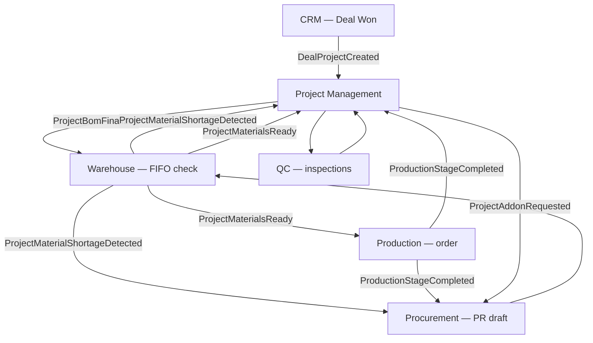
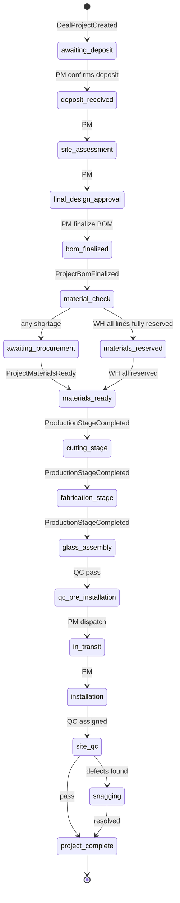
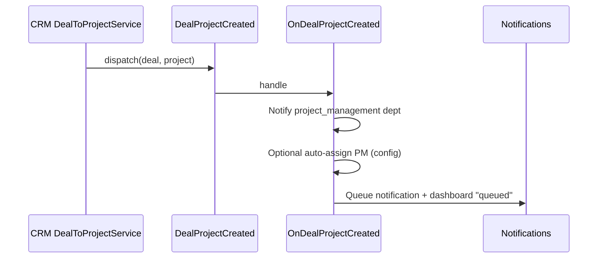
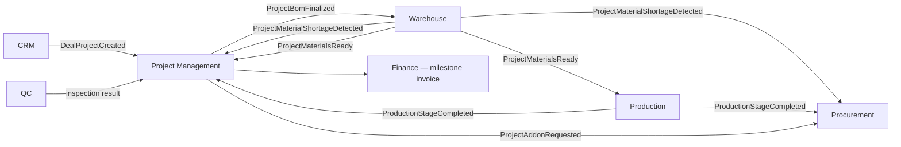

# Project Management — Implementation Plan

**Module:** Projects · BOM · Stage Machine · Cross-Module Orchestration  
**Stack:** PHP 8.2+ · Laravel 11 · PostgreSQL/MySQL · Next.js SPA  
**References:** [README.md](../README.md) §2 (Core Business Flow), §8.2 (Project Management), §10 (Integrations), [USER_ONBOARDING.MD](./USER_ONBOARDING.MD), [SALES_CRM.MD](./SALES_CRM.MD) §14 (Project Handoff), [WAREHOUSE.MD](./WAREHOUSE.MD) §8 (FIFO), §17 (Integration), planned [INTEGRATION_CONTRACT.MD](./INTEGRATION_CONTRACT.MD)  
**Version:** 1.0 · 2026

> **README cross-link:** [README.md §8.2](../README.md#82-project-management-module) should link to this document as the authoritative implementation plan for the Project Management module.

---

## Table of Contents

1. [Goals & Project-Centric Role](#1-goals--project-centric-role)
2. [Connecting Users by Department](#2-connecting-users-by-department)
3. [Project Lifecycle — 18 Stages](#3-project-lifecycle--18-stages)
4. [Repository & Folder Structure](#4-repository--folder-structure)
5. [CRM Handoff — Deal → Project](#5-crm-handoff--deal--project)
6. [BOM & Documents](#6-bom--documents)
7. [Database Schema](#7-database-schema)
8. [Core Services Spec](#8-core-services-spec)
9. [Events PUBLISH](#9-events-publish)
10. [Events LISTEN](#10-events-listen)
11. [API Endpoints](#11-api-endpoints)
12. [Permissions & Role Scoping](#12-permissions--role-scoping)
13. [Frontend Routes](#13-frontend-routes)
14. [Cross-Module Integration](#14-cross-module-integration)
15. [Audit Logging](#15-audit-logging)
16. [Implementation Phases](#16-implementation-phases)
17. [Resolved Integration Decisions](#17-resolved-integration-decisions)
18. [Remaining Open Questions](#18-remaining-open-questions)

---

## 1. Goals & Project-Centric Role

### What Project Management owns

| Object | Purpose |
|--------|---------|
| **Project** | Central execution entity — binds CRM, warehouse, procurement, production, QC, finance |
| **Project stage** | Single 18-step lifecycle (`ProjectStage` enum) — **only PM module writes `projects.stage`** |
| **BOM** | Bill of materials — Excel import or manual lines; versioned |
| **Documents** | Design PDFs/DWG, works plan, client-facing attachments |
| **Engineers** | PM-assigned production/installation engineers |
| **Delays** | Per-stage delay log with reason and days lost |
| **Floors / sections** | Apartment/block project tracking by floor or section |
| **Material status (read model)** | Aggregated view from Warehouse + Procurement for UI |

### What PM does **not** own (orchestrates via events)

| Object | Owner module |
|--------|--------------|
| Stock levels, FIFO reservations | Warehouse |
| Purchase requisitions, POs, GRNs, glass orders | Procurement |
| Production orders, cutting sheets, stage logs | Production |
| QC checklists & inspections | QC |
| Deal, contact, account | CRM (handoff only) |

### Golden rules

1. **Project-centric** — every operational action traces to `project_id` (README §2, §10).
2. **`ProjectStageService` is the sole writer** of `projects.stage` and `project_stage_logs`. Warehouse, Procurement, and Production **never** update `projects.stage` directly — they emit events or call `ProjectStageService`.
3. **BOM finalize** → emit `ProjectBomFinalized` → Warehouse runs stock check (FIFO).
4. **Glass is procurement-only** — `is_glass = true`, `is_procurement_only = true`; never a warehouse stock row.
5. **Client addons** the company does not manufacture → `ProjectAddonRequested` → Procurement requisition.
6. **Dashboard buckets:** queued (pre-production), started (in production), awaiting procurement (aggregate WH shortage + open PRs).
7. **Nairobi vs outside Nairobi:** `location_type` drives installation scope (fabrication-only vs full install) per README §8.2.



---

## 2. Connecting Users by Department

From [USER_ONBOARDING.MD](./USER_ONBOARDING.MD) §8.4 and README §7.1:

| Department slug | `default_module` | Landing route |
|-----------------|------------------|---------------|
| `project_management` | `projects` | `/projects` |

| Role slug | PM access level |
|-----------|-----------------|
| `super_admin` | Full projects + all records |
| `operations_manager` | Read all; approve delays; override stage where policy allows |
| `project_manager` | Full PM on **assigned** projects; assign engineers; BOM; stage advance |
| `sales_representative` | Read projects linked to owned deals (`sales_rep_id`) |
| `production_manager` | Read project + production tab; no direct stage write |
| `warehouse_manager_*` | Read material status; no stage write |
| `procurement_officer` | Read material status + procurement chips |
| `qc_inspector` | Read assigned projects; QC tab |
| `client` | Read-only client portal for own projects |

### Permission keys (add to `PermissionSeeder`)

```
# General
projects.view
projects.view_all              # managers — all projects
projects.create                # rare — post-CRM manual create
projects.update
projects.assign_pm
projects.assign_engineers

# Stage & timeline
projects.advance_stage         # manual advance where allowed
projects.log_delay
projects.update_timeline

# BOM
projects.bom.view
projects.bom.upload
projects.bom.finalize

# Documents
projects.documents.view
projects.documents.upload

# Addons (non-manufactured)
projects.addons.create

# Material status (read model)
projects.material_status.view

# Floors / apartment tracking
projects.floors.manage

# Client portal (external)
projects.client_portal.view    # scoped to client's projects only
```

### Route middleware pattern

```php
Route::middleware(['auth:sanctum', 'active', 'device.trusted'])
    ->prefix('projects')
    ->group(function () {
        require __DIR__.'/api/projects/projects.php';
    });
```

**Department guard (module tile):** user primary department `project_management` OR permission `projects.view`.

### Data scoping

| Role | Scope rule |
|------|------------|
| `project_manager` | `project_manager_id = auth()->id()` OR engineer on `project_engineers` |
| `sales_representative` | `sales_rep_id = auth()->id()` |
| `operations_manager` / `super_admin` | No filter (`projects.view_all`) |
| `client` | Policy: project linked to client user account (TBD — Agent 1 + onboarding) |

Implement via **Laravel Policies** + optional global scope toggled by `projects.view_all`.

### Frontend connection (`/auth/me` → Projects sidebar)

`frontend/lib/navigation.ts` department `projects` paths map to API. Sidebar shows Projects when `permissions` includes `projects.view`.

---

## 3. Project Lifecycle — 18 Stages

Stage values **must** match [`backend/app/Enums/ProjectStage.php`](../backend/app/Enums/ProjectStage.php) exactly.

### 3.1 Stage reference table

| # | Enum case | DB value (`projects.stage`) | Typical trigger | Transition type |
|---|-----------|-------------------------------|-----------------|-----------------|
| 1 | `AwaitingDeposit` | `awaiting_deposit` | CRM handoff when deposit **not** yet satisfied | **Automatic** (CRM / PM listener on `DealProjectCreated`) |
| 2 | `DepositReceived` | `deposit_received` | CRM handoff when deal deposit **satisfied**, or PM confirms deposit | **Automatic** or **Manual** (see [INTEGRATION_CONTRACT.MD](./INTEGRATION_CONTRACT.MD) §11 Q1) |
| 3 | `SiteAssessment` | `site_assessment` | PM schedules engineer site visit | **Manual** (PM) |
| 4 | `FinalDesignApproval` | `final_design_approval` | Client approves design PDF/DWG | **Manual** (PM) |
| 5 | `BomFinalized` | `bom_finalized` | PM calls finalize BOM API | **Manual** (PM) → emits `ProjectBomFinalized` |
| 6 | `MaterialCheck` | `material_check` | WH listener on `ProjectBomFinalized` starts check | **Automatic** (WH via `ProjectStageService`) |
| 7 | `MaterialsReserved` | `materials_reserved` | WH FIFO — **all** stockable lines fully reserved (all-or-nothing) | **Automatic** (WH) |
| 8 | `AwaitingProcurement` | `awaiting_procurement` | WH emits `ProjectMaterialShortageDetected` (any line cannot be fully reserved) | **Automatic** (WH) |
| 9 | `MaterialsReady` | `materials_ready` | WH emits `ProjectMaterialsReady` | **Automatic** (WH) |
| 10 | `CuttingStage` | `cutting_stage` | PROD completes cutting / sync from production | **Automatic** (PROD via `ProjectStageService`) |
| 11 | `FabricationStage` | `fabrication_stage` | PROD stage complete | **Automatic** (PROD) |
| 12 | `GlassAssembly` | `glass_assembly` | PROD reaches glass assembly | **Automatic** (PROD) → notifies PROC for glass order |
| 13 | `QcPreInstallation` | `qc_pre_installation` | QC post-fabrication pass | **Manual/Automatic** (QC result → PM listener) |
| 14 | `InTransit` | `in_transit` | Dispatch to site (**outside Nairobi / full install only**) | **Manual** (PM) |
| 15 | `Installation` | `installation` | Installation team on site (**skipped for Nairobi fabrication-only**) | **Manual** (PM) |
| 16 | `SiteQc` | `site_qc` | Site QC inspection (**skipped for Nairobi fabrication-only**) | **Automatic** (QC) |
| 17 | `Snagging` | `snagging` | Snagging items logged | **Manual** (PM/QC) |
| 18 | `ProjectComplete` | `project_complete` | Client sign-off + final payment flag | **Manual** (PM) |

### 3.2 Lifecycle diagram



### 3.3 Completion percent

`completion_percent` on `projects` is derived from stage index (1–18):

```
completion_percent = floor((stage_index / 18) * 100)
```

PM may override for apartment/block projects using floor-level progress (weighted average across `project_floors`).

### 3.4 Delay logging

When a stage transition exceeds projected timeline or external blocker occurs, PM (or automatic listener on procurement delay) inserts `project_delays`:

- `stage` — stage where delay occurred  
- `reason` — enum: `procurement`, `production_capacity`, `client_decision`, `site_not_ready`, `material_damage`, `other`  
- `days_lost` — integer  
- Alert when `projected_end - today <= 3 days` and project not on track (README §8.2).

### 3.5 Stage ownership rule (integration contract)

> **Only `App\Services\Projects\ProjectStageService` may write `projects.stage`.**  
> Other modules call:
>
> ```php
> $projectStageService->transition($project, ProjectStage::MaterialsReady, $context);
> ```
>
> or register event listeners that delegate to this service. Direct `Project::update(['stage' => ...])` outside `ProjectStageService` is forbidden.

---

## 4. Repository & Folder Structure

Same convention as CRM and Warehouse ([SALES_CRM.MD §3](./SALES_CRM.MD#3-repository--module-folder-structure-match-user-onboarding), [USER_ONBOARDING.MD §14](./USER_ONBOARDING.MD#14-laravel-module-structure-implemented)):

```
backend/app/
├── Enums/
│   └── ProjectStage.php                    # exists — do not duplicate
├── Events/
│   └── Projects/
│       ├── ProjectBomFinalized.php
│       └── ProjectAddonRequested.php
├── Listeners/
│   └── Projects/
│       ├── OnDealProjectCreated.php
│       ├── OnProjectMaterialShortageDetected.php
│       ├── OnProjectMaterialsReady.php
│       └── OnProductionStageCompleted.php
├── Http/Controllers/Projects/
│   ├── ProjectController.php
│   ├── ProjectDashboardController.php
│   ├── AssignProjectManagerController.php
│   ├── ProjectDocumentController.php
│   ├── ProjectBomController.php
│   ├── FinalizeBomController.php
│   ├── AdvanceProjectStageController.php
│   ├── ProjectMaterialStatusController.php
│   ├── ProjectDelayController.php
│   ├── ProjectFloorController.php
│   ├── ProjectEngineerController.php
│   └── ProjectAddonController.php
├── Http/Requests/Projects/
│   ├── StoreProjectRequest.php
│   ├── UpdateProjectRequest.php
│   ├── UploadBomRequest.php
│   ├── FinalizeBomRequest.php
│   ├── AdvanceStageRequest.php
│   ├── StoreProjectDelayRequest.php
│   └── StoreProjectAddonRequest.php
├── Http/Resources/Projects/
│   ├── ProjectResource.php
│   ├── ProjectDetailResource.php
│   ├── ProjectBomResource.php
│   ├── ProjectMaterialStatusResource.php
│   └── ProjectTimelineResource.php
├── Models/
│   ├── Project.php                         # exists
│   ├── ProjectStageLog.php
│   ├── ProjectDocument.php
│   ├── ProjectBom.php
│   ├── ProjectBomLine.php
│   ├── ProjectEngineer.php
│   ├── ProjectDelay.php
│   ├── ProjectFloor.php
│   └── ProjectStageRequirement.php
├── Services/Projects/
│   ├── ProjectStageService.php             # sole stage writer
│   ├── BomImportService.php
│   ├── ProjectMaterialStatusService.php
│   ├── ProjectReferenceGenerator.php
│   ├── ProjectDocumentStorageService.php # wraps BiboStorage / Firebase
│   └── ProjectDashboardService.php
├── Policies/
│   └── ProjectPolicy.php
└── routes/api/projects/
    ├── projects.php
    ├── bom.php
    ├── documents.php
    └── dashboard.php
```

**Shared (do not duplicate):**

- `App\Services\Crm\Deals\DealToProjectService` — CRM owns deal → project creation  
- `App\Events\Crm\DealProjectCreated` — PM listens  
- `App\Services\Audit\OwenAuditLogger` — audit trail  

**File ownership (parallel agents):** `backend/app/Services/Projects/*` and `backend/app/Http/Controllers/Projects/*` — **Agent 1 only**.

---

## 5. CRM Handoff — Deal → Project

### Entry point

| Item | Value |
|------|-------|
| CRM endpoint | `POST /api/crm/deals/{id}/create-project` |
| Permission | `deals.create_project` |
| Precondition | Deal stage = `won` |
| Service | `App\Services\Crm\Deals\DealToProjectService` |
| Event emitted | `DealProjectCreated` |

### Field mapping (implemented)

Source: [`DealToProjectService.php`](../backend/app/Services/Crm/Deals/DealToProjectService.php) + [SALES_CRM.MD §14](./SALES_CRM.MD#14-project-handoff).

| Project column | Source (deal / CRM) | Notes |
|----------------|---------------------|-------|
| `reference` | Generated `PR-{RANDOM8}` | Unique project reference |
| `name` | `deal.name` ?? `deal.title` | |
| `deal_id` | `deal.id` | Back-link to CRM |
| `contact_id` | `deal.primary_contact_id` ?? `deal.contact_id` | |
| `account_id` | `deal.account_id` | Required — validation fails if missing |
| `site_address` | `deal.site_address` | |
| `quoted_amount` | `final_agreed_amount` ?? `estimated_value` ?? `amount` | |
| `deposit_received` | `deposit_paid_amount` ?? `deposit_amount` | |
| `sales_rep_id` | `deal_owner_id` ?? `owner_id` ?? acting user | |
| `stage` | `awaiting_deposit` | `ProjectStage::AwaitingDeposit` |
| `project_manager_id` | — | **Null at handoff** — PM assigns via listener or manual assign |
| `type` | — | Default `full_install`; PM updates from deal product scope |
| `location_type` | — | Default `nairobi`; PM sets Nairobi vs outside |
| `projected_start` / `projected_end` | Deal `expected_installation_date` (optional) | PM refines |
| `approved_quotation_id` | Latest accepted quotation | Future column or document link |

**Deal updates after handoff:**

- `deal.stage` → `project_created`  
- `deal.project_id` → new project id  

### PM listener on `DealProjectCreated`



**Listener responsibilities (Agent 1):**

1. Notify `project_management` department (in-app + email phase 2).  
2. Optionally assign `project_manager_id` if config `bibo.pm.auto_assign_round_robin` enabled.  
3. Create initial `project_stage_logs` entry: `null → awaiting_deposit`.  
4. Do **not** advance stage — deposit confirmation is PM manual step unless CRM already recorded full deposit (future: auto → `deposit_received` if `deposit_received >= required`).

### Handoff diagram

```mermaid
flowchart LR
    DEAL[Deal Won] --> SVC[DealToProjectService]
    SVC --> PROJ[Project created stage=awaiting_deposit]
    SVC --> EVT[DealProjectCreated]
    EVT --> LIST[PM Listeners]
    LIST --> ASSIGN[Assign PM / notify ops]
    PROJ --> PMUI[/projects/id]
```

---

## 6. BOM & Documents

### 6.1 Document types (`project_documents`)

| `type` | Description | Required at stage |
|--------|-------------|-------------------|
| `design_pdf` | Client-facing final design | `final_design_approval` |
| `design_dwg` | CAD source | `final_design_approval` |
| `works_plan` | Internal execution plan | `site_assessment` or before `bom_finalized` |
| `bom_source` | Original Excel upload | `bom_finalized` |
| `site_photo` | Site assessment photos | `site_assessment` |
| `client_signoff` | Sign-off scan | `project_complete` |

Storage: `path` + optional `firebase_url` (match CRM/HR pattern). Version increment on re-upload same `type`.

### 6.2 BOM structure

| Table | Purpose |
|-------|---------|
| `project_boms` | Header: version, status (`draft` \| `finalized`), source file |
| `project_bom_lines` | Line items with type-specific fields |

**BOM workflow:**

1. PM uploads Excel **or** POST JSON lines → `BomImportService` → `project_bom_lines` (status `draft`).  
2. PM reviews/edits lines in UI.  
3. PM calls `POST /api/projects/{id}/finalize-bom` → status `finalized`, stage → `bom_finalized`, emit **`ProjectBomFinalized`**.  
4. Warehouse listener runs FIFO stock check (WAREHOUSE.MD §8).

### 6.3 BOM line types

| `line_type` | Fields | Warehouse | Procurement |
|-------------|--------|-----------|-------------|
| `accessory` | `material_name`, `material_code`, `quantity`, optional `warehouse_item_id` | Yes — reserve from accessories deck | If shortage |
| `aluminium_profile` | `material_name`, `material_code`, `measurement_mm` (length), `quantity` (pieces/bars) | Yes — reserve profiles + check offcuts | If shortage |
| `rubber` | `material_name`, `material_code`, `quantity`, `compatible_profile_code` | Yes — rubbers deck | If shortage |
| `glass` | `material_name`, `material_code`, `quantity`, dimensions in `notes` | **No** — `is_procurement_only = true`, `is_glass = true` | Always — project-specific glass |
| `addon` | `material_name`, `description`, `quantity`, client-requested spec | **No** — `is_addon = true`, non-manufactured | Via `ProjectAddonRequested` |

**Flags on `project_bom_lines`:**

| Column | When true |
|--------|-----------|
| `is_procurement_only` | Never warehouse stock (glass, special order items) |
| `is_glass` | Glass line — PROC creates `glass_orders`, not GRN to stock |
| `is_addon` | Client addon company does not manufacture |
| `warehouse_item_id` | Resolved SKU from `warehouse_items` after import mapping |

### 6.4 Excel import spec (`BomImportService`)

**Accepted formats:** `.xlsx`, `.xls` (phase 1); CSV optional.

**Expected columns (row 1 header):**

| Column header (aliases) | Maps to |
|-------------------------|---------|
| `Line Type` / `Type` | `line_type` enum |
| `Material Code` / `SKU` / `Code` | `material_code` → lookup `warehouse_items.sku` |
| `Material Name` / `Description` | `material_name` |
| `Quantity` / `Qty` | `quantity` |
| `Length (mm)` / `Measurement` | `measurement_mm` (profiles) |
| `Notes` | `notes` |
| `Glass` (Y/N) | Sets `is_glass`, `is_procurement_only` |
| `Addon` (Y/N) | Sets `is_addon` |

**Import rules:**

1. Unknown SKU → line saved with `warehouse_item_id = null`; PM must map manually before finalize.  
2. `line_type = glass` → force `is_procurement_only = true`, skip warehouse mapping validation.  
3. Duplicate codes aggregate optional (config: merge qty vs separate lines).  
4. Store source file path on `project_boms.source_file_path`.  
5. Validation errors return row numbers without partial finalize.

**Manual entry:** same fields via `POST /api/projects/{id}/bom` JSON body:

```json
{
  "lines": [
    {
      "line_type": "aluminium_profile",
      "material_code": "PROF-SLD-80MM",
      "material_name": "80mm Sliding Frame",
      "measurement_mm": 2400,
      "quantity": 12
    },
    {
      "line_type": "glass",
      "material_name": "6mm Clear Tempered",
      "quantity": 4,
      "notes": "1200x2400 mm"
    }
  ]
}
```

### 6.5 Apartment / floor tracking

For `priority = apartment_block` projects:

- `project_floors` rows: `floor_label` (e.g. "Floor 3", "Block A — Wing 2"), `section_notes`, optional `stage_override`, `completion_percent`.  
- BOM lines may tag `floor_id` (future column on `project_bom_lines`) for section-specific material lists.  
- Timeline UI shows per-floor progress bars.

---

## 7. Database Schema

### 7.1 Existing tables (`2025_05_19_300000_create_projects_tables.php`)

Already migrated:

- `projects` — core project row  
- `project_stage_logs` — audit trail of stage changes  
- `project_documents` — file metadata  

Key `projects` columns (see [`Project.php`](../backend/app/Models/Project.php)):

```sql
-- Abbreviated — full migration in backend/database/migrations/2025_05_19_300000_create_projects_tables.php
CREATE TABLE projects (
    id                          BIGSERIAL PRIMARY KEY,
    reference                   VARCHAR(255) NOT NULL UNIQUE,
    name                        VARCHAR(255) NOT NULL,
    deal_id                     BIGINT NULL REFERENCES deals(id),
    contact_id                  BIGINT NULL REFERENCES contacts(id),
    account_id                  BIGINT NULL REFERENCES accounts(id),
    type                        VARCHAR(64) NOT NULL DEFAULT 'full_install',
    location_type               VARCHAR(32) NOT NULL DEFAULT 'nairobi',
    site_address                TEXT NULL,
    stage                       VARCHAR(64) NOT NULL DEFAULT 'awaiting_deposit',
    completion_percent          SMALLINT NOT NULL DEFAULT 0,
    priority                    VARCHAR(32) NOT NULL DEFAULT 'normal',
    quoted_amount               DECIMAL(14,2) NULL,
    deposit_received            DECIMAL(14,2) NULL,
    overage_buffer_percent      SMALLINT NOT NULL DEFAULT 0,
    projected_start             DATE NULL,
    projected_end               DATE NULL,
    actual_start                DATE NULL,
    actual_end                  DATE NULL,
    sales_rep_id                BIGINT NULL REFERENCES users(id),
    project_manager_id          BIGINT NULL REFERENCES users(id),
    client_notes                TEXT NULL,
    internal_notes              TEXT NULL,
    created_at                  TIMESTAMP NOT NULL,
    updated_at                  TIMESTAMP NOT NULL,
    deleted_at                  TIMESTAMP NULL
);
```

### 7.2 Proposed expansion — `2025_05_19_300001_expand_project_bom_tables.php`

**SQL only** (implementation agent converts to Laravel migration):

```sql
-- BOM header (versioned)
CREATE TABLE project_boms (
    id                  BIGSERIAL PRIMARY KEY,
    project_id          BIGINT NOT NULL REFERENCES projects(id) ON DELETE CASCADE,
    version             INT NOT NULL DEFAULT 1,
    status              VARCHAR(30) NOT NULL DEFAULT 'draft',  -- draft, finalized, superseded
    uploaded_by         BIGINT NULL REFERENCES users(id),
    source_file_path    VARCHAR(500) NULL,
    source_firebase_url VARCHAR(500) NULL,
    finalized_at        TIMESTAMP NULL,
    finalized_by        BIGINT NULL REFERENCES users(id),
    notes               TEXT NULL,
    created_at          TIMESTAMP NOT NULL,
    updated_at          TIMESTAMP NOT NULL,
    UNIQUE (project_id, version)
);

CREATE INDEX idx_project_boms_project_status ON project_boms(project_id, status);

-- BOM lines
CREATE TABLE project_bom_lines (
    id                  BIGSERIAL PRIMARY KEY,
    bom_id              BIGINT NOT NULL REFERENCES project_boms(id) ON DELETE CASCADE,
    line_type           VARCHAR(30) NOT NULL,  -- accessory, aluminium_profile, rubber, glass, addon
    warehouse_item_id   BIGINT NULL,             -- FK to warehouse_items.id when mapped
    material_code       VARCHAR(50) NULL,
    material_name       VARCHAR(255) NOT NULL,
    quantity            DECIMAL(15,3) NOT NULL DEFAULT 1,
    measurement_mm      INT NULL,                -- profile cut length or rubber metre
    is_procurement_only BOOLEAN NOT NULL DEFAULT FALSE,
    is_glass            BOOLEAN NOT NULL DEFAULT FALSE,
    is_addon            BOOLEAN NOT NULL DEFAULT FALSE,
    compatible_profile_code VARCHAR(50) NULL,    -- rubber lines
    floor_id            BIGINT NULL,             -- optional FK project_floors.id
    sort_order          INT NOT NULL DEFAULT 0,
    notes               TEXT NULL,
    created_at          TIMESTAMP NOT NULL,
    updated_at          TIMESTAMP NOT NULL
);

CREATE INDEX idx_project_bom_lines_bom ON project_bom_lines(bom_id);
CREATE INDEX idx_project_bom_lines_item ON project_bom_lines(warehouse_item_id);

-- Engineers assigned to project
CREATE TABLE project_engineers (
    id                  BIGSERIAL PRIMARY KEY,
    project_id          BIGINT NOT NULL REFERENCES projects(id) ON DELETE CASCADE,
    user_id             BIGINT NOT NULL REFERENCES users(id),
    role                VARCHAR(50) NOT NULL DEFAULT 'engineer',  -- engineer, lead_engineer, installation
    assigned_by         BIGINT NULL REFERENCES users(id),
    assigned_at         TIMESTAMP NOT NULL DEFAULT NOW(),
    removed_at          TIMESTAMP NULL,
    UNIQUE (project_id, user_id, role)
);

-- Delay log
CREATE TABLE project_delays (
    id                  BIGSERIAL PRIMARY KEY,
    project_id          BIGINT NOT NULL REFERENCES projects(id) ON DELETE CASCADE,
    stage               VARCHAR(64) NOT NULL,    -- ProjectStage value at time of delay
    reason              VARCHAR(50) NOT NULL,    -- procurement, production_capacity, client_decision, site_not_ready, material_damage, other
    days_lost           INT NOT NULL DEFAULT 0,
    notes               TEXT NULL,
    logged_by           BIGINT NOT NULL REFERENCES users(id),
    logged_at           TIMESTAMP NOT NULL DEFAULT NOW(),
    created_at          TIMESTAMP NOT NULL,
    updated_at          TIMESTAMP NOT NULL
);

CREATE INDEX idx_project_delays_project ON project_delays(project_id);

-- Apartment / floor tracking
CREATE TABLE project_floors (
    id                  BIGSERIAL PRIMARY KEY,
    project_id          BIGINT NOT NULL REFERENCES projects(id) ON DELETE CASCADE,
    floor_label         VARCHAR(100) NOT NULL,
    section_notes       TEXT NULL,
    completion_percent  SMALLINT NOT NULL DEFAULT 0,
    sort_order          INT NOT NULL DEFAULT 0,
    created_at          TIMESTAMP NOT NULL,
    updated_at          TIMESTAMP NOT NULL,
    UNIQUE (project_id, floor_label)
);

-- Optional lookup — documents required before stage advance
CREATE TABLE project_stage_requirements (
    id                  BIGSERIAL PRIMARY KEY,
    stage               VARCHAR(64) NOT NULL UNIQUE,  -- ProjectStage value
    required_documents  JSONB NOT NULL DEFAULT '[]',  -- e.g. ["design_pdf", "works_plan"]
    is_active           BOOLEAN NOT NULL DEFAULT TRUE,
    created_at          TIMESTAMP NOT NULL,
    updated_at          TIMESTAMP NOT NULL
);

-- Client addon requests (non-manufactured) — PM origin; PROC owns fulfillment
CREATE TABLE project_addon_requests (
    id                  BIGSERIAL PRIMARY KEY,
    project_id          BIGINT NOT NULL REFERENCES projects(id) ON DELETE CASCADE,
    bom_line_id         BIGINT NULL REFERENCES project_bom_lines(id),
    description         TEXT NOT NULL,
    quantity            DECIMAL(15,3) NOT NULL DEFAULT 1,
    client_requested    BOOLEAN NOT NULL DEFAULT TRUE,
    status              VARCHAR(30) NOT NULL DEFAULT 'pending',  -- pending, requisition_created, ordered, delivered, cancelled
    requested_by        BIGINT NOT NULL REFERENCES users(id),
    requested_at        TIMESTAMP NOT NULL DEFAULT NOW(),
    created_at          TIMESTAMP NOT NULL,
    updated_at          TIMESTAMP NOT NULL
);
```

**Post-migration FK (when warehouse migration lands):**

```sql
ALTER TABLE project_bom_lines
    ADD CONSTRAINT fk_project_bom_lines_warehouse_item
    FOREIGN KEY (warehouse_item_id) REFERENCES warehouse_items(id) ON DELETE SET NULL;

ALTER TABLE project_bom_lines
    ADD CONSTRAINT fk_project_bom_lines_floor
    FOREIGN KEY (floor_id) REFERENCES project_floors(id) ON DELETE SET NULL;
```

---

## 8. Core Services Spec

### 8.1 `ProjectStageService`

**Path:** `App\Services\Projects\ProjectStageService`

**Responsibilities:**

- Sole writer of `projects.stage` and append-only `project_stage_logs`.  
- Validate transitions against allowed graph (§3).  
- Update `completion_percent` from stage index.  
- Set `actual_start` on first move past `deposit_received`; `actual_end` on `project_complete`.  
- Emit domain events when transitions require cross-module side effects (delegated to listeners).  
- Reject direct stage skips unless user has `projects.advance_stage` + override flag (operations manager).

**Public API:**

```php
public function transition(
    Project $project,
    ProjectStage $toStage,
    ?User $actor = null,
    array $context = [],  // delay_reason, notes, force: bool
): Project;

public function canTransition(Project $project, ProjectStage $toStage): bool;

public function currentStage(Project $project): ProjectStage;
```

**Never** call from Warehouse/Procurement/Production controllers directly on the model — inject this service in their **listeners** only.

### 8.2 `BomImportService`

**Path:** `App\Services\Projects\BomImportService`

**Responsibilities:**

- Parse Excel/JSON → `project_bom_lines`.  
- Map `material_code` → `warehouse_items.sku` (nullable if not found).  
- Enforce glass/addon flags (§6.3).  
- Create new `project_boms` version on re-upload (increment `version`, mark prior as `superseded`).  
- Return import summary: `{ imported, skipped, unmapped_skus[] }`.

**Dependencies:** PhpSpreadsheet (Excel), `ProjectDocumentStorageService`.

### 8.3 `ProjectMaterialStatusService`

**Path:** `App\Services\Projects\ProjectMaterialStatusService`

**Read-only aggregate** for `GET /api/projects/{id}/material-status` — PM owns endpoint; data from WH + PROC.

**Response shape:**

```json
{
  "project_id": 42,
  "stage": "awaiting_procurement",
  "bom_version": 1,
  "summary": {
    "total_lines": 48,
    "warehouse_lines": 44,
    "procurement_only_lines": 4,
    "fully_reserved": 30,
    "shortage_lines": 8,
    "open_requisitions": 2,
    "glass_orders_pending": 1
  },
  "lines": [
    {
      "bom_line_id": 101,
      "material_code": "PROF-SLD-80MM",
      "required_qty": 12,
      "reserved_qty": 12,
      "shortage_qty": 0,
      "offcut_allocated": false,
      "requisition_id": null
    }
  ],
  "fifo_position": 3
}
```

**Data sources (Agent 2 + 3 implement read APIs or shared views):**

- `stock_reservations` + `stock_reservation_lines` (Warehouse)  
- `purchase_requisition_lines` where `project_bom_line_id` set (Procurement)  
- `glass_orders` (Procurement)  

---

## 9. Events PUBLISH

Event names follow planned [INTEGRATION_CONTRACT.MD](./INTEGRATION_CONTRACT.MD) — **do not invent alternates**.

| Event | Class (proposed) | When emitted | Payload |
|-------|------------------|--------------|---------|
| `ProjectBomFinalized` | `App\Events\Projects\ProjectBomFinalized` | PM finalizes BOM | `project`, `bom`, `lines[]` |
| `ProjectAddonRequested` | `App\Events\Projects\ProjectAddonRequested` | PM POST addon | `project`, `addonRequest`, optional `bomLine` |

**`ProjectBomFinalized` listeners (other agents):**

| Listener owner | Action |
|----------------|--------|
| Warehouse (Agent 2) | Run `BomStockCheckService` → FIFO reserve or shortage |
| PM (self) | Transition → `material_check` via `ProjectStageService` |

**`ProjectAddonRequested` listeners:**

| Listener owner | Action |
|----------------|--------|
| Procurement (Agent 3) | Create `project_addon_requests` + PR line `trigger_type = client_addon` |

Register in `AppServiceProvider::boot` under named methods (`registerProjectEventListeners`).

---

## 10. Events LISTEN

| Event | Publisher | PM listener | PM action |
|-------|-----------|-------------|-----------|
| `DealProjectCreated` | CRM | `OnDealProjectCreated` | Notify PM dept; optional PM assign; initial stage log |
| `ProjectMaterialShortageDetected` | Warehouse | `OnProjectMaterialShortageDetected` | `ProjectStageService` → `awaiting_procurement`; log delay if configured |
| `ProjectMaterialsReady` | Warehouse | `OnProjectMaterialsReady` | `ProjectStageService` → `materials_ready` |
| `ProductionStageCompleted` | Production | `OnProductionStageCompleted` | Map production stage → project stage (e.g. cutting → `cutting_stage`); at `glass_assembly` ensure PROC notified |

**Related events PM does not publish but depends on:**

| Event | Publisher | Effect on PM |
|-------|-----------|--------------|
| `PurchaseRequisitionApproved` | Procurement | Material status chip updates |
| `GoodsReceiptVerified` | Procurement | WH inbound → may clear shortage → eventual `ProjectMaterialsReady` |
| `OffcutLogged` | Production/WH | May reduce shortage without procurement |

### Listener registration sketch

```php
// AppServiceProvider — Agent 1 section
Event::listen(DealProjectCreated::class, OnDealProjectCreated::class);
Event::listen(ProjectMaterialShortageDetected::class, OnProjectMaterialShortageDetected::class);
Event::listen(ProjectMaterialsReady::class, OnProjectMaterialsReady::class);
Event::listen(ProductionStageCompleted::class, OnProductionStageCompleted::class);
```

**Production → PM stage mapping (Agent 4 coordinates):**

| Production stage | Project stage |
|------------------|---------------|
| `cutting` | `cutting_stage` |
| `fabrication` | `fabrication_stage` |
| `glass_assembly` | `glass_assembly` |
| `finishing` | `qc_pre_installation` (or hold until QC trigger) |

---

## 11. API Endpoints

Base: `/api/projects` · Auth: `auth:sanctum`, `active`, `device.trusted`

### Projects CRUD & assignment

| Method | Path | Permission | Purpose |
|--------|------|------------|---------|
| GET | `/projects` | `projects.view` | List with filters: stage, pm, priority, dashboard bucket |
| POST | `/projects` | `projects.create` | Manual create (rare — normally CRM handoff) |
| GET | `/projects/{id}` | `projects.view` | Detail + relations |
| PATCH | `/projects/{id}` | `projects.update` | Update metadata, timeline, notes |
| POST | `/projects/{id}/assign-pm` | `projects.assign_pm` | Set `project_manager_id` |
| GET | `/projects/dashboard` | `projects.view` | Queued / started / awaiting procurement counts |

### Stage & timeline

| Method | Path | Permission | Purpose |
|--------|------|------------|---------|
| POST | `/projects/{id}/advance-stage` | `projects.advance_stage` | Manual transition where allowed (§3) |
| GET | `/projects/{id}/timeline` | `projects.view` | Stage logs + delays + projected vs actual |
| POST | `/projects/{id}/delays` | `projects.log_delay` | Insert `project_delays` |
| GET | `/projects/pipeline` | `projects.view` | Kanban by `ProjectStage` |
| GET | `/projects/timeline` | `projects.view_all` | Gantt aggregate |

### Engineers & floors

| Method | Path | Permission | Purpose |
|--------|------|------------|---------|
| GET/POST | `/projects/{id}/engineers` | `projects.assign_engineers` | List / assign engineers |
| DELETE | `/projects/{id}/engineers/{userId}` | `projects.assign_engineers` | Remove assignment |
| GET/POST | `/projects/{id}/floors` | `projects.floors.manage` | Apartment floor tracking |

### Documents

| Method | Path | Permission | Purpose |
|--------|------|------------|---------|
| GET | `/projects/{id}/documents` | `projects.documents.view` | List versions |
| POST | `/projects/{id}/documents` | `projects.documents.upload` | Multipart upload |
| GET | `/projects/{id}/documents/{docId}/download` | `projects.documents.view` | Signed URL |

### BOM

| Method | Path | Permission | Purpose |
|--------|------|------------|---------|
| GET | `/projects/{id}/bom` | `projects.bom.view` | Current BOM + lines |
| POST | `/projects/{id}/bom` | `projects.bom.upload` | Excel file or JSON lines |
| PATCH | `/projects/{id}/bom/lines/{lineId}` | `projects.bom.upload` | Edit draft line |
| POST | `/projects/{id}/finalize-bom` | `projects.bom.finalize` | Finalize + **`ProjectBomFinalized`** |

### Material status & addons

| Method | Path | Permission | Purpose |
|--------|------|------------|---------|
| GET | `/projects/{id}/material-status` | `projects.material_status.view` | WH + PROC aggregate |
| POST | `/projects/{id}/addons` | `projects.addons.create` | Client addon → **`ProjectAddonRequested`** |

**List response shape:** `{ data, meta }` with pagination (integration contract).

---

## 12. Permissions & Role Scoping

### Role → permission mapping (extend `RolePermissionSeeder`)

| Role | Permissions (summary) |
|------|------------------------|
| `project_manager` | `projects.view`, `projects.update`, `projects.assign_engineers`, `projects.advance_stage`, `projects.bom.*`, `projects.documents.*`, `projects.log_delay`, `projects.material_status.view`, `projects.addons.create`, `projects.floors.manage` |
| `operations_manager` | `projects.view_all`, all PM permissions, override stage |
| `super_admin` | all `projects.*` |
| `sales_representative` | `projects.view` (scoped to `sales_rep_id`) |
| `production_manager` | `projects.view`, `projects.material_status.view` |
| `warehouse_manager_*` | `projects.view`, `projects.material_status.view` |
| `procurement_officer` | `projects.view`, `projects.material_status.view` |
| `qc_inspector` | `projects.view` (assigned projects) |
| `client` | `projects.client_portal.view` (own projects only) |

### Dashboard buckets (query semantics)

| Bucket | SQL filter (conceptual) |
|--------|-------------------------|
| **Queued** | `stage IN (awaiting_deposit, deposit_received, site_assessment, final_design_approval, bom_finalized, material_check, materials_reserved)` |
| **Awaiting procurement** | `stage = awaiting_procurement` OR material-status `shortage_lines > 0` |
| **Started** | `stage IN (materials_ready, cutting_stage, fabrication_stage, glass_assembly, qc_pre_installation, in_transit, installation, site_qc, snagging)` |

`ProjectDashboardService` aggregates WH + PROC counts for awaiting procurement chip (open PRs linked to project).

### Policy example

```php
// ProjectPolicy
public function view(User $user, Project $project): bool
{
    if ($user->can('projects.view_all')) return true;
    if ($user->can('projects.view') && $project->project_manager_id === $user->id) return true;
    if ($user->can('projects.view') && $project->sales_rep_id === $user->id) return true;
    if ($project->engineers()->where('user_id', $user->id)->exists()) return true;
    return false;
}

public function advanceStage(User $user, Project $project): bool
{
    return $user->can('projects.advance_stage')
        && ($project->project_manager_id === $user->id || $user->can('projects.view_all'));
}
```

---

## 13. Frontend Routes

From `frontend/lib/navigation.ts` (existing shell):

| Route | Purpose | Tabs / views |
|-------|---------|--------------|
| `/projects` | All projects list + dashboard buckets | Filters: queued, started, awaiting procurement |
| `/projects/pipeline` | Kanban by `ProjectStage` | Drag disabled until API supports guarded transitions |
| `/projects/timeline` | Gantt — projected vs actual | Company-wide; requires `projects.view_all` |
| `/projects/client-portal` | Client read-only view | Stage, photos, PM notes |
| `/projects/[id]` | **Project detail hub** | Overview · BOM · Documents · Material Status · Production · Timeline · Floors |

### Project detail tabs (`/projects/[id]`)

| Tab | API | Owner agent |
|-----|-----|-------------|
| Overview | `GET /projects/{id}` | Agent 1 |
| BOM | `GET/POST /projects/{id}/bom` | Agent 1 |
| Documents | `GET/POST /projects/{id}/documents` | Agent 1 |
| Material Status | `GET /projects/{id}/material-status` | Agent 1 (read model; WH+PROC data) |
| Production | `GET /production/orders?project_id=` | Agent 4 |
| Timeline | `GET /projects/{id}/timeline` | Agent 1 |
| Floors | `GET /projects/{id}/floors` | Agent 1 (apartment projects) |

### API client

```
frontend/lib/api/projects/
  projects.ts
  bom.ts
  documents.ts
  material-status.ts
```

Use `withCredentials: true` per USER_ONBOARDING §18.

### UI chips (cross-module)

- **Material:** Reserved / Shortage / Awaiting GRN (from material-status)  
- **Procurement:** Open PR count, glass order status  
- **Production:** Current production stage + FIFO position  

---

## 14. Cross-Module Integration



| From | To | Integration | Event / API |
|------|-----|-------------|-------------|
| CRM | PM | Deal won → project | `DealProjectCreated` |
| PM | WH | BOM finalized → stock check | `ProjectBomFinalized` |
| WH | PM | Shortage / ready | `ProjectMaterialShortageDetected`, `ProjectMaterialsReady` |
| WH | PROC | Shortage → PR draft | `ProjectMaterialShortageDetected` |
| PROC | WH | GRN verified → inbound | `GoodsReceiptVerified` |
| PM | PROC | Client addon | `ProjectAddonRequested` |
| PM | PROC | Glass at `glass_assembly` | Stage listener + `glass_orders` |
| WH | PROD | Materials ready | `ProjectMaterialsReady` |
| PROD | PM | Stage sync | `ProductionStageCompleted` → `ProjectStageService` |
| PROD | WH | Cutting → offcuts | `OffcutLogged` |
| QC | PM | Pass/fail → stage | Service call to `ProjectStageService` |
| PM | Finance | Project complete | Future: invoice milestone event |

### Agent boundaries

| Agent | Module | Owns |
|-------|--------|------|
| **Agent 1** | Project Management | Stage machine, BOM, documents, PM APIs, material-status read model |
| **Agent 2** | Warehouse | FIFO, reservations, listens `ProjectBomFinalized` |
| **Agent 3** | Procurement | PR/PO/GRN, glass, addons; listens shortage + addon events |
| **Agent 4** | Production | Production orders; listens `ProjectMaterialsReady`; emits `ProductionStageCompleted` |

**Shared coordination file:** [INTEGRATION_CONTRACT.MD](./INTEGRATION_CONTRACT.MD) (Week 0 — all agents).

---

## 15. Audit Logging

Use `OwenAuditLogger` / `Project` model `Auditable` trait (module: `projects`).

| Action | Module | Entity | Notes |
|--------|--------|--------|-------|
| `project.created` | projects | project | CRM handoff or manual |
| `project.updated` | projects | project | Metadata changes |
| `project.stage_changed` | projects | project | Include `old_values.stage`, `new_values.stage` |
| `project.pm_assigned` | projects | project | |
| `project.engineer_assigned` | projects | project_engineer | |
| `project.delay_logged` | projects | project_delay | |
| `project.bom_uploaded` | projects | project_bom | Version number |
| `project.bom_finalized` | projects | project_bom | Triggers integration event |
| `project.document_uploaded` | projects | project_document | |
| `project.addon_requested` | projects | project_addon_request | |

Stage changes must also append `project_stage_logs` row (operational timeline) in same transaction as Owen entry.

---

## 16. Implementation Phases

### Week 0 — Contract & schema (shared)

- [ ] Publish `INTEGRATION_CONTRACT.MD` event names and FK conventions  
- [ ] Migration `2025_05_19_300001_expand_project_bom_tables.php`  
- [ ] Extend `PermissionSeeder` with `projects.*`  
- [ ] `ProjectStageService` skeleton + tests for transition graph  

### Week 1 — CRM handoff & core project API

- [ ] `OnDealProjectCreated` listener + notifications  
- [ ] `GET/POST/PATCH /api/projects`  
- [ ] `ProjectPolicy` + PM assignment endpoint  
- [ ] Frontend `/projects` list with real API  

### Week 2 — BOM & documents

- [ ] `BomImportService` Excel + JSON  
- [ ] Document upload (`ProjectDocumentStorageService`)  
- [ ] `POST finalize-bom` + `ProjectBomFinalized` event  
- [ ] Frontend BOM tab + upload UI  

### Week 3 — Stage machine & timeline

- [ ] Full `ProjectStageService` with 18 stages  
- [ ] Manual advance API + delay logging  
- [ ] Pipeline + timeline pages  
- [ ] `project_floors` for apartment projects  

### Week 4 — Integration listeners

- [ ] Listen `ProjectMaterialShortageDetected`, `ProjectMaterialsReady`, `ProductionStageCompleted`  
- [ ] `ProjectMaterialStatusService` stub → wire WH/PROC APIs as available  
- [ ] Dashboard buckets (queued / started / awaiting procurement)  

### Week 5 — Addons & client portal

- [ ] `POST /addons` + `ProjectAddonRequested`  
- [ ] Client portal read API (scoped)  
- [ ] Project detail hub tabs: Material Status, Production deep link  

### Week 6 — Polish & smoke test

- [ ] End-to-end: CRM deal → BOM → WH check → PROC → PROD → stage sync  
- [ ] Owen audit coverage review  
- [ ] README §8.2 link to this doc  

**Definition of done (Agent 1 slice):**

1. CRM deal won → project visible on `/projects` (`DealProjectCreated`).  
2. PM uploads BOM, finalizes → `ProjectBomFinalized` emitted.  
3. PM never writes stage outside `ProjectStageService`.  
4. Material status endpoint returns structured WH+PROC aggregate (mock OK until Agents 2–3 ship).  
5. Client addon creates `ProjectAddonRequested`.  

---

## 17. Resolved Integration Decisions

See [INTEGRATION_CONTRACT.MD](./INTEGRATION_CONTRACT.MD) §11 for all 14 locked decisions (2026-05-26).

**PM-specific highlights:**

| Topic | Decision |
|-------|----------|
| CRM initial stage | `deposit_received` if deposit satisfied; else `awaiting_deposit` |
| Reservation | All-or-nothing — `materials_reserved` only when **every** stockable BOM line fully reserved |
| `account_id` | Required on every project |
| Nairobi projects | `project_type` + `location_type` skip stages 14–16 when fabrication-only |
| PR approved | PM notification listener **and** material-status poll |
| Material status permission | `projects.material_status.view` |
| Glass orders | Created by PROC on `ProductionStageCompleted(fabrication)` only — not on PM `glass_assembly` advance |

## 18. Remaining Open Questions

### For Agent 2 (Warehouse)

1. Confirm `BomStockCheckService` listens `ProjectBomFinalized` — **Resolved:** PM listener → `material_check`; WH runs check asynchronously.  
2. Exact shape of `ProjectMaterialShortageDetected` payload — include `shortage_lines[]` with `project_bom_line_id`?  
3. ~~Partial reservation~~ — **Resolved (Q5):** all-or-nothing; see §17.  
4. FK timing: when will `warehouse_items.id` be available for `project_bom_lines.warehouse_item_id`?

### For Agent 3 (Procurement)

1. Auto-draft PR on `ProjectMaterialShortageDetected` — draft vs submit for approval?  
2. ~~Glass trigger~~ — **Resolved (Q4):** `ProductionStageCompleted(fabrication)` only.  
3. Link `purchase_requisition_lines.project_bom_line_id` — confirm column in expansion migration.  
4. `project_addon_requests` — does PROC own table writes entirely after `ProjectAddonRequested`?

### For Agent 4 (Production)

1. Confirm production stage enum values for mapping table (§10).  
2. Who creates production order — listener on `ProjectMaterialsReady` only? **Yes.**  
3. `ProductionStageCompleted` payload: scalar IDs per contract §11.1.  
4. Nairobi projects: stop production pipeline at `qc_pre_installation` without installation stages? **Yes (Q10).**

### For CRM / Foundation

1. ~~Auto-advance deposit stage~~ — **Resolved (Q1):** PM listener on `DealProjectCreated`.  
2. Sync `approved_quotation_id` on project — new column or document link only?  
3. Client user linkage for client portal — FK on project or account?

### For QC (future)

1. Which inspections gate `qc_pre_installation` → `in_transit` vs direct to `installation` for Nairobi?  
2. Shared checklist templates from BOM opening counts?

---

## Appendix A — `ProjectStage` enum (authoritative)

```php
// backend/app/Enums/ProjectStage.php
enum ProjectStage: string
{
    case AwaitingDeposit = 'awaiting_deposit';
    case DepositReceived = 'deposit_received';
    case SiteAssessment = 'site_assessment';
    case FinalDesignApproval = 'final_design_approval';
    case BomFinalized = 'bom_finalized';
    case MaterialCheck = 'material_check';
    case MaterialsReserved = 'materials_reserved';
    case AwaitingProcurement = 'awaiting_procurement';
    case MaterialsReady = 'materials_ready';
    case CuttingStage = 'cutting_stage';
    case FabricationStage = 'fabrication_stage';
    case GlassAssembly = 'glass_assembly';
    case QcPreInstallation = 'qc_pre_installation';
    case InTransit = 'in_transit';
    case Installation = 'installation';
    case SiteQc = 'site_qc';
    case Snagging = 'snagging';
    case ProjectComplete = 'project_complete';
}
```

---

## Appendix B — README alignment

| README §8.2 feature | This plan |
|---------------------|-----------|
| 18 project stages | §3 — exact enum values |
| BOM Excel parse | §6.4 `BomImportService` |
| FIFO / procurement | §9–10 events; WAREHOUSE.MD §8 |
| Glass not in warehouse | §6.3 `is_glass`, `is_procurement_only` |
| Apartment/floor tracking | §6.5, `project_floors` |
| Client dashboard | §13 `/projects/client-portal` |
| Delay logging | §3.4, `project_delays` |
| Cross-module integration | §14 |

---

*End of Project Management Implementation Plan v1.0*
