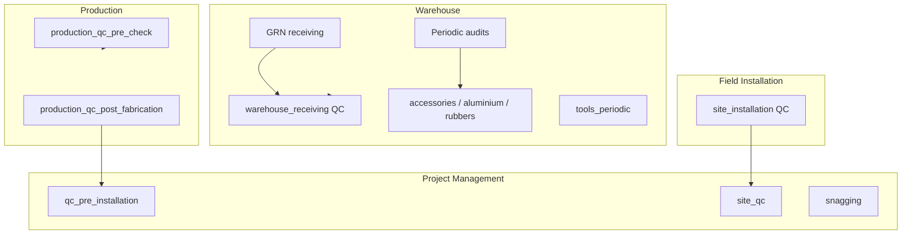
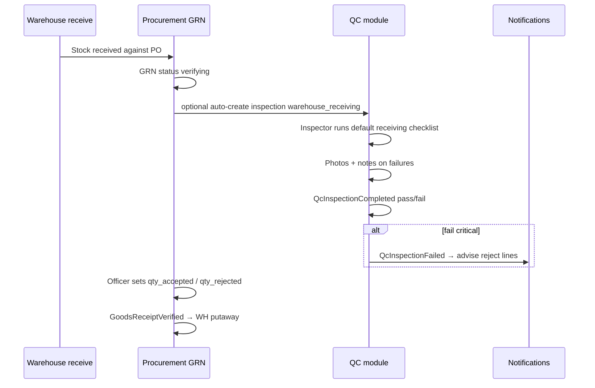
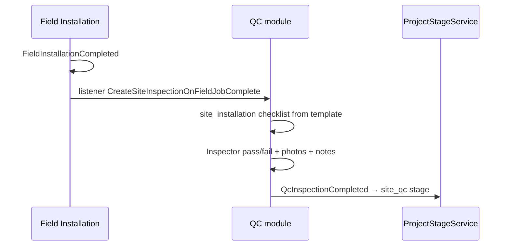

# Quality Control — Implementation Plan

**Module:** QC · Checklists · Inspections · Defects · Warehouse Audits · Scheduled Inspections  
**Stack:** PHP 8.2+ · Laravel 11 · PostgreSQL/MySQL · Next.js SPA  
**References:** [README.md](../README.md) §8.6, [INTEGRATION_CONTRACT.MD](./INTEGRATION_CONTRACT.MD) **v1.3**, [WAREHOUSE.MD](./WAREHOUSE.MD) §10 (GRN receive), [PROCUREMENT.MD](./PROCUREMENT.MD) §5 (GRN verification), [PRODUCTION.MD](./PRODUCTION.MD) §3 (`qc_pre_check`, `qc_post_fabrication`), [FIELD_INSTALLATION.MD](./FIELD_INSTALLATION.MD) §14 (site handoff), [PROJECT_MANAGEMENT.MD](./PROJECT_MANAGEMENT.MD) §3 (stages 13, 16–17), [USER_ONBOARDING.MD](./USER_ONBOARDING.MD)  
**Version:** 1.0 · 2026

> **Developer entry point:** Read [INTEGRATION_CONTRACT.MD §12](./INTEGRATION_CONTRACT.MD#12-developer-handoff) first, then this document. **Dev 6** owns QC. Backend + PHPUnit first — frontend coordinator integrates later.

---

## Table of Contents

0. [Backend Implementation Status](#0-backend-implementation-status)
1. [Goals & Inspection Points](#1-goals--inspection-points)
2. [Connecting Users by Department](#2-connecting-users-by-department)
3. [Checklist Model — Defaults, Custom & Overrides](#3-checklist-model--defaults-custom--overrides)
4. [Repository & Folder Structure](#4-repository--folder-structure)
5. [Parallel Development & Conflict Prevention](#5-parallel-development--conflict-prevention)
6. [Database Schema & Migrations](#6-database-schema--migrations)
7. [Warehouse Receiving QC](#7-warehouse-receiving-qc)
8. [Production Stage QC](#8-production-stage-qc)
9. [Site Installation QC](#9-site-installation-qc)
10. [Periodic Warehouse & Tools Inspections](#10-periodic-warehouse--tools-inspections)
11. [Photos, Notes & Defects](#11-photos-notes--defects)
12. [Domain Events — Publish & Listen](#12-domain-events--publish--listen)
13. [Project Stage Gates — PM Only](#13-project-stage-gates--pm-only)
14. [API Endpoints](#14-api-endpoints)
15. [Permissions & Role Scoping](#15-permissions--role-scoping)
16. [Frontend Routes](#16-frontend-routes)
17. [Cross-Module Integration](#17-cross-module-integration)
18. [Audit Logging](#18-audit-logging)
19. [Implementation Phases](#19-implementation-phases)
20. [Seed Data — Default Checklists](#20-seed-data--default-checklists)
21. [Remaining Open Questions](#21-remaining-open-questions)
22. [PHPUnit Test Plan](#22-phpunit-test-plan)

---

## 0. Backend Implementation Status

| Area | Status | Notes |
|------|--------|-------|
| Base migration `700000` | **Applied** | `qc_checklist_templates`, `qc_inspections`, `qc_defects` |
| Expansion migration `700001` | **Planned (Dev 6)** | Photos, schedules, template metadata, context FKs — §6 |
| Models / services / controllers | **Missing** | No `Services/QualityControl/` |
| Routes | **Missing** | No `routes/api/qc/` |
| Permissions (seeded) | **Coarse keys** | `qc.view`, `qc.manage`, `qc.inspect` |
| GRN verification | **Exists (PROC)** | QC **adds** quality layer — does not replace PROC verify gate |
| Production QC stages | **Logged only (Q6)** | Phase 1: inspections recorded; Phase 2: hard gates |

---

## 1. Goals & Inspection Points

### Business goals

QC provides **structured checklists**, **photo evidence**, **notes**, and **defect tracking** at every critical control point — with **seeded defaults** per stage and **custom templates** inspectors can add or override.

| Goal | Description |
|------|-------------|
| **Default checklists** | Seeded system templates per inspection context (§20) |
| **Custom checklists** | QC managers create global or project-specific templates; inspectors add ad-hoc line items per inspection |
| **Photos on anomalies** | Attach images to failed items, defects, or general notes |
| **Notes** | Free-text on every inspection + per checklist item |
| **Warehouse receiving** | Quality check linked to GRN before/during verification |
| **Production stages** | Pre-cutting material check, post-fabrication, optional in-process checks |
| **Site installation** | Site QC after field install; snagging sign-off |
| **Periodic audits** | Warehouse layout/order audits (accessories bins, aluminium sections, rubbers) on configurable frequency |
| **Tools inspection** | Scheduled tool condition audits independent of project |

### Inspection context map

All contexts use enum `QcInspectionContext` — stable across modules.

| Context | When | Linked entity | Gates PM/PROD? |
|---------|------|---------------|----------------|
| `warehouse_receiving` | GRN qty/quality check | `goods_receipt_id` | Advises PROC reject lines (Phase 2 optional gate) |
| `warehouse_accessories_audit` | Scheduled | deck/section | No — operational |
| `warehouse_aluminium_audit` | Scheduled | deck/section | No |
| `warehouse_rubbers_audit` | Scheduled | deck/section | No |
| `tools_periodic` | Scheduled | `tool_id` or all tools | No |
| `production_qc_pre_check` | Before cutting | `production_order_id` | Phase 2: blocks cutting start |
| `production_qc_post_fabrication` | After finishing | `production_order_id` | Phase 2: blocks dispatch; Phase 1: parallel log |
| `production_in_process` | Optional mid-pipeline | `production_order_id` | No |
| `site_installation` | Field job complete | `field_installation_job_id` | → PM `site_qc` |
| `snagging_signoff` | Snagging resolved | `project_id` | → PM `project_complete` path |



---

## 2. Connecting Users by Department

| Department slug | Default module | Landing route |
|-----------------|----------------|---------------|
| `quality_control` | `qc` | `/qc/inspections` |

| Role slug | Scope |
|-----------|--------|
| `qc_inspector` | Run inspections, upload photos, log defects, add ad-hoc checklist items |
| `qc_manager` | Manage templates, schedules, approve waivers, analytics |
| `operations_manager` | View all; waive critical failures |
| `warehouse_manager_*` | Read warehouse audit results for their deck |
| `production_manager` | Read production-linked inspections |
| `project_manager` | Read project/site QC status |
| `super_admin` | All permissions |

---

## 3. Checklist Model — Defaults, Custom & Overrides

### 3.1 Template layers

| Layer | `qc_checklist_templates` flags | Who creates |
|-------|-------------------------------|-------------|
| **System default** | `is_system = true`, `is_active = true` | `QcDefaultChecklistsSeeder` |
| **Global custom** | `is_system = false`, `project_id = null` | QC manager via UI |
| **Project override** | `project_id` set, `parent_template_id` optional | QC manager clones default for one project |
| **Ad-hoc items** | Stored on `qc_inspections.custom_items` JSON | Inspector during inspection |

### 3.2 Template item shape (JSON in `items`)

```json
{
  "key": "profile_surface_clean",
  "label": "Aluminium profile surface free of dents and scratches",
  "type": "pass_fail",
  "required": true,
  "help_text": "Check full bar length under good light",
  "sort_order": 10
}
```

| `type` | Response stored in `checklist_responses` |
|--------|-------------------------------------------|
| `pass_fail` | `"pass"` \| `"fail"` \| `"na"` |
| `yes_no` | boolean |
| `numeric` | number + optional min/max |
| `text` | string |
| `photo_required_on_fail` | if fail → require ≥1 photo |

### 3.3 Custom checklist rules

| Action | Allowed |
|--------|---------|
| QC manager creates new global template for any context | ✓ |
| QC manager clones system template → project override | ✓ |
| Inspector adds ad-hoc line items on open inspection | ✓ (`custom_items`) |
| Inspector edits system template master | ✗ — clone first |
| Warehouse/Production dev edits template tables | ✗ — Dev 6 only |

---

## 4. Repository & Folder Structure

Legend: ⬜ planned (Dev 6 owns all ⬜ paths)

```
backend/app/
├── Enums/QualityControl/
│   ├── QcInspectionContext.php           ⬜
│   ├── QcInspectionResult.php            ⬜ pending, pass, fail, conditional_pass
│   ├── QcDefectSeverity.php              ⬜ critical, major, minor
│   ├── QcDefectStatus.php                ⬜ open, in_progress, resolved, waived
│   ├── QcScheduleFrequency.php           ⬜ daily, weekly, biweekly, monthly, quarterly
│   └── QcChecklistItemType.php           ⬜
├── Events/QualityControl/
│   ├── QcInspectionCompleted.php
│   ├── QcInspectionFailed.php
│   └── QcScheduleDue.php
├── Listeners/QualityControl/
│   ├── CreateReceivingInspectionOnGrnPending.php   ⬜ optional auto-draft
│   ├── CreateSiteInspectionOnFieldJobComplete.php
│   └── NotifyOnCriticalDefect.php
├── Http/Controllers/QualityControl/
│   ├── QcChecklistTemplateController.php
│   ├── QcInspectionController.php
│   ├── QcInspectionPhotoController.php
│   ├── QcDefectController.php
│   ├── QcInspectionScheduleController.php
│   └── QcDashboardController.php
├── Http/Requests/QualityControl/
│   ├── StoreQcTemplateRequest.php
│   ├── StoreQcInspectionRequest.php
│   ├── SubmitQcInspectionRequest.php
│   └── StoreQcScheduleRequest.php
├── Http/Resources/QualityControl/
│   ├── QcChecklistTemplateResource.php
│   ├── QcInspectionResource.php
│   ├── QcDefectResource.php
│   └── QcScheduleResource.php
├── Models/QualityControl/
│   ├── QcChecklistTemplate.php
│   ├── QcInspection.php
│   ├── QcDefect.php
│   ├── QcInspectionPhoto.php
│   └── QcInspectionSchedule.php
├── Services/QualityControl/
│   ├── QcChecklistTemplateService.php
│   ├── QcInspectionService.php
│   ├── QcDefectService.php
│   ├── QcPhotoStorageService.php
│   ├── QcScheduleService.php               ⬜ due-date calculator + notifications
│   └── QcTemplateResolverService.php       ⬜ default → project override → ad-hoc
├── Policies/QualityControl/
│   ├── QcInspectionPolicy.php
│   └── QcChecklistTemplatePolicy.php
├── database/seeders/
│   └── QcDefaultChecklistsSeeder.php       ⬜
└── routes/api/qc/
    ├── templates.php
    ├── inspections.php
    ├── defects.php
    ├── schedules.php
    └── dashboard.php
```

---

## 5. Parallel Development & Conflict Prevention

### 5.1 Dev 6 vs other modules

| Module | Dev | QC relationship | Conflict rule |
|--------|-----|-----------------|---------------|
| Production | Dev 4 | Reads `production_order_id`; does not own stage logs | No edits under `Services/Production/` |
| Field Installation | Dev 5 | Reads `field_installation_job_id`; site QC after job complete | No edits under `Services/FieldInstallation/` |
| Warehouse | Dev 2 | Periodic audits read deck/section; receiving links GRN | No stock mutations from QC |
| Procurement | Dev 3 | Links `goods_receipt_id`; advises reject qty | Does not call `GoodsReceiptVerified` |
| PM | Dev 1 | Emits events for stage gates; PM listener only | Never `UPDATE projects.stage` from QC |

### 5.2 Owned paths (Dev 6)

| Path | Owner |
|------|-------|
| `backend/app/Services/QualityControl/` | Dev 6 |
| `backend/app/Http/Controllers/QualityControl/` | Dev 6 |
| `backend/app/Models/QualityControl/` | Dev 6 |
| `backend/app/Events/QualityControl/` | Dev 6 |
| `backend/app/Enums/QualityControl/` | Dev 6 |
| `backend/routes/api/qc/` | Dev 6 |
| `backend/database/migrations/2025_05_19_700001_*` | Dev 6 |
| `backend/database/seeders/QcDefaultChecklistsSeeder.php` | Dev 6 |
| `backend/tests/Feature/QualityControl/` | Dev 6 |

**Do not modify** `700000` after applied — expand in `700001` only.

### 5.3 Shared files

| File | Dev 6 may do |
|------|--------------|
| `routes/api.php` | One `require` for `qc/` routes |
| `AppServiceProvider.php` | `registerQualityControlListeners()` only |
| `PermissionSeeder.php` | Append `qc.templates.manage`, `qc.schedules.manage`, etc. |
| `DatabaseSeeder.php` | Register `QcDefaultChecklistsSeeder` |

### 5.4 Dev 6 must NOT

- Verify GRNs or write `goods_receipts.status` (PROC)
- Put away stock or create movements (WH)
- Complete production stages (PROD)
- Write `projects.stage` directly (PM via events)
- Duplicate field NC tables — site **quality** defects live in `qc_defects`; field **logistics** NCs stay in Field Installation

---

## 6. Database Schema & Migrations

### 6.1 Base migration (exists — do not modify)

Source: [`backend/database/migrations/2025_05_19_700000_create_qc_tables.php`](../backend/database/migrations/2025_05_19_700000_create_qc_tables.php)

Tables: `qc_checklist_templates`, `qc_inspections`, `qc_defects`.

### 6.2 Expansion migration — Dev 6 creates

**File:** `backend/database/migrations/2025_05_19_700001_expand_qc_tables.php`

```sql
-- Extend templates
ALTER TABLE qc_checklist_templates
    ADD COLUMN context VARCHAR(64) NOT NULL DEFAULT 'production_qc_post_fabrication',
    ADD COLUMN description TEXT NULL,
    ADD COLUMN is_system BOOLEAN NOT NULL DEFAULT false,
    ADD COLUMN project_id BIGINT NULL REFERENCES projects(id) ON DELETE CASCADE,
    ADD COLUMN parent_template_id BIGINT NULL REFERENCES qc_checklist_templates(id) ON DELETE SET NULL,
    ADD COLUMN created_by BIGINT NULL REFERENCES users(id) ON DELETE SET NULL,
    ADD COLUMN version INT NOT NULL DEFAULT 1;

CREATE INDEX idx_qc_templates_context ON qc_checklist_templates (context, is_active);
CREATE INDEX idx_qc_templates_project ON qc_checklist_templates (project_id);

-- Extend inspections
ALTER TABLE qc_inspections
    ADD COLUMN context VARCHAR(64) NOT NULL DEFAULT 'production_qc_post_fabrication',
    ADD COLUMN template_id BIGINT NULL REFERENCES qc_checklist_templates(id) ON DELETE SET NULL,
    ADD COLUMN goods_receipt_id BIGINT NULL,
    ADD COLUMN field_installation_job_id BIGINT NULL,
    ADD COLUMN warehouse_deck_slug VARCHAR(40) NULL,
    ADD COLUMN warehouse_section_id BIGINT NULL,
    ADD COLUMN tool_id BIGINT NULL,
    ADD COLUMN custom_items JSONB NOT NULL DEFAULT '[]',
    ADD COLUMN internal_notes TEXT NULL,
    ADD COLUMN completed_by BIGINT NULL REFERENCES users(id) ON DELETE SET NULL,
    ADD COLUMN completed_at TIMESTAMP NULL;

CREATE INDEX idx_qc_inspections_context ON qc_inspections (context, result);
CREATE INDEX idx_qc_inspections_grn ON qc_inspections (goods_receipt_id);
CREATE INDEX idx_qc_inspections_field_job ON qc_inspections (field_installation_job_id);
CREATE INDEX idx_qc_inspections_project ON qc_inspections (project_id, context);

-- FK goods_receipt_id when procurement table exists (app-level validation if migration order varies)
-- FK field_installation_job_id when 650000 applied

CREATE TABLE qc_inspection_photos (
    id              BIGSERIAL PRIMARY KEY,
    inspection_id   BIGINT NOT NULL REFERENCES qc_inspections(id) ON DELETE CASCADE,
    defect_id       BIGINT NULL REFERENCES qc_defects(id) ON DELETE SET NULL,
    checklist_key   VARCHAR(80) NULL,
    file_path       VARCHAR(500) NOT NULL,
    firebase_url    VARCHAR(500) NULL,
    caption         TEXT NULL,
    uploaded_by     BIGINT NOT NULL REFERENCES users(id),
    created_at      TIMESTAMP NOT NULL
);

CREATE INDEX idx_qc_photos_inspection ON qc_inspection_photos (inspection_id);

-- Extend defects
ALTER TABLE qc_defects
    ADD COLUMN checklist_key VARCHAR(80) NULL,
    ADD COLUMN reported_by BIGINT NULL REFERENCES users(id) ON DELETE SET NULL,
    ADD COLUMN resolution_notes TEXT NULL;

-- Scheduled / periodic inspections
CREATE TABLE qc_inspection_schedules (
    id                  BIGSERIAL PRIMARY KEY,
    name                VARCHAR(120) NOT NULL,
    context             VARCHAR(64) NOT NULL,
    frequency           VARCHAR(20) NOT NULL,
    frequency_interval  INT NOT NULL DEFAULT 1,
    warehouse_deck_slug VARCHAR(40) NULL,
    warehouse_section_id BIGINT NULL,
    tool_scope          VARCHAR(30) NULL DEFAULT 'all',  -- all, active_issued, deck_tools
    assigned_role       VARCHAR(50) NULL,
    assigned_user_id    BIGINT NULL REFERENCES users(id) ON DELETE SET NULL,
    template_id         BIGINT NULL REFERENCES qc_checklist_templates(id) ON DELETE SET NULL,
    next_due_at         TIMESTAMP NOT NULL,
    last_run_at         TIMESTAMP NULL,
    is_active           BOOLEAN NOT NULL DEFAULT true,
    created_by          BIGINT NOT NULL REFERENCES users(id),
    created_at          TIMESTAMP NOT NULL,
    updated_at          TIMESTAMP NOT NULL
);

CREATE INDEX idx_qc_schedules_due ON qc_inspection_schedules (next_due_at, is_active);
```

---

## 7. Warehouse Receiving QC

QC participates in **warehouse receiving** alongside Procurement GRN verification — complementary, not duplicate.

### Flow



| Step | Owner | Detail |
|------|-------|--------|
| 1 | WH / PROC | Physical receive; GRN enters `verifying` |
| 2 | QC | Inspection linked via `goods_receipt_id` |
| 3 | QC | Default checklist: packaging, qty spot-check, profile damage, accessory labeling |
| 4 | QC | Failed items → `qc_defects` + photos |
| 5 | PROC | Uses QC outcome to inform `qty_rejected` — PROC still owns verify action |
| 6 | WH | Putaway after `GoodsReceiptVerified` |

**Phase 1:** QC advisory — GRN can verify without QC pass.  
**Phase 2 (optional):** Block `VerifyGoodsReceiptController` if linked inspection `result = fail` and no waiver.

---

## 8. Production Stage QC

Aligns with [PRODUCTION.MD](./PRODUCTION.MD) §3 and contract Q6.

| Production stage | QC context | Default template focus |
|------------------|------------|------------------------|
| Before cutting | `production_qc_pre_check` | Material correctness, profile length, accessory kit completeness |
| After finishing (before dispatch) | `production_qc_post_fabrication` | Squareness, glass clearance, hardware fit, surface finish |
| Optional mid-pipeline | `production_in_process` | Welding, sash alignment, rubber fit |

### Trigger options

| Phase | Behaviour |
|-------|-----------|
| **Phase 1** | Production completes stage; QC inspection created **in parallel** or manually by QC inspector |
| **Phase 2** | `ProductionStageCompleted(qc_pre_check)` blocked until inspection `pass`; same for post-fabrication before PM → `qc_pre_installation` |

QC listens to (optional auto-create):

```php
Event::listen(ProductionStageCompleted::class, CreateProductionQcInspection::class);
// Only when productionStage in ('qc_pre_check', 'qc_post_fabrication')
```

**Dev 6 must NOT** register `OnProductionStageCompleted` — PM owns that listener.

---

## 9. Site Installation QC

Triggered when Field Installation completes a job ([FIELD_INSTALLATION.MD](./FIELD_INSTALLATION.MD)).



| Context | Template focus |
|---------|----------------|
| `site_installation` | Plumb/level, sealing, hardware operation, glass intact, client area clean |
| `snagging_signoff` | Each snag item resolved; client sign-off photo optional |

**Distinction from Field NCs:** Field Installation logs **logistics** issues (shortage, wrong delivery). QC logs **quality** defects (fit, finish, function).

---

## 10. Periodic Warehouse & Tools Inspections

Operational audits **not tied to a project** — driven by `qc_inspection_schedules`.

### 10.1 Warehouse audit contexts

| Context | What inspector verifies | Typical frequency (seeded default) |
|---------|-------------------------|-----------------------------------|
| `warehouse_accessories_audit` | Bins labelled, door-type sections correct, no mixed SKUs, FIFO labels visible | **Weekly** |
| `warehouse_aluminium_audit` | Profiles grouped by family, subsections tidy, no obstructed aisles | **Biweekly** |
| `warehouse_rubbers_audit` | Compatibility grouping correct, cut lengths stored safely | **Monthly** |

Inspectors select deck/section on start; stored on `qc_inspections.warehouse_deck_slug` / `warehouse_section_id`.

### 10.2 Tools periodic inspection

| Context | Scope | Default frequency |
|---------|-------|-----------------|
| `tools_periodic` | All active tools or tools currently issued | **Monthly** |

Checklist items: condition, calibration due, safety guards, damage, return overdue flag (read from WH `tool_issuances`).

### 10.3 Schedule service

`QcScheduleService`:

1. Cron / scheduler job daily: find schedules where `next_due_at <= now()`.
2. Emit `QcScheduleDue` → notify assigned role/user.
3. On inspection complete: `last_run_at = now()`, recalculate `next_due_at` from `frequency` + `frequency_interval`.

| `frequency` | Example |
|-------------|---------|
| `daily` | interval 1 = every day |
| `weekly` | interval 1 = every 7 days |
| `biweekly` | interval 1 = every 14 days |
| `monthly` | interval 1 = calendar month |
| `quarterly` | interval 3 months |

QC managers CRUD schedules via API; warehouse managers **read-only** on their deck results.

---

## 11. Photos, Notes & Defects

### 11.1 Notes

| Field | Location | Purpose |
|-------|----------|---------|
| `qc_inspections.notes` | Inspection | General inspector summary (existing column) |
| `qc_inspections.internal_notes` | Inspection | QC manager only — not shown to client portal |
| Per-item note | `checklist_responses[key].note` | Explains fail/conditional |

### 11.2 Photos

| Attach to | Table | Required when |
|-----------|-------|---------------|
| Whole inspection | `qc_inspection_photos` | Optional |
| Failed checklist item | `qc_inspection_photos.checklist_key` | Required if template `photo_required_on_fail` |
| Defect | `qc_inspection_photos.defect_id` | Recommended for major/critical |

Storage: `QcPhotoStorageService` — same pattern as [FIELD_INSTALLATION.MD](./FIELD_INSTALLATION.MD) §8 (`file_path` + `firebase_url`).

### 11.3 Defects

Existing `qc_defects` table extended with `checklist_key`, `reported_by`, `resolution_notes`.

| Severity | Action |
|----------|--------|
| `critical` | `QcInspectionFailed` event; block pass until resolved or waived |
| `major` | Notify module owner (WH/PROD/Field) |
| `minor` | Log only; inspection can still pass with notes |

---

## 12. Domain Events — Publish & Listen

Scalar IDs only ([INTEGRATION_CONTRACT.MD](./INTEGRATION_CONTRACT.MD) §11 Q11).

### PUBLISHES

| Event | Trigger | Payload |
|-------|---------|---------|
| `QcInspectionCompleted` | Inspection submitted pass/conditional | `inspectionId`, `context`, `projectId?`, `result`, `completedByUserId` |
| `QcInspectionFailed` | result = fail or critical defect | `inspectionId`, `context`, `projectId?`, `completedByUserId` |
| `QcScheduleDue` | Scheduler finds overdue schedule | `scheduleId`, `context`, `dueAt` |

### LISTENS

| Event | Publisher | Listener action |
|-------|-----------|-----------------|
| `ProductionStageCompleted` | Production | Auto-create inspection for QC stages (optional) |
| `FieldInstallationCompleted` | Field Installation | Auto-create `site_installation` inspection |
| Goods receipt → verifying | Procurement | Optional `CreateReceivingInspectionOnGrnPending` |

### PM listeners (Dev 1 owns)

```php
Event::listen(QcInspectionCompleted::class, OnQcInspectionCompleted::class);
// site_installation + pass → ProjectStage::SiteQc
// production_qc_post_fabrication + pass → may confirm qc_pre_installation
// snagging_signoff + pass → toward project_complete
```

---

## 13. Project Stage Gates — PM Only

QC **never** writes `projects.stage`.

| QC context | On pass (PM listener) | On fail |
|------------|----------------------|---------|
| `production_qc_post_fabrication` | Confirm/hold at `qc_pre_installation` | Notify production manager |
| `site_installation` | Advance to `site_qc` | Notify field lead + PM |
| `snagging_signoff` | Enable `project_complete` path | Keep in `snagging` |

Phase 1 (contract Q6): PM stage may advance before QC pass — inspections tracked for audit.  
Phase 2: configurable gate per context in `config/bibo.php` → `qc.gates.*`.

---

## 14. API Endpoints

Base: **`/api/v1/qc`** · Auth: `auth:sanctum`, `active`

```php
Route::middleware(['auth:sanctum', 'active'])
    ->prefix('qc')
    ->group(function () {
        require __DIR__.'/api/qc/templates.php';
        require __DIR__.'/api/qc/inspections.php';
        require __DIR__.'/api/qc/defects.php';
        require __DIR__.'/api/qc/schedules.php';
        require __DIR__.'/api/qc/dashboard.php';
    });
```

### Templates

| Method | Path | Permission | Purpose |
|--------|------|------------|---------|
| GET | `/templates?context=` | `qc.view` | List templates |
| GET | `/templates/{id}` | `qc.view` | Template detail |
| POST | `/templates` | `qc.templates.manage` | Create custom template |
| POST | `/templates/{id}/clone` | `qc.templates.manage` | Clone to project override |
| PATCH | `/templates/{id}` | `qc.templates.manage` | Update (non-system only) |

### Inspections

| Method | Path | Permission | Purpose |
|--------|------|------------|---------|
| GET | `/inspections` | `qc.view` | Filter by context, project, result |
| GET | `/inspections/{id}` | `qc.view` | Detail + responses + photos |
| POST | `/inspections` | `qc.inspect` | Start inspection (resolve template) |
| PATCH | `/inspections/{id}` | `qc.inspect` | Save draft responses + custom items |
| POST | `/inspections/{id}/submit` | `qc.inspect` | Finalize pass/fail + emit event |
| POST | `/inspections/{id}/photos` | `qc.inspect` | Upload photo |

### Defects & schedules

| Method | Path | Permission | Purpose |
|--------|------|------------|---------|
| POST | `/inspections/{id}/defects` | `qc.inspect` | Add defect |
| PATCH | `/defects/{id}` | `qc.manage` | Resolve / waive |
| GET | `/schedules` | `qc.view` | List periodic schedules |
| POST | `/schedules` | `qc.schedules.manage` | Create schedule |
| PATCH | `/schedules/{id}` | `qc.schedules.manage` | Update frequency / assignee |
| GET | `/dashboard/summary` | `qc.view` | Open defects, due schedules, fail rate |

---

## 15. Permissions & Role Scoping

### Seeded today

```
qc.view
qc.manage
qc.inspect
```

### Append (Dev 6)

```
qc.templates.manage
qc.schedules.manage
qc.defects.resolve
qc.waive_critical
```

| Role | Permissions |
|------|-------------|
| `qc_inspector` | `qc.view`, `qc.inspect` |
| `qc_manager` | all `qc.*` |
| `operations_manager` | all `qc.*` + `qc.waive_critical` |
| `warehouse_manager_*` | `qc.view` (deck-scoped audit results) |
| `production_manager` | `qc.view` (production contexts) |

---

## 16. Frontend Routes

Coordinator-owned:

| Route | Purpose |
|-------|---------|
| `/qc/inspections` | My inspections + filters by context |
| `/qc/inspections/{id}` | Run checklist, photos, notes, submit |
| `/qc/templates` | Manage default + custom templates |
| `/qc/schedules` | Warehouse/tools frequency config |
| `/qc/dashboard` | Defects, due audits, trends |
| `/qc/receiving?grn_id=` | Deep-link from procurement GRN screen |

**API client:** `frontend/lib/api/qc.ts`

---

## 17. Cross-Module Integration

| From | To | Integration |
|------|-----|-------------|
| PROC GRN | QC | `goods_receipt_id` on receiving inspection |
| PROD | QC | `production_order_id`; contexts `production_qc_*` |
| FIELD | QC | `field_installation_job_id`; auto site inspection |
| QC | PM | `QcInspectionCompleted` → stage transitions |
| QC | WH | Read deck/section/tool data; no stock writes |
| WH audits | QC | Periodic schedules per deck |

---

## 18. Audit Logging

| Action | `entity_type` |
|--------|---------------|
| `qc.inspection_started` | `qc_inspection` |
| `qc.inspection_submitted` | `qc_inspection` |
| `qc.defect_reported` | `qc_defect` |
| `qc.defect_resolved` | `qc_defect` |
| `qc.template_created` | `qc_checklist_template` |
| `qc.schedule_created` | `qc_inspection_schedule` |

---

## 19. Implementation Phases

### Phase 1 — Schema, templates, seeders (Week 1)

- [ ] `700001` expansion migration
- [ ] Enums + models
- [ ] `QcDefaultChecklistsSeeder` (§20)
- [ ] Template CRUD API

### Phase 2 — Inspection workflow (Week 2)

- [ ] Start / draft / submit inspection
- [ ] Photos + notes + defects
- [ ] `QcInspectionCompleted` / `Failed` events

### Phase 3 — Receiving + production (Week 3)

- [ ] GRN-linked receiving inspections
- [ ] Production order inspections
- [ ] PM listener coordination (Dev 1)

### Phase 4 — Site + field (Week 4)

- [ ] `FieldInstallationCompleted` listener
- [ ] Site + snagging contexts

### Phase 5 — Periodic schedules (Week 5)

- [ ] Schedule CRUD + due job
- [ ] Warehouse accessories/aluminium/rubbers audits
- [ ] Tools periodic inspection

### Phase 6 — Gates & dashboard (Week 6)

- [ ] Optional hard gates (Phase 2 config)
- [ ] Dashboard analytics
- [ ] Frontend (coordinator)

---

## 20. Seed Data — Default Checklists

**Seeder:** `backend/database/seeders/QcDefaultChecklistsSeeder.php`  
Register in `DatabaseSeeder` after projects/warehouse lookups exist.

Each row: `is_system = true`, `is_active = true`, `project_id = null`.

### `warehouse_receiving` — **GRN Incoming Quality**

| # | Item key | Label |
|---|----------|-------|
| 1 | packaging_intact | Packaging intact — no water or impact damage |
| 2 | qty_matches_po | Quantity matches PO line within tolerance |
| 3 | profile_visual | Aluminium: no bending, scratching, or incorrect alloy mark |
| 4 | accessory_labelling | Accessories: correct SKU labels on bins/packs |
| 5 | rubber_batch | Rubbers: batch/date visible and matches PO |
| 6 | docs_with_shipment | Delivery note and invoice copy present |

### `warehouse_accessories_audit` — **Weekly accessories order**

| # | Item key | Label |
|---|----------|-------|
| 1 | bins_labelled | Every bin has readable label matching system |
| 2 | door_type_separation | Sliding / folding / casement / bathroom sections not mixed |
| 3 | fifo_visible | Older stock forward; no buried bins |
| 4 | floor_clear | Aisle clear; no boxes on floor |
| 5 | min_max_marked | Low-stock bins flagged |

### `warehouse_aluminium_audit` — **Biweekly aluminium order**

| # | Item key | Label |
|---|----------|-------|
| 1 | profile_family_grouped | Profiles grouped by family in correct subsection |
| 2 | length_stored_safe | Bars stored without tip damage |
| 3 | offcuts_area | Offcuts/production workspace offcuts labelled (if applicable) |

### `warehouse_rubbers_audit` — **Monthly rubbers corner**

| # | Item key | Label |
|---|----------|-------|
| 1 | compatibility_grouped | Gaskets grouped by compatible profile |
| 2 | sealed_storage | Rolls/bags sealed where required |

### `tools_periodic` — **Monthly tool condition**

| # | Item key | Label |
|---|----------|-------|
| 1 | physical_condition | No cracked handles, frayed cords, missing guards |
| 2 | calibration_current | Calibration sticker in date (if applicable) |
| 3 | return_status | Issued tools accounted for or overdue flagged |

### `production_qc_pre_check` — **Pre-cutting materials**

| # | Item key | Label |
|---|----------|-------|
| 1 | bom_match | Materials match approved BOM for project |
| 2 | profile_length | Profile lengths sufficient for cutting sheet |
| 3 | accessory_kit | Pre-kit accessories present for door types |
| 4 | glass_not_required_yet | Glass not required at this stage (procurement only) |

### `production_qc_post_fabrication` — **Post-fabrication**

| # | Item key | Label |
|---|----------|-------|
| 1 | dimensions_within_tolerance | Frame dimensions within ± tolerance |
| 2 | squareness | Diagonal check pass |
| 3 | surface_finish | No unacceptable scratches or dents |
| 4 | hardware_fit | Hinges/handles/locks operate correctly |
| 5 | glass_bead_ready | Glass rebate clean — ready for glass install |
| 6 | labels_applied | Project/unit label applied |

### `site_installation` — **Site QC**

| # | Item key | Label |
|---|----------|-------|
| 1 | plumb_level | Unit plumb and level |
| 2 | sealing_complete | Seals and gaskets fitted |
| 3 | operation_smooth | Opens/closes smoothly |
| 4 | glass_undamaged | Glass intact — no chips |
| 5 | site_cleaned | Work area cleaned |
| 6 | client_walkthrough | Client walkthrough completed |

### `snagging_signoff` — **Snagging resolved**

| # | Item key | Label |
|---|----------|-------|
| 1 | all_snags_closed | All logged snag items resolved |
| 2 | rework_photographed | Rework photographed |
| 3 | client_signoff | Client sign-off obtained |

### Default schedules (seed alongside templates)

| Name | context | frequency | interval |
|------|---------|-----------|----------|
| Accessories weekly audit | `warehouse_accessories_audit` | weekly | 1 |
| Aluminium biweekly audit | `warehouse_aluminium_audit` | biweekly | 1 |
| Rubbers monthly audit | `warehouse_rubbers_audit` | monthly | 1 |
| Tools monthly inspection | `tools_periodic` | monthly | 1 |

---

## 21. Remaining Open Questions

| # | Topic | Notes |
|---|-------|-------|
| 1 | Hard gate vs advisory | Phase 1 advisory per Q6; enable per-context gates in Phase 2 |
| 2 | GRN auto-create inspection | On `verifying` status or manual QC queue |
| 3 | Product-type templates | Filter templates by `product_type` (sliding vs casement) phase 2 |
| 4 | Client portal QC visibility | Hide `internal_notes`; show pass/fail summary only |
| 5 | Inspector assignment rules | Auto-assign vs pool queue |

---

## 22. PHPUnit Test Plan

**Path:** `backend/tests/Feature/QualityControl/QcInspectionFlowTest.php`

| Test | Assert |
|------|--------|
| Seeder creates system templates per context | Count ≥ 9 contexts |
| Clone template to project override | New row, same items, `project_id` set |
| Start inspection resolves project override > system default | Correct `template_id` |
| Submit pass emits `QcInspectionCompleted` | Event dispatched |
| Fail with critical defect emits `QcInspectionFailed` | Event + defect row |
| Photo required on fail validation | 422 without photo |
| GRN-linked receiving inspection | `goods_receipt_id` set |
| Schedule due generates next `next_due_at` | Date math correct |
| QC cannot update `projects.stage` directly | No PM bypass |

---

## Appendix A — Related documents

| Document | Status |
|----------|--------|
| [INTEGRATION_CONTRACT.MD](./INTEGRATION_CONTRACT.MD) | v1.3 |
| [WAREHOUSE.MD](./WAREHOUSE.MD) | Receiving §10 |
| [PROCUREMENT.MD](./PROCUREMENT.MD) | GRN §5 |
| [PRODUCTION.MD](./PRODUCTION.MD) | QC stages §3 |
| [FIELD_INSTALLATION.MD](./FIELD_INSTALLATION.MD) | Site handoff §9 |

---

*End of Quality Control Implementation Plan v1.0*
