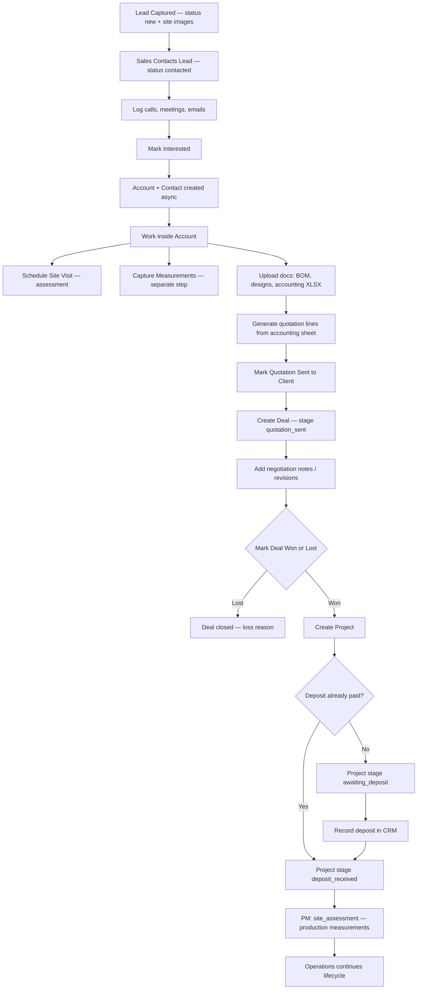
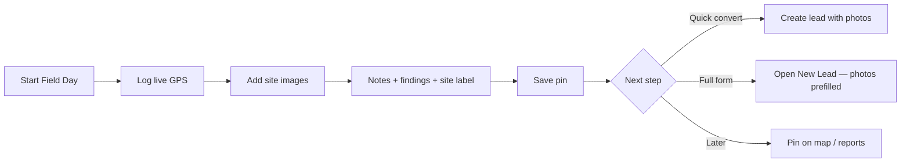
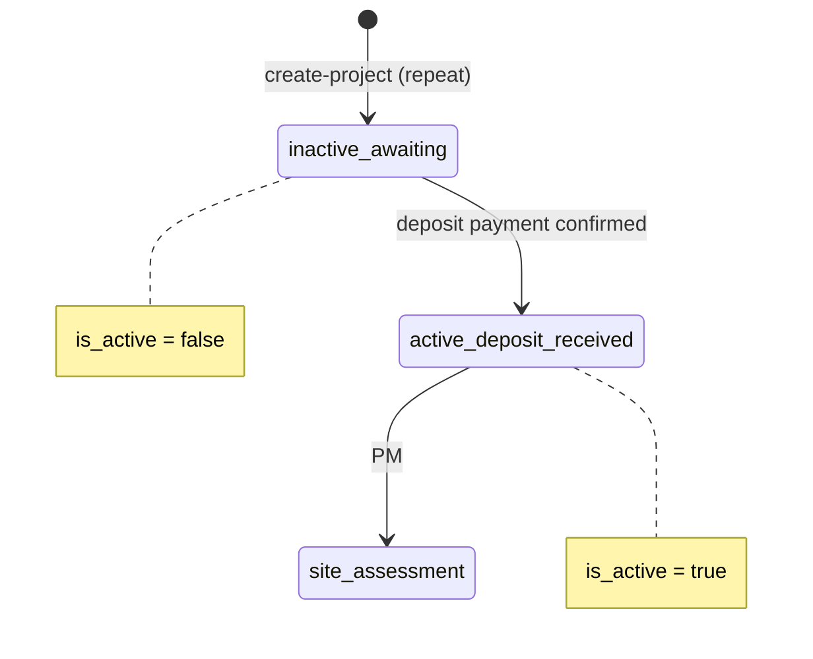

# Sales CRM Flow Update — Account-Centric Pipeline

**Module:** CRM · Sales Pipeline · Accounts · Quotations · Field Visits  
**Status:** Proposed redesign (supersedes flow sections in [SALES_CRM.MD](./SALES_CRM.MD) §4, §7, §9, §15)  
**Version:** 2.0 · June 2026

---

## Table of Contents

1. [Why This Change](#1-why-this-change)
2. [Before vs After Summary](#2-before-vs-after-summary)
3. [Core Principles](#3-core-principles)
4. [Updated End-to-End Flow](#4-updated-end-to-end-flow)
5. [Lead Pipeline](#5-lead-pipeline) — [§5.3 Site images](#53-new-lead-form--site-images) · [§5.4 Field Day images](#54-sales-field-day--site-images) · [§5.5 Project info](#55-new-lead-form--project-info-building-construction-stage)
6. [Account as the Client Hub](#6-account-as-the-client-hub)
7. [Engagement Logging (Contacted Stage)](#7-engagement-logging-contacted-stage) — [§7.4 Scheduled activities & calendar](#74-scheduled-activities--calendar-sync)
8. [Site Visits vs Measurements](#8-site-visits-vs-measurements) — includes [§8.5 mm unit standard](#85-measurement-unit-standard--millimetres-mm)
9. [Account Documents & Quotation Preparation](#9-account-documents--quotation-preparation)
10. [Deal Creation (After Quotation Sent)](#10-deal-creation-after-quotation-sent)
11. [Negotiation, Deposit & Project Handoff](#11-negotiation-deposit--project-handoff) — includes [§11.6 Repeat projects](#116-repeat-projects-same-account)
12. [Updated Entity Model](#12-updated-entity-model)
13. [Stage Actions & UI (Proposed)](#13-stage-actions--ui-proposed)
14. [Implementation Notes](#14-implementation-notes)

---

## 1. Why This Change

In the **current flow** (v1), a **Deal** is created early — typically at lead conversion, before a deposit is received and often before a quotation is sent. Account and Contact are created at the same time as the Deal.

That model mixes **qualification work** (outreach, site visits, measurements, costing) with **commercial commitment** (deal value, negotiation, deposit, project handoff).

The **updated flow** (v2) separates these concerns:

| Concern | Owner in v2 |
| -------- | ----------- |
| Early qualification & outreach | **Lead** |
| Client relationship & all pre-deal work | **Account** |
| Formal sales opportunity (money) | **Deal** — created only after quotation is sent |
| Execution | **Project** — created when deal is **won**; deposit tracked on project stage |

The Account becomes the **single workspace** for everything that happens from the moment a client is marked **interested** through quotation and negotiation — before Operations takes over via a **won** deal and Project.

---

## 2. Before vs After Summary

| Step | Current flow (v1) | Updated flow (v2) |
| ---- | ----------------- | ----------------- |
| Client shows interest | Lead → `interested` → qualify | Lead → `interested` → **Account + Contact created async** |
| Where measurements live | Lead or Deal | **Account** (linked site visits) |
| Where quotations live | Deal | **Account** (optionally linked to a draft opportunity record) |
| When Deal is created | At lead conversion (before quotation) | **After quotation is marked sent to client** |
| When Project is created | After deal won + deposit | **When deal marked won** — first project active; **repeat project inactive** at `awaiting_deposit` (§11.6) |
| Production measurements | Mixed with CRM site visits | **Project Management** — `site_assessment` stage (after deposit) |
| Outreach between `new` and `interested` | Generic activity log | **Structured call logs, meeting notes, email-sent notes** |
| Follow-ups & meetings | Lead `next_follow_up_at` only on calendar | **Scheduled activities** synced to CRM **calendar** (§7.4) |
| Site visit purpose | Often tied to measurement capture | **Site visit** (assessment / relationship) **separate from measurement capture** |
| Site images at intake | Not captured on create | **New Lead form** (§5.3) and **Field Day pins** (§5.4) |
| Building construction stage | Not captured | **Project info** on New Lead — `building_construction_stage` (§5.5) |

---

## 3. Core Principles

1. **Lead** = someone who *may* buy. Stays lightweight until interest is confirmed.
2. **Account** = the client workspace from **`interested`** onward. Holds contacts, documents, site visits, measurements, quotations, and negotiation history.
3. **Deal** = a formal sales opportunity with value and stage. Created **after quotation is sent**, not at first sign of interest.
4. **Project** = execution record. Created when deal is **marked won** — not blocked on deposit.
5. **Deposit** is tracked on the **Project** (`awaiting_deposit` → `deposit_received`), not as a gate before project creation.
6. **Async account provisioning** — marking a lead `interested` queues account creation; the UI must not block on it.
7. **CRM measurements ≠ production measurements** — Account measurements are for **quoting**; PM captures **production measurements** at `site_assessment` after handoff.
8. **Site visits ≠ measurements** — a CRM visit can happen for assessment or relationship without producing measurement lines.
9. **All dimensional measurements use millimetres (mm)** — no cm, m, or inches in CRM or PM capture (§8.5).
10. **Scheduled activities sync to calendar** — future calls, meetings, and tasks appear on the unified CRM calendar (§7.4).

---

## 4. Updated End-to-End Flow



| Step | System action |
| ---- | ------------- |
| Lead captured | `POST /api/crm/leads` — status `new`; **site images** (§5.3); **building construction stage** (§5.5) |
| Field Day pin | `POST /api/crm/field-days/{id}/pins` — GPS + **site images** (§5.4); optional convert to lead |
| Sales contacts | Status → `contacted`; log structured engagement (§7) |
| Schedule follow-up | Create **scheduled activity** → appears on CRM calendar (§7.4) |
| Mark interested | Status → `interested`; dispatch `CreateAccountFromLead` job |
| Account ready | Account status `prospect`; Contact linked; lead `converted_to_account_id` set |
| Site visit | `POST /api/crm/site-visits` on **account** — purpose = assessment (§8) |
| Measurements | Separate capture workflow on account / approved visit (§8) |
| Upload documents | Account document store — BOM, designs, accounting XLSX (§9) |
| Quotation | Import lines from accounting XLSX → draft quotation on account |
| Sent to client | Quotation status `sent`; **Deal created** with stage `quotation_sent` |
| Negotiation | Deal stage → `negotiation_revision`; negotiation notes on deal/account |
| Close deal | Mark **won** or **lost** (§11) |
| Project (won) | `POST /api/crm/deals/{id}/create-project` → stage `awaiting_deposit` or `deposit_received` |
| Deposit | Record on deal; sync project → `deposit_received` when threshold met |
| Production measurements | PM advances to `site_assessment` — engineer capture (not CRM) |

---

## 5. Lead Pipeline

### 5.1 Recommended lead statuses (v2)

```
new → contacted → interested → account_created → [terminal: not_reachable | unqualified]
```

| Status | Meaning |
| ------ | ------- |
| `new` | Captured, not yet contacted |
| `contacted` | Outreach started — engagement logs required (§7) |
| `interested` | Client confirmed interest; triggers async account creation |
| `account_created` | Account provisioned; sales continues work on Account record |
| `not_reachable` | Terminal — could not reach after attempts |
| `unqualified` | Terminal — not worth pursuing |

**Removed from lead pipeline (moved to Account):**

- `qualified`
- `site_visit_required` / `site_visit_scheduled`
- `measurements_captured`
- `converted` (replaced by `account_created`)

The lead record remains as the **origin story** (`source_lead_id` on Account). Sales reps open the **Account** for all ongoing work.

### 5.2 Transition: `interested` → async account

When a user marks a lead **interested**:

1. Update lead status to `interested` immediately (sync).
2. Dispatch background job `CreateAccountFromLead`:
   - Create **Account** from lead account / contact fields.
   - Create or link **Contact** → set `account.primary_contact_id`.
   - Copy requirement, location, product interest, and **`building_construction_stage_id`** fields to account context.
   - Set lead `converted_account_id`, status → `account_created`.
   - Audit: `crm.lead.account_provisioned`.
3. UI shows “Account provisioning…” until job completes, then deep-link to Account.

**No Deal is created at this step.**

### 5.3 New Lead Form — Site Images

Site images are captured **at lead creation** — not deferred to the first site visit. Reception and sales reps upload on the New Lead form; field officers capture on **Field Day pins** (§5.4) before converting to a lead.

**Endpoint:** `POST /api/crm/leads` (+ optional `POST /api/crm/leads/{id}/photos` for additional uploads after save)  
**Permission:** `leads.create`  
**UI:** `/crm/leads/new` → **Site images** section on the create form

#### Form section (add to New Lead)

| Section | Fields | Required |
| ------- | ------ | -------- |
| **H. Site images** | `site_images[]` — one or more image files | **At least 1** recommended; required when `need_site_visit = true` |

Existing sections A–G unchanged — see [SALES_CRM.MD §8](./SALES_CRM.MD#8-new-lead-form-specification). **Project info** (section I), including building construction stage, is defined in [§5.5](#55-new-lead-form--project-info-building-construction-stage).

#### What to capture

Photos that help sales and field teams understand the site before contact or visit:

- Building exterior / estate entrance  
- Target room or balcony (windows, openings)  
- Obstacles (columns, AC units, furniture)  
- Access routes (stairs, lifts, parking)  
- Any visible damage or special conditions  

Optional per-image **caption** (e.g. `"Master bedroom — east window"`).

#### API behaviour

**Option A — multipart create (preferred):**

```http
POST /api/crm/leads
Content-Type: multipart/form-data

name=...
phone=...
site_images[]=<file>
site_images[]=<file>
site_image_captions[]="Front elevation"
site_image_captions[]="Living room opening"
```

**Option B — create then upload:**

1. `POST /api/crm/leads` (JSON) → returns `lead.id`  
2. `POST /api/crm/leads/{id}/photos` — multipart, same as site visit photo pattern  

#### Storage — `lead_photos`

```sql
CREATE TABLE lead_photos (
    id                  BIGSERIAL PRIMARY KEY,
    lead_id             BIGINT NOT NULL REFERENCES leads(id) ON DELETE CASCADE,
    file_path           VARCHAR(500) NOT NULL,
    firebase_url        VARCHAR(500) NULL,
    caption             VARCHAR(255) NULL,
    sort_order          INT DEFAULT 0,
    uploaded_by         BIGINT NOT NULL REFERENCES users(id),
    created_at          TIMESTAMP NOT NULL
);
```

Reuse `CrmAttachmentStorageService` (same pattern as `site_visit_photos`).

#### Validation

| Rule | Detail |
| ---- | ------ |
| Min count | ≥ 1 image when `need_site_visit = true` |
| Max count | 20 images per lead (configurable) |
| Formats | `jpeg`, `jpg`, `png`, `webp` |
| Max file size | 10 MB per image |
| GPS | Optional — extract from EXIF when present; do not require |

#### Side effects on create

1. Insert lead row + `lead_photos` records.  
2. Insert `crm_activities` task from `next_action` + `next_follow_up_at`.  
3. Audit: `crm.lead.created`.

#### Handoff to Account

When `CreateAccountFromLead` runs (§5.2):

- **Copy** `lead_photos` → account document store as type `site_photo` (or link records via `source_lead_photo_id`).  
- Account **Documents** tab shows intake photos under “Site images from lead”.

Field Day prefill: pin site images copy to lead on convert — see [§5.4](#54-sales-field-day--site-images).

#### Lead detail UI

- **Gallery** on lead detail — thumbnails, lightbox, captions.  
- Allow add/remove photos while lead is not `account_created` (`leads.update`).  
- After account provisioned, photos remain on lead for audit; primary view moves to Account documents.

### 5.4 Sales Field Day — Site Images

Field officers capture site images **when logging a Field Day pin** — at the property, alongside live GPS. This is the primary intake path for reps in the field; photos must not wait until lead conversion or a scheduled site visit.

**UI:** `/crm/field-day` → log pin → **Site images** section  
**Permission:** `field_day.create` (field officer); `field_day.view` / `field_day.manage` (reports)

#### Pin workflow (updated)



| Step | Action |
| ---- | ------ |
| 1 | **Start field day** — `POST /api/crm/field-days/start` |
| 2 | **Log live GPS** — required; accuracy ≤ 500 m (existing rule) |
| 3 | **Capture site images** — camera or gallery; ≥ 1 per pin |
| 4 | **Notes / findings / site label** — existing pin fields |
| 5 | **Save pin** — `POST /api/crm/field-days/{id}/pins` |
| 6 | **Convert to lead** or open **New Lead** with `from_pin={id}` — images flow to lead (§5.3) |

#### Pin form — site images block

Add to the pin draft on Field Day page (alongside GPS, notes, findings):

| Field | Required | Notes |
| ----- | -------- | ----- |
| `site_images[]` | **Yes** — min 1 per pin | Capture on-site while GPS is fresh |
| `site_image_captions[]` | Optional | e.g. `"Block B — balcony facing road"` |

Same capture guidance as New Lead (§5.3): exterior, openings, obstacles, access, damage.

#### API behaviour

**Option A — multipart pin create (preferred for mobile):**

```http
POST /api/crm/field-days/{fieldDayId}/pins
Content-Type: multipart/form-data

latitude=-1.2921
longitude=36.8219
accuracy_m=12
captured_at=2026-06-07T10:30:00Z
site_label=Prime Offices
findings=Client interested in roller blinds
site_images[]=<file>
site_images[]=<file>
site_image_captions[]="Building front"
site_image_captions[]="Sample window"
```

**Option B — JSON pin then upload:**

1. `POST /api/crm/field-days/{id}/pins` (JSON — GPS + notes)  
2. `POST /api/crm/field-day-pins/{pinId}/photos` — multipart  

#### Storage — `field_day_pin_photos`

```sql
CREATE TABLE field_day_pin_photos (
    id                  BIGSERIAL PRIMARY KEY,
    field_day_pin_id    BIGINT NOT NULL REFERENCES field_day_pins(id) ON DELETE CASCADE,
    file_path           VARCHAR(500) NOT NULL,
    firebase_url        VARCHAR(500) NULL,
    caption             VARCHAR(255) NULL,
    sort_order          INT DEFAULT 0,
    uploaded_by         BIGINT NOT NULL REFERENCES users(id),
    created_at          TIMESTAMP NOT NULL
);
```

Reuse `CrmAttachmentStorageService` (same as `lead_photos` / `site_visit_photos`).

#### Validation

| Rule | Detail |
| ---- | ------ |
| Min count | **≥ 1 image per pin** before save |
| Max count | 15 images per pin (configurable) |
| Formats | `jpeg`, `jpg`, `png`, `webp` |
| Max file size | 10 MB per image |
| GPS | Required on pin (unchanged); photos should be taken at pin location |
| Timestamp | Optional EXIF `DateTimeOriginal`; fallback to pin `captured_at` |

#### Handoff to Lead

When a pin becomes a lead (`FieldDayPinLeadConversionService` or New Lead with `field_day_pin_id`):

1. Copy all `field_day_pin_photos` → `lead_photos` (or `lead_attachments`), preserving captions and `source_field_day_pin_photo_id`.  
2. Prefill lead location from pin GPS, county, subcounty, ward, `location_address`.  
3. Set lead `lead_source` → `field_visit` (or existing field-day source slug).  
4. Pin retains photos for Field Day report audit; lead gallery shows the same set.

Quick convert (`POST /api/crm/field-day-pins/{id}/convert-to-lead`) must **fail** if pin has zero photos unless user has `field_day.manage` override.

#### Field Day reports & map

- **Pin list** (`/crm/field-day`) — thumbnail strip per pin; tap to expand gallery.  
- **Reports** (`/crm/field-day/reports`) — ops manager sees pins with photo count + preview per officer/day.  
- **Map view** (planned) — pin marker shows photo count badge; popup gallery.

#### Permissions (unchanged keys)

| Permission | Field Day photos |
| ---------- | ---------------- |
| `field_day.create` | Upload on own pins |
| `field_day.view` | View own team pins + photos in reports |
| `field_day.manage` | View all officers; override min-photo rule if needed |

### 5.5 New Lead Form — Project Info (Building Construction Stage)

Capture **how far along the building is** at lead intake. This helps sales qualify timing, plan site visits, and set expectations before quotation — especially for new builds vs renovations.

**UI:** `/crm/leads/new` and lead edit → **Project info** section (with requirements / product interests)  
**Permission:** `leads.create` / `leads.update`

#### Form section — Project info

Extends [SALES_CRM.MD §8](./SALES_CRM.MD#8-new-lead-form-specification) section D (Requirement) into an explicit **Project info** block:

| Section | Fields | Required |
| ------- | ------ | -------- |
| **I. Project info** | `building_construction_stage_id`, `property_site_type`, `product_interests[]`, `requirement_description`, `estimated_scope`, `estimated_budget`, `expected_timeline`, `urgency` | **`building_construction_stage_id` recommended**; required when `property_site_type` ∈ (`residential`, `commercial`, `mixed_use`) and `need_site_visit = true` |

#### Building construction stage

Lookup table: `crm_building_construction_stages` (slug + label, `is_active`) — seeded via `CrmLookupSeeder`.

| Slug | Label | Typical sales implication |
| ---- | ----- | ------------------------- |
| `planning_design` | Planning / design | Early engagement; measurements may be provisional |
| `foundation` | Foundation | Openings not final — revisit likely |
| `structure_frame` | Structure / frame up | Window openings forming — good time for assessment |
| `roofing` | Roofing | Envelope closing — schedule measurement visit |
| `plastering` | Plastering / internal walls | Near ready for accurate measurements |
| `finishing_fit_out` | Finishing / fit-out | **Ideal** for final quote measurements |
| `completed_occupied` | Completed / occupied | Existing building — renovation or retrofit |
| `renovation` | Renovation in progress | Partial measurements; phased quote possible |
| `unknown` | Unknown / not discussed | Prompt follow-up to confirm |

**Field on lead:** `building_construction_stage_id` → FK `crm_building_construction_stages.id`  
**API payload:** `building_construction_stage_id` (integer) or `building_construction_stage` (slug) on `POST /api/crm/leads` / `PUT /api/crm/leads/{id}`

```sql
CREATE TABLE crm_building_construction_stages (
    id          BIGSERIAL PRIMARY KEY,
    slug        VARCHAR(50) NOT NULL UNIQUE,
    label       VARCHAR(100) NOT NULL,
    sort_order  INT NOT NULL DEFAULT 0,
    is_active   BOOLEAN NOT NULL DEFAULT true,
    created_at  TIMESTAMP NOT NULL,
    updated_at  TIMESTAMP NOT NULL
);

ALTER TABLE leads
    ADD COLUMN building_construction_stage_id BIGINT NULL
        REFERENCES crm_building_construction_stages(id);
```

Expose in `GET /api/crm/lookups` as `building_construction_stages[]`.

#### UI behaviour

- Dropdown **Building construction stage** in Project info accordion (below `property_site_type`).  
- Helper text: *“How far is the building? This helps us schedule the right site visit.”*  
- If stage is `planning_design` or `foundation`, show soft warning: *“Measurements may need a revisit when openings are ready.”*  
- If `completed_occupied` or `finishing_fit_out`, suggest enabling **need site visit** for measurement capture.

#### Handoff to Account & Project

| Step | Field copy |
| ---- | ----------- |
| `CreateAccountFromLead` (§5.2) | `building_construction_stage_id` → account (or account site context JSON) |
| Account detail | Editable on account; show original value from lead |
| `DealToProjectService` (§11.3) | Copy to `projects.stage_data.intake.building_construction_stage` for PM context |
| Project PM overview | Read-only badge: *“Building stage at intake: Finishing / fit-out”* |

Field Day quick convert: optional prompt to set construction stage on the lead edit screen (not required on pin).

#### Validation

| Rule | Detail |
| ---- | ----- |
| FK | Must reference active lookup row when provided |
| Site visit | When `need_site_visit = true` and stage is `planning_design` or `foundation`, allow save but flag lead for sales review |
| Edit | Updatable until lead is `account_created`; then edit on **Account** project info |

---

## 6. Account as the Client Hub

From **`interested` / `account_created`**, the Account is the operational home for the client.

### 6.1 What lives on the Account

| Object | Relationship | Notes |
| ------ | ------------ | ----- |
| **Contacts** | Account 1 → N Contacts | Primary contact for quotations & comms |
| **Documents** | Account 1 → N files | BOM, designs, accounting spreadsheets, photos |
| **Site visits** | Account 1 → N SiteVisits | Assessment / relationship visits (§8) |
| **Measurements** | Account 1 → N measurement sets | Structured dimensions; may link to a visit or stand alone |
| **Quotations** | Account 1 → N Quotations | Draft → sent → revised → accepted |
| **Deals** | Account 1 → N Deals | Created when quotation sent (§10); one active deal per quotation thread typical |
| **Engagement history** | Account ← activities | Calls, meetings, emails rolled up from lead + account |

### 6.2 Account status (updated usage)

```
prospect → active_opportunity → active_customer → repeat_customer → dormant / blacklisted
```

| Status | When |
| ------ | ---- |
| `prospect` | Account just created from interested lead |
| `active_opportunity` | Quotation sent / open deal exists |
| `active_customer` | Any deal `won` or project created |
| `repeat_customer` | Second+ won deal; may have **queued** inactive projects (§11.6) |
| `dormant` | No activity in N days (configurable) |

### 6.3 Account UI (conceptual tabs)

1. **Overview** — contact, location, owner, status, next action  
2. **Calendar** — scheduled activities + site visits for this account (§7.4)  
3. **Engagement** — call logs, meetings, emails (§7)  
3. **Site visits** — scheduled / completed visits  
4. **Measurements** — captured dimensions per room/opening  
5. **Documents** — uploaded XLSX/PDF/images with type tags  
6. **Quotations** — draft, sent, revised, accepted  
7. **Deals** — formal opportunities (post-send)  
8. **Payments** — visible once deal exists  

---

## 7. Engagement Logging (Contacted Stage)

Between **`new`** and **`interested`**, sales must capture structured outreach — not only a status change.

### 7.1 Activity types (extend `crm_activities`)

| Type | Required fields | Purpose |
| ---- | --------------- | ------- |
| `call_log` | `subject`, `description`, `completed_at`, `duration_minutes`, `outcome` | Phone / WhatsApp calls |
| `meeting_note` | `subject`, `description`, `completed_at`, `location` or `meeting_type`, `attendees` | In-person or virtual meetings |
| `email_sent` | `subject`, `description`, `completed_at`, `recipient`, `template_id` (optional) | Outbound email record |
| `task` | `subject`, `due_at`, `assigned_to` | Follow-up reminders (existing) |

### 7.2 Rules

- Transition **`new` → `contacted`**: at least one engagement log OR explicit “attempted contact” note.
- Transition **`contacted` → `interested`**: recommend ≥ 1 `call_log` or `meeting_note` showing positive response.
- All engagement records link to `lead_id` until account exists; then also link `account_id` for rollup.
- Engagement timeline visible on Lead detail (pre-account) and Account detail (post-account).

### 7.3 Suggested `outcome` values for call logs

`reached` · `no_answer` · `callback_requested` · `not_interested` · `interested` · `wrong_number`

### 7.4 Scheduled activities & calendar sync

CRM needs **scheduled activities** — future-dated calls, meetings, tasks, and follow-ups — visible on a **unified calendar** for each sales user and on account/lead context.

**Scheduled** activities are distinct from **engagement logs** (§7.1):

| | Scheduled activity | Engagement log |
| --- | ------------------ | -------------- |
| **Timing** | Future (`scheduled_start_at`) | Past (`completed_at`) |
| **Status** | `pending` · `completed` · `cancelled` · `overdue` | Always completed when saved |
| **Calendar** | **Yes** — appears until completed or cancelled | **No** — timeline/history only |
| **Examples** | “Call client Tuesday 10:00”, “Site meeting Thursday” | “Called client — no answer” |

#### 7.4.1 Schedulable activity types

Extend `crm_activities` / `POST /api/crm/activities`:

| `activity_type` | Calendar colour | Typical duration |
| ----------------- | --------------- | ---------------- |
| `schedule_call` | Blue (`call`) | 15–30 min |
| `meeting` | Violet (`meeting`) | 30–90 min |
| `task` | Orange (`task`) | User-defined |
| `follow_up` | Teal (`follow_up`) | 15–30 min |
| `email` | Grey (optional) | — — schedule send / reminder only |

**Site visits** are a separate entity but **must appear on the same calendar** (merged feed from `site_visits.visit_date` + `visit_time`).

#### 7.4.2 Required fields — scheduled activities

| Field | Required | Notes |
| ----- | -------- | ----- |
| `activity_type` | Yes | One of schedulable types above |
| `subject` | Yes | Shown on calendar chip |
| `scheduled_start_at` | Yes | ISO datetime; timezone `Africa/Nairobi` |
| `scheduled_end_at` | Recommended | Default: start + 30 min if omitted |
| `assigned_to` | Yes | Owner — calendar filtered by assignee |
| `lead_id` / `contact_id` / `deal_id` / `account_id` | At least one | Link to CRM record |
| `description` | Optional | Notes, agenda, dial-in link |
| `location` | Optional | Physical address or “Phone / WhatsApp” |
| `reminder_minutes_before` | Optional | Default `30`; in-app + email (phase 2) |
| `status` | Auto | `pending` on create |

On **complete**: set `status = completed`, `completed_at = now()`; optionally prompt to save engagement log (`call_log` / `meeting_note`) from the same dialog.

#### 7.4.3 Unified calendar feed

Single API aggregates all calendar-visible items for a date range:

**Endpoint:** `GET /api/crm/calendar/events`  
**Permission:** `activities.view` (own events) · `activities.view_all` (team)

Query: `from`, `to` (ISO dates), optional `assigned_to`, `account_id`, `lead_id`.

**Response shape** (normalized):

```json
{
  "data": [
    {
      "id": "activity-42",
      "source": "crm_activity",
      "source_id": 42,
      "type": "schedule_call",
      "title": "Follow up — Prime Offices",
      "subtitle": "Jane Kamau",
      "starts_at": "2026-06-10T10:00:00+03:00",
      "ends_at": "2026-06-10T10:30:00+03:00",
      "assigned_to": { "id": 5, "name": "Jane Kamau" },
      "lead_id": 101,
      "account_id": 12,
      "location": "Phone",
      "status": "pending",
      "href": "/crm/leads/101"
    },
    {
      "id": "site-visit-8",
      "source": "site_visit",
      "source_id": 8,
      "type": "site_visit",
      "title": "Assessment — Prime Offices",
      "starts_at": "2026-06-11T09:00:00+03:00",
      "ends_at": "2026-06-11T11:00:00+03:00",
      "assigned_to": { "id": 9, "name": "Field Officer" },
      "account_id": 12,
      "status": "scheduled",
      "href": "/crm/site-visits/8"
    }
  ]
}
```

**Merge rules:**

| Source | Include when |
| ------ | ------------ |
| `crm_activities` | `status IN (pending, overdue)` and `scheduled_start_at` within range |
| `site_visits` | `visit_date` within range; status not `cancelled` |
| `leads.next_follow_up_at` | Legacy fallback if no linked activity; migrate to activity on save |

#### 7.4.4 Calendar UI surfaces

| Route | View | Data source |
| ----- | ---- | ----------- |
| `/crm/leads?view=calendar` | Day · week · month | `GET /api/crm/calendar/events` (replace lead-card-only mapping) |
| `/crm/activities` | List + **Calendar tab** | Same feed; filter by type |
| `/crm/activities/tasks` | Task-focused list | `activity_type=task` |
| `/crm/activities/calls` | Call-focused list | `schedule_call` + completed `call_log` |
| `/crm/activities/meetings` | Meeting list | `meeting` |
| Account detail → **Calendar** tab | Account-scoped events | `?account_id=` |
| Lead / Deal detail | **Upcoming** sidebar | Next 7 days for linked record |

Reuse existing `LeadsCalendarView` day/week/month components — feed from calendar API instead of `apiCardsToCalendarEvents` + fixed `09:00` slot.

**Interactions:**

- Click empty slot → **Schedule activity** dialog (pre-filled date/time).  
- Click event → open lead, account, deal, or site visit.  
- Drag-drop reschedule (phase 2) → `PATCH /api/crm/activities/{id}` with new `scheduled_start_at`.  
- Overdue pending activities → `status = overdue` (daily job) + red badge on calendar.

#### 7.4.5 Auto-scheduling side effects

| Trigger | Creates scheduled activity |
| ------- | --------------------------- |
| New Lead form — `next_action` + `next_follow_up_at` | `follow_up` or `task` linked to lead |
| Schedule site visit | Site visit on calendar (no duplicate activity unless `also_create_activity=true`) |
| Mark `contacted` with “callback requested” | Prompt to schedule `schedule_call` |
| Quotation `sent` | Optional task: “Follow up on quotation in 3 days” |

#### 7.4.6 Permissions

| Permission | Access |
| ---------- | ------ |
| `activities.view` | Own calendar (`assigned_to = auth`) |
| `activities.view_all` | Team calendar — all assignees |
| `activities.create` | Schedule activities on owned records |
| `activities.update` | Reschedule / edit own |
| `activities.complete` | Mark done |

#### 7.4.7 Schema additions (`crm_activities`)

```sql
ALTER TABLE crm_activities
    ADD COLUMN scheduled_start_at TIMESTAMP NULL,
    ADD COLUMN scheduled_end_at   TIMESTAMP NULL,
    ADD COLUMN account_id           BIGINT NULL REFERENCES accounts(id),
    ADD COLUMN site_visit_id        BIGINT NULL REFERENCES site_visits(id),
    ADD COLUMN location             VARCHAR(500) NULL,
    ADD COLUMN reminder_minutes_before INT NULL DEFAULT 30,
    ADD COLUMN cancelled_at         TIMESTAMP NULL;

CREATE INDEX crm_activities_calendar_idx
    ON crm_activities (assigned_to, scheduled_start_at)
    WHERE status IN ('pending', 'overdue');
```

#### 7.4.8 External calendar sync (phase 2)

Optional later: Google Calendar / Microsoft 365 OAuth per user — export `calendar/events` as iCal feed or two-way sync for `schedule_call` and `meeting` only. Not required for v2 launch; CRM-native calendar is source of truth.

---

## 8. Site Visits vs Measurements

**Current problem:** Site visits and measurement capture are tightly coupled — one visit type tries to do both assessment and dimension capture.

**v2 separation:**

| Concept | Purpose | Produces |
| ------- | ------- | -------- |
| **Site visit** | Relationship, site assessment, access check, photos, feasibility | Visit report, photos, officer notes — **not necessarily measurements** |
| **Measurement capture (CRM)** | Structured room/opening dimensions **for quotation** | `measurement_lines` on account — sales-time estimate |

### 8.1 Site visit record (extended)

Add / use fields:

| Field | Example values |
| ----- | -------------- |
| `visit_purpose` | `assessment` · `measurement` · `revisit` · `client_meeting` |
| `requires_measurements` | boolean — if false, visit completes without measurement step |

### 8.2 Site visit status (assessment-only path)

```
scheduled → assigned → in_progress → submitted_for_review → approved / revisit_required / cancelled
```

For `visit_purpose = assessment`, approval does **not** require measurement lines.

### 8.3 Measurement capture (separate workflow)

- Can be triggered from Account → **Capture measurements** (schedule measurement visit OR enter manually).
- If tied to a visit: `visit_purpose = measurement` and measurement lines required on submit.
- Approved measurements unlock **quotation preparation** (account-level), not deal creation.
- These are **not** production measurements — PM re-captures at `site_assessment` after deal won (§11.5).

### 8.4 Linking

```
Account (1) ──< (N) SiteVisit
SiteVisit (1) ──optional──> (N) MeasurementLine
Account (1) ──< (N) MeasurementSet   -- optional grouping when not visit-linked
```

### 8.5 Measurement unit standard — millimetres (mm)

**All dimensional measurements across CRM and Project Management are stored and displayed in millimetres (mm).**

| Rule | Detail |
| ---- | ------ |
| **Unit** | `mm` only — no centimetres, metres, or inches in forms or API payloads |
| **Storage** | Numeric fields (`width_mm`, `height_mm`, `depth_mm`, `measurement_mm`, etc.) hold integer or decimal **millimetre** values |
| **Display** | UI labels show `mm` suffix (e.g. `2400 mm`, not `2.4 m`) |
| **Import/export** | Accounting XLSX and BOM sheets must use mm columns; reject or convert on ingest if another unit is detected |
| **CRM vs PM** | Same unit standard for account/quoting measurements (§8.3) and production measurements at `site_assessment` (§11.5) |

**Typical CRM `measurement_lines` fields (all mm):**

| Field | Description |
| ----- | ----------- |
| `width_mm` | Opening or product width |
| `height_mm` | Opening or product height |
| `depth_mm` | Recess / frame depth where applicable |
| `quantity` | Count of identical openings (unitless) |

**Validation:** values must be positive; optional max sanity check per product type (e.g. reject width > 50 000 mm unless flagged).

Do not store a per-line `unit` column for dimensions — **`mm` is implicit and global**.

---

## 9. Account Documents & Quotation Preparation

### 9.1 Document types on Account

Upload XLSX, PDF, and image files with a **document type** tag:

| Type slug | Typical format | Used for |
| --------- | -------------- | -------- |
| `bom` | XLSX | Bill of materials — reference for costing |
| `design` | PDF / DWG / image | Client-approved or proposed designs |
| `accounting` | XLSX | **Primary source for quotation line import** |
| `site_photo` | image | Field reference |
| `other` | any | General attachments |

Storage: account-scoped path, e.g. `accounts/{id}/documents/{type}/{filename}`.

### 9.2 Quotation line generation from accounting XLSX

1. User uploads **accounting** spreadsheet to Account documents.
2. User clicks **Create quotation from accounting sheet** on a chosen document version.
3. System parses expected columns (configurable template), e.g.:

| Column | Maps to |
| ------ | ------- |
| Item / Description | `quotation_lines.description` |
| Qty | `quantity` |
| Unit | `unit` |
| Unit price | `unit_price` |
| Discount % | `discount_percent` |
| Room / Location | `room_label` |

4. Creates **Quotation** on account: status `draft`, lines populated from sheet.
5. User reviews/edits lines in UI before internal approval.

### 9.3 Quotation status flow (on Account)

```
draft → internal_review → sent → revision_requested → revised → accepted / rejected / expired
```

### 9.4 Mark sent to client

When sales marks quotation **sent**:

1. Quotation status → `sent`; store `sent_at`, `sent_by`, optional PDF / email reference.
2. **Create Deal** (§10) if none exists for this quotation thread.
3. Account status → `active_opportunity`.

---

## 10. Deal Creation (After Quotation Sent)

**This is the main structural change from v1.**

| v1 | v2 |
| -- | -- |
| Deal at lead conversion | Deal when quotation marked **sent** |
| Deal owns early pipeline stages | Account owns pre-send work |

### 10.1 Deal creation trigger

**Event:** `QuotationSent`  
**Service:** `DealFromQuotationService`

Creates Deal with:

| Field | Source |
| ----- | ------ |
| `account_id` | quotation.account_id |
| `primary_contact_id` | account.primary_contact_id |
| `source_lead_id` | account.source_lead_id |
| `title` | account name + product summary |
| `stage` | `quotation_sent` |
| `amount` | quotation total |
| `approved_quotation_id` | null until accepted |
| `latest_quotation_id` | sent quotation id |

Lead conversion endpoint **no longer creates a Deal by default**. It only provisions Account + Contact.

### 10.2 Deal pipeline (v2)

```
quotation_sent → negotiation_revision → won / lost
```

After **`won`**, the deal links to a Project (stage `project_created`). Deposit and execution stages live on the **Project**, not the deal.

**Removed early deal stages** (now on Account):

- `new_deal`
- `site_visit_pending`
- `measurements_completed`
- `quotation_preparation`

**Removed deposit-centric deal stages** (moved to Project):

- `accepted`
- `deposit_pending`
- `deposit_recorded`

| Stage | Meaning |
| ----- | ------- |
| `quotation_sent` | Deal exists; client has received quotation |
| `negotiation_revision` | Client requested changes; revised quotation in progress |
| `won` | Commercially closed — client committed; **create project** |
| `lost` | Terminal — requires `loss_reason_id` |
| `project_created` | Terminal — project linked; deal read-only |

---

## 11. Negotiation, Won/Lost & Project Handoff

### 11.1 Negotiation notes

After quotation is sent, capture negotiation context on **Deal** (primary) and mirror summary on **Account**:

| Field | Type | Notes |
| ----- | ---- | ----- |
| `negotiation_notes` | text / JSON thread | Timestamped entries: who, what changed, client ask |
| `revision_reason` | text | Why revision was requested |
| `competitor_mention` | optional text | If client comparing quotes |

Each revision creates a new quotation version (`revised`) linked to the same deal.

### 11.2 Close the deal — won or lost

After negotiation (including any revised quotations), sales closes the deal in CRM:

| Outcome | Action | Preconditions |
| ------- | ------ | ------------- |
| **Lost** | `POST /api/crm/deals/{id}/mark-lost` | `loss_reason_id` required |
| **Won** | `POST /api/crm/deals/{id}/mark-won` | Accepted quotation on deal/account (latest `accepted` or final revised version) |

**No separate “accepted” deal stage** — acceptance is reflected on the quotation record; the deal moves directly to **`won`** or **`lost`**.

### 11.3 Project creation (on won — deposit not required)

**Endpoint:** `POST /api/crm/deals/{id}/create-project`  
**Precondition:** `deal.stage = won`  
**Permission:** `deals.create_project`

Project is created **immediately when the deal is won**, even if deposit has not been received.

`DealToProjectService` checks whether the account already has an **active in-flight project** (§11.6). Initial **`is_active`** and **`stage`** depend on that:

| Scenario | `is_active` | Project stage | Notes |
| -------- | ----------- | ------------- | ----- |
| **First project** on account (no other active project) | `true` | `awaiting_deposit` or `deposit_received` | If deal deposit already satisfied → `deposit_received`; else `awaiting_deposit` |
| **Repeat project** — account already has an active project | **`false`** | **`awaiting_deposit`** always | Activates on deposit payment (§11.6) |

`DealToProjectService` sets stage via `ProjectStageService` — see [PROJECT_MANAGEMENT.MD §3](./PROJECT_MANAGEMENT.MD#3-project-lifecycle--18-stages).

**Active in-flight project** = `projects.is_active = true` AND `stage NOT IN (project_complete)` AND not soft-deleted.

Project inherits from Deal + Account:

| Project field | Source |
| ------------- | ------ |
| `name` | deal.title |
| `account_id` | deal.account_id |
| `primary_contact_id` | deal.primary_contact_id |
| `deal_id` | deal.id |
| `is_active` | `true` (first) · **`false` (repeat — §11.6)** |
| `project_value` | accepted quotation total |
| `deposit_paid` | sum deal payments (may be 0) |
| `site_location` | account site fields |
| `approved_quotation_id` | accepted quotation |
| Account documents (BOM, designs, accounting) | Linked for PM reference — PM may re-finalize at `bom_finalized` |

Deal → `project_created`; Account → `active_customer` (or `repeat_customer` if not first won deal).  
Emit event: `DealProjectCreated` for Operations notification.

### 11.4 Deposit after project exists

Deposit can be recorded **before or after** project creation:

1. **Before won:** `POST /api/crm/deals/{id}/payments` — payments stored on deal; handoff picks `deposit_received` if threshold met.
2. **After project exists:** same payment endpoint on deal → listener syncs **first** project to `deposit_received`; **repeat (inactive)** project → **activates** + `deposit_received` (§11.6).

| Step | CRM | First project | Repeat project (queued) |
| ---- | --- | ------------- | ------------------------ |
| Deal won, no deposit | Create project | `is_active = true`, `awaiting_deposit` | `is_active = false`, `awaiting_deposit` |
| Deposit recorded | `deal_payments` updated | → `deposit_received` | **`is_active = true`**, → `deposit_received` |
| Ready for execution | — | PM → `site_assessment` | PM → `site_assessment` (parallel OK) |

PM may also manually confirm deposit (`awaiting_deposit` → `deposit_received`) per [INTEGRATION_CONTRACT.MD](./INTEGRATION_CONTRACT.MD).

### 11.5 Production measurements (Project Management — not CRM)

**CRM account measurements** (§8) are for **quotation and costing** only.

**Production measurements** are captured later in **Project Management** when PM advances the project to **`site_assessment`**:

- PM assigns engineer(s) to site visit.
- Engineer captures final dimensions (**mm**), photos, and site conditions in `project.stage_data.site_assessment`.
- These measurements drive **final design approval**, **BOM finalization**, and production — not the CRM quotation.
- Profile lengths and cut sizes in BOM (`measurement_mm`) follow the same **mm** standard per [PROJECT_MANAGEMENT.MD](./PROJECT_MANAGEMENT.MD).

Do **not** block project creation or `site_assessment` on CRM measurement approval; CRM measurements are the sales-time estimate, PM measurements are the execution truth.

### 11.6 Repeat projects (same account)

When an account is already **`active_customer`** with at least one **active in-flight project**, a second (or subsequent) won deal creates a **queued project**. It stays **inactive** at **`awaiting_deposit`** until **deposit is paid** for that deal — then it **activates immediately** (parallel execution with other active projects is allowed).

#### Rules at creation

| Field | Repeat project value |
| ----- | -------------------- |
| `is_active` | **`false`** (inactive) |
| `stage` | **`awaiting_deposit`** always |
| Warehouse / production | **No** material reservation or production orders until active |
| PM dashboards | Listed under **Inactive / queued projects** for the account |

At creation the repeat project always starts **`is_active = false`** and **`stage = awaiting_deposit`**, even if payments already exist on the deal. Run the **deposit activation check** immediately after create; if threshold is already met, activate in the same request.

#### Activation (inactive → active) — on deposit payment

A repeat project **activates when deposit is confirmed** for its deal:

| Trigger | System action |
| ------- | ------------- |
| `POST /api/crm/deals/{id}/payments` (sum ≥ required deposit) | `ProjectActivationService::tryActivateFromDeposit($project)` |
| `POST create-project` (repeat, deposit already on deal) | Same check synchronously after insert |
| PM manual confirm deposit | Same listener |

**On activation:**

1. Set `is_active = true`  
2. Transition stage → **`deposit_received`** via `ProjectStageService`  
3. Emit `ProjectActivated` (ops notification)  
4. Account may now have **multiple active in-flight projects** — no wait for the first project to complete  



**Listener:** `OnDealPaymentRecorded` → if project linked to deal has `is_active = false` and deposit threshold met → activate.

**Manual override (optional):** `POST /api/projects/{id}/activate` — `permission:projects.manage` — waive deposit requirement in exceptional cases only.

#### Account UI

Account **Projects** tab shows:

| Badge | Meaning |
| ----- | ------- |
| **Active** | `is_active = true`, in execution |
| **Queued** | `is_active = false`, `stage = awaiting_deposit` |
| **Complete** | `stage = project_complete` |

#### Schema addition

```sql
ALTER TABLE projects ADD COLUMN is_active BOOLEAN NOT NULL DEFAULT true;
CREATE INDEX projects_account_active_idx ON projects (account_id, is_active) WHERE is_active = true;
```

Existing projects backfill: `is_active = true` where `stage != project_complete`.

---

## 12. Updated Entity Model

```
Lead (1) ──< (N) LeadPhoto                    [site images at intake — §5.3]
FieldDay (1) ──< (N) FieldDayPin
FieldDayPin (1) ──< (N) FieldDayPinPhoto      [site images on pin — §5.4]
FieldDayPin (1) ──optional──> (1) Lead        [convert; photos copy to lead]
Lead (1) ──interested──> (1) Account          [async]
Lead (1) ──< (N) CrmActivity                  [scheduled + engagement — §7, §7.4]

Account (1) ──< (N) Contact
Account (1) ──< (N) AccountDocument
Account (1) ──< (N) SiteVisit                 [also on CRM calendar — §7.4]
Account (1) ──< (N) MeasurementSet / MeasurementLine
Account (1) ──< (N) Quotation
Account (1) ──< (N) Deal                      [deal created on quotation sent]
Account (1) ──< (N) Project                   [repeat starts queued; activates on deposit]
Account (1) ──< (N) CrmActivity               [scheduled + rollup timeline]

CrmActivity + SiteVisit ──merge──> CRM Calendar   [GET /api/crm/calendar/events]

Quotation (1) ──< (N) QuotationLine
Quotation (1) ──triggers──> (1) Deal          [on sent]

Deal (1) ──< (N) Quotation                    [revisions]
Deal (1) ──< (N) DealPayment
Deal (1) ──optional──> (1) Project            [on won; repeat → is_active false, awaiting_deposit]

SiteVisit (1) ──optional──> (N) MeasurementLine   [CRM — for quoting only]
Project (1) ──site_assessment──> production measurements   [PM — execution truth]
```

### Golden rules (v2)

1. **Lead** = interest · **Account** = client workspace · **Deal** = money · **Project** = execution  
2. Account created at **`interested`**, not at deposit.  
3. Deal created at **`quotation sent`**, not at lead conversion.  
4. **First project** when deal **`won`** — `is_active = true`, stage **`awaiting_deposit`** or **`deposit_received`**.  
5. **Repeat project** — **`is_active = false`** at create, **`awaiting_deposit`**; **activates on deposit payment** (§11.6).  
6. **Deposit gates production**, not project creation — PM tracks deposit on project stage.  
7. **CRM measurements** = quoting · **PM `site_assessment` measurements** = production.  
8. Site visits and CRM measurements are **separate concerns**, both owned by Account until handoff.  
9. Engagement between `new` and `interested` must be **structured and auditable**.  
10. **All dimensions in mm** — no alternate units in CRM or PM measurement capture.  
11. **Site images at intake** — required on New Lead (§5.3) and Field Day pins (§5.4); copy forward to lead and account.  
12. **Scheduled activities** — future work (calls, meetings, tasks) live in `crm_activities` and **sync to the CRM calendar** (§7.4).

---

## 13. Stage Actions & UI (Proposed)

### Lead actions

| Stage | Primary buttons |
| ----- | --------------- |
| `new` | Log call / meeting / email · **Schedule follow-up** · Mark Contacted |
| `contacted` | Log engagement · **Schedule call/meeting** · Mark Interested · Mark Not Reachable / Unqualified |
| `interested` | (Auto) Provisioning account… |
| `account_created` | Open Account |

### Field Day actions (`/crm/field-day`)

| Context | Primary buttons |
| ------- | --------------- |
| No active day | Start Field Day |
| Logging pin | Log GPS · **Add site images** (≥ 1) · Save pin |
| Saved pin (no lead) | Create lead from pin · Open full lead form |
| Saved pin (has lead) | View lead |
| End of day | View summary (pin count, leads created, photo count) |

### Account actions

| Context | Primary buttons |
| ------- | --------------- |
| Overview | Schedule site visit · Capture measurements · Upload document |
| Documents | Upload BOM / design / accounting XLSX |
| Measurements | Approve set · Start quotation from accounting |
| Quotations (draft) | Send to client |
| Quotations (sent) | View Deal · Add negotiation note · Request revision |

### Deal actions

| Stage | Primary buttons |
| ----- | --------------- |
| `quotation_sent` | Add negotiation note · Request revision · Mark won · Mark lost |
| `negotiation_revision` | Send revised quotation · Mark won · Mark lost |
| `won` | Create project · Record deposit (if not yet paid) |
| `project_created` | View project |
| `lost` | — (terminal) |

### Project actions (after CRM handoff — PM module)

| Stage / state | Primary buttons |
| ------------- | --------------- |
| **Queued** (`is_active = false`, `awaiting_deposit`) | Record deposit (CRM) — **activates on payment** · View only until deposit met |
| `awaiting_deposit` (active) | Record deposit (CRM) / Confirm deposit received |
| `deposit_received` | Advance to site assessment |
| `site_assessment` | Capture production measurements · Advance to final design approval |

---

## 14. Implementation Notes

### 14.1 Backend changes (high level)

| Area | Change |
| ---- | ------ |
| `LeadStageService` | New transitions; remove conversion-to-deal paths |
| `CreateAccountFromLead` job | New async provisioning on `interested`; copy `lead_photos` to account |
| `LeadPhoto` / `lead_photos` | Site images on create; `POST /api/crm/leads/{id}/photos` |
| `crm_building_construction_stages` | Lookup + `leads.building_construction_stage_id` (§5.5) |
| `CrmLookupSeeder` | Seed construction stage options |
| `FieldDayPinPhoto` / `field_day_pin_photos` | Site images per pin; multipart on pin create (§5.4) |
| `FieldDayPinLeadConversionService` | Copy pin photos → lead on convert; block convert if no photos |
| `LeadConversionService` | Rename/refocus → account + contact only; remove default deal creation |
| `DealFromQuotationService` | New — create deal on quotation send |
| `DealToProjectService` | First vs repeat project logic; post-create deposit activation check (§11.6) |
| `ProjectActivationService` | Activate inactive project on deposit threshold met |
| `OnDealPaymentRecorded` listener | Activate queued repeat project + `deposit_received` |
| `projects.is_active` | New column; repeat projects default `false` |
| `AccountDocument` model | New — typed file uploads |
| `QuotationImportService` | Parse accounting XLSX → quotation lines |
| `SiteVisit` | Add `visit_purpose`; decouple measurement requirement |
| `crm_activities` | Scheduled fields (`scheduled_start_at`, `account_id`); engagement types (§7.1) |
| `CrmCalendarService` | Unified feed: activities + site visits (§7.4) |
| `GET /api/crm/calendar/events` | Calendar API for leads view, activities, account tab |
| Policies | Scope site visits, quotations, documents by `account_id` |

### 14.2 Frontend changes (high level)

| Area | Change |
| ---- | ------ |
| Lead detail | Engagement timeline; site image gallery; **Upcoming activities** sidebar |
| Lead create form | **Site images** (§5.3); **Project info** — building construction stage (§5.5); Field Day prefill (§5.4) |
| Field Day page | **Site images** on pin log (§5.4); gallery on pin list + reports |
| Leads calendar view | Feed from `GET /api/crm/calendar/events` (day/week/month) |
| `/crm/activities` | Calendar tab + schedule/complete dialogs |
| Account detail page | New hub with tabs (§6.3); **Calendar** tab; Active / Queued / Complete project badges |
| Project list | Filter inactive queued projects; activate action for ops manager |
| Quotation flow | Document upload + import wizard |
| Deal list | Deals appear later in pipeline (post-send) |
| Field officer | Visit purpose selector; measurement as optional step |

### 14.3 Migration path from v1

1. Existing leads mid-pipeline: map `qualified` / site-visit statuses → `account_created` if account exists, else prompt provisioning.  
2. Existing deals created pre-quotation: grandfather; new deals follow v2 rules only.  
3. Update [SALES_CRM.MD](./SALES_CRM.MD) cross-references once implementation is complete.

### 14.4 Related docs

- [SALES_CRM.MD](./SALES_CRM.MD) — original schema, permissions, API baseline  
- [PROJECT_MANAGEMENT.MD](./PROJECT_MANAGEMENT.MD) — project handoff from won deal  
- [INTEGRATION_CONTRACT.MD](./INTEGRATION_CONTRACT.MD) — event contracts for `QuotationSent`, `DealProjectCreated`

---

## Appendix: Practical Example (v2)

**Prime Offices — roller blinds**

1. Reception captures lead with **site photos** and **building stage** (e.g. `finishing_fit_out`) → `new`.  
2. Sales rep calls client → logs `call_log` → `contacted`; **schedules follow-up call** on calendar for +3 days.  
3. Client wants a quote → `interested` → job creates **Account “Prime Offices Ltd”**.  
4. On Account: schedule **assessment** site visit (no measurements yet).  
5. Field officer completes visit with photos and notes → approved.  
6. Second visit scheduled with `visit_purpose = measurement` → dimensions captured **in mm**.  
7. Accounting uploads costing XLSX → quotation draft generated → internal review → **sent to client**.  
8. System creates **Deal** at stage `quotation_sent`.  
9. Client asks for 10% discount → negotiation notes → revised quotation sent → `negotiation_revision`.  
10. Client agrees → sales marks deal **won** → **Project created** at `awaiting_deposit`.  
11. Client pays deposit → CRM records payment → project moves to **`deposit_received`**.  
12. PM schedules **`site_assessment`** → engineer captures **production measurements** → BOM finalization and production follow in PM.

---

**Field officer path — same client via Field Day**

1. Field officer **starts field day** → logs GPS at Prime Offices.  
2. Captures **≥ 1 site image** (building + balcony) on the pin → saves.  
3. **Quick convert to lead** — photos copy to lead gallery; source = field visit.  
4. Sales completes lead details later; flow continues from step 2 above (contacted → interested → account…).

---

**Repeat customer — second project on same account**

1. Prime Offices already has **Project A** active (`is_active = true`, in fabrication).  
2. Same account wins a **second deal** (new wing) → sales marks won → **Project B** created.  
3. Project B: **`is_active = false`**, stage **`awaiting_deposit`** — visible as **Queued** on account.  
4. Client pays deposit for Project B → **`is_active = true`**, stage **`deposit_received`** — runs in parallel with Project A.  
5. PM starts **`site_assessment`** on Project B while Project A may still be in fabrication.
