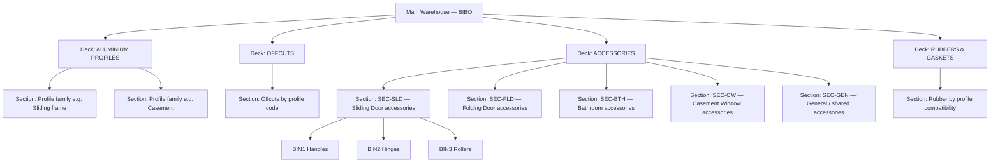
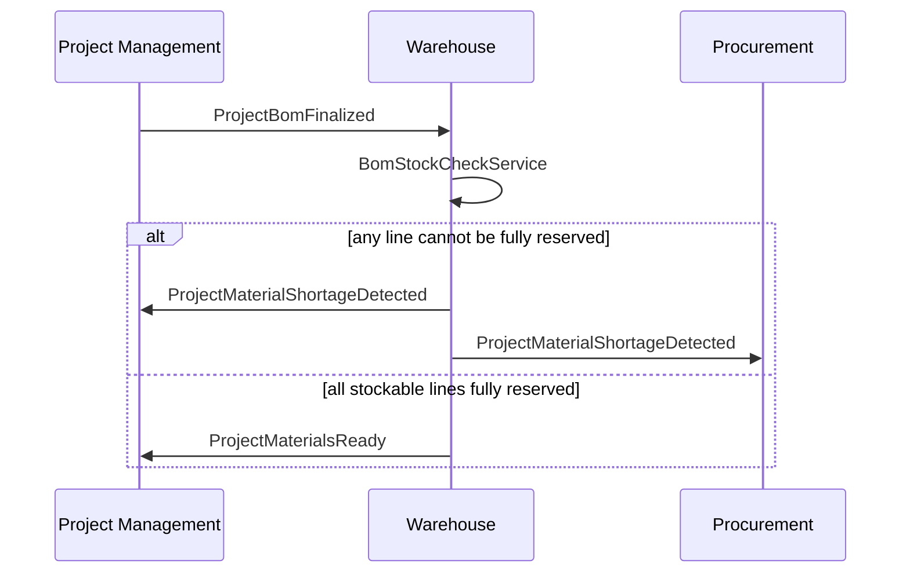
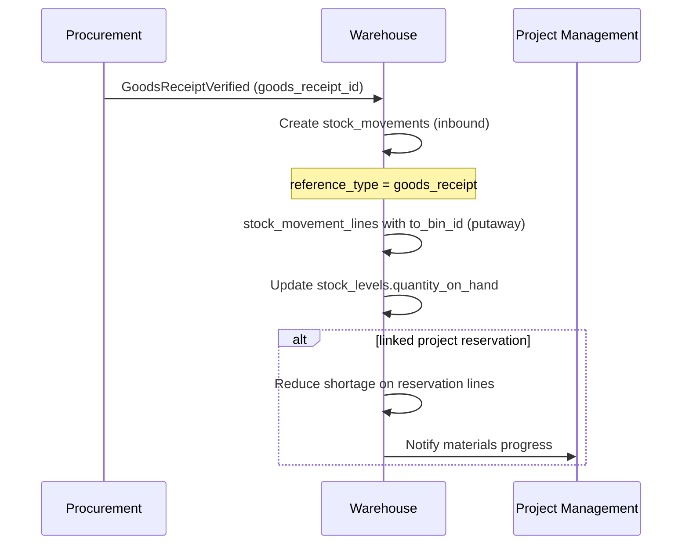
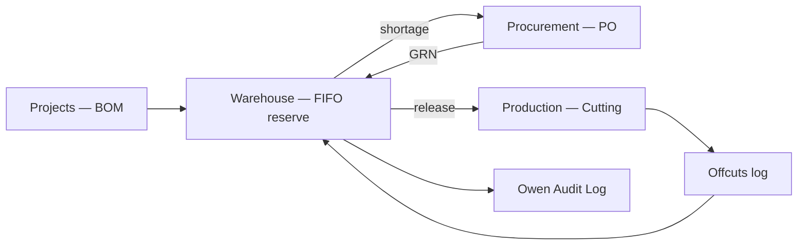

# Warehouse & Inventory — Implementation Plan

**Module:** Warehouse · Inventory · Offcuts · Tools · Stock Reservations (FIFO)  
**Stack:** PHP 8.2+ · Laravel 12 · PostgreSQL/MySQL · Next.js SPA  
**References:** [README.md](../README.md) §8.3 (Warehouse), §8.2 (Project BOM), §10 (Integrations), [Raw_Plam.txt](./Raw_Plam.txt) §6, [USER_ONBOARDING.MD](./USER_ONBOARDING.MD), [SALES_CRM.MD](./SALES_CRM.MD) §3 (folder structure), [WAREHOUSE_MIGRATION_SPEC.MD](./WAREHOUSE_MIGRATION_SPEC.MD) (column-level migration target)  
**Version:** 1.1 · 2026

---

## Table of Contents

1. [Goals & Physical Layout](#1-goals--physical-layout)
2. [Connecting Users to Warehouse by Department](#2-connecting-users-to-warehouse-by-department)
3. [Location Hierarchy](#3-location-hierarchy)
4. [Repository & Folder Structure](#4-repository--folder-structure)
5. [Master Data](#5-master-data)
6. [Database Schema](#6-database-schema)
7. [Migration Refactor Notes](#7-migration-refactor-notes)
8. [Stock Management](#8-stock-management)
9. [FIFO Reservations & Project Integration](#9-fifo-reservations--project-integration)
10. [GRN Receive Flow](#10-grn-receive-flow)
11. [Domain Events](#11-domain-events)
12. [Offcuts Warehouse](#12-offcuts-warehouse)
13. [Rubbers & Gaskets](#13-rubbers--gaskets)
14. [Tools Management](#14-tools-management)
15. [Stock Movements & Stock-Take](#15-stock-movements--stock-take)
16. [API Endpoints](#16-api-endpoints)
17. [Permissions & Role Scoping](#17-permissions--role-scoping)
18. [Seed Data](#18-seed-data)
19. [Frontend Routes](#19-frontend-routes)
20. [Cross-Module Integration](#20-cross-module-integration)
21. [Audit Logging](#21-audit-logging)
22. [Implementation Phases](#22-implementation-phases)

---

## 1. Goals & Physical Layout

### Business goals (README §8.3)

- Track **Accessories** and **Aluminium Profiles** with **separate manager roles**.
- **Glass is NOT stored** in warehouse — sourced per project at procurement.
- **Hierarchy:** find any item physically → **Warehouse → Deck → Section → Bin → Item** (README §8.3 uses the shorthand “Section → Bin”; the **Deck** layer models the two manager zones — accessories/rubbers vs aluminium/offcuts).
- **FIFO** material reservation when project BOM is confirmed.
- **Offcuts** logged after cutting; check offcuts before new procurement.
- **Tools** issued per project with return/damage tracking.

### BIBO physical warehouse layout (two decks + partitions)

The main warehouse is organized into **four logical decks (zones)**. Two warehouse manager roles split responsibility, but the system models all zones in one warehouse record.



| Deck slug | Name | Managed by (typical) | Storage unit |
|-----------|------|----------------------|--------------|
| `aluminium` | Aluminium Profiles | Warehouse Manager (Aluminium) | Length (metres) / bars |
| `offcuts` | Offcuts | Warehouse Manager (Aluminium) | Length (mm) per piece |
| `accessories` | Accessories | Warehouse Manager (Accessories) | Each / pack |
| `rubbers` | Rubbers & Gaskets | Warehouse Manager (Accessories) | Metre / roll / each |

### Accessories partitioning rule

**Accessories are grouped by door/window profile type**, not mixed randomly:

- Each **door type** (Sliding Door, Folding Door, Bathroom, Casement, etc.) gets its own **section**.
- Within that section, **bins** hold related accessories together (hinges, handles, rollers, locks — all for that door type).
- **Bathroom accessories** always live in dedicated section `SEC-BTH` — never mixed with sliding/folding sections.
- **Rubbers/gaskets** live on the **Rubbers deck**, organized by **profile compatibility** (which aluminium profile they fit).

**Example (README):** Sliding door accessories → `SEC5FG` → `BIN2` = Hinges.

---

## 2. Connecting Users to Warehouse by Department

From [USER_ONBOARDING.MD](./USER_ONBOARDING.MD) §2 and seed data:

| Department slug | Default module | Landing route |
|-----------------|----------------|---------------|
| `warehouse` | `warehouse` | `/warehouse/inventory` |

| Role slug | Scope |
|-----------|--------|
| `warehouse_manager_accessories` | Decks: `accessories`, `rubbers` |
| `warehouse_manager_aluminium` | Decks: `aluminium`, `offcuts` |
| `super_admin` / `operations_manager` | All decks |
| `procurement_officer` | Read stock levels (`warehouse.stock.view`) |
| `production_manager` | Read + request release (`warehouse.stock.view`, `warehouse.release.view`) |

### Permission keys (add to `PermissionSeeder`)

```
# General
warehouse.stock.view
warehouse.stock.view_all

# Master data
warehouse.master_data.view
warehouse.master_data.manage

# Location structure
warehouse.locations.view
warehouse.locations.manage

# Stock operations
warehouse.stock.adjust
warehouse.stock.transfer
warehouse.stock.receive
warehouse.stock.issue

# Reservations (FIFO)
warehouse.reservations.view
warehouse.reservations.create
warehouse.reservations.release

# Deck-scoped (optional fine control)
warehouse.aluminium.manage
warehouse.accessories.manage
warehouse.offcuts.manage
warehouse.rubbers.manage

# Offcuts
warehouse.offcuts.allocate
warehouse.offcuts.log

# Tools
warehouse.tools.view
warehouse.tools.manage
warehouse.tools.issue

# Stock-take
warehouse.stocktake.view
warehouse.stocktake.run
```

### Deck-scoped middleware

```php
// EnsureUserCanManageDeck — checks role + permission against deck slug
Route::middleware(['permission:warehouse.accessories.manage', 'warehouse.deck:accessories'])
```

`WarehouseDeckPolicy` maps role → allowed deck slugs.

---

## 3. Location Hierarchy

### 3.1 Levels

```
Warehouse (1 building)
  └── Deck / Zone (aluminium | offcuts | accessories | rubbers)
        └── Section (partition — door type OR profile family OR bathroom)
              └── Bin (physical shelf / container)
                    └── Item stock (SKU at quantity)
```

### 3.2 Section types

| `section_type` | Deck | Purpose |
|----------------|------|---------|
| `profile_family` | `aluminium` | Group profiles by family (sliding frame, casement, etc.) |
| `offcut_profile` | `offcuts` | Offcuts grouped by profile code |
| `door_accessories` | `accessories` | All accessories for one door type |
| `bathroom_accessories` | `accessories` | Bathroom-only — always separate section |
| `general_accessories` | `accessories` | Shared items used across door types |
| `rubber_profile` | `rubbers` | Gaskets/rubbers by compatible profile |

### 3.3 Naming convention

| Level | Code pattern | Example |
|-------|--------------|---------|
| Warehouse | `WH-MAIN` | Main Warehouse |
| Deck | `DECK-ALU`, `DECK-OFF`, `DECK-ACC`, `DECK-RUB` | |
| Section | `SEC-{DOOR}` | `SEC-SLD`, `SEC-FLD`, `SEC-BTH`, `SEC5FG` |
| Bin | `BIN{n}` | `BIN1`, `BIN2` |
| Item SKU | `{category}-{code}` | `ACC-HNG-001`, `PROF-SLD-80MM` |

### 3.4 Navigation path (UI)

User searches item → system returns:

```
Main Warehouse → Accessories → Sliding Door (SEC-SLD) → BIN2 (Hinges) → Hinge 100mm (qty: 240)
```

---

## 4. Repository & Folder Structure

Same convention as CRM ([SALES_CRM.MD §3](./SALES_CRM.MD#3-repository--folder-structure-match-user-onboarding)):

```
backend/app/
├── Enums/Warehouse/
│   ├── DeckSlug.php
│   ├── SectionType.php
│   ├── ItemCategory.php          # aluminium_profile, accessory, rubber, tool
│   ├── StockMovementType.php     # inbound, outbound, transfer, adjustment
│   └── ReservationStatus.php
├── Http/Controllers/Warehouse/
│   ├── Locations/
│   │   ├── WarehouseController.php
│   │   ├── DeckController.php
│   │   ├── SectionController.php
│   │   └── BinController.php
│   ├── Inventory/
│   │   ├── StockLevelController.php
│   │   └── ItemSearchController.php
│   ├── Movements/
│   │   ├── StockMovementController.php
│   │   ├── ReceiveStockController.php
│   │   ├── TransferStockController.php
│   │   └── AdjustStockController.php
│   ├── Reservations/
│   │   ├── ProjectReservationController.php
│   │   └── ReleaseReservedStockController.php
│   ├── Offcuts/
│   │   ├── OffcutController.php
│   │   ├── LogOffcutController.php
│   │   └── AllocateOffcutController.php
│   ├── MasterData/
│   │   ├── AluminiumProfileController.php
│   │   ├── AccessoryController.php
│   │   ├── RubberController.php
│   │   └── DoorTypeController.php
│   ├── Tools/
│   │   ├── ToolController.php
│   │   ├── IssueToolController.php
│   │   └── ReturnToolController.php
│   └── StockTake/
│       └── StockTakeController.php
├── Http/Requests/Warehouse/
│   ├── Locations/
│   ├── Movements/
│   ├── Offcuts/
│   ├── MasterData/
│   └── Tools/
├── Http/Resources/Warehouse/
│   ├── StockLevelResource.php
│   ├── LocationPathResource.php
│   └── OffcutResource.php
├── Models/Warehouse/
│   ├── Warehouse.php
│   ├── Deck.php
│   ├── Section.php
│   ├── Bin.php
│   ├── Item.php
│   ├── AluminiumProfile.php      # extends / links Item
│   ├── Accessory.php
│   ├── Rubber.php
│   ├── DoorType.php
│   ├── DoorTypeAccessory.php     # standard qty per door type
│   ├── StockLevel.php
│   ├── StockMovement.php
│   ├── StockMovementLine.php
│   ├── StockReservation.php
│   ├── StockReservationLine.php
│   ├── OffcutPiece.php
│   ├── Tool.php
│   ├── ToolIssuance.php
│   └── Lookup/
│       ├── UnitOfMeasure.php
│       └── ItemCategory.php
├── Services/Warehouse/
│   ├── Inventory/
│   │   ├── StockLevelCalculator.php    # available = on_hand - reserved
│   │   └── ItemLocationResolver.php
│   ├── Reservations/
│   │   ├── FifoReservationService.php
│   │   └── BomStockCheckService.php
│   ├── Movements/
│   │   └── StockMovementService.php
│   ├── Offcuts/
│   │   ├── OffcutLoggingService.php
│   │   └── OffcutAllocationService.php
│   └── Tools/
│       └── ToolIssuanceService.php
├── Policies/Warehouse/
│   ├── DeckPolicy.php
│   ├── StockMovementPolicy.php
│   └── OffcutPolicy.php
└── routes/api/warehouse/
    ├── locations.php
    ├── inventory.php
    ├── movements.php
    ├── reservations.php
    ├── offcuts.php
    ├── master-data.php
    └── tools.php
```

---

## 5. Master Data

### 5.1 Item categories

| Category | Deck | UoM | Notes |
|----------|------|-----|-------|
| `aluminium_profile` | aluminium | metre / bar | Powder coat colour, weight/m |
| `accessory` | accessories | each / pack | Linked to `door_type_id` |
| `rubber` | rubbers | metre / roll | Profile compatibility list |
| `tool` | n/a (tools register) | each | Not bin stock in same way |

**Glass:** not a warehouse item — flag `is_procurement_only` on project BOM lines.

### 5.2 Door types (drives accessory sections)

| Code | Name | Section code | Notes |
|------|------|--------------|-------|
| `SLD` | Sliding Door | `SEC-SLD` | Handles, rollers, locks, tracks |
| `FLD` | Folding Door | `SEC-FLD` | Folding-specific hardware |
| `CSM` | Casement Window | `SEC-CSM` | Casement hinges, stays |
| `BTH` | Bathroom | `SEC-BTH` | **Always grouped together** |
| `AWN` | Awning Window | `SEC-AWN` | |
| `GEN` | General | `SEC-GEN` | Shared across types |

Each door type has **standard accessory list** (`door_type_accessories`: item_id, standard_qty) for BOM estimation.

### 5.3 Aluminium profiles

| Field | Notes |
|-------|-------|
| `code` | e.g. `PROF-SLD-80MM` |
| `name` | Display name |
| `profile_family` | Section grouping on aluminium deck |
| `dimensions` | Width × depth mm |
| `finish` | Powder coat colour |
| `weight_per_metre` | kg/m |
| `standard_bar_length` | mm (e.g. 6000) |
| `min_stock_metres` | Low-stock threshold |

### 5.4 Accessories

| Field | Notes |
|-------|-------|
| `code` | SKU |
| `name` | e.g. "Heavy Duty Hinge 100mm" |
| `door_type_id` | Which section partition |
| `default_bin_id` | Preferred bin in door section |
| `unit_of_measure` | each / pack |
| `min_stock_qty` | Triggers procurement alert |

### 5.5 Rubbers / gaskets

| Field | Notes |
|-------|-------|
| `code` | SKU |
| `name` | |
| `compatible_profile_ids` | JSON array — which aluminium profiles |
| `section_id` | Rubbers deck section |
| `unit_of_measure` | metre / roll |

---

## 6. Database Schema

### 6.1 Location tables

```sql
CREATE TABLE warehouses (
    id          BIGSERIAL PRIMARY KEY,
    code        VARCHAR(30) NOT NULL UNIQUE,
    name        VARCHAR(255) NOT NULL,
    address     TEXT NULL,
    is_active   BOOLEAN DEFAULT TRUE,
    created_at  TIMESTAMP NOT NULL,
    updated_at  TIMESTAMP NOT NULL
);

CREATE TABLE warehouse_decks (
    id              BIGSERIAL PRIMARY KEY,
    warehouse_id    BIGINT NOT NULL REFERENCES warehouses(id),
    slug            VARCHAR(30) NOT NULL,  -- aluminium, offcuts, accessories, rubbers
    name            VARCHAR(255) NOT NULL,
    sort_order      INT DEFAULT 0,
    UNIQUE (warehouse_id, slug)
);

CREATE TABLE warehouse_sections (
    id              BIGSERIAL PRIMARY KEY,
    deck_id         BIGINT NOT NULL REFERENCES warehouse_decks(id),
    door_type_id    BIGINT NULL REFERENCES door_types(id),
    code            VARCHAR(30) NOT NULL,  -- SEC-SLD, SEC-BTH
    name            VARCHAR(255) NOT NULL,
    section_type    VARCHAR(50) NOT NULL,
    sort_order      INT DEFAULT 0,
    is_active       BOOLEAN DEFAULT TRUE,
    UNIQUE (deck_id, code)
);

CREATE TABLE warehouse_bins (
    id              BIGSERIAL PRIMARY KEY,
    section_id      BIGINT NOT NULL REFERENCES warehouse_sections(id),
    code            VARCHAR(30) NOT NULL,  -- BIN1, BIN2
    name            VARCHAR(255) NULL,
    description     TEXT NULL,
    sort_order      INT DEFAULT 0,
    is_active       BOOLEAN DEFAULT TRUE,
    UNIQUE (section_id, code)
);
```

### 6.2 Items & extensions

```sql
CREATE TABLE door_types (
    id              BIGSERIAL PRIMARY KEY,
    code            VARCHAR(20) NOT NULL UNIQUE,
    name            VARCHAR(255) NOT NULL,
    section_code    VARCHAR(30) NOT NULL,
    is_active       BOOLEAN DEFAULT TRUE,
    created_at      TIMESTAMP NOT NULL,
    updated_at      TIMESTAMP NOT NULL
);

CREATE TABLE warehouse_items (
    id              BIGSERIAL PRIMARY KEY,
    sku             VARCHAR(50) NOT NULL UNIQUE,
    name            VARCHAR(255) NOT NULL,
    category        VARCHAR(30) NOT NULL,  -- aluminium_profile, accessory, rubber
    unit_of_measure VARCHAR(20) NOT NULL,
    door_type_id    BIGINT NULL REFERENCES door_types(id),
    min_stock_qty   DECIMAL(15,3) DEFAULT 0,
    is_active       BOOLEAN DEFAULT TRUE,
    created_at      TIMESTAMP NOT NULL,
    updated_at      TIMESTAMP NOT NULL
);

CREATE TABLE aluminium_profiles (
    item_id             BIGINT PRIMARY KEY REFERENCES warehouse_items(id),
    profile_family      VARCHAR(100) NOT NULL,
    width_mm            DECIMAL(10,2) NULL,
    depth_mm            DECIMAL(10,2) NULL,
    finish              VARCHAR(100) NULL,
    weight_per_metre    DECIMAL(10,4) NULL,
    standard_bar_length_mm INT NULL
);

CREATE TABLE accessories (
    item_id             BIGINT PRIMARY KEY REFERENCES warehouse_items(id),
    door_type_id        BIGINT NOT NULL REFERENCES door_types(id),
    default_bin_id      BIGINT NULL REFERENCES warehouse_bins(id)
);

CREATE TABLE rubbers (
    item_id                 BIGINT PRIMARY KEY REFERENCES warehouse_items(id),
    compatible_profile_ids  JSONB NULL,
    default_section_id      BIGINT NULL REFERENCES warehouse_sections(id)
);

CREATE TABLE door_type_accessories (
    door_type_id    BIGINT NOT NULL REFERENCES door_types(id),
    item_id         BIGINT NOT NULL REFERENCES warehouse_items(id),
    standard_qty    DECIMAL(10,2) NOT NULL DEFAULT 1,
    PRIMARY KEY (door_type_id, item_id)
);
```

> **FK order:** In the actual migration, create `door_types` before `warehouse_sections` (see [WAREHOUSE_MIGRATION_SPEC.MD §3](./WAREHOUSE_MIGRATION_SPEC.MD#3-fk-creation-order)). Column-level detail and indexes: [WAREHOUSE_MIGRATION_SPEC.MD](./WAREHOUSE_MIGRATION_SPEC.MD).

### 6.3 Stock levels (per bin)

```sql
CREATE TABLE stock_levels (
    id              BIGSERIAL PRIMARY KEY,
    item_id         BIGINT NOT NULL REFERENCES warehouse_items(id),
    bin_id          BIGINT NOT NULL REFERENCES warehouse_bins(id),
    quantity_on_hand DECIMAL(15,3) NOT NULL DEFAULT 0,
    quantity_reserved DECIMAL(15,3) NOT NULL DEFAULT 0,
    -- available = on_hand - reserved (computed)
    updated_at      TIMESTAMP NOT NULL,
    UNIQUE (item_id, bin_id)
);
```

### 6.4 Stock movements

```sql
CREATE TABLE stock_movements (
    id              BIGSERIAL PRIMARY KEY,
    movement_number VARCHAR(30) NOT NULL UNIQUE,
    movement_type   VARCHAR(30) NOT NULL,
    reference_type  VARCHAR(50) NULL,  -- purchase_order, project, production_order, stock_take
    reference_id    BIGINT NULL,
    notes           TEXT NULL,
    performed_by    BIGINT NOT NULL REFERENCES users(id),
    performed_at    TIMESTAMP NOT NULL,
    created_at      TIMESTAMP NOT NULL
);

CREATE TABLE stock_movement_lines (
    id              BIGSERIAL PRIMARY KEY,
    stock_movement_id BIGINT NOT NULL REFERENCES stock_movements(id),
    item_id         BIGINT NOT NULL REFERENCES warehouse_items(id),
    from_bin_id     BIGINT NULL REFERENCES warehouse_bins(id),
    to_bin_id       BIGINT NULL REFERENCES warehouse_bins(id),
    quantity        DECIMAL(15,3) NOT NULL,
    unit_cost       DECIMAL(15,2) NULL
);
```

### 6.5 FIFO reservations (project-centric)

```sql
CREATE TABLE stock_reservations (
    id              BIGSERIAL PRIMARY KEY,
    reservation_number VARCHAR(30) NOT NULL UNIQUE,
    project_id      BIGINT NOT NULL REFERENCES projects(id),
    status          VARCHAR(30) NOT NULL DEFAULT 'pending',
    reserved_at     TIMESTAMP NOT NULL,
    reserved_by     BIGINT NOT NULL REFERENCES users(id),
    fifo_sequence   INT NOT NULL,
    notes           TEXT NULL,
    created_at      TIMESTAMP NOT NULL,
    updated_at      TIMESTAMP NOT NULL
);

CREATE TABLE stock_reservation_lines (
    id              BIGSERIAL PRIMARY KEY,
    reservation_id  BIGINT NOT NULL REFERENCES stock_reservations(id),
    item_id         BIGINT NOT NULL REFERENCES warehouse_items(id),
    bin_id          BIGINT NOT NULL REFERENCES warehouse_bins(id),
    quantity_reserved DECIMAL(15,3) NOT NULL,
    quantity_released DECIMAL(15,3) NOT NULL DEFAULT 0,
    bom_line_ref    VARCHAR(100) NULL
);
```

**FIFO rule:** When multiple projects need same item, `fifo_sequence` on reservation (project queue order) determines allocation priority.

### 6.6 Offcuts

```sql
CREATE TABLE offcut_pieces (
    id              BIGSERIAL PRIMARY KEY,
    offcut_number   VARCHAR(30) NOT NULL UNIQUE,
    item_id         BIGINT NOT NULL REFERENCES warehouse_items(id),  -- profile
    bin_id          BIGINT NOT NULL REFERENCES warehouse_bins(id),   -- offcuts deck
    length_mm       INT NOT NULL,
    quantity_pieces INT NOT NULL DEFAULT 1,
    source_project_id BIGINT NULL,
    source_movement_id BIGINT NULL,
    status          VARCHAR(30) NOT NULL DEFAULT 'available',  -- available, allocated, consumed, scrapped
    allocated_project_id BIGINT NULL,
    logged_by       BIGINT NOT NULL REFERENCES users(id),
    logged_at       TIMESTAMP NOT NULL,
    notes           TEXT NULL,
    created_at      TIMESTAMP NOT NULL
);
```

### 6.7 Tools

```sql
CREATE TABLE warehouse_tools (
    id              BIGSERIAL PRIMARY KEY,
    tool_code       VARCHAR(30) NOT NULL UNIQUE,
    name            VARCHAR(255) NOT NULL,
    tool_type       VARCHAR(100) NULL,
    condition       VARCHAR(30) NOT NULL DEFAULT 'good',
    purchase_date   DATE NULL,
    is_active       BOOLEAN DEFAULT TRUE,
    created_at      TIMESTAMP NOT NULL
);

CREATE TABLE tool_issuances (
    id              BIGSERIAL PRIMARY KEY,
    tool_id         BIGINT NOT NULL REFERENCES warehouse_tools(id),
    project_id      BIGINT NULL,
    issued_to       BIGINT NOT NULL REFERENCES users(id),
    issued_by       BIGINT NOT NULL REFERENCES users(id),
    issue_date      DATE NOT NULL,
    return_date     DATE NULL,
    condition_out   VARCHAR(30) NOT NULL,
    condition_in    VARCHAR(30) NULL,
    damage_notes    TEXT NULL,
    created_at      TIMESTAMP NOT NULL
);
```

---

## 7. Migration Refactor Notes

**Current stub:** `backend/database/migrations/2025_05_19_400000_create_warehouse_tables.php` (7 tables).  
**Target:** 18 tables per [WAREHOUSE_MIGRATION_SPEC.MD](./WAREHOUSE_MIGRATION_SPEC.MD).

| Current artifact | Fix |
|------------------|-----|
| `warehouses.category` | Remove; categories are **deck slugs** on `warehouse_decks` |
| Missing `warehouse_decks` | Add four decks under `WH-MAIN` |
| `warehouse_sections.warehouse_id` | Change to `deck_id` + `section_type` + optional `door_type_id` |
| `inventory_items` + qty on row | Split → `warehouse_items` (master) + `stock_levels` (per bin) |
| Flat `stock_movements` | Header/lines: `stock_movements` + `stock_movement_lines` |
| Flat `stock_reservations` | Header/lines: `stock_reservations` + `stock_reservation_lines` + `fifo_sequence` on header |
| `offcuts` table | Replace with `offcut_pieces` (`item_id`, `bin_id`, `offcut_number`) |
| No master data | Add `door_types`, profile/accessory/rubber extensions, `door_type_accessories` |
| No tools | Add `warehouse_tools`, `tool_issuances` |

**Prerequisite:** `2025_05_19_300000_create_projects_tables.php` must run first (`projects`, `users` FKs).

**Glass rule:** No `glass` row in `warehouse_items.category` — enforced at application layer and documented in BOM (`is_procurement_only` / `is_glass` on project side).

---

## 8. Stock Management

### Core formulas

```
available_qty = quantity_on_hand - quantity_reserved
```

| Operation | Movement type | Effect |
|-----------|---------------|--------|
| GRN from procurement | `inbound` | +on_hand at bin |
| Issue to production/project | `outbound` | −on_hand, −reserved |
| Bin to bin | `transfer` | −from, +to |
| Stock-take variance | `adjustment` | ±on_hand |
| Offcut logged from cutting | `inbound` (offcuts deck) | +offcut piece record |

### Low-stock alerts

When `available_qty < min_stock_qty` on any item:

1. Create notification for `procurement_officer`.
2. Optional auto-requisition draft (Procurement module phase 2).

---

## 9. FIFO Reservations & Project Integration

From README §8.2 project stages 6–8:

```
BOM Finalized → Material Check → Materials Reserved (FIFO) → Awaiting Procurement (if shortage)
```

### 9.1 `BomStockCheckService`

**Input:** project_id + BOM lines (item_id, qty required)

**Output:**

| BOM line | Required | On hand | Reserved (others) | Available | Offcut usable | Shortage |
|----------|----------|---------|-------------------|-----------|---------------|----------|

**Offcut check:** Before flagging procurement for profiles, `OffcutAllocationService` searches `offcut_pieces` where `length_mm >= required_cut`.

### 9.2 `FifoReservationService`

**All-or-nothing reservation** ([INTEGRATION_CONTRACT.MD](./INTEGRATION_CONTRACT.MD) §11 Q5): the project advances to `materials_reserved` only when **every** stockable BOM line can be **fully** reserved. If any line has a shortage, emit `ProjectMaterialShortageDetected` and move to `awaiting_procurement` — **no partial reservation**.

1. Assign `fifo_sequence` from project queue (earlier project = lower number).
2. For each BOM line, attempt full lock in bins (prefer default bin → then same section).
3. If **all** lines succeed: update `stock_levels.quantity_reserved`; emit `ProjectMaterialsReady` (or advance via `materials_reserved` then `materials_ready` per PM listener).
4. If **any** line fails: release any tentative locks; emit `ProjectMaterialShortageDetected`; do **not** set `materials_reserved`.

### 9.2.1 FIFO sequence override (operations manager)

Per contract §11 Q14: **production schedule reorder** does not change `fifo_sequence`. Only **`operations_manager`** may override reservation queue order via `FifoReservationOverrideService`, with mandatory Owen audit log (`fifo_sequence_override`).

Production Manager and PROD module **must not** call override APIs.

### 9.3 Stage-based release

Production stage start triggers partial release (README §8.2):

- Cutting stage → release profile stock only.
- Fabrication → release accessories from door-type bins per BOM.

`ReleaseReservedStockController` — `permission:warehouse.reservations.release`

### 9.4 Event-driven FIFO flow

Triggered when Project Management emits **`ProjectBomFinalized`** (README §8.2 stages 6–8, Raw_Plam §6.3):



| Step | Service | Action |
|------|---------|--------|
| 1 | `BomStockCheckService` | Compare BOM lines vs `stock_levels` + usable `offcut_pieces` |
| 2 | `FifoReservationService` | Assign `fifo_sequence`; lock bins; update `quantity_reserved` |
| 3a | — | Shortage → emit **`ProjectMaterialShortageDetected`** |
| 3b | — | Full reserve → emit **`ProjectMaterialsReady`** |

PM owns stage transitions (`awaiting_procurement` / `materials_ready`) via listeners — warehouse never writes `projects.stage` directly.

---

## 10. GRN Receive Flow

When Procurement verifies a goods receipt and emits **`GoodsReceiptVerified`**:



| Step | Detail |
|------|--------|
| 1 | Create **`stock_movements`** row: `movement_type = inbound`, `reference_type = goods_receipt`, `reference_id = {grn_id}` |
| 2 | For each accepted GRN line, create **`stock_movement_lines`** with `to_bin_id` = putaway bin (warehouse operator selects or uses `accessories.default_bin_id`) |
| 3 | Increment **`stock_levels.quantity_on_hand`** for `(item_id, bin_id)` |
| 4 | Receipt / invoice images remain on procurement **`goods_receipt_attachments`** (`path`, optional `firebase_url`); movement links via `reference_id`. Optional copy paths into movement `notes` for audit |
| 5 | If GRN fulfills an open project shortage, `GrnReservationFulfillmentService` re-runs BOM stock check and creates/resumes FIFO reservation when stock is sufficient; may emit **`ProjectMaterialsReady`** |

**Storage pattern (BiboStorage):** Same as CRM attachments — `private/procurement/{grn_id}/{filename}` or category `warehouse` for warehouse-captured photos; resolve URL via `BiboStorage::resolvePrivateApiUrl`.

**Frontend entry:** `/warehouse/receive?grn={id}` — deep-link from procurement GRN detail.

**API:** `POST /api/v1/warehouse/movements/receive` with `goods_receipt_id`, line putaway bins, optional notes.

---

## 11. Domain Events

Warehouse module event wiring (pending `docs/INTEGRATION_CONTRACT.MD`; names match integration plan):

### Publish (emit)

| Event | When | Payload (min) |
|-------|------|----------------|
| **`ProjectMaterialShortageDetected`** | BOM check / FIFO reserve finds shortage | `project_id`, shortage lines `[{item_id, qty_short}]` |
| **`ProjectMaterialsReady`** | All BOM stock + offcuts reserved | `project_id`, `reservation_id` |
| **`OffcutLogged`** | Offcut piece created after cutting | `offcut_piece_id`, `project_id`, `item_id`, `length_mm` |

### Listen (handle)

| Event | Publisher | Handler |
|-------|-----------|---------|
| **`ProjectBomFinalized`** | PM | Queue `BomStockCheckService` → `FifoReservationService` |
| **`GoodsReceiptVerified`** | Procurement | Inbound movement + putaway + reservation shortage reduction |
| **`ProductionStageCompleted`** | Production | Partial **`stock_reservation_lines.quantity_released`** when stage requires material release (e.g. cutting → profiles, fabrication → accessories) |

Register listeners in `AppServiceProvider` under warehouse-specific methods; PM remains sole writer of `projects.stage`.

---

## 12. Offcuts Warehouse

### Deck: `offcuts`

Separate from full-length aluminium deck. After cutting (Production module):

1. Operator logs offcut: profile code, **length_mm**, bin in offcuts section.
2. System creates `offcut_pieces` + inbound movement.
3. Monthly analytics: total wastage, reuse rate, efficiency per project.

### Workflows

| Action | Endpoint | Notes |
|--------|----------|-------|
| Log offcut | `POST /api/v1/warehouse/offcuts` | From production/cutting |
| Search usable offcuts | `GET /api/v1/warehouse/offcuts?profile=&min_length=` | Before procurement |
| Allocate to project | `POST /api/v1/warehouse/offcuts/{id}/allocate` | Sets `allocated_project_id` |
| Mark consumed | `PATCH /api/v1/warehouse/offcuts/{id}` body `{ "status": "consumed" }` | When cut used |
| Reuse analytics | `GET /api/v1/warehouse/offcuts/analytics` | Monthly reuse rate, by-project summary |

### Section layout

One section per profile family/code, e.g.:

- `SEC-OFF-SLD80` — Offcuts for 80mm sliding profile
- `SEC-OFF-CSM70` — Offcuts for 70mm casement profile

Bins within section can be by length range (optional) or single bin per profile.

---

## 13. Rubbers & Gaskets

### Deck: `rubbers`

- **Not mixed** with accessories deck.
- Sections grouped by **compatible aluminium profile** (e.g. all gaskets for SLD-80 profile family).
- Items stored in metres or rolls.
- Linked to `rubbers.compatible_profile_ids` for BOM matching.

### BOM matching

When project BOM includes rubber line → system suggests correct rubber SKU from compatibility matrix.

---

## 14. Tools Management

Separate from consumable stock (README §8.3):

- Register tools with code, type, condition.
- Issue to employee + project; track return.
- Damage on return → flag for replacement requisition.
- Permissions: `warehouse.tools.issue` (warehouse or IT).

---

## 15. Stock Movements & Stock-Take

### Movement document flow

```
Receive (from PO GRN) → stock_movements (inbound)
Transfer (SEC-SLD BIN1 → BIN2) → transfer
Issue to Project #1042 → outbound + reservation release
Adjustment (stock-take) → adjustment with reason
```

### Monthly stock-take

1. `StockTakeController` generates snapshot per bin.
2. User counts physical qty → variance report.
3. Approved adjustments applied via `adjustment` movement.

---

## 16. API Endpoints

Base: `/api/v1/warehouse` · Auth: `auth:sanctum`, `active`, `device.trusted`

Mutating endpoints use Form Request validation under `app/Http/Requests/Warehouse/`.

### Locations

| Method | Path | Permission |
|--------|------|------------|
| GET | `/locations/tree` | `warehouse.locations.view` |
| GET | `/warehouses` | `warehouse.locations.view` |
| GET | `/decks` | `warehouse.locations.view` |
| GET | `/decks/{deck}/sections` | `warehouse.locations.view` |
| GET | `/sections/{section}/bins` | `warehouse.locations.view` |
| POST | `/sections` | `warehouse.locations.manage` |
| POST | `/bins` | `warehouse.locations.manage` |

### Inventory

| Method | Path | Permission |
|--------|------|------------|
| GET | `/inventory` | `warehouse.stock.view` |
| GET | `/inventory/search?q=` | `warehouse.stock.view` |
| GET | `/inventory/search/locations?q=` | `warehouse.stock.view` |
| GET | `/inventory/by-location` | `warehouse.stock.view` |
| GET | `/inventory/low-stock` | `warehouse.stock.view` |
| GET | `/items/{item}/stock` | `warehouse.stock.view` |

### Movements

| Method | Path | Permission | Notes |
|--------|------|------------|-------|
| GET | `/movements` | `warehouse.stock.view` | |
| POST | `/movements/receive` | `warehouse.stock.receive` | GRN putaway; triggers `GrnReservationFulfillmentService` |
| POST | `/movements/transfer` | `warehouse.stock.transfer` | |
| POST | `/movements/adjust` | `warehouse.stock.adjust` | |
| POST | `/movements/issue` | `warehouse.stock.issue` | Optional `project_id`: releases matching reservation lines then issues remainder |

### Reservations

| Method | Path | Permission |
|--------|------|------------|
| GET | `/reservations` | `warehouse.reservations.view` |
| POST | `/projects/{project}/stock-check` | `warehouse.reservations.view` |
| POST | `/projects/{project}/reserve` | `warehouse.reservations.create` |
| POST | `/reservations/{id}/release` | `warehouse.reservations.release` |
| POST | `/reservations/reorder` | `warehouse.reservations.create` + `operations_manager\|super_admin` |

### Offcuts

| Method | Path | Permission |
|--------|------|------------|
| GET | `/offcuts` | `warehouse.offcuts.manage` |
| GET | `/offcuts/analytics` | `warehouse.offcuts.manage` |
| POST | `/offcuts` | `warehouse.offcuts.log` |
| POST | `/offcuts/{id}/allocate` | `warehouse.offcuts.allocate` |
| PATCH | `/offcuts/{id}` | `warehouse.offcuts.manage` | Body: `{ "status": "consumed" }` |

### Master data

| Method | Path | Permission |
|--------|------|------------|
| GET/POST | `/master-data/door-types` | `warehouse.master_data.manage` |
| GET/POST | `/master-data/aluminium-profiles` | `warehouse.master_data.manage` |
| GET/POST | `/master-data/accessories` | `warehouse.master_data.manage` |
| GET/POST | `/master-data/rubbers` | `warehouse.master_data.manage` |
| GET | `/master-data/rubbers/suggest?warehouse_item_id=` | `warehouse.master_data.view` |

### Tools

| Method | Path | Permission |
|--------|------|------------|
| GET/POST | `/tools` | `warehouse.tools.manage` |
| POST | `/tools/{id}/issue` | `warehouse.tools.issue` |
| POST | `/tools/issuances/{id}/return` | `warehouse.tools.issue` |

### Stock take

| Method | Path | Permission |
|--------|------|------------|
| GET | `/stock-take/snapshot` | `warehouse.stocktake.view` |
| POST | `/stock-take/variance` | `warehouse.stocktake.view` |
| POST | `/stock-take/apply` | `warehouse.stocktake.run` |

---

## 17. Permissions & Role Scoping

| Role | Decks | Key permissions |
|------|-------|-----------------|
| `warehouse_manager_aluminium` | aluminium, offcuts | `warehouse.aluminium.manage`, `warehouse.offcuts.*` |
| `warehouse_manager_accessories` | accessories, rubbers | `warehouse.accessories.manage`, `warehouse.rubbers.manage` |
| `procurement_officer` | read all | `warehouse.stock.view` |
| `production_manager` | read + release | `warehouse.stock.view`, `warehouse.reservations.release` |
| `operations_manager` | all | `warehouse.stock.view_all`, stock-take approve |

**Policy example:**

```php
// DeckPolicy — aluminium manager cannot POST to accessories deck
public function manage(User $user, Deck $deck): bool
{
    if ($user->can('warehouse.stock.view_all')) return true;
    if ($deck->slug === 'aluminium' || $deck->slug === 'offcuts') {
        return $user->hasRole('warehouse_manager_aluminium');
    }
    if ($deck->slug === 'accessories' || $deck->slug === 'rubbers') {
        return $user->hasRole('warehouse_manager_accessories');
    }
    return false;
}
```

---

## 18. Seed Data

### `WarehouseMasterDataSeeder`

Seeds **`door_types`** (SLD, FLD, CSM, BTH, AWN, GEN), sample **`warehouse_items`** + extensions, and **`door_type_accessories`** standard qty rows. Idempotent via unique codes / SKUs.

Add to `php artisan db:seed` after `CrmLookupSeeder`:

```php
$this->call([
  // ...
  WarehouseStructureSeeder::class,  // warehouse, decks, sections, bins
  WarehouseMasterDataSeeder::class, // door types, sample items
]);
```

### `WarehouseStructureSeeder`

**Warehouse:** `WH-MAIN` — BIBO Main Warehouse

**Decks:**

| slug | name |
|------|------|
| `aluminium` | Aluminium Profiles |
| `offcuts` | Offcuts |
| `accessories` | Accessories |
| `rubbers` | Rubbers & Gaskets |

**Accessory sections (door partitions):**

| code | name | door_type |
|------|------|-----------|
| `SEC-SLD` | Sliding Door Accessories | SLD |
| `SEC-FLD` | Folding Door Accessories | FLD |
| `SEC-CSM` | Casement Window Accessories | CSM |
| `SEC-BTH` | Bathroom Accessories | BTH |
| `SEC-AWN` | Awning Accessories | AWN |
| `SEC-GEN` | General Accessories | GEN |

Each section: seed `BIN1`–`BIN5` (expand in production).

**Example bins for SEC-SLD:**

| Bin | Label |
|-----|-------|
| BIN1 | Handles |
| BIN2 | Hinges |
| BIN3 | Rollers |
| BIN4 | Locks |
| BIN5 | Tracks / Misc |

**Rubbers sections:** `SEC-RUB-SLD`, `SEC-RUB-CSM`, etc.

**Aluminium sections:** by profile family (e.g. `SEC-ALU-SLD-FRAME`).

**Offcuts sections:** mirror profile codes (`SEC-OFF-SLD80`).

All seeders use `updateOrCreate` by unique codes (idempotent).

---

## 19. Frontend Routes

Existing (`frontend/lib/navigation.ts`):

| Route | Purpose |
|-------|---------|
| `/warehouse/inventory` | Stock levels across decks |
| `/warehouse/movements` | Movement history |
| `/warehouse/offcuts` | Offcuts deck UI |
| `/warehouse/tools` | Tools register |
| `/warehouse/master-data` | Items, door types, profiles |
| `/warehouse/receive?grn={id}` | GRN putaway — deep-link from procurement |

### Planned UI views

| View | Features |
|------|----------|
| **Inventory** | Filter by deck → section → bin; show available vs reserved |
| **Location map** | Tree: Deck → Section → Bin |
| **Accessories browser** | Door type tabs (Sliding, Folding, Bathroom, …) |
| **Offcuts** | Search by profile + min length; allocate to project |
| **Rubbers** | Profile compatibility matrix |
| **Receive stock** | GRN link from procurement |
| **Project reservation** | BOM check + FIFO queue (from Projects module) |

---

## 20. Cross-Module Integration



| From | To | Event |
|------|-----|-------|
| Project | Warehouse | **`ProjectBomFinalized`** → stock check |
| Warehouse | Project | **`ProjectMaterialsReady`** / **`ProjectMaterialShortageDetected`** |
| Warehouse | Procurement | Low stock / **`ProjectMaterialShortageDetected`** |
| Procurement | Warehouse | **`GoodsReceiptVerified`** → inbound movement |
| Production | Warehouse | **`ProductionStageCompleted`** → release; cutting → **`OffcutLogged`** |
| Warehouse | Production | Stage start → release reserved materials |

---

## 21. Audit Logging

| Action | Module | Entity |
|--------|--------|--------|
| `stock.received` | warehouse | stock_movement |
| `stock.issued` | warehouse | stock_movement |
| `stock.transferred` | warehouse | stock_movement |
| `reservation.created` | warehouse | stock_reservation |
| `reservation.released` | warehouse | stock_reservation |
| `offcut.logged` | warehouse | offcut_piece |
| `offcut.allocated` | warehouse | offcut_piece |
| `tool.issued` | warehouse | tool_issuance |
| `master_data.updated` | warehouse | warehouse_item |

---

## 22. Implementation Phases

### Phase 1 — Location structure (Week 1)

- [ ] Migrations: warehouses, decks, sections, bins
- [ ] `WarehouseStructureSeeder`
- [ ] Location CRUD API + tree endpoint
- [ ] Frontend location tree component

### Phase 2 — Master data (Week 2)

- [ ] Items, door types, profiles, accessories, rubbers
- [ ] `WarehouseMasterDataSeeder`
- [ ] Master data admin UI

### Phase 3 — Stock levels & movements (Week 3)

- [ ] Stock levels per bin
- [ ] Receive, transfer, adjust movements
- [ ] Inventory list UI with deck/section filters

### Phase 4 — FIFO reservations (Week 4)

- [ ] `FifoReservationService` + project BOM check stub
- [ ] Reservation/release API
- [ ] Integration hook for Projects module

### Phase 5 — Offcuts (Week 5)

- [ ] Offcut logging from production
- [ ] Search + allocate before procurement
- [ ] Offcuts UI (`/warehouse/offcuts`)

### Phase 6 — Tools & stock-take (Week 6)

- [ ] Tools register + issuance
- [ ] Stock-take workflow
- [ ] Reports: levels, movements, offcut reuse rate

---

## Appendix A — Physical layout summary

```
WH-MAIN (BIBO Main Warehouse)
│
├── DECK: ALUMINIUM PROFILES          [Manager: Aluminium]
│   ├── SEC-ALU-SLD-FRAME
│   ├── SEC-ALU-CSM-FRAME
│   └── ...
│
├── DECK: OFFCUTS                     [Manager: Aluminium]
│   ├── SEC-OFF-SLD80  → BIN1, BIN2...
│   └── SEC-OFF-CSM70
│
├── DECK: ACCESSORIES                 [Manager: Accessories]
│   ├── SEC-SLD  (Sliding Door — all sliding hardware together)
│   │   ├── BIN1 Handles
│   │   ├── BIN2 Hinges
│   │   └── BIN3 Rollers
│   ├── SEC-FLD  (Folding Door)
│   ├── SEC-BTH  (Bathroom — always separate)
│   ├── SEC-CSM  (Casement)
│   └── SEC-GEN  (General shared)
│
└── DECK: RUBBERS & GASKETS           [Manager: Accessories]
    ├── SEC-RUB-SLD  (gaskets for sliding profiles)
    └── SEC-RUB-CSM
```

---

## Appendix B — Role → deck matrix

| Deck | `warehouse_manager_aluminium` | `warehouse_manager_accessories` |
|------|:-----------------------------:|:-------------------------------:|
| aluminium | ✓ | — |
| offcuts | ✓ | — |
| accessories | — | ✓ |
| rubbers | — | ✓ |

---

*End of Warehouse Implementation Plan v1.1*
