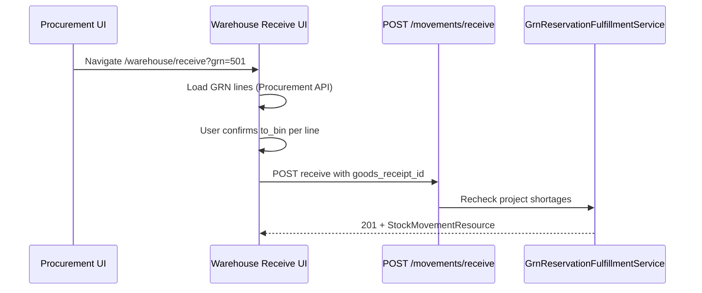

# Warehouse Module — Frontend Implementation Guide

**Audience:** Frontend developers wiring the BIBO ERM warehouse UI  
**Backend status:** API complete and tested (82 warehouse tests passing)  
**Related:** [`docs/WAREHOUSE.MD`](../../docs/WAREHOUSE.MD) (domain model & schema), [`docs/INTEGRATION_CONTRACT.MD`](../../docs/INTEGRATION_CONTRACT.MD) (cross-module events)

---

## 1. Executive summary

The warehouse **backend is ready**. The **frontend is mostly scaffolded with mock data** — only `/warehouse/inventory` exists as a page shell; it still uses `mockWarehouseItems` instead of live API calls.

This guide covers:

1. **Updated backend scenarios** (user stories + acceptance criteria)
2. **What was intentionally skipped** in the backend pass (frontend work)
3. **Route map** — nav entries vs actual pages vs APIs to call
4. **Page-by-page UI guidance** with endpoints, payloads, permissions, and response shapes
5. **Integration points** with Procurement, Projects, and Production

---

## 2. API conventions

| Topic | Value |
|-------|-------|
| Base URL env | `NEXT_PUBLIC_API_URL` (see `frontend/lib/api/config.ts`) |
| API prefix | `/api/v1/warehouse` |
| Auth | Cookie session via Sanctum (`credentials: "include"`) |
| Middleware | `auth:sanctum`, `active`, `device.trusted` on all warehouse routes |
| CSRF | Required on mutating requests — use `apiFetch` / `apiRequest` from `frontend/lib/api/client.ts` |
| Device header | `X-Device-Id` / `X-Device-UUID` (trusted device required) |
| JSON envelope | Laravel API Resources wrap entities in `{ "data": ... }` |
| Validation errors | HTTP 422 with `{ "message": "...", "errors": { "field": ["..."] } }` |
| Permissions | Spatie slugs on `GET /api/v1/auth/me` — gate UI with same slugs as backend |

**Recommended client module:** add `frontend/lib/api/warehouse/` mirroring `frontend/lib/api/crm/` (types + fetch helpers + `buildQuery`).

Example:

```ts
import { apiFetch } from "../client";

export async function fetchInventory(params?: { deck_id?: number }) {
  const qs = new URLSearchParams();
  if (params?.deck_id) qs.set("deck_id", String(params.deck_id));
  return apiFetch<{ data: ApiStockLevel[] }>(
    `/api/v1/warehouse/inventory${qs.toString() ? `?${qs}` : ""}`,
  );
}
```

---

## 3. Updated scenarios (user stories)

These are the **recent backend changes** that frontend flows must reflect.

### 3.1 Validated warehouse actions

**As a** warehouse operator  
**I want** every stock movement, offcut action, reservation, master-data create, tool issue/return, and location create to be validated before persistence  
**So that** invalid payloads fail with field-level errors instead of corrupting stock.

**Acceptance**

- All mutating endpoints return 422 on bad input before any DB write.
- Display Laravel `errors` object per field (same pattern as CRM forms).
- Validation rules live in `backend/app/Http/Requests/Warehouse/` — treat those files as the source of truth for form schemas.

---

### 3.2 Issue to project with automatic reservation release

**As a** warehouse manager  
**I want** issuing stock to a project to consume matching reserved quantities first  
**So that** I do not manually release reservations and then issue in two steps.

**Given** Operations reserved 6 hinges for Project A in BIN2  
**When** I POST issue with `project_id` and 4 hinges from that bin  
**Then**

- Reserved qty drops 6 → 2
- On-hand drops by 4
- One outbound movement is created

**API**

```http
POST /api/v1/warehouse/movements/issue
Content-Type: application/json

{
  "project_id": 42,
  "notes": "Issue to cutting bay",
  "lines": [
    {
      "item_id": 15,
      "from_bin_id": 8,
      "quantity": 4
    }
  ]
}
```

**UI guidance**

- On “Issue to project” forms, always send `project_id` when the user picked a project.
- Without `project_id`, issue is a plain outbound movement (no reservation coupling).
- Show reserved vs available per bin (`quantity_reserved`, `quantity_available` on stock levels) so operators know what will be released.
- Permission: `warehouse.stock.issue`

---

### 3.3 GRN receipt that clears a project shortage

**As a** warehouse receiver  
**I want** goods receipt putaway to automatically re-check whether waiting projects can now be reserved  
**So that** stock does not sit available while projects remain in shortage.

**Given** a project BOM was finalized but stock was short (no active reservation)  
**When** I receive a GRN into the correct bins  
**Then** the backend re-runs BOM stock check via `GrnReservationFulfillmentService` and creates/resumes FIFO reservation if sufficient; may emit `ProjectMaterialsReady`.

**API (manual receive — same payload GRN listener uses internally)**

```http
POST /api/v1/warehouse/movements/receive
Content-Type: application/json

{
  "goods_receipt_id": 501,
  "reference_type": "goods_receipt",
  "notes": "GRN-501 putaway",
  "lines": [
    {
      "item_id": 15,
      "to_bin_id": 8,
      "quantity": 4
    }
  ]
}
```

**UI guidance**

- `/warehouse/receive?grn={id}` should load GRN lines from Procurement, let user confirm/edit putaway bins, then POST receive.
- After success, show toast: “Stock received — project reservations rechecked” (backend does not return project list; refresh project shortage widgets separately if needed).
- Permission: `warehouse.stock.receive`
- Deck scoping: accessories manager cannot receive into aluminium bins (403/422 from policy).

---

### 3.4 Mark offcut as consumed (PATCH)

**As an** aluminium warehouse manager  
**I want** to mark an offcut as consumed with a status update  
**So that** reused cuts leave the available pool.

**Given** offcut piece `OFF-123` is available or allocated  
**When** production uses it  
**Then** I PATCH status to `consumed`.

```http
PATCH /api/v1/warehouse/offcuts/{id}
Content-Type: application/json

{ "status": "consumed" }
```

**Response:** `OffcutResource` with `status: "consumed"`.

**UI guidance**

- Offcuts list: row action “Mark consumed” → confirm dialog → PATCH.
- Filter list with `GET /offcuts?status=available` so consumed pieces drop off by default.
- Permissions: `warehouse.offcuts.manage` (view/list/consume), `warehouse.offcuts.log` (create)

---

### 3.5 Offcut reuse analytics

**As an** operations manager  
**I want** offcut reuse metrics over time and by project  
**So that** I can report on cutting efficiency.

```http
GET /api/v1/warehouse/offcuts/analytics?from=2026-05-01&to=2026-05-31
```

**Response shape**

```json
{
  "data": {
    "period": { "from": "...", "to": "..." },
    "summary": {
      "pieces_logged": 12,
      "pieces_consumed": 8,
      "pieces_available": 3,
      "total_length_mm_logged": 14400,
      "total_length_mm_consumed": 9600,
      "reuse_rate_percent": 66.67
    },
    "by_project": [
      {
        "project_id": 42,
        "pieces_logged": 4,
        "pieces_consumed": 3,
        "total_length_mm_logged": 4800,
        "reuse_rate_percent": 75.0
      }
    ]
  }
}
```

**UI guidance**

- Add analytics panel on `/warehouse/offcuts` or link from workspace Reports.
- Default date range: current month (matches backend default).
- Permission: `warehouse.offcuts.manage`

---

### 3.6 Low-stock alerts (existing backend, new frontend hook)

**As a** procurement officer  
**I want** to see items below minimum stock  
**So that** I can raise POs early.

```http
GET /api/v1/warehouse/inventory/low-stock
```

**Response**

```json
{
  "data": [
    {
      "item_id": 15,
      "sku": "ACC-HNG-001",
      "name": "Sliding Door Hinge",
      "available": "2.000",
      "min_stock_qty": "10.000"
    }
  ]
}
```

**UI guidance**

- Replace hardcoded workspace badge `"3 Low Stock"` in `frontend/lib/navigation.ts` with live count from this endpoint.
- Highlight rows on inventory table when `available < min_stock_qty`.
- Permission: `warehouse.stock.view`

---

## 4. Skipped by design (frontend not built in backend pass)

The backend team **deliberately did not implement** the following UI work. APIs exist; pages do not.

| Item | Status | Frontend action required |
|------|--------|--------------------------|
| **All warehouse pages except inventory shell** | Nav links exist; routes `/warehouse/movements`, `/offcuts`, `/tools`, `/master-data` return 404 | Create Next.js pages under `frontend/app/(dashboard)/warehouse/` |
| **Live API wiring on inventory** | Page uses `mockWarehouseItems` | Replace mocks with `GET /inventory`, `/low-stock`, `/locations/tree` |
| **GRN receive flow** | Documented deep-link only: `/warehouse/receive?grn={id}` | Build receive wizard; integrate Procurement GRN detail “Receive in warehouse” button |
| **Project reservation UI** | Backend only via Projects events + API | Build in Projects module or warehouse admin view using `/projects/{id}/stock-check` and `/reserve` |
| **Location tree component** | API ready | Build tree picker (deck → section → bin) using `GET /locations/tree` |
| **Stock-take workflow UI** | API ready | Build snapshot → count entry → variance → apply flow |
| **FIFO reorder UI** | API ready | Operations-only drag-and-drop on reservation queue |
| **Real-time notifications** | Backend fires `WarehouseLowStockDetected` + DB notifications | Wire notification center (if not global yet) |
| **Permission-gated nav items** | Warehouse subModules lack `permission` fields | Add `permission: "warehouse.stock.view"` etc. to `navigation.ts` items |

**Important:** Do not assume mock data categories match backend enums. Backend uses `aluminium_profile`, `accessory`, `rubber` — not `glass` (glass is rejected server-side for warehouse items).

---

## 5. Frontend route map

### 5.1 Navigation today (`frontend/lib/navigation.ts`)

| Route | Nav label | Page exists? | API ready? |
|-------|-----------|--------------|------------|
| `/warehouse/inventory` | Inventory | Yes (mock data) | Yes |
| `/warehouse/movements` | Stock Movements | **No** | Yes |
| `/warehouse/offcuts` | Offcuts | **No** | Yes |
| `/warehouse/tools` | Tools | **No** | Yes |
| `/warehouse/master-data` | Master Data | **No** | Yes |
| `/warehouse/receive?grn={id}` | *(not in nav)* | **No** | Yes (via movements/receive) |

### 5.2 Recommended additional routes

| Route | Purpose | Primary permissions |
|-------|---------|---------------------|
| `/warehouse/locations` | Location tree + create section/bin | `warehouse.locations.view`, `.manage` |
| `/warehouse/reservations` | FIFO queue, release, reorder | `warehouse.reservations.view`, `.create`, `.release` |
| `/warehouse/stock-take` | Count workflow | `warehouse.stocktake.view`, `.run` |
| `/warehouse/receive` | GRN putaway (query `grn`) | `warehouse.stock.receive` |

---

## 6. Page-by-page implementation guide

### 6.1 Inventory (`/warehouse/inventory`)

**User story:** Filter stock by deck/section/bin; show on-hand, reserved, available; flag low stock.

**Endpoints**

| Action | Method | Path |
|--------|--------|------|
| List stock levels | GET | `/inventory?deck_id=&section_id=&bin_id=` |
| Low stock summary | GET | `/inventory/low-stock` |
| Search items | GET | `/inventory/search?q=` |
| Search with locations | GET | `/inventory/search/locations?q=` |
| Item bin breakdown | GET | `/items/{item}/stock` |
| Location tree (filters) | GET | `/locations/tree` |

**Stock level resource (key fields)**

```ts
type ApiStockLevel = {
  id: number;
  item_id: number;
  bin_id: number;
  quantity_on_hand: string;   // decimal string "12.000"
  quantity_reserved: string;
  quantity_available: string;
  item?: ApiItem;
  bin?: ApiBin;
  location?: {
    section: { id: number; code: string; name: string };
    deck: { id: number; slug: string; name: string };
  };
};
```

**UI components to build/refactor**

- Replace `InventoryTable` mock with paginated or virtualized API data.
- `InventoryFilters`: cascade deck → section → bin from `/locations/tree` (tree is scoped by role).
- `InventoryStats`: total SKUs, low-stock count from `/inventory/low-stock`.
- Row actions: View item stock, Transfer (opens modal → POST transfer), Movement history (link to movements filtered by item).

**Role scoping**

- `warehouse_manager_aluminium`: tree shows `aluminium`, `offcuts` decks only.
- `warehouse_manager_accessories`: tree shows `accessories`, `rubbers` only.
- `operations_manager` / `warehouse.stock.view_all`: all decks.

---

### 6.2 Stock movements (`/warehouse/movements`)

**User story:** View movement history; create receive, transfer, adjust, issue.

**Endpoints**

| Action | Method | Path | Permission |
|--------|--------|------|------------|
| List | GET | `/movements?movement_type=&from=&to=` | `warehouse.stock.view` |
| Receive | POST | `/movements/receive` | `warehouse.stock.receive` |
| Transfer | POST | `/movements/transfer` | `warehouse.stock.transfer` |
| Adjust | POST | `/movements/adjust` | `warehouse.stock.adjust` |
| Issue | POST | `/movements/issue` | `warehouse.stock.issue` |

**Transfer payload example**

```json
{
  "notes": "Rebalance BIN2 → BIN3",
  "lines": [
    {
      "item_id": 15,
      "from_bin_id": 8,
      "to_bin_id": 9,
      "quantity": 2
    }
  ]
}
```

**Adjust payload example**

```json
{
  "reason": "cycle_count_correction",
  "notes": "Found 1 extra unit",
  "lines": [
    {
      "item_id": 15,
      "bin_id": 8,
      "quantity_delta": 1
    }
  ]
}
```

**UI patterns**

- Tabbed create forms: Receive | Transfer | Adjust | Issue.
- Issue tab: optional project picker → sets `project_id`.
- History table columns: movement_number, type, reference, performer, performed_at, line count.
- Link movement rows to reference (GRN id, project id) when `reference_type` is set.

---

### 6.3 GRN receive (`/warehouse/receive?grn={id}`)

**User story:** Procurement verifies GRN → deep-link opens putaway screen → receive stock → projects auto-rechecked.

**Flow**



**Frontend checklist**

- [ ] Parse `grn` query param; redirect if missing.
- [ ] Fetch GRN detail from Procurement module (when available).
- [ ] Pre-fill `item_id`, `quantity` from accepted lines.
- [ ] Bin picker scoped to item category / default bin from master data.
- [ ] Submit `goods_receipt_id` on receive payload.
- [ ] Handle deck policy errors (wrong manager for target bin).

---

### 6.4 Offcuts (`/warehouse/offcuts`)

**User story:** Log offcuts from cutting; search by profile/length; allocate to project; mark consumed; view analytics.

**Endpoints**

| Action | Method | Path |
|--------|--------|------|
| List / filter | GET | `/offcuts?profile=&min_length=&status=` |
| Analytics | GET | `/offcuts/analytics?from=&to=` |
| Log | POST | `/offcuts` |
| Allocate | POST | `/offcuts/{id}/allocate` |
| Consume | PATCH | `/offcuts/{id}` `{ "status": "consumed" }` |

**Log payload**

```json
{
  "item_id": 3,
  "bin_id": 42,
  "length_mm": 1200,
  "quantity_pieces": 1,
  "source_project_id": 42,
  "notes": "Cutting bay 2"
}
```

**Allocate payload**

```json
{
  "project_id": 42
}
```

**UI layout suggestion**

- Top: analytics cards (reuse rate, pieces logged/consumed).
- Filters: profile SKU, min length, status.
- Table: offcut_number, profile, length, bin, status, allocated project.
- Actions: Allocate (modal with project search), Mark consumed (PATCH).

---

### 6.5 Master data (`/warehouse/master-data`)

**User story:** Manage door types, profiles, accessories, rubbers.

**Endpoints**

| Entity | List | Create |
|--------|------|--------|
| Door types | GET `/master-data/door-types` | POST same |
| Aluminium profiles | GET `/master-data/aluminium-profiles` | POST same |
| Accessories | GET `/master-data/accessories?door_type_id=` | POST same |
| Rubbers | GET `/master-data/rubbers` | POST same |
| Rubber suggest | GET `/master-data/rubbers/suggest?warehouse_item_id=` | — |

**Accessory create payload**

```json
{
  "sku": "ACC-NEW-001",
  "name": "New Handle",
  "unit_of_measure": "pcs",
  "door_type_id": 1,
  "default_bin_id": 5,
  "min_stock_qty": 10,
  "standard_qty": 2
}
```

**UI layout suggestion**

- Tabs: Door Types | Profiles | Accessories | Rubbers.
- Accessories tab: door-type sub-tabs (SLD, FLD, BTH, …).
- Rubbers tab: compatibility matrix using suggest API when BOM line selects a profile.

Permission: `warehouse.master_data.view` (read), `warehouse.master_data.manage` (write).

---

### 6.6 Tools (`/warehouse/tools`)

**Endpoints**

| Action | Method | Path |
|--------|--------|------|
| List | GET | `/tools?active_only=true` |
| Register | POST | `/tools` |
| Issue | POST | `/tools/{id}/issue` |
| Return | POST | `/tools/issuances/{id}/return` |

**Issue payload**

```json
{
  "issued_to": 7,
  "project_id": 42,
  "condition_out": "good"
}
```

**Return payload**

```json
{
  "condition_in": "damaged",
  "damage_notes": "Blade chipped"
}
```

**UI:** register table + issue/return modals; show open issuances per tool.

---

### 6.7 Reservations (`/warehouse/reservations` — recommended)

**User story:** Operations checks BOM stock, creates FIFO reservation, releases on production stage, reorders queue.

**Endpoints**

| Action | Method | Path | Permission |
|--------|--------|------|------------|
| List | GET | `/reservations` | `warehouse.reservations.view` |
| Stock check | POST | `/projects/{id}/stock-check` | `.view` |
| Reserve | POST | `/projects/{id}/reserve` | `.create` |
| Release | POST | `/reservations/{id}/release` | `.release` |
| Reorder FIFO | POST | `/reservations/reorder` | `.create` + role `operations_manager\|super_admin` |

**Reserve payload**

```json
{
  "emit_events": true,
  "lines": [
    { "item_id": 15, "quantity": 6 }
  ]
}
```

**Reorder payload**

```json
{
  "reservation_ids": [12, 10, 11]
}
```

**UI:** Often embedded in Projects module; warehouse view is optional admin screen.

---

### 6.8 Stock take (`/warehouse/stock-take` — recommended)

| Step | Method | Path |
|------|--------|------|
| Snapshot | GET | `/stock-take/snapshot?deck_id=` |
| Variance | POST | `/stock-take/variance` body: counted lines |
| Apply | POST | `/stock-take/apply` |

Wizard: select deck → print/export snapshot → enter counts → review variance → apply adjustments (requires `warehouse.stocktake.run`).

---

### 6.9 Location admin (`/warehouse/locations` — recommended)

| Action | Method | Path |
|--------|--------|------|
| Tree | GET | `/locations/tree` |
| Create section | POST | `/sections` |
| Create bin | POST | `/bins` |

Use tree as read view; “Add section/bin” forms POST with deck scoping enforced server-side.

---

## 7. Permissions & role matrix (UI gating)

Use permissions from `GET /api/v1/auth/me` (same slugs as `backend/config/permissions.php`).

| Role | Decks visible | Can receive/issue | Reservations | Offcuts | Stock take |
|------|---------------|-------------------|--------------|---------|------------|
| `warehouse_manager_accessories` | accessories, rubbers | Yes (own decks) | View only | No | Yes |
| `warehouse_manager_aluminium` | aluminium, offcuts | Yes (own decks) | View only | Full | Yes |
| `operations_manager` | All | Yes | Create, release, reorder | Full | Yes |
| `production_manager` | All (read) | No | Release only | No | No |
| `procurement_officer` | All (read) | No | No | No | No |

**Nav filtering:** extend warehouse items in `navigation.ts`:

```ts
{ name: "Inventory", path: "/warehouse/inventory", permission: "warehouse.stock.view" },
{ name: "Offcuts", path: "/warehouse/offcuts", permission: "warehouse.offcuts.manage" },
```

---

## 8. Cross-module integration

| From | To | Frontend touchpoint |
|------|-----|---------------------|
| Procurement GRN detail | Warehouse receive | Button → `/warehouse/receive?grn={id}` |
| Projects BOM finalized | Warehouse reservation | Project stage UI shows shortage/ready (events backend-only today) |
| Production cutting | Offcut log | Production UI POST `/offcuts` or link to warehouse log form |
| Production stage complete | Reservation release | Backend listener; project UI refresh reservations |
| Low stock | Procurement | Badge on workspace + notifications |

Event names (for future websocket/polling): `ProjectMaterialsReady`, `ProjectMaterialShortageDetected`, `WarehouseLowStockDetected`, `OffcutLogged`.

See [`docs/INTEGRATION_CONTRACT.MD`](../../docs/INTEGRATION_CONTRACT.MD) for payloads.

---

## 9. Error handling patterns

| HTTP | Meaning | UI action |
|------|---------|-----------|
| 401 | Session expired | Redirect to login |
| 403 | Missing permission or deck policy | Hide action or show “Not allowed for this deck” |
| 422 | Validation | Map `errors` to form fields |
| 409 / domain exceptions | Insufficient stock, partial reserve rejected | Toast with server `message`; do not retry blindly |

**Reserved stock:** transfer/issue against reserved qty returns 422 on `lines` — show “Only X available (Y reserved)” using stock level data proactively.

---

## 10. Suggested frontend file structure

```
frontend/
├── app/(dashboard)/warehouse/
│   ├── inventory/page.tsx          # exists — wire API
│   ├── movements/page.tsx          # TODO
│   ├── offcuts/page.tsx            # TODO
│   ├── tools/page.tsx              # TODO
│   ├── master-data/page.tsx        # TODO
│   ├── receive/page.tsx            # TODO (GRN deep-link)
│   ├── reservations/page.tsx       # optional
│   └── stock-take/page.tsx         # optional
├── components/warehouse/
│   ├── inventory-table.tsx         # exists — remove mocks
│   ├── location-tree-picker.tsx    # TODO
│   ├── movement-form.tsx           # TODO
│   ├── offcut-table.tsx            # TODO
│   └── issue-to-project-form.tsx   # TODO
└── lib/api/warehouse/
    ├── types.ts
    ├── inventory.ts
    ├── movements.ts
    ├── offcuts.ts
    ├── reservations.ts
    ├── master-data.ts
    ├── tools.ts
    └── locations.ts
```

---

## 11. Local testing

**Seed warehouse structure + master data**

```bash
cd backend
php artisan migrate --seed
```

**Demo users** (`WarehouseDemoUsersSeeder`)

| Email | Password | Role |
|-------|----------|------|
| `warehouse.accessories@bibo.local` | `password` | Accessories + rubbers manager |
| `warehouse.aluminium@bibo.local` | `password` | Aluminium + offcuts manager |

Use Operations / Procurement seeded users for reservation and read-only flows.

**Run backend tests**

```bash
php artisan test --filter=Warehouse
```

Feature tests under `backend/tests/Feature/Warehouse/` are executable API examples (copy request bodies from there).

---

## 12. Implementation priority (suggested)

1. **API client module** (`lib/api/warehouse/*`) + shared types  
2. **Inventory page** — live data, filters, low-stock badge  
3. **Movements page** — history + transfer/issue forms  
4. **GRN receive** — procurement deep-link  
5. **Offcuts page** — list, log, allocate, consume, analytics  
6. **Master data + tools** — admin CRUD  
7. **Reservations + stock-take** — operations workflows  

---

## 13. Changelog (backend scenarios this doc reflects)

| Date | Change |
|------|--------|
| 2026-05 | Form Request validation on all warehouse mutating endpoints |
| 2026-05 | Issue with `project_id` releases matching reservation lines |
| 2026-05 | GRN receive triggers `GrnReservationFulfillmentService` |
| 2026-05 | Offcut consume via `PATCH /offcuts/{id}` |
| 2026-05 | Offcut analytics endpoint |
| 2026-05 | API docs aligned to `/api/v1/warehouse` |

---

*End of Warehouse Frontend Implementation Guide v1.0*
