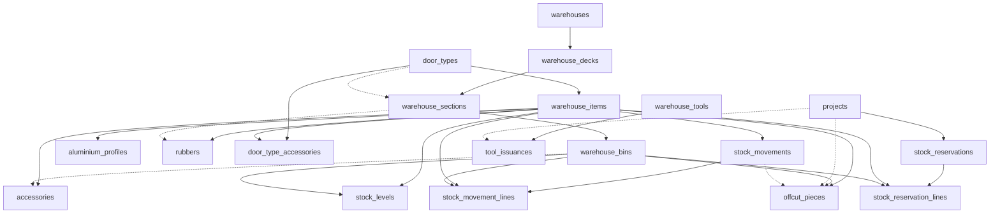

# Warehouse Migration Specification

**Target file:** `backend/database/migrations/2025_05_19_400000_create_warehouse_tables.php`  
**Authoritative plan:** [WAREHOUSE.MD](./WAREHOUSE.MD)  
**Integration contract:** [four_module_integration_plan](../.cursor/plans/four_module_integration_plan_a3882cfc.plan.md) (Agent 2) — pending `docs/INTEGRATION_CONTRACT.MD`  
**Prerequisite migration:** `2025_05_19_300000_create_projects_tables.php` (`projects`, `users`)  
**Version:** 1.0 · 2026-05-26

---

## Table of Contents

1. [Purpose](#1-purpose)
2. [Before / After Comparison](#2-before--after-comparison)
3. [FK Creation Order](#3-fk-creation-order)
4. [Table Specifications](#4-table-specifications)
5. [Indexes & Constraints Summary](#5-indexes--constraints-summary)
6. [Enum & Reference Values](#6-enum--reference-values)
7. [Down Migration Order](#7-down-migration-order)

---

## 1. Purpose

Replace the stub warehouse migration (7 tables, flat stock model) with **18 tables** that match [WAREHOUSE.MD §6](./WAREHOUSE.MD#6-database-schema):

- Physical layout: **Warehouse → Deck → Section → Bin → `stock_levels`**
- Item master data with category extensions (profiles, accessories, rubbers, door types)
- Header + line stock movements and FIFO reservations
- Offcut pieces (not flat `offcuts`)
- Tools register + issuances

**Hard rules**

| Rule | Implementation |
|------|----------------|
| Glass is never warehouse stock | No `glass` category on `warehouse_items`; glass stays on project BOM / procurement only |
| Stock qty lives per bin | `stock_levels(item_id, bin_id)` — not on `warehouse_items` |
| Two manager roles | Deck slugs scope access: `aluminium`+`offcuts` vs `accessories`+`rubbers` |
| Cross-module IDs | `project_id`, `goods_receipt` via `reference_type` / `reference_id` on movements |

---

## 2. Before / After Comparison

| Area | Current (`2025_05_19_400000`) | Problem | Target (this spec) |
|------|------------------------------|---------|---------------------|
| `warehouses` | `code`, `name`, **`category`**, `is_active` | Category belongs on **deck**, not warehouse | `code`, `name`, **`address`**, `is_active`; remove `category` |
| Deck layer | **Missing** | README §8.3 / Raw_Plam §6.1 need zone split (aluminium vs accessories) | **`warehouse_decks`** — 4 slugs per WH-MAIN |
| `warehouse_sections` | FK **`warehouse_id`** | Wrong parent; sections partition **decks** | FK **`deck_id`** + `section_type`, `door_type_id` |
| Items | **`inventory_items`** with `quantity_on_hand`, `quantity_reserved`, single `bin_id` | Stock is per **bin**, items are SKU master | **`warehouse_items`** (master only) + **`stock_levels`** |
| Movements | Flat row per item/qty | Needs document header + line detail | **`stock_movements`** + **`stock_movement_lines`** |
| Reservations | Flat row per item/project | Needs header FIFO + line bins | **`stock_reservations`** + **`stock_reservation_lines`** |
| Offcuts | **`offcuts`** — `profile_code`, no item/bin FK | Must link profile SKU + offcuts deck bin | **`offcut_pieces`** — `item_id`, `bin_id`, `offcut_number` |
| Master data | **Missing** | Door types, profile/accessory/rubber extensions | **`door_types`**, **`aluminium_profiles`**, **`accessories`**, **`rubbers`**, **`door_type_accessories`** |
| Tools | **Missing** | README §8.3 tools management | **`warehouse_tools`**, **`tool_issuances`** |
| Soft deletes | `inventory_items.deleted_at` | Not in plan | Omit soft deletes on warehouse items (use `is_active`) |

**Table count:** 7 → **18**

---

## 3. FK Creation Order

Tables must be created in this order so foreign keys resolve. Depends on **`users`** and **`projects`** from earlier migrations.



| Step | Table | Depends on |
|------|-------|------------|
| 1 | `warehouses` | — |
| 2 | `door_types` | — |
| 3 | `warehouse_decks` | `warehouses` |
| 4 | `warehouse_sections` | `warehouse_decks`, `door_types` (nullable FK) |
| 5 | `warehouse_bins` | `warehouse_sections` |
| 6 | `warehouse_items` | `door_types` (nullable FK) |
| 7 | `aluminium_profiles` | `warehouse_items` |
| 8 | `accessories` | `warehouse_items`, `door_types`, `warehouse_bins` (nullable) |
| 9 | `rubbers` | `warehouse_items`, `warehouse_sections` (nullable) |
| 10 | `door_type_accessories` | `door_types`, `warehouse_items` |
| 11 | `stock_levels` | `warehouse_items`, `warehouse_bins` |
| 12 | `stock_movements` | `users` |
| 13 | `stock_movement_lines` | `stock_movements`, `warehouse_items`, `warehouse_bins` |
| 14 | `stock_reservations` | `projects`, `users` |
| 15 | `stock_reservation_lines` | `stock_reservations`, `warehouse_items`, `warehouse_bins` |
| 16 | `offcut_pieces` | `warehouse_items`, `warehouse_bins`, `projects` (nullable), `stock_movements` (nullable), `users` |
| 17 | `warehouse_tools` | — |
| 18 | `tool_issuances` | `warehouse_tools`, `projects` (nullable), `users` |

---

## 4. Table Specifications

> Types use PostgreSQL names; MySQL equivalents: `BIGSERIAL` → `BIGINT UNSIGNED AUTO_INCREMENT`, `JSONB` → `JSON`, `TIMESTAMP` → `TIMESTAMP NULL` / `DATETIME`.

### 4.1 `warehouses`

Top-level building (e.g. `WH-MAIN`).

| Column | Type | Null | Default | Notes |
|--------|------|------|---------|-------|
| `id` | BIGSERIAL | NO | — | PK |
| `code` | VARCHAR(30) | NO | — | Unique warehouse code |
| `name` | VARCHAR(255) | NO | — | Display name |
| `address` | TEXT | YES | NULL | Physical address |
| `is_active` | BOOLEAN | NO | TRUE | |
| `created_at` | TIMESTAMP | NO | — | |
| `updated_at` | TIMESTAMP | NO | — | |

**Constraints:** `UNIQUE (code)`

---

### 4.2 `warehouse_decks`

Logical zones inside a warehouse (four decks for BIBO main).

| Column | Type | Null | Default | Notes |
|--------|------|------|---------|-------|
| `id` | BIGSERIAL | NO | — | PK |
| `warehouse_id` | BIGINT | NO | — | FK → `warehouses.id` ON DELETE CASCADE |
| `slug` | VARCHAR(30) | NO | — | `aluminium`, `offcuts`, `accessories`, `rubbers` |
| `name` | VARCHAR(255) | NO | — | |
| `sort_order` | INT | NO | 0 | UI ordering |
| `created_at` | TIMESTAMP | NO | — | |
| `updated_at` | TIMESTAMP | NO | — | |

**Constraints:** `UNIQUE (warehouse_id, slug)`  
**Indexes:** `INDEX (warehouse_id)`

---

### 4.3 `door_types`

Drives accessory section partitioning and BOM standard quantities.

| Column | Type | Null | Default | Notes |
|--------|------|------|---------|-------|
| `id` | BIGSERIAL | NO | — | PK |
| `code` | VARCHAR(20) | NO | — | e.g. `SLD`, `FLD`, `BTH` |
| `name` | VARCHAR(255) | NO | — | |
| `section_code` | VARCHAR(30) | NO | — | Default section code e.g. `SEC-SLD` |
| `is_active` | BOOLEAN | NO | TRUE | |
| `created_at` | TIMESTAMP | NO | — | |
| `updated_at` | TIMESTAMP | NO | — | |

**Constraints:** `UNIQUE (code)`

---

### 4.4 `warehouse_sections`

Partition within a deck (door type, profile family, offcut profile, rubber compatibility).

| Column | Type | Null | Default | Notes |
|--------|------|------|---------|-------|
| `id` | BIGSERIAL | NO | — | PK |
| `deck_id` | BIGINT | NO | — | FK → `warehouse_decks.id` ON DELETE CASCADE |
| `door_type_id` | BIGINT | YES | NULL | FK → `door_types.id` ON DELETE SET NULL; set for accessory sections |
| `code` | VARCHAR(30) | NO | — | e.g. `SEC-SLD`, `SEC-BTH`, `SEC-OFF-SLD80` |
| `name` | VARCHAR(255) | NO | — | |
| `section_type` | VARCHAR(50) | NO | — | See §6 |
| `sort_order` | INT | NO | 0 | |
| `is_active` | BOOLEAN | NO | TRUE | |
| `created_at` | TIMESTAMP | NO | — | |
| `updated_at` | TIMESTAMP | NO | — | |

**Constraints:** `UNIQUE (deck_id, code)`  
**Indexes:** `INDEX (deck_id)`, `INDEX (door_type_id)`, `INDEX (section_type)`

---

### 4.5 `warehouse_bins`

Physical shelf / container within a section.

| Column | Type | Null | Default | Notes |
|--------|------|------|---------|-------|
| `id` | BIGSERIAL | NO | — | PK |
| `section_id` | BIGINT | NO | — | FK → `warehouse_sections.id` ON DELETE CASCADE |
| `code` | VARCHAR(30) | NO | — | e.g. `BIN1`, `BIN2` |
| `name` | VARCHAR(255) | YES | NULL | e.g. "Hinges" |
| `description` | TEXT | YES | NULL | |
| `sort_order` | INT | NO | 0 | |
| `is_active` | BOOLEAN | NO | TRUE | |
| `created_at` | TIMESTAMP | NO | — | |
| `updated_at` | TIMESTAMP | NO | — | |

**Constraints:** `UNIQUE (section_id, code)`  
**Indexes:** `INDEX (section_id)`

---

### 4.6 `warehouse_items`

SKU master record — **no quantities** (those live on `stock_levels`).

| Column | Type | Null | Default | Notes |
|--------|------|------|---------|-------|
| `id` | BIGSERIAL | NO | — | PK |
| `sku` | VARCHAR(50) | NO | — | Unique SKU |
| `name` | VARCHAR(255) | NO | — | |
| `category` | VARCHAR(30) | NO | — | `aluminium_profile`, `accessory`, `rubber` only |
| `unit_of_measure` | VARCHAR(20) | NO | — | `metre`, `bar`, `each`, `pack`, `roll` |
| `door_type_id` | BIGINT | YES | NULL | FK → `door_types.id` ON DELETE SET NULL |
| `min_stock_qty` | DECIMAL(15,3) | NO | 0 | Low-stock threshold |
| `is_active` | BOOLEAN | NO | TRUE | |
| `created_at` | TIMESTAMP | NO | — | |
| `updated_at` | TIMESTAMP | NO | — | |

**Constraints:** `UNIQUE (sku)`  
**Indexes:** `INDEX (category)`, `INDEX (door_type_id)`, `INDEX (is_active)`

---

### 4.7 `aluminium_profiles`

1:1 extension for `category = aluminium_profile`.

| Column | Type | Null | Default | Notes |
|--------|------|------|---------|-------|
| `item_id` | BIGINT | NO | — | PK, FK → `warehouse_items.id` ON DELETE CASCADE |
| `profile_family` | VARCHAR(100) | NO | — | Section grouping on aluminium deck |
| `width_mm` | DECIMAL(10,2) | YES | NULL | |
| `depth_mm` | DECIMAL(10,2) | YES | NULL | |
| `finish` | VARCHAR(100) | YES | NULL | Powder coat colour |
| `weight_per_metre` | DECIMAL(10,4) | YES | NULL | kg/m |
| `standard_bar_length_mm` | INT | YES | NULL | e.g. 6000 |

---

### 4.8 `accessories`

1:1 extension for `category = accessory`.

| Column | Type | Null | Default | Notes |
|--------|------|------|---------|-------|
| `item_id` | BIGINT | NO | — | PK, FK → `warehouse_items.id` ON DELETE CASCADE |
| `door_type_id` | BIGINT | NO | — | FK → `door_types.id` ON DELETE RESTRICT |
| `default_bin_id` | BIGINT | YES | NULL | FK → `warehouse_bins.id` ON DELETE SET NULL |

**Indexes:** `INDEX (door_type_id)`, `INDEX (default_bin_id)`

---

### 4.9 `rubbers`

1:1 extension for `category = rubber`.

| Column | Type | Null | Default | Notes |
|--------|------|------|---------|-------|
| `item_id` | BIGINT | NO | — | PK, FK → `warehouse_items.id` ON DELETE CASCADE |
| `compatible_profile_ids` | JSONB | YES | NULL | Array of `warehouse_items.id` (aluminium profiles) |
| `default_section_id` | BIGINT | YES | NULL | FK → `warehouse_sections.id` ON DELETE SET NULL |

**Indexes:** `INDEX (default_section_id)`

---

### 4.10 `door_type_accessories`

Standard accessory quantities per door type (BOM estimation).

| Column | Type | Null | Default | Notes |
|--------|------|------|---------|-------|
| `door_type_id` | BIGINT | NO | — | FK → `door_types.id` ON DELETE CASCADE |
| `item_id` | BIGINT | NO | — | FK → `warehouse_items.id` ON DELETE CASCADE |
| `standard_qty` | DECIMAL(10,2) | NO | 1 | Per door unit |

**Constraints:** `PRIMARY KEY (door_type_id, item_id)`

---

### 4.11 `stock_levels`

On-hand and reserved qty **per item per bin**.

| Column | Type | Null | Default | Notes |
|--------|------|------|---------|-------|
| `id` | BIGSERIAL | NO | — | PK |
| `item_id` | BIGINT | NO | — | FK → `warehouse_items.id` ON DELETE CASCADE |
| `bin_id` | BIGINT | NO | — | FK → `warehouse_bins.id` ON DELETE CASCADE |
| `quantity_on_hand` | DECIMAL(15,3) | NO | 0 | |
| `quantity_reserved` | DECIMAL(15,3) | NO | 0 | |
| `updated_at` | TIMESTAMP | NO | — | No `created_at` — row created on first stock event |

**Constraints:** `UNIQUE (item_id, bin_id)`  
**Indexes:** `INDEX (bin_id)`, `INDEX (item_id)`

**Computed (application layer):** `available = quantity_on_hand - quantity_reserved`

---

### 4.12 `stock_movements`

Movement document header.

| Column | Type | Null | Default | Notes |
|--------|------|------|---------|-------|
| `id` | BIGSERIAL | NO | — | PK |
| `movement_number` | VARCHAR(30) | NO | — | Unique doc number e.g. `SM-2026-00001` |
| `movement_type` | VARCHAR(30) | NO | — | `inbound`, `outbound`, `transfer`, `adjustment` |
| `reference_type` | VARCHAR(50) | YES | NULL | `goods_receipt`, `purchase_order`, `project`, `production_order`, `stock_take`, `offcut` |
| `reference_id` | BIGINT | YES | NULL | Polymorphic ID (e.g. GRN id) |
| `notes` | TEXT | YES | NULL | |
| `performed_by` | BIGINT | NO | — | FK → `users.id` ON DELETE RESTRICT |
| `performed_at` | TIMESTAMP | NO | — | Business timestamp |
| `created_at` | TIMESTAMP | NO | — | |

**Constraints:** `UNIQUE (movement_number)`  
**Indexes:** `INDEX (movement_type)`, `INDEX (reference_type, reference_id)`, `INDEX (performed_at)`, `INDEX (performed_by)`

---

### 4.13 `stock_movement_lines`

Line-level bin/qty detail for each movement.

| Column | Type | Null | Default | Notes |
|--------|------|------|---------|-------|
| `id` | BIGSERIAL | NO | — | PK |
| `stock_movement_id` | BIGINT | NO | — | FK → `stock_movements.id` ON DELETE CASCADE |
| `item_id` | BIGINT | NO | — | FK → `warehouse_items.id` ON DELETE RESTRICT |
| `from_bin_id` | BIGINT | YES | NULL | FK → `warehouse_bins.id` ON DELETE SET NULL; NULL for pure inbound |
| `to_bin_id` | BIGINT | YES | NULL | FK → `warehouse_bins.id` ON DELETE SET NULL; **GRN putaway target** |
| `quantity` | DECIMAL(15,3) | NO | — | Always positive |
| `unit_cost` | DECIMAL(15,2) | YES | NULL | Optional for inbound valuation |

**Indexes:** `INDEX (stock_movement_id)`, `INDEX (item_id)`, `INDEX (to_bin_id)`, `INDEX (from_bin_id)`

---

### 4.14 `stock_reservations`

FIFO reservation header (one active reservation per project BOM check cycle).

| Column | Type | Null | Default | Notes |
|--------|------|------|---------|-------|
| `id` | BIGSERIAL | NO | — | PK |
| `reservation_number` | VARCHAR(30) | NO | — | e.g. `RSV-2026-00001` |
| `project_id` | BIGINT | NO | — | FK → `projects.id` ON DELETE CASCADE |
| `status` | VARCHAR(30) | NO | `pending` | `pending`, `partial`, `fulfilled`, `released`, `cancelled` |
| `reserved_at` | TIMESTAMP | NO | — | |
| `reserved_by` | BIGINT | NO | — | FK → `users.id` ON DELETE RESTRICT |
| `fifo_sequence` | INT | NO | — | Lower = higher FIFO priority |
| `notes` | TEXT | YES | NULL | |
| `created_at` | TIMESTAMP | NO | — | |
| `updated_at` | TIMESTAMP | NO | — | |

**Constraints:** `UNIQUE (reservation_number)`  
**Indexes:** `INDEX (project_id)`, `INDEX (status)`, `INDEX (fifo_sequence)`

---

### 4.15 `stock_reservation_lines`

Reserved qty locked to specific bins.

| Column | Type | Null | Default | Notes |
|--------|------|------|---------|-------|
| `id` | BIGSERIAL | NO | — | PK |
| `reservation_id` | BIGINT | NO | — | FK → `stock_reservations.id` ON DELETE CASCADE |
| `item_id` | BIGINT | NO | — | FK → `warehouse_items.id` ON DELETE RESTRICT |
| `bin_id` | BIGINT | NO | — | FK → `warehouse_bins.id` ON DELETE RESTRICT |
| `quantity_reserved` | DECIMAL(15,3) | NO | — | |
| `quantity_released` | DECIMAL(15,3) | NO | 0 | Incremented on production stage release |
| `bom_line_ref` | VARCHAR(100) | YES | NULL | Trace to `project_bom_lines` when PM module exists |

**Indexes:** `INDEX (reservation_id)`, `INDEX (item_id)`, `INDEX (bin_id)`

---

### 4.16 `offcut_pieces`

Individual offcut inventory on the **offcuts** deck (not full-length aluminium).

| Column | Type | Null | Default | Notes |
|--------|------|------|---------|-------|
| `id` | BIGSERIAL | NO | — | PK |
| `offcut_number` | VARCHAR(30) | NO | — | Unique tag e.g. `OFF-2026-00123` |
| `item_id` | BIGINT | NO | — | FK → `warehouse_items.id` (aluminium profile SKU) |
| `bin_id` | BIGINT | NO | — | FK → `warehouse_bins.id` (offcuts deck) |
| `length_mm` | INT | NO | — | Remaining usable length |
| `quantity_pieces` | INT | NO | 1 | Usually 1 |
| `source_project_id` | BIGINT | YES | NULL | FK → `projects.id` ON DELETE SET NULL |
| `source_movement_id` | BIGINT | YES | NULL | FK → `stock_movements.id` ON DELETE SET NULL |
| `status` | VARCHAR(30) | NO | `available` | `available`, `allocated`, `consumed`, `scrapped` |
| `allocated_project_id` | BIGINT | YES | NULL | FK → `projects.id` ON DELETE SET NULL |
| `logged_by` | BIGINT | NO | — | FK → `users.id` ON DELETE RESTRICT |
| `logged_at` | TIMESTAMP | NO | — | |
| `notes` | TEXT | YES | NULL | |
| `created_at` | TIMESTAMP | NO | — | |

**Constraints:** `UNIQUE (offcut_number)`  
**Indexes:** `INDEX (item_id)`, `INDEX (bin_id)`, `INDEX (status)`, `INDEX (length_mm)`, `INDEX (allocated_project_id)`, `INDEX (source_project_id)`

---

### 4.17 `warehouse_tools`

Tools register (not bin consumable stock).

| Column | Type | Null | Default | Notes |
|--------|------|------|---------|-------|
| `id` | BIGSERIAL | NO | — | PK |
| `tool_code` | VARCHAR(30) | NO | — | Unique |
| `name` | VARCHAR(255) | NO | — | |
| `tool_type` | VARCHAR(100) | YES | NULL | |
| `condition` | VARCHAR(30) | NO | `good` | `good`, `fair`, `damaged`, `retired` |
| `purchase_date` | DATE | YES | NULL | |
| `is_active` | BOOLEAN | NO | TRUE | |
| `created_at` | TIMESTAMP | NO | — | |
| `updated_at` | TIMESTAMP | NO | — | |

**Constraints:** `UNIQUE (tool_code)`  
**Indexes:** `INDEX (is_active)`, `INDEX (condition)`

---

### 4.18 `tool_issuances`

Issue / return log per employee and optional project.

| Column | Type | Null | Default | Notes |
|--------|------|------|---------|-------|
| `id` | BIGSERIAL | NO | — | PK |
| `tool_id` | BIGINT | NO | — | FK → `warehouse_tools.id` ON DELETE RESTRICT |
| `project_id` | BIGINT | YES | NULL | FK → `projects.id` ON DELETE SET NULL |
| `issued_to` | BIGINT | NO | — | FK → `users.id` ON DELETE RESTRICT |
| `issued_by` | BIGINT | NO | — | FK → `users.id` ON DELETE RESTRICT |
| `issue_date` | DATE | NO | — | |
| `return_date` | DATE | YES | NULL | NULL = still out |
| `condition_out` | VARCHAR(30) | NO | — | Condition at issue |
| `condition_in` | VARCHAR(30) | YES | NULL | Condition on return |
| `damage_notes` | TEXT | YES | NULL | |
| `created_at` | TIMESTAMP | NO | — | |

**Indexes:** `INDEX (tool_id)`, `INDEX (project_id)`, `INDEX (issued_to)`, `INDEX (return_date)`

---

## 5. Indexes & Constraints Summary

| Table | Unique | Notable indexes |
|-------|--------|-----------------|
| `warehouses` | `code` | — |
| `warehouse_decks` | `(warehouse_id, slug)` | `warehouse_id` |
| `door_types` | `code` | — |
| `warehouse_sections` | `(deck_id, code)` | `deck_id`, `door_type_id`, `section_type` |
| `warehouse_bins` | `(section_id, code)` | `section_id` |
| `warehouse_items` | `sku` | `category`, `door_type_id` |
| `door_type_accessories` | PK `(door_type_id, item_id)` | — |
| `stock_levels` | `(item_id, bin_id)` | `bin_id` |
| `stock_movements` | `movement_number` | `(reference_type, reference_id)`, `movement_type`, `performed_at` |
| `stock_reservation_lines` | — | `reservation_id`, `item_id` |
| `stock_reservations` | `reservation_number` | `project_id`, `fifo_sequence` |
| `offcut_pieces` | `offcut_number` | `(item_id, length_mm, status)` composite for search |
| `warehouse_tools` | `tool_code` | — |

**Recommended composite index (offcut search):**

```sql
CREATE INDEX idx_offcut_pieces_profile_length_status
    ON offcut_pieces (item_id, length_mm, status);
```

---

## 6. Enum & Reference Values

### `warehouse_decks.slug`

| Value | Manager role |
|-------|----------------|
| `aluminium` | `warehouse_manager_aluminium` |
| `offcuts` | `warehouse_manager_aluminium` |
| `accessories` | `warehouse_manager_accessories` |
| `rubbers` | `warehouse_manager_accessories` |

### `warehouse_sections.section_type`

| Value | Deck |
|-------|------|
| `profile_family` | `aluminium` |
| `offcut_profile` | `offcuts` |
| `door_accessories` | `accessories` |
| `bathroom_accessories` | `accessories` |
| `general_accessories` | `accessories` |
| `rubber_profile` | `rubbers` |

### `warehouse_items.category`

| Value | Allowed |
|-------|---------|
| `aluminium_profile` | ✓ |
| `accessory` | ✓ |
| `rubber` | ✓ |
| `glass` | **✗ never** |
| `tool` | ✗ — use `warehouse_tools` |

### `stock_movements.movement_type`

`inbound` · `outbound` · `transfer` · `adjustment`

### `stock_movements.reference_type` (GRN receive)

| Value | When |
|-------|------|
| `goods_receipt` | Procurement `GoodsReceiptVerified` → inbound putaway |
| `purchase_order` | Direct PO reference (optional) |
| `project` | Issue to project |
| `production_order` | Issue to production |
| `stock_take` | Adjustment from stock-take |
| `offcut` | Offcut inbound from cutting |

---

## 7. Down Migration Order

Drop in reverse dependency order:

```
tool_issuances
warehouse_tools
offcut_pieces
stock_reservation_lines
stock_reservations
stock_movement_lines
stock_movements
stock_levels
door_type_accessories
rubbers
accessories
aluminium_profiles
warehouse_items
warehouse_bins
warehouse_sections
warehouse_decks
door_types
warehouses
```

---

## Appendix — Full DDL Reference (PostgreSQL)

Single-file target DDL for implementers (matches [WAREHOUSE.MD §6](./WAREHOUSE.MD#6-database-schema) with FKs and indexes applied):

```sql
-- 1. warehouses
CREATE TABLE warehouses (
    id          BIGSERIAL PRIMARY KEY,
    code        VARCHAR(30) NOT NULL UNIQUE,
    name        VARCHAR(255) NOT NULL,
    address     TEXT NULL,
    is_active   BOOLEAN NOT NULL DEFAULT TRUE,
    created_at  TIMESTAMP NOT NULL,
    updated_at  TIMESTAMP NOT NULL
);

-- 2. door_types
CREATE TABLE door_types (
    id              BIGSERIAL PRIMARY KEY,
    code            VARCHAR(20) NOT NULL UNIQUE,
    name            VARCHAR(255) NOT NULL,
    section_code    VARCHAR(30) NOT NULL,
    is_active       BOOLEAN NOT NULL DEFAULT TRUE,
    created_at      TIMESTAMP NOT NULL,
    updated_at      TIMESTAMP NOT NULL
);

-- 3. warehouse_decks
CREATE TABLE warehouse_decks (
    id              BIGSERIAL PRIMARY KEY,
    warehouse_id    BIGINT NOT NULL REFERENCES warehouses(id) ON DELETE CASCADE,
    slug            VARCHAR(30) NOT NULL,
    name            VARCHAR(255) NOT NULL,
    sort_order      INT NOT NULL DEFAULT 0,
    created_at      TIMESTAMP NOT NULL,
    updated_at      TIMESTAMP NOT NULL,
    UNIQUE (warehouse_id, slug)
);
CREATE INDEX idx_warehouse_decks_warehouse_id ON warehouse_decks (warehouse_id);

-- 4. warehouse_sections
CREATE TABLE warehouse_sections (
    id              BIGSERIAL PRIMARY KEY,
    deck_id         BIGINT NOT NULL REFERENCES warehouse_decks(id) ON DELETE CASCADE,
    door_type_id    BIGINT NULL REFERENCES door_types(id) ON DELETE SET NULL,
    code            VARCHAR(30) NOT NULL,
    name            VARCHAR(255) NOT NULL,
    section_type    VARCHAR(50) NOT NULL,
    sort_order      INT NOT NULL DEFAULT 0,
    is_active       BOOLEAN NOT NULL DEFAULT TRUE,
    created_at      TIMESTAMP NOT NULL,
    updated_at      TIMESTAMP NOT NULL,
    UNIQUE (deck_id, code)
);
CREATE INDEX idx_warehouse_sections_deck_id ON warehouse_sections (deck_id);
CREATE INDEX idx_warehouse_sections_door_type_id ON warehouse_sections (door_type_id);

-- 5. warehouse_bins
CREATE TABLE warehouse_bins (
    id              BIGSERIAL PRIMARY KEY,
    section_id      BIGINT NOT NULL REFERENCES warehouse_sections(id) ON DELETE CASCADE,
    code            VARCHAR(30) NOT NULL,
    name            VARCHAR(255) NULL,
    description     TEXT NULL,
    sort_order      INT NOT NULL DEFAULT 0,
    is_active       BOOLEAN NOT NULL DEFAULT TRUE,
    created_at      TIMESTAMP NOT NULL,
    updated_at      TIMESTAMP NOT NULL,
    UNIQUE (section_id, code)
);
CREATE INDEX idx_warehouse_bins_section_id ON warehouse_bins (section_id);

-- 6. warehouse_items
CREATE TABLE warehouse_items (
    id              BIGSERIAL PRIMARY KEY,
    sku             VARCHAR(50) NOT NULL UNIQUE,
    name            VARCHAR(255) NOT NULL,
    category        VARCHAR(30) NOT NULL,
    unit_of_measure VARCHAR(20) NOT NULL,
    door_type_id    BIGINT NULL REFERENCES door_types(id) ON DELETE SET NULL,
    min_stock_qty   DECIMAL(15,3) NOT NULL DEFAULT 0,
    is_active       BOOLEAN NOT NULL DEFAULT TRUE,
    created_at      TIMESTAMP NOT NULL,
    updated_at      TIMESTAMP NOT NULL
);
CREATE INDEX idx_warehouse_items_category ON warehouse_items (category);

-- 7–10. extensions + door_type_accessories
CREATE TABLE aluminium_profiles (
    item_id                 BIGINT PRIMARY KEY REFERENCES warehouse_items(id) ON DELETE CASCADE,
    profile_family          VARCHAR(100) NOT NULL,
    width_mm                DECIMAL(10,2) NULL,
    depth_mm                DECIMAL(10,2) NULL,
    finish                  VARCHAR(100) NULL,
    weight_per_metre        DECIMAL(10,4) NULL,
    standard_bar_length_mm  INT NULL
);

CREATE TABLE accessories (
    item_id         BIGINT PRIMARY KEY REFERENCES warehouse_items(id) ON DELETE CASCADE,
    door_type_id    BIGINT NOT NULL REFERENCES door_types(id) ON DELETE RESTRICT,
    default_bin_id  BIGINT NULL REFERENCES warehouse_bins(id) ON DELETE SET NULL
);

CREATE TABLE rubbers (
    item_id                 BIGINT PRIMARY KEY REFERENCES warehouse_items(id) ON DELETE CASCADE,
    compatible_profile_ids  JSONB NULL,
    default_section_id      BIGINT NULL REFERENCES warehouse_sections(id) ON DELETE SET NULL
);

CREATE TABLE door_type_accessories (
    door_type_id    BIGINT NOT NULL REFERENCES door_types(id) ON DELETE CASCADE,
    item_id         BIGINT NOT NULL REFERENCES warehouse_items(id) ON DELETE CASCADE,
    standard_qty    DECIMAL(10,2) NOT NULL DEFAULT 1,
    PRIMARY KEY (door_type_id, item_id)
);

-- 11. stock_levels
CREATE TABLE stock_levels (
    id                  BIGSERIAL PRIMARY KEY,
    item_id             BIGINT NOT NULL REFERENCES warehouse_items(id) ON DELETE CASCADE,
    bin_id              BIGINT NOT NULL REFERENCES warehouse_bins(id) ON DELETE CASCADE,
    quantity_on_hand    DECIMAL(15,3) NOT NULL DEFAULT 0,
    quantity_reserved   DECIMAL(15,3) NOT NULL DEFAULT 0,
    updated_at          TIMESTAMP NOT NULL,
    UNIQUE (item_id, bin_id)
);
CREATE INDEX idx_stock_levels_bin_id ON stock_levels (bin_id);

-- 12–13. movements
CREATE TABLE stock_movements (
    id              BIGSERIAL PRIMARY KEY,
    movement_number VARCHAR(30) NOT NULL UNIQUE,
    movement_type   VARCHAR(30) NOT NULL,
    reference_type  VARCHAR(50) NULL,
    reference_id    BIGINT NULL,
    notes           TEXT NULL,
    performed_by    BIGINT NOT NULL REFERENCES users(id) ON DELETE RESTRICT,
    performed_at    TIMESTAMP NOT NULL,
    created_at      TIMESTAMP NOT NULL
);
CREATE INDEX idx_stock_movements_reference ON stock_movements (reference_type, reference_id);
CREATE INDEX idx_stock_movements_performed_at ON stock_movements (performed_at);

CREATE TABLE stock_movement_lines (
    id                  BIGSERIAL PRIMARY KEY,
    stock_movement_id   BIGINT NOT NULL REFERENCES stock_movements(id) ON DELETE CASCADE,
    item_id             BIGINT NOT NULL REFERENCES warehouse_items(id) ON DELETE RESTRICT,
    from_bin_id         BIGINT NULL REFERENCES warehouse_bins(id) ON DELETE SET NULL,
    to_bin_id           BIGINT NULL REFERENCES warehouse_bins(id) ON DELETE SET NULL,
    quantity            DECIMAL(15,3) NOT NULL,
    unit_cost           DECIMAL(15,2) NULL
);
CREATE INDEX idx_stock_movement_lines_movement_id ON stock_movement_lines (stock_movement_id);

-- 14–15. reservations
CREATE TABLE stock_reservations (
    id                  BIGSERIAL PRIMARY KEY,
    reservation_number  VARCHAR(30) NOT NULL UNIQUE,
    project_id          BIGINT NOT NULL REFERENCES projects(id) ON DELETE CASCADE,
    status              VARCHAR(30) NOT NULL DEFAULT 'pending',
    reserved_at         TIMESTAMP NOT NULL,
    reserved_by         BIGINT NOT NULL REFERENCES users(id) ON DELETE RESTRICT,
    fifo_sequence       INT NOT NULL,
    notes               TEXT NULL,
    created_at          TIMESTAMP NOT NULL,
    updated_at          TIMESTAMP NOT NULL
);
CREATE INDEX idx_stock_reservations_project_id ON stock_reservations (project_id);
CREATE INDEX idx_stock_reservations_fifo_sequence ON stock_reservations (fifo_sequence);

CREATE TABLE stock_reservation_lines (
    id                  BIGSERIAL PRIMARY KEY,
    reservation_id      BIGINT NOT NULL REFERENCES stock_reservations(id) ON DELETE CASCADE,
    item_id             BIGINT NOT NULL REFERENCES warehouse_items(id) ON DELETE RESTRICT,
    bin_id              BIGINT NOT NULL REFERENCES warehouse_bins(id) ON DELETE RESTRICT,
    quantity_reserved   DECIMAL(15,3) NOT NULL,
    quantity_released   DECIMAL(15,3) NOT NULL DEFAULT 0,
    bom_line_ref        VARCHAR(100) NULL
);
CREATE INDEX idx_stock_reservation_lines_reservation_id ON stock_reservation_lines (reservation_id);

-- 16. offcuts
CREATE TABLE offcut_pieces (
    id                      BIGSERIAL PRIMARY KEY,
    offcut_number           VARCHAR(30) NOT NULL UNIQUE,
    item_id                 BIGINT NOT NULL REFERENCES warehouse_items(id) ON DELETE RESTRICT,
    bin_id                  BIGINT NOT NULL REFERENCES warehouse_bins(id) ON DELETE RESTRICT,
    length_mm               INT NOT NULL,
    quantity_pieces         INT NOT NULL DEFAULT 1,
    source_project_id       BIGINT NULL REFERENCES projects(id) ON DELETE SET NULL,
    source_movement_id      BIGINT NULL REFERENCES stock_movements(id) ON DELETE SET NULL,
    status                  VARCHAR(30) NOT NULL DEFAULT 'available',
    allocated_project_id    BIGINT NULL REFERENCES projects(id) ON DELETE SET NULL,
    logged_by               BIGINT NOT NULL REFERENCES users(id) ON DELETE RESTRICT,
    logged_at               TIMESTAMP NOT NULL,
    notes                   TEXT NULL,
    created_at              TIMESTAMP NOT NULL
);
CREATE INDEX idx_offcut_pieces_profile_length_status
    ON offcut_pieces (item_id, length_mm, status);

-- 17–18. tools
CREATE TABLE warehouse_tools (
    id              BIGSERIAL PRIMARY KEY,
    tool_code       VARCHAR(30) NOT NULL UNIQUE,
    name            VARCHAR(255) NOT NULL,
    tool_type       VARCHAR(100) NULL,
    condition       VARCHAR(30) NOT NULL DEFAULT 'good',
    purchase_date   DATE NULL,
    is_active       BOOLEAN NOT NULL DEFAULT TRUE,
    created_at      TIMESTAMP NOT NULL,
    updated_at      TIMESTAMP NOT NULL
);

CREATE TABLE tool_issuances (
    id              BIGSERIAL PRIMARY KEY,
    tool_id         BIGINT NOT NULL REFERENCES warehouse_tools(id) ON DELETE RESTRICT,
    project_id      BIGINT NULL REFERENCES projects(id) ON DELETE SET NULL,
    issued_to       BIGINT NOT NULL REFERENCES users(id) ON DELETE RESTRICT,
    issued_by       BIGINT NOT NULL REFERENCES users(id) ON DELETE RESTRICT,
    issue_date      DATE NOT NULL,
    return_date     DATE NULL,
    condition_out   VARCHAR(30) NOT NULL,
    condition_in    VARCHAR(30) NULL,
    damage_notes    TEXT NULL,
    created_at      TIMESTAMP NOT NULL
);
CREATE INDEX idx_tool_issuances_tool_id ON tool_issuances (tool_id);
```

---

*End of Warehouse Migration Specification v1.0*
